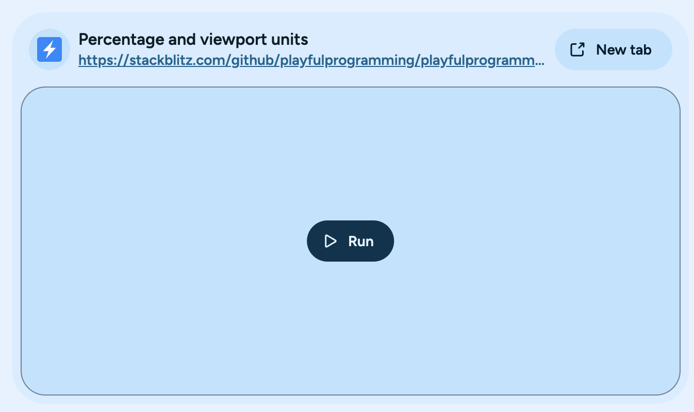
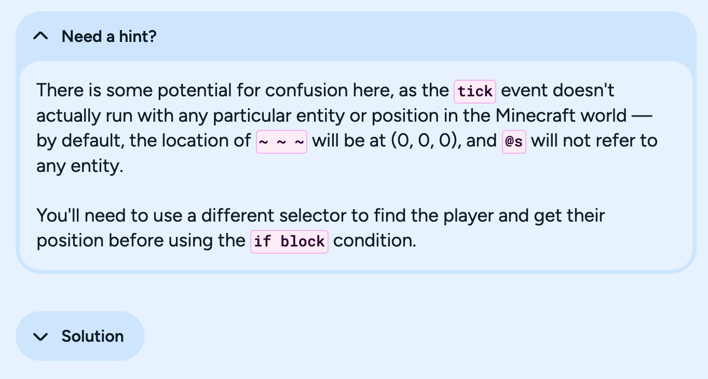
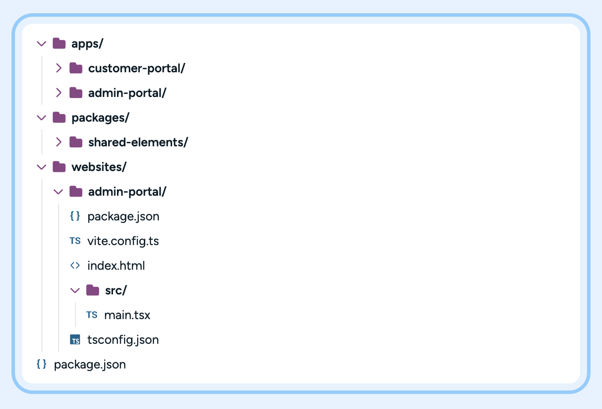

# Markdown Features

Playful Programming has a number of features that extend the Markdown syntax to make it more powerful and expressive.

## Base Features

Our base markdown syntax is based on the [GitHub Flavored Markdown](https://github.github.com/gfm/) specification. This includes support for:

- Headings
- Images
- Links
- Code Blocks
- Tables
- [Alerts](https://docs.github.com/en/get-started/writing-on-github/getting-started-with-writing-and-formatting-on-github/basic-writing-and-formatting-syntax#alerts)

However, we've extended many of these base features.

### Headings

Markdown headings usually have a 1:1 relationship with the HTML `<h1>`, `<h2>`, `<h3>`, `<h4>`, `<h5>`, and `<h6>` tags.
However, in Playful Programming, we move the heading level down by one for accessibility reasons.

This means that the highest level heading in Playful Programming is an `<h2>` tag, and the lowest level heading is an `<h6>` tag.

- `# Heading 1` becomes `<h2>Heading 1</h2>`
- `## Heading 2` becomes `<h3>Heading 2</h3>`
- `### Heading 3` becomes `<h4>Heading 3</h4>`
- `#### Heading 4` becomes `<h5>Heading 4</h5>`
- `##### Heading 5` becomes `<h6>Heading 5</h6>`
- `###### Heading 6` becomes `<h6>Heading 6</h6>`


#### Custom Heading IDs

We support the ability to set custom IDs for stable deep linking in an article using the following syntax:

```markdown
# Heading {#some-id}
```


### Images

Relative image paths are resolved relative to the markdown file that contains the image.

```markdown

```

We also:

- Transform the image into a `picture` element to support multiple sources.
- Resize the image automatically to fit the screen.
  - The maximum width is 896px.
  - The maximum height is 768px.
  - The aspect ratio is preserved.
- Generate `avi` and `webp` versions of the image to improve performance.
- Automatically add a `loading="lazy"` attribute to all images to improve performance.
- Add decoding `async` to all images to improve performance.

#### Image Zoom

We, by default, add the ability to click on an image to zoom in on it. This is useful for showing off details in an image.

You can disable this feature by adding the `data-nozoom` attribute to the image:

```markdown

```

Or customize the image to zoom into for a higher-resolution version:

```markdown

```

### Links

Links in Playful Programming are the same as in GitHub Flavored Markdown, but we mark external links with some properties:

- `target="_blank"`: Opens the link in a new tab
- `rel="noopener noreferrer"`: Prevents the new tab from accessing the `window.opener` property

### Tables

Tables in Playful Programming are the same as in GitHub Flavored Markdown, but we add support for sticky headers when the table is too long to fit on the screen.

### Code Blocks

We use [Shiki](https://shiki.style/) to highlight code blocks in markdown files. This means that we support over 100 languages and light and dark mode themes.

We also support the following features:

- Line highlighting
  - `"[!code highlight]"`
  - "``` {1,3-4}"
- Line numbers

## HTML Element Transforms

We support a number of HTML elements that are transformed into more complex components:

- Videos
- IFrames
- Summary Blocks

### Videos

You can embed videos in your markdown files using the following syntax:

```markdown
<video src="./video.mp4" title="The alt text of the video" />
```

This will set the default values of the video to `true`:

- `muted`
- `autoPlay`
- `controls`
- `loop`

### IFrames



You can embed iframes in your markdown files using the following syntax:

```markdown
<iframe src="https://example.com" data-frame-title="The heading text of the iframe" />
```

We make this iframe lazy-loaded by default and force the user to click to run the contents for performance reasons.

We also lookup the websites favicon and use it as the icon for the iframe.

#### Code Samples

We support loading full code projects into iframes via [StackBlitz projects](https://stackblitz.com/). This is useful for showing off code samples in a live environment.

To start, create a full project into a sub-folder of the markdown file. Then, add the following code block to the markdown file:

```markdown
<iframe data-frame-title="React Transparent Files Before - StackBlitz" src="pfp-code:./my-folder"></iframe>
```

We pass all URL parameters to the StackBlitz project, so you can use them to customize the project.

### Summary Blocks



Summary blocks are a way to show a summary of a section of content. They are useful for showing off the main points of a section.

```markdown
<details>
    <summary>Title</summary>
    Hidden content
</details>
```

## Components

Like MDX, Playful Programming supports the use of components in markdown files. Unlike MDX, we use a different syntax to define components and do not use React or JSX.

### Filetree



The filetree component is used to display a file tree in the markdown file. It is useful for showing the structure of a project or the contents of a directory.

```markdown
<!-- ::start:filetree -->
- `public/`
- `src/`
    - `assets/{open: false}`
        - ...
    - `index.html`
    - **`index.js`**
    - `styles.css` A style file that we can use later
- `package.json`
<!-- ::end:filetree -->
```

It is required to use inline code blocks for files and folders names.

The filetree component supports the following:

- Icons for files and folders are automatically added
- Folders are denoted by a trailing `/`
- `- folder/{open: false}` to denote a closed folder
  - Folders are open by default
- `- ...` to denote more contents are omitted inside a folder
- `- **File**` to highlight a file or folder
- Comments are added after-the-fact

While not 1:1, the filetree component is inspired by the [Astro Starlight `file-tree` component](https://starlight.astro.build/components/file-tree/)

### In-Content Ads


We support showing ads in the content of the article. This is useful for promoting products, services, or donations.

```html
<!-- ::in-content-ad title="Consider supporting" body="Donating any amount will help towards further development of articles like this." button-text="Visit our Open Collective" button-href="https://opencollective.com/playfulprogramming" -->
```

We support the following properties:

- `title`: The title of the ad
- `body`: The body of the ad
- `button-text`: The text of the button
- `button-href`: The URL that the button links to

### Link Previews

Link previews embed the opengraph image of a link into a blog post. These can be added with:

```markdown
<!-- ::start:link-preview -->
[Playful Programming GitHub](https://github.com/playfulprogramming/playfulprogramming)
<!-- ::end:link-preview -->
```

These can also be created manually by wrapping an image inside a link, optionally with a title:

```markdown
[Example Title ](https://example.com)
```

### Tabs

Tabs are a way to organize content in a tabbed interface. They are useful for organizing content that is related but not necessarily sequential.


```markdown
<!-- ::start:tabs -->
# Tab 1
This is the content of tab 1.

# Tab 2
This is the content of tab 2.

# Tab 3
This is the content of tab 3.
<!-- ::end:tabs -->
```

Tabs take the top-level heading as the tab title, but leaves lower-level headings as they are.


```markdown
<!-- ::start:tabs -->
# Tab 1
This is the content of tab 1.

# Tab 2
This is the content of tab 2.

# Tab 3
This is the content of tab 3.
<!-- ::end:tabs -->
```

## EPUB Generation

We auto-generate an EPUB file for all article collections. This allows you to read contents from Playful Programming on-the-go with an ereader.

Just go to:

```
https://playfulprogramming.com/YOUR-COLLECTION-SLUG-HERE.epub
```

To get the EPUB for the related collection.

### Markdown Extensions

We support customizing the contents of the epub by hiding or exlusively showing parts of a markdown file from the generated epub:

```markdown
<!-- ::start:no-ebook -->
This is missing from the EPUB
<!-- ::end:no-ebook -->

<!-- ::start:only-ebook -->
This is missing from the website
<!-- ::end:only-ebook -->
```

## Frontmatter

We support adding metadata to an article or collection via a JS-object "frontmatter":

```markdown
---
{
    title: "A title",
    published: '2023-03-25',
    tags: ['opinion']
}
---

Article contents here
```


### Post Frontmatter

We support the following properties on a post:

- `title`: The title of the article
- `published`: The publication date of the article
  - Must be an ISO timestamp of `YYYY-MM-DD`
- `authors`:  A list of ids of the related authors
  - Only used when there's multiple authors per article. Must list all authors, including the one the post is in the folder of.
- `tags`: A list of tags the post relates to
  - Must match [one of these](./content/data/tags.json) tags.
- `license`: A string of what license to attribute the post to
  - Must match [one of these](./content/data/licenses.json) license IDs.
- `description`: The description of the article 
  - Without this present, one will auto-generate for you based on the first ~160 characters of the post
- `edited`: When an article was edited last
  - Optional.
  - Must be an ISO timestamp of `YYYY-MM-DD`
- `collection`: The name of the series the post is associated with
  - If you need to add more metadata than this, please create a folder of `collections` and put an `index.md` file there with said metadata. Then place the post in the `posts` subfolder of the collection.
- `order`: The order of which the article is within a collection
  - Only used when inside of a collection
- `originalLink`: The [canonical link](https://en.wikipedia.org/wiki/Canonical_link_element) of the post, where it was originally posted.
  - Required if the post is a cross-post
- `noindex`: Should the article be hidden from the site's list view, `sitemap`, and search?
  - Useful for draft or archived content
- `upToDateSlug`: The latest published version of the article
- `version`: The version of the article
  - IE: `v1`, `v3.5`, etc
  - Useful when combined with `upToDateSlug` and `noindex`


### Collection Frontmatter

- `title`: The title of the collection
- `description`: The description of the collection
  - Unlike posts, without one nothing will auto-generate for you.
- `authors`:  A list of ids of the related authors
  - Only used when there's multiple authors per article. Must list all authors, including the one the post is in the folder of.
- `coverImg`: The cover image of the collection
  - Used in EPUB generation for the cover
  - Used in the auto-generated page as the top image
- `socialImg`: The image used in social media preview pages
  - If unused, `coverImg` will be used instead
- `type`: The type of collection it is
  - `"book"` - Used for SEO
  - Nothing (defualt) - Unused
- `pageLayout`: 
  - `"none"` - Do not auto-generate a page for this collection
    - Useful for custom pages like The Framework Field Guide 
  - Nothing (defualt) - auto-generate a page for the collection
- `customChaptersText`: The custom text to be used in the "A part of a series" text
- `tags`: A list of related tags
  - Must match [one of these](./content/data/tags.json) tags.
- `published`: The publication date of the article
  - Must be an ISO timestamp of `YYYY-MM-DD`
- `buttons`: A list of buttons to show on the auto-generated page
  - Must be an array of `{text: string, url: string}`
- `chapterList`: A list of extra chapters to include in addition to the auto-discovered ones
  - Must be an array of `{title: string;description: string;order: string;}`
- `noindex`: Should the collection be hidden from the site's list view, `sitemap`, and search?
  - Useful for draft or archived content
- `upToDateSlug`: The latest published version of the collection
- `version`: The version of the collection
  - IE: `v1`, `v3.5`, etc
  - Useful when combined with `upToDateSlug` and `noindex`
