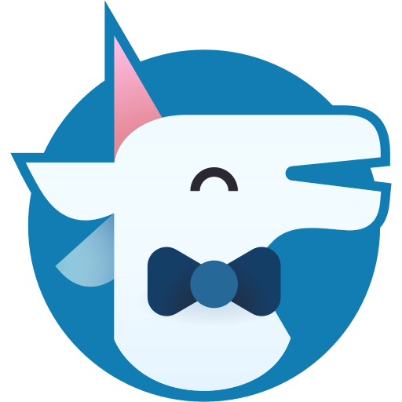

    

<h1 align="center">
  Página Web de Playful Programming
</h1>

Este repository actúa como la ubicación del código fuente para el [blog de Playful Programming](https://playfulprogramming.com).

## Patrocinadores

[Reconocemos todos los patrocinios que compartimos abiertamente en GitHub](https://github.com/playfulprogramming/playfulprogramming/issues?q=is%3Aissue+label%3Adisclosure+is%3Aclosed)

## Declaración de Ética

No queremos terminar en un lugar donde nuestro contenido educativo, experiencia,
o la comunidad se vea comprometida por la influencia financiera o miembros de la comunidad potencialmente perjudiciales. De tal manera, hemos implementado el
[Acuerdo de colaborador](https://www.contributor-covenant.org/)
como nuestro [código de conducta](CODE_OF_CONDUCT.md) para defender estos valores.

También nos comprometemos a mantener la transparencia con respecto a las finanzas
que fluyen a través del proyecto. No todos los patrocinios contienen una
contribución financiera, pero si lo hacen, informaremos cuáles son esas finanzas
hacia dónde se dirigen y lo que se hará a cambio.

## Contribuyendo

¡Animamos y apoyamos a otros para que contribuyan a nuestro sitio y nuestra
comunidad! Hemos escrito una [guía completa sobre cómo hacerlo aquí](./CONTRIBUTING.md).
Esta guía incluye instrucciones sobre cómo agregar una nueva publicación al
sitio, cómo editar nuestro código y cuál es nuestra estrategia de despliegues.

Tén en cuenta que solicitamos a los desarrolladores que se comuniquen [a través de nuestro Discord](https://discord.gg/FMcvc6T)
o [a través de un issue de GitHub](https://github.com/playfulprogramming/playfulprogramming/issues/new)
antes de que se lleve a cabo un desarrollo extensivo. Si tienes en mente una
funcionalidad que te gustaría agregar al sitio, ¡háznoslo saber! ¡Nos encantaría hacer una lluvia de ideas antes de que empiece su desarrollo!

Hacemos extensiva esta invitación a quienes no estén familiarizados con nuestros procesos. Asegúrate de consultar primero nuestro archivo [CONTRIBUTING.md](./CONTRIBUTING.md), pero no tengas miedo de unirte y hacer preguntas si no estás seguro de algo.
