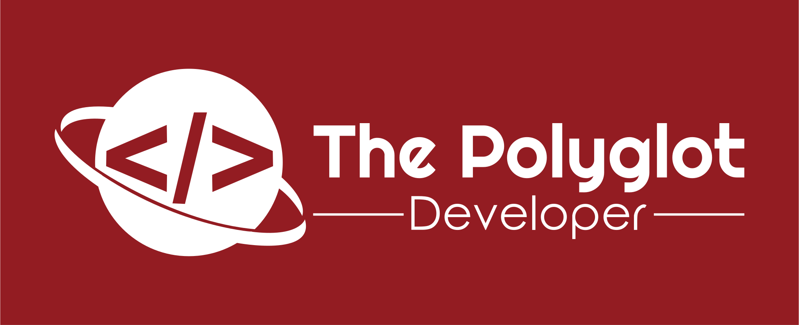

    

<h1 align="center">
  Playful Programming Website
</h1>

This repository acts as the source code location for [the Playful Programming blog](https://playfulprogramming.com).

## Sponsors

[We disclose every sponsorship we share openly on GitHub](https://github.com/playfulprogramming/playfulprogramming/issues?q=is%3Aissue+label%3Adisclosure+is%3Aclosed)

## Statement of Ethics

We never want to end up in a place where our educational content, experience,
or community is compromised by either financial sway or potentially harmful
members of the community. As such, we've implemented the
[Contributor Covenant](https://www.contributor-covenant.org/)
as our [code of conduct](CODE_OF_CONDUCT.md) to uphold these values.

We also pledge to maintain transparency in regards to any finances that flow
through the project. Not every sponsorship contains a financial contribution,
but if one does we will disclose both what those finances
are going towards and what will be done in exchange.

## Contributing

We highly encourage and celebrate others contributing to our site and our community! We've written [a comprehensive guide on how to do so here](./CONTRIBUTING.md). This guide includes instructions for how to add a new post to the site, how to edit our code, and what our deployment strategy is.

Keep in mind that we request developers reach out [via our Discord](https://discord.gg/FMcvc6T) or [via GitHub issue](https://github.com/playfulprogramming/playfulprogramming/issues/new) before extensive development is pursued. If you have a feature you'd like to add to the site, let us know! We'd love to do some brainstorming before coding begins!

We extend this invitation to those who may be unfamiliar with our processes. Be sure to check out [our CONTRIBUTING.md](./CONTRIBUTING.md) file first, but don't be afraid to join in and ask questions if you're uncertain of anything

