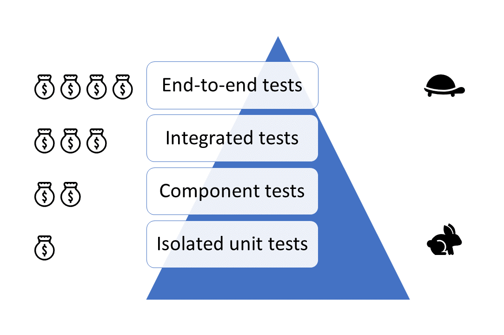

---
{
title: "50 lines of code smoke test for any Angular application",
published: "2020-12-20T22:47:47Z",
edited: "2021-01-18T12:29:16Z",
tags: ["angular", "testing"],
description: "Where there's smoke, there's fire. Use this top-level integrated test suite for any Angular application.",
originalLink: "https://dev.to/this-is-angular/50-lines-of-code-smoke-test-for-any-angular-application-1c0n",
coverImage: "cover-image.png",
socialImage: "social-image.png"
}
---

*Where there's smoke, there's fire. Cover photo by [blickpixel](https://pixabay.com/photos/fire-detectors-smoke-detector-502893/) on Pixabay.*

In this article, we create a smoke test suite for Angular applications by using `TestBed` to run integrated tests which loads our entire `AppModule` without any modification. This is effectively as close to an end-to-end test as we can get with the `TestBed`.

# Application smoke test setup

First, we look at the smoke test setup which depends on only the `AppModule` and the `AppComponent` of our Angular application.

```ts
// if needed
// import { HttpClientTestingModule } from '@angular/common/http/testing';
import { ComponentFixture, TestBed } from '@angular/core/testing';
import { Router } from '@angular/router';
import { RouterTestingModule } from '@angular/router/testing';

import { AppComponent } from './app.component';
import { AppModule } from './app.module';

function setup() {
  TestBed.configureTestingModule({
    imports: [
      AppModule,
      RouterTestingModule,
      // if needed
      // HttpClientTestingModule,
    ],
  }).compileComponents();

  let rootFixture: ComponentFixture<AppComponent>;
  const initializeRootFixture = () => {
    if (rootFixture == null) {
      rootFixture = TestBed.createComponent(AppComponent);
    }
  };

  return {
    get router() {
      initializeRootFixture();

      return TestBed.inject(Router);
    },
    run<TResult>(task: () => TResult) {
      initializeRootFixture();

      return rootFixture.ngZone == null
        ? task()
        : rootFixture.ngZone.run(task);
    },
  };
}
```

<figcaption>The setup for our Angular application smoke test.</figcaption>

We import the `AppModule` in the Angular testing module and import `RouterTestingModule` to stub the History and Location APIs.

With the common setup prepared, we move on to the first smoke test case for our Angular application.

# Verifying that the application can boot

This first smoke test case verifies that our application boots without errors.

```ts
describe('Applicaton smoke test', () => {
  it('the application boots up', () => {
    const bootApplication = () => {
      const { router, run } = setup();

      run(() => router.initialNavigation());
    };

    expect(bootApplication).not.toThrow();
  });
});
```

<figcaption>This test case verifies that our Angular application can boot.</figcaption>

After loading the `AppModule` into the Angular testing module through the `setup` function, it sets up routing and navigates to the default route. The assertion statement verifies that none of this causes a failure to happen.

Because we're exercising the `AppModule` as well as all the configuration and initialization it triggers, we're integration testing across a large surface of Angular APIs in collaboration with our application.

# Verifying that navigation works

Our next smoke test case exercises navigation to a specific route, in this case the default route, including route guards and route resolvers.

```ts
describe('Applicaton smoke test', () => {
  it('navigation works', async () => {
    const { router, run } = setup();

    const canNavigate = await run(() => router.navigateByUrl('/'));

    expect(canNavigate).toBe(true);
  });
});
```

<figcaption>This test case verifies that navigation works in our Angular application and that the default route can be reached.</figcaption>

`canNavigate` will resolve to `true` if navigation to the default route was allowed and successful. If a route guard rejects access or a route resolver fails, `canNavigate will resolve to `false\` and the assertion will fail.

If most routes in your application are guarded by a login, change `router.navigateByUrl('/')` to `router.navigateByUrl('/login')` or add login setup to the test suite.

# Conclusion



<figcaption>The Angular testing pyramid.</figcaption>
Using the `TestBed` for integrated tests is a great compromise between implementation cost and execution speed as it's faster than most end-to-end testing frameworks and close enough to rendering one or more Angular components in a real browser while being fast to implement. This gives us a great value for money.

## Side effects

We might need to add fake APIs or services to replace the ones which would lead to side effects in a real environment. These could be triggered by application initializers, the `OnInit` lifecycle moment or other Angular triggers. These are added through the Angular testing module controlled by `TestBed`.

We might consider something like Mock Service Worker to stub web API endpoints while running our smoke tests. I recommend you read "[Using MSW (Mock Service Worker) in an Angular project](https://timdeschryver.dev/blog/using-msw-in-an-angular-project)" by Tim Deschryver and go through [the official Angular examples](https://github.com/mswjs/examples/tree/master/examples/rest-angular).

## Next steps

We added two test cases to our Angular smoke test suite. The first one verifies that booting our Angular application doesn't result in any failures. The second test case exercises navigation to the default route.

Another logical step is to add test cases which navigate to other routes. An even more useful smoke test suite would even go through the most important use cases of the application.
