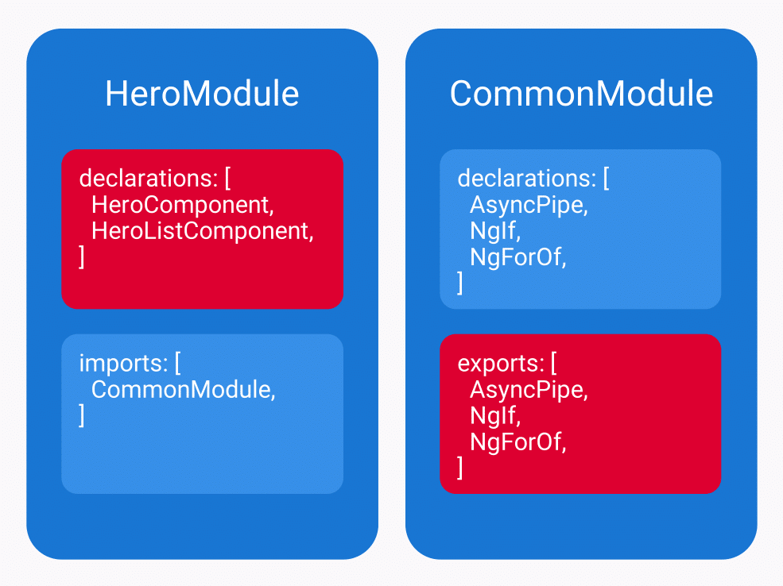
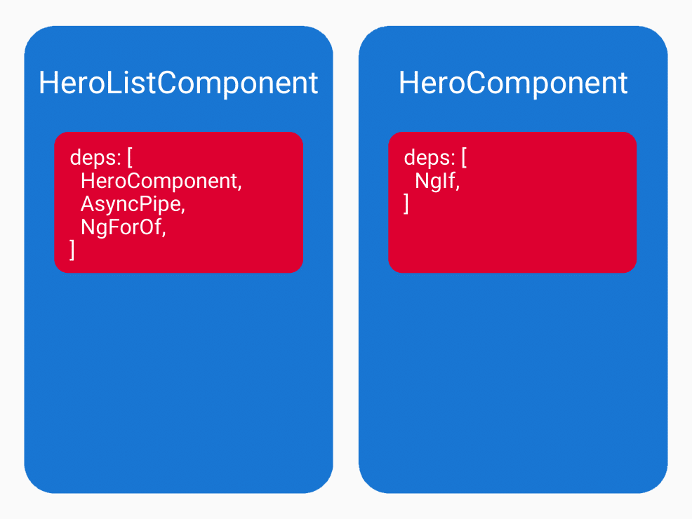

---
{
title: "Angular Revisited: Standalone components and optional NgModules",
published: "2020-11-20T21:24:56Z",
edited: "2022-08-28T18:11:57Z",
tags: ["angular", "ivy", "components", "designpatterns"],
description: "NgModule is arguably one of the most confusing Angular concepts.",
originalLink: "https://dev.to/this-is-angular/angular-revisited-tree-shakable-components-and-optional-ngmodules-36d2",
coverImage: "cover-image.png",
socialImage: "social-image.png",
collection: "Standalone Angular applications",
order: 1
}
---

*It’s time to revisit our Angular engine room. Cover photo by [Gregory Butler](https://pixabay.com/da/slagskib-maskinrummet-historisk-389274/) on [Pixabay](https://pixabay.com/)*

*Original publication date: 2019-02-11.*

`NgModule` is arguably one of the most confusing Angular concepts.

Fortunately, Angular is moving towards a future in which we need Angular modules (`NgModule`s) less often or not at all.

In a future version of Angular, Ivy will enable us to bootstrap or render components to the DOM without any Angular modules. We will also be able to use other components, directives, and pipes in our component templates without Angular modules to resolve them.

These features are not yet available, but we can start preparing now to ease the migration path.

# Standalone components

In the current Angular generation, a component can and must only be declared in a single `NgModule`. The **declarables** (components, directives, and pipes) that can be used by that component is determined at compile time from the metadata of its declaring Angular module.

## Transitive module scope

Every Angular module has a **transitive module scope** which is decided at compile time. The transitive module scope actually consists of two scopes: A transitive compilation scope and a transitive exported scope.

## Transitive exported scope

The transitive exported scope is all the declarables that an Angular module lists in the `exports` option of its metadata. It can also re-export other Angular modules by listing them in that same option. Their exported scopes will then become part of this Angular module’s transitive exported scope.

## Transitive compilation scope

The transitive compilation scope of an Angular module consists of all the declarables that a component declared by that Angular module can use in its template.

The components, directives, and pipes are combined with the transitive exported scope of the Angular modules that are listed in the `imports` option of this Angular module’s metadata.

## The transitive hero module compilation scope

Let’s look at an example of a transitive module scope.

```ts
// hero-list.component.ts
import { Component } from '@angular/core';

import { HeroService } from './hero.service';

@Component({
  selector: 'app-hero-list',
  template: '<app-hero *ngFor="let hero of heroes$ | async"></app-hero>',
})
export class HeroListComponent {
  heroes$ = this.heroService.getHeroes();

  constructor(private heroService: HeroService) {}
}
```

```ts
// hero.component.ts
import { Component } from '@angular/core';

@Component({
  selector: 'app-hero',
  template: `
    <span *ngIf="type === 'superhero'">
      🦸
    </span>
    <span *ngIf="type === 'supervillain'">
      🦹
    </span>
    {{ name }}
  `,
})
export class HeroComponent {
  @Input()
  name: string;
  @Input()
  type: string;
}
```

```ts
// hero.module.ts
import { CommonModule } from '@angular/common';
import { NgModule } from '@angular/core';

import { HeroComponent } from './hero.component';
import { HeroListComponent } from './hero-list.component';

@NgModule({
  declarations: [HeroComponent, HeroListComponent],
  imports: [CommonModule],
})
export class HeroModule {}
```

*The hero and hero list components declared by the same Angular module.*

The `HeroModule` declares two components. They both share a transitive compilation scope.


*Figure 1. The transitive compilation scope of the hero module.*

Figure 1 illustrates the transitive compilation scope of `HeroModule`. The scope—highlighted in red—includes `HeroComponent`, `HeroListComponent` and all the declarables that are exported by `CommonModule`.

`HeroListComponent` is compiled in the context of `HeroModule`‘s transitive compilation scope. This is why it can render `HeroComponent`s using `<app-hero>` tags. They are both declared in `HeroModule`.

The hero list component also uses `AsyncPipe` in its template by using its pipe name, `async`. This is an example of a declarable that is available since `HeroModule` imports `CommonModule`.

Likewise, the `NgForOf` structural directive is used in the hero list component template even though it’s declared by `CommonModule`. In the same way, the hero component uses the `NgIf` structural directive to conditionally render content in its template.

## Local component scope

The Angular Ivy rewrite might introduce [component-level scope for declarable dependencies](https://github.com/angular/angular/pull/27481). This is called **local component scope**.

Angular previously had local component scope for declarables. The latest version to support it was Angular 2 RC5. Back then, the `Component` decorator factory supported the options `directives` and `pipes`.

[Angular Pull Request #27841](https://github.com/angular/angular/pull/27481) and [Angular Ivy Proof of Concept Demo](https://github.com/mgechev/angular-ivy-demo) by Angular team member [Minko Gechev](https://twitter.com/mgechev) suggests that the `Component` decorator factory could get an option called `deps` which takes an array or a nested array of declarables used in the component template. The final implementation and API may differ.


*Figure 2. The local component scopes of the hero list component and the hero component.*

Figure 2 illustrates the local component scopes of the hero list component and the hero component if they were converted to standalone components with the syntax of Pull Request #27841. A hero Angular module wouldn’t be necessary. Neither would the `CommonModule`.

With Angular Ivy, we will be able to render a component independently from an `NgModule`. Ivy will even enable us to lazy-load and render a component without an Angular module or the Angular Router.

## Single component Angular modules

We can’t create standalone components with local component scope yet, but we can start preparing for the future with **SCAMs** (single component Angular modules).

For each component, we create an `NgModule` that imports only the declarables used by that specific component. Likewise, it only declares and exports that single component.

```ts
// cart-button.component.ts
import { Component } from '@angular/core';

@Component({
  selector: 'cart-button',
  template: `
    <button mat-icon-button type="button" (click)="onClick()">
      <mat-icon aria-label="Add to shopping cart">shopping_cart</mat-icon>
    </button>
  `,
})
export class CartButtonComponent {
  onClick(): void {
    this.addToShoppingCart();
  }

  private addToShoppingCart(): void {
    // (...)
  }
}
```

```ts
// cart-button.module.ts
import { NgModule } from '@angular/core';
import { MatButtonModule, MatIconModule } from '@angular/material';

import { CartButtonComponent } from './cart-button.component';

@NgModule({
  declarations: [CartButtonComponent],
  exports: [CartButtonComponent],
  imports: [MatButtonModule, MatIconModule],
})
export class CartButtonModule {}
```

*A SCAM (single component Angular module).*

Sure, it is a bit more work but I actually started doing this in most places anyways. It makes it easier to maintain a current list of declarable dependencies to keep a small bundle size.

When looking at a SCAM, we only have to consider a single component to determine whether an Angular module import is in use.

SCAMs are also useful for testing since they import exactly the declarables needed for the component-under-test.

They could even prove useful for using the Bazel build system. Using one Bazel package per Angular module makes the Bazel build process and setup more seamless.

## Converting to standalone components

In the future, we might combine a component and its SCAM into a standalone component by moving the dependencies imported by the `NgModule` into the `deps` option of the `Component` decorator. We would convert the dependencies from Angular module references into references to the actual declarables we use in our template.

```ts
// cart-button.component.ts
import { Component } from '@angular/core';
import { MatButton, MatIcon } from '@angular/material';

@Component({
  deps: [MatButton, MatIcon],
  selector: 'cart-button',
  template: `
    <button mat-icon-button type="button" (click)="onClick()">
      <mat-icon aria-label="Add to shopping cart">shopping_cart</mat-icon>
    </button>
  `,
})
export class CartButtonComponent {
  onClick(): void {
    this.addToShoppingCart();
  }

  private addToShoppingCart(): void {
    // (...)
  }
}
```

*A standalone component.*

For example `MatButtonModule` is converted to `MatButton`. Currently, the Angular Material components have not been compiled with Angular Ivy and published as standalone components. This will probably be the case for many libraries for a while.

Fortunately, Angular Ivy has taken this into consideration. Ivy comes with 2 compilers. The primary Ivy compiler is executed through the `ngtsc` process which is a thin wrapper around the TypeScript compiler that transforms Angular decorators to metadata stored in static class properties.

The second compiler that comes with Ivy is called `ngcc` which is short for the Angular Compatibility Compiler. We can convert pre-Ivy libraries in `node_modules` by running `ivy-ngcc` as an NPM script or using NPX (`npx ivy-ngcc`). It makes sense to do this in the `postinstall` NPM hook.

## Testing standalone components

When integration testing our Angular components today with the Angular testing utilities, we can replace view child components by adding fake components with the same selectors to the Angular testing module.

With standalone components, the view child components that are used are declared in the `Component` decorator. The Angular team would have to add an API for replacing local scope declarables during tests.

## Bootstrapping a standalone component

Since Angular version 2, bootstrapping an Angular application has required us to create an Angular module with a `bootstrap` option pointing to a root component— by convention the `AppModule` and `AppComponent`, respectively.

We are also used to initialising a platform and bootstrapping the `AppModule` in our main file.

```ts
// app.component.ts
import { Component, OnInit } from '@angular/core';

@Component({
  selector: 'pre-ivy-app',
  template: ` <h1>Hello, {{ name }}!</h1> `,
})
export class AppComponent implements OnInit {
  name: string = 'World';

  ngOnInit(): void {
    this.name = 'Angular';
  }
}
```

```ts
// app.module.ts
import { NgModule } from '@angular/core';
import { BrowserModule } from '@angular/platform-browser';

import { AppComponent } from './app.component';

@NgModule({
  bootstrap: [AppComponent],
  declarations: [AppComponent],
  imports: [BrowserModule],
})
export class AppModule {}
```

```ts
// main.ts
import { enableProdMode } from '@angular/core';
import { platformBrowserDynamic } from '@angular/platform-browser-dynamic';

import { AppModule } from './app/app.module';
import { environment } from './environments/environment';

if (environment.production) {
  enableProdMode();
}

platformBrowserDynamic().bootstrapModule(AppModule);
```

*Bootstrapping a pre-Ivy Angular application.*

With the Angular Ivy renderer, this approach could become a thing of the past.

```ts
// app.component.ts
import { Component, OnInit } from '@angular/core';

@Component({
  selector: 'ivy-app',
  template: ` <h1>Hello, {{ name }}!</h1> `,
})
export class AppComponent implements OnInit {
  name: string = 'World';

  ngOnInit(): void {
    this.name = 'Ivy';
  }
}
```

```ts
// main.ts
import '@angular/compiler';

import { Injector, Sanitizer, ɵLifecycleHooksFeature as LifecycleHooksFeature, ɵrenderComponent as renderComponent } from '@angular/core';
import { DomSanitizer, ɵDomSanitizerImpl as DomSanitizerImpl } from '@angular/platform-browser';

import { AppComponent } from './app.component';

const rootInjector: Injector = Injector.create({
  name: 'root',
  providers: [
    {
      deps: [],
      provide: DomSanitizer,
      useClass: DomSanitizerImpl,
    },
    {
      provide: Sanitizer,
      useExisting: DomSanitizer,
    },
  ],
});

renderComponent(AppComponent, {
  hostFeatures: [LifecycleHooksFeature],
  injector: rootInjector,
  sanitizer: rootInjector.get(Sanitizer),
});
```

*Bootstrapping an Angular Ivy component.*

We simply pass our root component to `renderComponent` in the main file. By default, `renderComponent` assumes the browser platform by using a DOM renderer.

Ivy even gets rid of the `enableProdMode` function. Instead, a global object variable called `ngDevMode` is used. Future tooling should enable automatic configuration of this variable.

To make dependency injection work, we create a root injector.

If we use lifecyle hooks in `AppComponent`, we’ll also have to add `LifeCycleHooksFeature` to the `features` option array. Note that this is only necessary for bootstrapped components with lifecycle hooks. Child components shouldn’t add this feature.

To sanitise rendered content and HTML attributes, we add a DOM sanitiser.

## Not what we have come to expect

If we choose to bootstrap a component with `renderComponent`, we opt out of a lot of the features we have come to expect from an Angular application:

- No `NgZone`
- No application initialisers
- No application initialisation status
- No application bootstrap hooks
- No automatic change detection on local UI state changes based on HTTP requests, timers, event bindings, and so on

Instead, we have to tell Angular that we changed the local UI state in component properties by using the `markDirty` function from the `@angular/core` package.

## Bootstrapping a standalone component is optional

It’s important to mention that bootstrapping a standalone component is an opt-in rendering mechanism since Angular Ivy will be fully backwards-compatible. We’ll still be able to bootstrap an Angular module and get all the features we are used to without having to manage the dirtiness of local UI state ourselves.

## No more explicit entry components

Angular Ivy rids our compiled code of Angular module factories. Our components contain their component factory in their metadata. They are self-contained, independent and tree-shakable.

This means that we can bootstrap any component to the DOM. Likewise, we can dynamically render any component to the DOM through a view container, component outlet, template outlet, CDK portal outlet, router outlet, or simply `renderComponent`.

Since every component compiled with Ivy can be used as an entry component, the `entryComponents` option for the `Component` decorator will become redundant for Angular Ivy components.

## Lazy-loading standalone components

The Angular Router has been the primary way of code-splitting our applications. There are other ways like the `lazyModules` option of the Angular CLI configuration file, `angular.json`, or even providing our own `NgModuleFactoryLoader`.

At some point, Ivy will allow us to lazy-load and render standalone components. Probably using the function-like dynamic `import` keyword. It will look something like:

```ts
// ivy-lazy-loading.ts
import { renderComponent } from '@angular/core';

import('./my-ivy.component').then(({ MyIvyComponent }) => renderComponent(MyIvyComponent, rootInjector));
```

*Lazy-loading standalone components with Angular Ivy.*

# Tree-shakable dependencies

Angular modules were traditionally the primary method to configure injectors for class-based services and other dependencies. Since Angular version 6, we can often provide dependencies without any `NgModule`s involved.

Tree-shakable dependencies are easier to reason about and less error-prone. Even better, they result in smaller application bundles, especially if used in shared dependencies and published libraries.

Like in most other aspects, Angular is very flexible when it comes to dependencies. Learn all about them in “[Tree-shakable dependencies in Angular projects](https://dev.to/this-is-angular/tree-shakable-dependencies-in-angular-projects-1ifg)”.

## Still useful for dynamic providers and multi providers

One place where Angular modules are still useful is to create dynamic providers such as configuration values. This is exactly what the `RouterModule` does with its static methods `forRoot` and `forChild`.

Another example where Angular modules still have their use is for multi providers. Angular’s `APP_INITIALIZER` is a common example of this.

# Libraries and shared bundles

Like discussed in “[Tree-shakable dependencies in Angular projects](https://dev.to/this-is-angular/tree-shakable-dependencies-in-angular-projects-1ifg)”, Angular libraries and shared bundles can put tree-shakable providers to good use. With Angular Development Kit’s Build Optimizer which is included in the default Angular CLI production configuration, even unused declarables are tree-shakable.

However, entry components aren’t tree-shakable. A library like Angular Material actually has a few entry components. Every component that is rendered through an Angular CDK Overlay or Portal Outlet needs to be declared as an entry component. This includes Angular Material’s Autocomplete, Datepicker, and Select components.

If Angular Material had only split its declarables into a single Angular module, we would add all its entry components to our application bundle as soon as we imported the library.

# Compilation schemas

One final concern that Angular modules currently solve is compilation schemas. Examples are `CUSTOM_ELEMENTS_SCHEMA` and `NO_ERRORS_SCHEMA`. How Ivy handles this with regards to standalone components is unknown to me. So far indications show that it’ll defer to the browser to handle custom elements unknown to Angular.

# What the Angular team thinks

When asked at AngularConnect 2018 what he would like to rip out or do differently in Angular, [Igor Minar replied](https://youtu.be/ybhy2Skb8XI?t=185) that at the top of his list of things to remove are Angular modules and that the Angular team is working towards making them optional.

> I think `NgModule` is something that if we didn’t have to, we wouldn’t introduce. Back in the day, there was a real need for it. With Ivy and other changes to Angular over the years, we are working towards making those optional.\
> — [Igor Minar at AngularConnect 2018](https://youtu.be/ybhy2Skb8XI?t=185)

Alex Rickabaugh agrees and adds that it’s often confusing to new Angular developers.

> The way `NgModule` works tends to be confusing to new Angular developers. Even if we weren’t to rip it out completely, we would change how it works and simplify things.\
> — [Alex Rickabaugh at AngularConnect 2018](https://youtu.be/ybhy2Skb8XI?t=219)

In his ng-conf 2019 talk, “Not Every App is a SPA”, [Rob Wormald discusses the proposal for a `deps` metadata option](https://youtu.be/JX5GGu_7JKc?t=714) for the component and element decorator factories. Rob asks the community for feedback on this idea so please experiment and get in touch with him to share your findings.

# Summary

Angular modules have historically been compile-time software artifacts necessary for configuring injectors and resolving declarables for components. The scope provided by an Angular module was necessary to resolve declarables, since we only refer to them by their selectors and pipe names in our component templates.

Unfortunately, this layer of indirection has proven difficult to learn and reason about, especially for newcomers to the Angular ecosystem. With recent API changes for injection tokens and the upcoming Angular Ivy rewrite, we’ll soon be able to build applications and libraries without `NgModule`s.

We don’t even have to wait. We can already break free from Angular modules for configuring injectors. We can also start preparing for standalone components with Single Component Angular Modules.

Even if Ivy enables us to declare `deps` in our standalone components, we’ll unfortunately still have to keep these lists in sync with the declarables used in our component templates. Maybe Angular tooling can automate this at a later time.

Lastly, it’s important to mention that `NgModule`s are not going away anytime soon. You can still use them but as seen by the techniques in this article, they will in many cases become optional.

See you in a less NgModular future! 🚀

# Resources

Slides for my talk *Angular revisited: Tree-shakable components and optional NgModules*:



In this talk, I introduce additional techniques for getting rid of some of our Angular modules today, using experimental Ivy APIs for change detection and rendering.

Here’s the recording of my talk presented at ngVikings 2019 in Copenhagen:

<iframe src="https://www.youtube.com/watch?v=DA3efofhpq4"></iframe>

# Related articles

Step-by-step refactoring of a simple application from a single Angular module containing all declarables to SCAMs in *[Emulating standalone components using single component Angular modules](https://dev.to/this-is-angular/emulating-tree-shakable-components-using-single-component-angular-modules-13do)*.

Dependency injection is a key feature of Angular. Since Angular version 6, we can configure tree-shakable dependencies which are easier to reason about and compile to smaller bundles. Learn all the details in *[Tree-shakable dependencies in Angular projects](https://dev.to/this-is-angular/tree-shakable-dependencies-in-angular-projects-1ifg)*.

A useful Angular pattern needs a schematic. [Younes](https://twitter.com/yjaaidi) created a SCAM schematic which he introduces along with some thoughts on the pattern in his article “[Your Angular Module is a SCAM!](https://medium.com/wishtack/your-angular-module-is-a-scam-b4136ca3917b)”.

# Peer reviewers

An enormous thank you to all of my fellow Angular professionals who gave me valuable feedback on this article and provided deep technical insight on Angular Ivy 🙇‍♂️

I meet wonderful, helpful people like these in various Angular communities.

- [Alexey Zuev](https://twitter.com/yurzui)
- [Brad Taniguchi](https://twitter.com/brad_taniguchi)
- [Joost Koehoorn](https://twitter.com/devjoost)
- [Kay Khan](https://github.com/KayHS)
- [Mahmoud Abduljawad](https://twitter.com/mahmoud_ajawad)
- [Max Koretskyi](https://twitter.com/maxkoretskyi)
- [Sandra Willford](https://www.linkedin.com/in/sandra-willford/)
- [Trotyl Yu](https://twitter.com/trotylyu)
- [Wassim Chegham](https://twitter.com/manekinekko)
