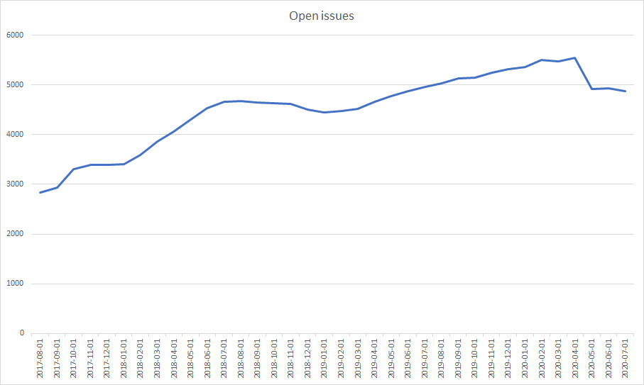

---
{
title: "Angular struggles in 2020",
published: "2020-07-21T00:44:29Z",
edited: "2020-11-15T20:36:34Z",
tags: ["angular"],
description: "An opinion piece on the Angular team management.",
originalLink: "https://dev.to/this-is-angular/angular-struggles-in-2020-1po4",
coverImage: "cover-image.png",
socialImage: "social-image.png"
}
---

*Cover photo by [Pixabay](https://www.pexels.com/photo/road-under-cloudy-sky-416920/) on Pexels.*

*The views expressed in this opinion piece are entirely my own. They do not represent any organization.*

You're going down a dark, murky, slippery road and you've lost your way. What do you do? Keep moving while acting like everything is alright? Or stop and ask for help?

The whole Angular community and especially what's left of the Angular team is going down that road in 2020. It looks like it's not all rainbows and unicorns down there. I think we should stop and regroup. It's time to stop pretending that everything is fine. It's not.

# The Angular team is hurting

What seems like an unlimited pool of talented people have parted ways with the Angular team for the past few years. Too many to be named, but here's a few of them:

- Matias Niemelä
- Kara Erickson
- Rob Wormald
- Alex Eagle
- Vikram Subramanian
- Brad Green
- Ben Lesh
- Brandon Roberts
- Olivier Combe
- Hans Larsen
- Jason Aden
- Mike Brocchi
- Victor Savkin
- Jeff Cross
- Rob Eisenberg

That's a dream team right there. Are some of them collateral damage of the Ivy project that dragged along for more than half of Angular's lifetime before the first stable version was released?

While Ivy probably is part of the problem, we have seen people leave the Angular team speaking about burnout, ridicule, and even anxiety. This doesn't come from scope creep combined with overly optimistic deadlines alone.

Refer to Jeff Cross' personal accounts in "[Jeff's Letter to the Angular Team and Community](https://medium.com/@jeffbcross/jeffs-letter-to-the-angular-team-and-community-5367934a16c9)" and recent Twitter discussions about this [\[1\]](https://twitter.com/jeffbcross/status/1284259207852593153)[\[2\]](https://twitter.com/ThomasBurleson/status/1283902169226280960) for context.

Serious personal injuries like these come from the worst team cultures in companies that enable individuals to micromanage, abuse and harass their peers. Leadership is about enabling your team, not disabling them.

With the constant high churn and conflicts on the Angular team, it seems that they might never get past the Storming stage of [Tuckman's stages of group development](https://en.wikipedia.org/wiki/Tuckman's_stages_of_group_development). Every time a big part of the team is replaced, the team is reset to the Forming stage.

On top of that, the Angular team as a whole is constantly struggling to get to know the huge and highly complex codebase they own.

# The Angular ecosystem is falling apart

For years, the Angular team's efforts were focused on working on the Ivy runtime and compiler in a misguided attempt to keep up in the never-ending "my framework is faster/smaller than your framework" prestige war.

In the same period, a lot of effort went into using and supporting Bazel--an open source version of a toolchain made specifically for Google. In the end, Angular ended up parting ways with Bazel after years of failed attempts to make it work as a generalized toolchain usable both outside and inside at Google.

Meanwhile, many other parts of this *batteries included* application framework were left to rot.

## TSLint takes its last breath

Angular CLI comes with a preset of tools. One of them is TSLint. [With TSLint now deprecated](https://github.com/palantir/tslint/issues/4534#issue-413722441), we wouldn't expect an ecosystem with such a rich set of tools to still use it. Unfortunately, that's still the case for the Angular CLI lint builder and Codelyzer lint rules.

Originally, ESLint support was [planned for Angular version 10](https://github.com/angular/angular-cli/issues/13732#issuecomment-573149865). Now we're left to wonder whether Angular will make it before [December 1st 2020 when TSLint stops accepting even security/TypeScript compatibility PRs](https://github.com/palantir/tslint/issues/4534#issue-413722441). According to the creator of TypeScript, Anders Hejlsberg, ESLint is faster than TSLint and they use it for TypeScript itself. The Angular team is still [worried about memory consumption and speed](https://github.com/angular/angular-cli/issues/13732#issuecomment-618689418).

The TSLint doomsday clock is still ticking for Angular.

## Angular Material is rewritten

Angular Material is switching to implementations wrapping [Material Design Components for the Web](https://github.com/material-components/material-components-web), a framework-agnostic Google library. This is a lot of work for no observable difference, seen from an outside perspective.

For many components, the Angular team will have less influence on the DOM structure and CSS classes. To mitigate this, they came up with [component test harnessses](https://indepth.dev/create-a-component-harness-for-your-tests-with-angular-cdk/). If you have tests that rely on the DOM structure of Angular Material, you have to rewrite all your tests to use the library's component harnesses or your tests will break when the internals of Angular Material are replaced.

Component harnesses have to be supported by so-called harness environments. While the `TestbedHarnessEnvironment` will work for unit tests with most test frameworks, Angular only ships with a `ProtractorHarnessEnvironment` for end-to-end tests and even that one is [still a partial implementation](https://github.com/angular/components/issues/18375). If you use other test end-to-end test frameworks than Protractor, you will have to implement your own harness environment which is easier said than done.

## Library authors are left to wonder

I have tried to outline [the View Engine-to-Ivy transition plan for Angular libraries](https://indepth.dev/the-angular-ivy-guide-for-library-authors/), but I've given up. Even in Angular version 10, [the Angular CLI and documentation recommends that library authors do not compile to the Ivy Instruction Set](https://angular.io/guide/ivy#maintaining-library-compatibility). Probably because the Ivy Instruction Set is not stable and finalized yet. The original plan was to have the Ivy Instruction Set finalized in Angular version 10.

```bash
ng build my-angular-library --prod
Building Angular Package
******************************************************************************
It is not recommended to publish Ivy libraries to NPM repositories.
Read more here: https://v9.angular.io/guide/ivy#maintaining-library-compatibility
******************************************************************************
```

I asked someone from the Angular team, but they didn't know the plan. It could be because Google themselves are still struggling to migrate their +2,600 applications to Ivy.

## Protractor coughs up a new version

[Apparently](https://github.com/angular/protractor/issues/5209#issuecomment-523182031), the Angular team now owns Protractor. Protractor was barely touched in 2019 despite a growing number of issues (about 200 open issues from 2019 alone) and breaking changes in the Selenium WebDriver APIs it wraps.

The Angular team managed to release Protractor version 7 and bundle it with Angular version 10. It seems that this version still supports the deprecated synchronous Selenium WebDriver API for interacting with browsers. There's still work to do.

## Angular Elements are still unusable for many use cases

Angular Elements was introduced years ago. Angular still doesn't support a way to output an Angular custom element in a single bundle or an easy way to share common bundles between multiple Angular custom elements. Additionally, even Ivy's compiled output is still too big out-of-the-box to make Angular custom elements usable in environments where bundle size is a concern. On top of that, building a library with the Ivy Instruction Set is still not recommended as mentioned in a previous section.

## The Zone.js doomsday clock

Zone.js can monkeypatch global APIs, but it can't intercept syntax like async-await. Angular's `NgZone` and the default change detection strategy relies heavily on Zone.js to intercept all tasks that could potentially change the state of an Angular application.

This prevents us from outputting ES2018 bundles as this would keep the native async-await statements in our bundles. Native async-await statements aren't intercepted by the `NgZone` which leaves Angular applications out-of-sync with the DOM.

This fact has been know for years, but has until very recently been ignored by the Angular team. When I say the Angular team, I actually mean the Angular team's management or whomever are the actual decision makers driving the direction of the Angular framework.

## Abandoned packages

While many of Angular's subpackages and related tools have been kept up-to-date and received features in the past few years, some have been fully abandoned or received very little care and attention in recent years:

- [Angular Benchpress](https://www.npmjs.com/package/@angular/benchpress)
- [Angular Flex Layout](https://github.com/angular/flex-layout)
- [Angular app shell](https://angular.io/guide/app-shell)
- [Angular Mobile](https://github.com/angular/mobile-toolkit)
- [Angular Preboot](https://github.com/angular/preboot)
- [Angular PWA](https://www.npmjs.com/package/@angular/pwa)
- [Angular Universal Socket Engine](https://www.npmjs.com/package/@nguniversal/socket-engine)
- [Angular Universal ASP.NET Core Engine](https://www.npmjs.com/package/@nguniversal/aspnetcore-engine)
- [Angular web worker platform](https://github.com/angular/angular/tree/master/packages/platform-webworker)
- [JasmineWD](https://www.npmjs.com/package/jasminewd2)
- [Protractor accessibility plugin](https://github.com/angular/protractor-accessibility-plugin)
- [Protractor console plugin](https://github.com/angular/protractor-console-plugin)
- [Protractor cookbook](https://github.com/angular/protractor-cookbook)
- [Protractor timeline plugin](https://github.com/angular/protractor-timeline-plugin)

# High number of unresolved issue and pull requests

The number of open issues and unresolved pull requests across Angular's main GitHub repositories have reached alarming levels as seen in Figure 1.



*Figure 1. Open issues across the `angular/angular`, `angular/angular-cli`, and `angular/components` repositories over time.*

The Angular team and the Angular Collaborators went through a focused effort to bring it down as seen in June and July 2020, but this has to be a consistent effort to get the number down to a reasonable level.

Towards the end of July 2020, the number of open issues across the `angular/angular`, `angular/angular-cli`, and `angular/components` GitHub repositories are close to 5,000. To put things in perspective, this is more than double the number of open issues in React, Svelte, and Vue's repositories combined.

The number of unresolved pull requests are about 1,000. That's 65% more than the number of unresolved pull requests in React, Svelte, and Vue's repositories combined.

On top of that, many issues are locked for further discussion by the Angular team's GitHub lockbot after the issue has been closed and not commented on for a month, regardless of whether the issue creator is satisfied by the outcome or still looking for feedback from the Angular team.

# No public roadmap

The elusive promise of Ivy has failed to impress. Ivy is an enabler to what exactly? The past 3 years, the core framework has barely changed.

Highly demanded feature requests are still either rejected as non-framework concerns, they have no response or they are not laid out in a roadmap.

Here are a few examples:

- Strongly typed reactive forms
- Observable lifecycle moments
- Observable input properties
- Zoneless applications
- Zoneless Angular Elements
- Dynamic rendering without `ComponentFactoryResolver`
- Optional Angular modules--besides public APIs, we're still missing NgModule-free options for:
  - Routed components
  - Injector management
  - Support for tree-shakable providers
  - Style compilation and encapsulation
  - Local component scope for declarable dependencies
  - Compilation schemas
  - Content projection
  - Bootstrapping components with all necessary dependencies for running and application
- Runtime language switching
- Dynamic loading of translation texts
- Dynamic component rendering with data binding

When asked about a roadmap, the Angular team answers that it's being worked out and to watch their blog for updates.

We're still waiting…

As briefly mentioned, these examples of technical issues are symptoms of much bigger and more important problems. Read more about this in "[No, I don't want to become an Angular GDE](https://dev.to/layzee/no-i-don-t-want-to-become-an-angular-gde-2576)".
