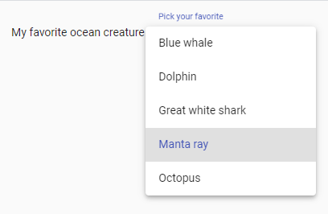
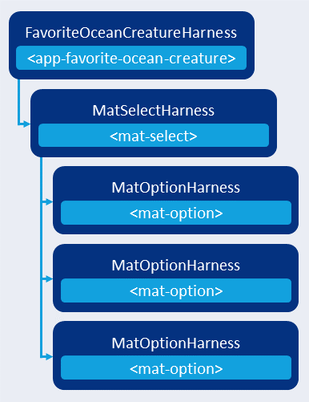

---
{
title: "Create a component harness for your tests with Angular CDK",
published: "2021-03-24T15:04:50Z",
edited: "2022-12-23T00:59:03Z",
tags: ["angular", "testing", "cdk", "componentharnesses"],
description: "Learn how to create and consume a custom component harness using Angular CDK. With a step-by-step case study, we run it in unit tests and end-to-end tests.",
originalLink: "https://dev.to/this-is-angular/create-a-component-harness-for-your-tests-with-angular-cdk-46bg",
coverImage: "cover-image.png",
socialImage: "social-image.png"
}
---

*Cover photo by [Cassey Cambridge](https://pixy.org/190591/) on Pixy.*

*Original publication date: 2020-03-28.*

*Updated for Angular CDK and Angular Material version 9.2.*

A component harness is a testing API around an Angular directive or component. Component harnesses can be shared between unit tests, integration tests, and end-to-end tests. They result in less brittle tests as implementation details are hidden from test suites.

## What does a component harness look like?

As a case study we'll explore the `MatButtonHarness` introduced in Angular Material version 9.

The component harness for the `MatButton` directive has these methods:

- `blur(): Promise<void>`
- `click(): Promise<void>`
- `focus(): Promise<void>`
- `getText(): Promise<string>`
- `host(): Promise<TestElement>`
- `isDisabled(): Promise<boolean>`

This covers the most important user interactions and observable traits of a Material Button.

All component harness methods must return a promise. This gives the consumer a consistent API feel, but also lets the harness environment take care of asynchronous events, timers, and change detection. This makes `async-await` the most convenient statement structure for tests using component harnesses as we'll see later.

The only method here that is out of the ordinary is the `host` method. It resolves a `TestElement`. We'll explore test elements in a minute. First, it's important to note that test elements should only be exposed to consumers if it wraps an element that the consumer has created. This is always the case for directives' host elements, so it's valid for `MatButtonHarness`.

The button harness also has the conventional static `with` method which accepts an object with harness filters to select the directive in the DOM, we're interested in.

As an example, we can select a button with the text label `Sign up` as seen in Listing 1.

```ts
// sign-up-form.spec.ts
it('submits a form when the sign up button is clicked', async () => {
  const signUpButton = await harnessLoader.getHarness(
    MatButtonHarness.with({ text: 'Sign up' }));

  await signUpButton.click();

  expect(formSpy).toHaveBeenCalled();
});
```

<figcaption>Listing 1. Selecting a harness for a specific button by using a harness filter.</figcaption>

## How do I create a component harness?

For our next case study, we will implement a component harness for a *favourite ocean creature* component which uses Angular Material components to implement the favourite ocean creature picker component.

The component's UI and interactions can be seen in Figures 1 and 2.


<figcaption>Figure 1. Favourite ocean creature picked.</figcaption>



<figcaption>Figure 2. Favourite ocean creature options.</figcaption>

As we'll see when we implement and use the test harness for this component, the implementation details won't matter for the purpose of testing, using a test-as-a-user approach. That is, the shape of the component model, the data binding API, and the DOM structure of the component template are unimportant as we don't directly rely on them in our test cases.

```ts
// favorite-ocean-creature.harness.ts
import { ComponentHarness } from '@angular/cdk/testing';

export class FavoriteOceanCreatureHarness extends ComponentHarness {
  static hostSelector = 'app-favorite-ocean-creature';
}
```

<figcaption>Listing 2. Minimal component harness specifying a selector.</figcaption>

In Listing 2, we create a minimal component harness which extends the `ComponentHarness` class from `@angular/cdk/testing` and specifies a CSS selector for a top-level DOM element of the component or it's template. In this case, we're targeting `<app-favorite-ocean-creature>` elements.

This gives test cases access to the `host` property which is a promise that resolves to a `TestElement`.

The `TestElement` interface holds these methods for interaction with a DOM element:

- `blur(): Promise<void>`
- `clear(): Promise<void>`
- `click(relativeX?: number, relativeY?: number): Promise<void>`
- `getAttribute(name: string): Promise<string | null>`
- `getCssValue(property: string): Promise<string>`
- `getDimensions(): Promise<ElementDimensions>`\*
- `getProperty(name: string): Promise<any>`
- `isFocused(): Promise<boolean>`
- `focus(): Promise<void>`
- `hasClass(name: string): Promise<string>`
- `hover(): Promise<void>`
- `matchesSelector(selector: string): Promise<boolean>`
- `sendKeys(...keys: (string | TestKey)[]): Promise<void>`\*\*
- `text(): Promise<string>`

\*  `ElementDimensions` is an `interface` with `number` properties `top`, `left`, `width`, and `height`.

\*\* `TestKey` is an `enum` with keycodes for non-text keys such as `BACKSPACE`, `TAB`, `ENTER`, `LEFT_ARROW`, and `F10`.

For every element in our component's DOM, we can query for a `TestElement`. However, we should only expose `TestElement`s to our consumers (test cases or library users) that interact with DOM elements that they are directly controlling such as a component's host element. In this case, that is the `<app-favorite-ocean-creature>` DOM element which is used and controlled by parent components' templates.

> Component harness authoring tip: In general, don't expose `TestElement`s directly. Only do so for DOM elements that consumers control.

The reason for this is that we don't want consumers to depend on our DOM structure which is an implementation detail that they should not have to rely on or even worry about. It's up to us as the owners of components and directives to keep our component harnesses in sync with their corresponding DOM structures.

### Staging the component test suite

Let's make the test suite for the component drive the API design of our component harness.

First we want to verify which ocean creature is picked initially. To do that, we need to configure the Angular testing module for a test host component which uses the favourite ocean create component.

```ts
// favorite-ocean-creature.spec.ts
import { TestbedHarnessEnvironment } from '@angular/cdk/testing/testbed';
import { Component } from '@angular/core';
import { TestBed } from '@angular/core/testing';
import { NoopAnimationsModule } from '@angular/platform-browser/animations';

import {
  FavoriteOceanCreatureHarness,
} from './favorite-ocean-creature.harness';
import { FavoriteOceanCreatureModule } from './favorite-ocean-creature.module';

describe('Favorite ocean creature', () => {
  @Component({
    template: '<app-favorite-ocean-creature></app-favorite-ocean-creature>',
  })
  class TestHostComponent {}

  let harness: FavoriteOceanCreatureHarness;

  beforeEach(async () => {
    TestBed.configureTestingModule({
      declarations: [TestHostComponent],
      imports: [NoopAnimationsModule, FavoriteOceanCreatureModule],
    });

    const fixture = TestBed.createComponent(TestHostComponent);
    const loader = TestbedHarnessEnvironment.loader(fixture);
    harness = await loader.getHarness(FavoriteOceanCreatureHarness);
  });
});
```

<figcaption>Listing 3. Staging a test suite that tests our component using its component harness.</figcaption>

Listing 3 shows how we create the test hosting component, configure the Angular testing module by disabling animations, declaring the test host component and importing the declaring module of our component.

After configuring the Angular testing module, we first set up a component fixture for the test host component. Then we create a `HarnesssLoader` by passing the component fixture to `TestbedHarnessEnvironment.loader`. Finally, we query the component harness that represents the favourite ocean creature component in the test host component's template by passing `FavoriteOceanCreatureHarness` to `HarnessLoader#getHarness` and resolving the promise it returns.

### Component harness environments

In unit and integration tests, we use `TestbedHarnessEnvironment` to create a `HarnessLoader`. The test bed component harness environment support the Karma and Jest test runners, probably also other test runners as long as they support a DOM.

If we use Protractor for end-to-end tests, we can use the `ProtractorHarnessEnvironment` to create `HarnessLoader`s. For other end-to-end test frameworks such as Cypress, we would have to implement a specialised `HarnessEnvironment` or wait for the community to publish one.

If you're interested in providing support for other end-to-end frameworks, read the official component harness guide's section called "[API for harness environment authors](https://material.angular.io/cdk/test-harnesses/overview#api-for-harness-environment-authors)". The guide teaches about the requirements for implementing a `HarnessEnvironment` and a corresponding `TestElement` which is what enables component harnesses to interact with the DOM as we saw in its API earlier.

## Querying for a child harness

With the test staging in Listing 3, we've got everything we need to start adding test cases to our test-as-a-user component test suite.

As the breathtaking and wise manta ray is obviously the favourite ocean creature of many people, it is the initial pick of our component. We'll assert this in our first test case.

```ts
// favorite-ocean-creature.spec.ts
it('manta ray is initially picked', async () => {
  const mantaRay = 'Manta ray';

  const pickedOceanCreature = await harness.getFavoriteOceanCreature();

  expect(pickedOceanCreature).toBe(mantaRay);
});
```

<figcaption>Listing 4. Asserting the initially picked ocean creature.</figcaption>

Listing 4 shows the API we want our component harness to support–a method called `getFavoriteOceanCreature` which returns a promise that resolves to a string holding the display name of an ocean creature that can be picked as our favourite.

```ts
// favorite-ocean-creature.harness.ts
import { AsyncFactoryFn, ComponentHarness } from '@angular/cdk/testing';
import { MatSelectHarness } from '@angular/material/select/testing';

export class FavoriteOceanCreatureHarness extends ComponentHarness {
  static hostSelector = 'app-favorite-ocean-creature';

  protected getDropDown: AsyncFactoryFn<MatSelectHarness> =
    this.locatorFor(MatSelectHarness);

  async getFavoriteOceanCreature(): Promise<string> {
    const select = await this.getDropDown();

    return select.getValueText();
  }
}
```

<figcaption>Listing 5. Querying for a child harness to delegate a consumer query.</figcaption>

In Listing 5, we add a protected method that returns a promise that resolves to a component harness. The `MatSelectHarness` represents a `MatSelect` directive. In our case, the select directive used by the favourite ocean picker component.

The `AsyncFactoryFn<T>`  type in the `@angular/cdk/testing` sub-package represents a function that returns `Promise<T>`, for example an `async` function.

While `getDropDown` looks like a property, since we're assigning to it the result of calling another method, it is indeed a method. `ComponentHarness#locatorFor` is a utility function often used for creating internal or publicly exposed query methods.

We use `this.locatorFor(MatSelectHarness)` to query for the harness representing the first select directive child of the specific favourite ocean creature component.

`ComponentHarness#locatorFor` is one of the built-in utility methods of the `ComponentHarness` base class. It supports multiple ways of querying for child elements or component harnesses representing them. It also supports DOM selectors and `HarnessPredicate`s.

Next, we implement the public method for resolving the display name of the picked ocean creature. This is done by using the asynchronous child harness locator, `getDropDown`.

Note that `getFavoriteOceanCreature` is an `async` method, meaning that whatever value we return is wrapped in a promise and that we can use the `await` operator inside its method body.

### Using a child harness

Once we have awaited the promise returned by `this.getDropDown()`, we have a `MatSelectHarness` in the `select` constant.

How do we get the display text of the selected option from the select harness? Unfortunately, at the time of writing, the [`MatSelectHarness` is undocumented](https://material.angular.io/components/select/api) in Angular Material's online documentation. But since we're using TypeScript, we have access to its type definition.

We scan `MatSelectHarness`' API for what we need:

- `blur(): Promise<void>`
- `clickOptions(filter?: OptionHarnessFilters): Promise<void>`
- `close(): Promise<void>`
- `focus(): Promise<void>`
- `getOptionGroups(filter?: Omit<OptionHarnessFilters, 'ancestor'>): Promise<MatOptgroupHarness[]>`\* \*\*
- `getOptions(filter?: Omit<OptionHarnessFilters, 'ancestor'>): Promise<MatOptionHarness[]>`\* \*\*
- `getValueText(): Promise<string>`
- `isDisabled(): Promise<boolean>`
- `isEmpty(): Promise<boolean>`
- `isOpen(): Promise<boolean>`
- `isRequired(): Promise<boolean>`
- `isMultiple(): Promise<boolean>`
- `isValid(): Promise<boolean>`
- `open(): Promise<void>`

\*`OptionHarnessFilters` is an interface that extends `BaseHarnessFilters` with the members  `isSelected?: boolean` and `text?: string | RegExp`. `BaseHarnessFilters` in the `@angular/cdk/testing` sub-package is an interface with the members `ancestor?: string` and  `selector?: string`.

\*\*Note that `MatSelectHarness` itself allows us to query for its child harnesses.

Did you spot a method we can use? Correct, it's `getValueText` as you might have noticed earlier, in Listing 5.

The `async-await` style used in `getFavoriteOceanCreature` is very common and central both when creating component harnesses and using them, since all their methods return promises.

### No dependency on implementation details

Circling back to Listing 4, we see that we managed to support a test case without the consumer (our first test case) knowing anything about our component's DOM structure or API.

```ts
// favorite-ocean-creature.spec.ts
it('manta ray is initially picked', async () => {
  const mantaRay = 'Manta ray';

  const pickedOceanCreature = await harness.getFavoriteOceanCreature();

  expect(pickedOceanCreature).toBe(mantaRay);
});
```

<figcaption>Listing 4 (repeated). Asserting the initially picked ocean creature.</figcaption>

The test case knows nothing about us using Angular Material's select directive and it knows nothing about which elements need to be clicked to open the drop down or pick an option. In fact, we didn't even have to know any of that about `MatSelect` when implementing our component harness.

The result is a test that is easy to follow and uses a language that's close to a user story.

## Querying for multiple pieces of content

Next up, we're going to verify that the component shows a list of ocean creatures that the user can pick from.

```ts
// favorite-ocean-creature.spec.ts
it('show awesome ocean creatures', async () => {
  const blueWhale = 'Blue whale';

  const options = await harness.getOptions();

  expect(options).toContain(blueWhale);
});
```

<figcaption>Listing 6. Asserting that multiple ocean creatures are presented to the user.</figcaption>

When using a dropdown, we often allow the consumer to pass the options we want to display. However, this component only lists a fixed collection of awesome ocean creatures as seen in Figure 2.

Because of this, our test asserts the presence of a blue whale which is a different ocean creature than the initially picked manta ray.

### Exposing content in queries

What do you think the resolved type of the `getOptions` method is? `<option>` elements? `MatOption`s? No, we don't want to expose information that couples our consumers to our implementation details. If we stop using the `MatSelect` directive or the select directive stop using `<option>` elements, we don't want to break our own tests or those of a 3rd party.

Instead, we'll simply resolve an array of text strings and pass them to our consumers. You might have noticed this because the test case asserts that the `options` contains the `'Blue whale'` text string.

### Interacting with a child harness

To support this test case, we only need the `getDropDown` locator that we added to our component harness in the previous chapter.

```ts
// favorite-ocean-creature.harness.ts
import { AsyncFactoryFn, ComponentHarness } from '@angular/cdk/testing';
import { MatSelectHarness } from '@angular/material/select/testing';

export class FavoriteOceanCreatureHarness extends ComponentHarness {
  static hostSelector = 'app-favorite-ocean-creature';

  protected getDropDown: AsyncFactoryFn<MatSelectHarness> =
    this.locatorFor(MatSelectHarness);

  async getOptions(): Promise<ReadonlyArray<string>> {
    const select = await this.getDropDown();
    await select.open();
    const options = await select.getOptions();
    const optionTexts = options.map(option => option.getText());

    return Promise.all(optionTexts);
  }
}
```

<figcaption>Listing 7. Interacting with a child harness.</figcaption>

In the `getOptions` method, we resolve a select harness like before. But instead of returning a value immediately, we interact with the child select harness.

From the `MatSelectHarness` API, we first use the `open` method to open the dropdown list, then we query for `MatOptionHarness`es by using the `getOptions` method.

As we discussed, we map the option harnesses to their display texts so that we don't expose implementation details to our consumers.

Since `MatOptionHarness#getText` returns a promise like every other harness method, we wrap the mapped promises in a `Promise.all` call to resolve all of them at once as an array of text strings.

Notice how `async-await` makes the individual steps in our method easy to follow by using a synchronous control flow style.

## The component harness hierarchy

As you might have noticed in the previous chapter, component harnesses form a hierarchy that matches the DOM and the component tree closely.



<figcaption>Figure 3. Our component harness hierarchy.</figcaption>

This is illustrated in Figure 3. Our tests use `FavoriteOceanCreatureHarness` that internally uses `MatSelectHarness` which also gives access to its child harnesses, `MatOptionHarness`.

If we were to look at the DOM rendered by our favorite ocean creature component, we would see a similar hierarchy.

Notice that the consumers of `FavoriteOceanCreatureHarness` know nothing about `<mat-select>` or `MatSelectHarness`. We only expose information rather than implementation details. We do this so that our consumers aren't tightly bound to our component implementation which uses `MatSelect` under the hood.

If we for some reason want our consumers to interact with the options in the dropdown list, we'll have to wrap `MatOptionHarness` in our own `FavoriteOceanCreatureOption`.

## Supporting user interactions with component harness filters

Our third test case exercises the user's ability to pick a different favourite ocean creature and verify that it's display text is reflected in the content.

```ts
// favorite-ocean-creature.spec.ts
it('pick your favorite ocean creature', async () => {
  const greatWhiteShark = 'Great white shark';

  await harness.pickOption({ text: greatWhiteShark });

  const pickedOceanCreature = await harness.getFavoriteOceanCreature();
  expect(pickedOceanCreature).toBe(greatWhiteShark);
});
```

<figcaption>Listing 8. Testing user interaction with a component harness.</figcaption>

As seen in Listing 8, we allow our consumer to specify a text filter to match the display text of the option that they want to pick. In this case, our test case is picking the great white shark option. We consistently use `async-await` for our component harness interactions.

Finally, we reuse the query method `getFavoriteOceanCreature` to assert that the content reflects our pick.

To support this test case, we need to implement the `pickOption` method which takes a component harness filter as an argument.

```ts
// favorite-ocean-creature.harness.ts
import { AsyncFactoryFn, ComponentHarness } from '@angular/cdk/testing';
import { MatSelectHarness } from '@angular/material/select/testing';

import {
  FavoriteOceanCreatureFilters,
} from './favorite-ocean-creature-filters';

export class FavoriteOceanCreatureHarness extends ComponentHarness {
  static hostSelector = 'app-favorite-ocean-creature';

  protected getDropDown: AsyncFactoryFn<MatSelectHarness> =
    this.locatorFor(MatSelectHarness);

  async pickOption(filter: FavoriteOceanCreatureFilters): Promise<void> {
    const select = await this.getDropDown();

    return select.clickOptions({ text: filter.text });
  }
}
```

<figcaption>Listing 9. Supporting a component harness filter</figcaption>

Listing 9 shows the relevant methods and properties of the favourite ocean creature harness that supports the test case we wrote in Listing 8.

`pickOption` is a new method. It accepts a `FavoriteOceanCreatureFilters` parameter that we will look at in a minute.

In the method body, we access the child `MatSelectHarness` using the `getDropDown` locator which we have used before.

We pass the text filter to the `MatSelectHarness#clickOptions` method which clicks the first matching option for single value dropdowns.

```ts
// favorite-ocean-creature-filters.ts
import { BaseHarnessFilters } from '@angular/cdk/testing';

export interface FavoriteOceanCreatureFilters extends BaseHarnessFilters {
  readonly text?: string | RegExp;
}
```

<figcaption>Listing 10. A custom component harness filter.</figcaption>

Listing 10 shows a basic custom component harness filter. We create an interface that extends `BaseHarnessFilters` from `@angular/cdk/testing`. Previously we mentioned that the base harness filters has optional `ancestor` and a `selector` properties. We don't currently support them as we only pass our `text` filter to the child select harness as seen in Listing 9.

It would make more sense not to extend the base harness filters until we implemented support for its properties or we could use `Omit` like `MatSelectHarness` does for option and option group harness filters.

For demonstration purposes, we extend the full base harness filter here which means that our consumers are able to specify `selector` and `ancestor` filters, even though they are not being used. We could implement the base filters using harness locators, but let's skip that to keep this example simple.

We have now implemented our first user interaction through a custom component harness with a custom component harness filter. Nice

## Filtering exposed content

In our final test case we assert that when we pick a favourite ocean creature, it is used in a sentence to spell out `My favorite ocean creature is <ocean creature display text>`.

```ts
// favorite-ocean-creature.spec.ts
it('put your favorite ocean creature in a sentence', async () => {
  const octopus = 'Octopus';

  await harness.pickOption({ text: octopus });

  const text = await harness.getText();
  expect(text).toBe(`My favorite ocean creature is ${octopus}`);
});
```

<figcaption>Listing 11. Verifying that our picked favorite ocean creature is used in a sentence.</figcaption>

The test case in Listing 11 first uses the familiar `pickOption` to pick the octopus as our favourite ocean creature. When that is done, we query for the text content of the favourite ocean creature component and assert that it matches the expected format and includes `Octopus`.

```ts
// favorite-ocean-creature.harness.ts
import { AsyncFactoryFn, ComponentHarness } from '@angular/cdk/testing';
import { MatSelectHarness } from '@angular/material/select/testing';

import {
  FavoriteOceanCreatureFilters,
} from './favorite-ocean-creature-filters';

export class FavoriteOceanCreatureHarness extends ComponentHarness {
  static hostSelector = 'app-favorite-ocean-creature';

  protected getDropDown: AsyncFactoryFn<MatSelectHarness> =
    this.locatorFor(MatSelectHarness);

  async getText(): Promise<string> {
    const host = await this.host();
    const text = await host.text();
  const label = 'Pick your favorite';

    return text.replace(label, '').trim();
  }

  async pickOption(filter: FavoriteOceanCreatureFilters): Promise<void> {
    const select = await this.getDropDown();

    return select.clickOptions({ text: filter.text });
  }
}
```

<figcaption>Listing 12. Filtering queried content to make consumption easy.</figcaption>

Listing 12 include the methods relevant to the sentence test case from Listing 11. We are already familiar with the `pickOption` interaction method, the `getDropDown` locator it uses and the filter it accepts.

Let's consider the `getText` query method which takes no arguments. We start out by querying the host element's DOM for the current text content. First it accesses a `TestElement` representing the host element by using the inherited `ComponentHarness#host` method.

We then query the text content of the host element by calling and resolving the `TestElement#text` method on our `host` variable. Finally, we filter out the label of the favourite ocean creature picker which is an implementation detail and not of interest to this part of the testing API we expose through our custom component harness.

We also trim the text since HTML often includes additional whitespace around text content. By doing this in our component harness, we save multiple consumers from doing the same sanitising task which could otherwise lead to false positives when testing use cases involving our favourite ocean creature component.

## The full test suite

Let's finish by taking a look at the full test suite.

```ts
// favorite-ocean-creature.spec.ts
import { TestbedHarnessEnvironment } from '@angular/cdk/testing/testbed';
import { Component } from '@angular/core';
import { TestBed } from '@angular/core/testing';
import { NoopAnimationsModule } from '@angular/platform-browser/animations';

import {
  FavoriteOceanCreatureHarness,
} from './favorite-ocean-creature.harness';
import { FavoriteOceanCreatureModule } from './favorite-ocean-creature.module';

describe('Favorite ocean creature', () => {
  @Component({
    template: '<app-favorite-ocean-creature></app-favorite-ocean-creature>',
  })
  class TestHostComponent {}

  let harness: FavoriteOceanCreatureHarness;

  beforeEach(async () => {
    TestBed.configureTestingModule({
      declarations: [TestHostComponent],
      imports: [NoopAnimationsModule, FavoriteOceanCreatureModule],
    });

    const fixture = TestBed.createComponent(TestHostComponent);
    const loader = TestbedHarnessEnvironment.loader(fixture);
    harness = await loader.getHarness(FavoriteOceanCreatureHarness);
  });

  it('manta ray is initially picked', async () => {
    const mantaRay = 'Manta ray';

    const pickedOceanCreature = await harness.getFavoriteOceanCreature();

    expect(pickedOceanCreature).toBe(mantaRay);
  });

  it('show awesome ocean creatures', async () => {
    const blueWhale = 'Blue whale';

    const options = await harness.getOptions();

    expect(options).toContain(blueWhale);
  });

  it('pick your favorite ocean creature', async () => {
    const greatWhiteShark = 'Great white shark';

    await harness.pickOption({ text: greatWhiteShark });

    const pickedOceanCreature = await harness.getFavoriteOceanCreature();
    expect(pickedOceanCreature).toBe(greatWhiteShark);
  });

  it('put your favorite ocean creature in a sentence', async () => {
    const octopus = 'Octopus';

    await harness.pickOption({ text: octopus });

    const text = await harness.getText();
    expect(text).toBe(`My favorite ocean creature is ${octopus}`);
  });
});
```

<figcaption>Listing 13. The favorite ocean creature test suite.</figcaption>

For our unit and integration tests, we still configure an Angular testing module through the test bed, but only to be able to create a component fixture for a test host component. We pass the component fixture to the test bed harness environment to get a harness loader.

For this test suite, we only need to load a single component harness that we store a reference to in the shared `harness` variable. We keep both the component fixture and the harness loader out of scope of the test cases.

### Simple test cases

Looking at the test cases in Listing 13, we notice that they have very few test steps. There are only 1-2 lines of code in the arrange, act, and assert stages of each test case. This is thanks to the testing API we expose through our custom component harness.

### No manual change detection or task queue emptying

If you have ever written component tests for Angular applications and UI libraries using the test bed, you will have noticed that we usually have to call `ComponentFixture#detectChanges`, `tick` inside an `fakeAsync` or resolve `ComponentFixture#whenStable` to wait for async tasks to complete and Angular's change detection cycle and rendering to end.

In our test cases that use a component harness, we don't have to call any of those methods and functions. The component harness environment takes care of this for us. The downside is that every method has to be asynchronous and return a promise, but this is nicely addressed by using `async-await` in our component harness methods and consuming test cases.

## End-to-end tests

Until now, we only showed unit tests consuming our component harness. One of the many benefits of using component harnesses is that they are reusable between unit tests, integration tests, and end-to-end tests.

Let's convert one of our tests cases to an end-to-end test.

```ts
import { ProtractorHarnessEnvironment } from '@angular/cdk/testing/protractor';
import { browser } from 'protractor';

import {
  FavoriteOceanCreatureHarness,
} from '../../src/app/favorite-ocean-creature/favorite-ocean-creature.harness';

describe('Favorite ocean creature app', () => {
  beforeEach(async () => {
    browser.get('/');
    const harnessLoader = ProtractorHarnessEnvironment.loader();
    harness = await harnessLoader.getHarness(FavoriteOceanCreatureHarness);
  });

  let harness: FavoriteOceanCreatureHarness;

  it('put your favorite ocean creature in a sentence', async () => {
    const octopus = 'Octopus';

    await harness.pickOption({ text: octopus });

    const text = await harness.getText();
    expect(text).toBe(`My favorite ocean creature is ${octopus}`);

  });
});
```

<figcaption>Listing 14. End-to-end test suite using the favorite ocean creature component harness.</figcaption>

The end-to-end test case in Listing 14 is an exact copy-paste from our unit test.

The setup is slightly different. Since the test runs against the full application in the browser, we're not configuring the testing Angular module with `TestBed`.

We're using Protractor to control the browser and navigate to the URL path where our component is rendered. We see that we use `ProtractorHarnessEnvironment` instead of `TestbedHarnessEnvironment` to get a `HarnessLoader`.

Those are really the only differences. The component harness is consumed in exactly the same way, as soon as we have an instance of it which we get from the harness loader.

### Slight differences

I told you that component harnesses can be used both in unit tests, integration tests, and end-to-end tests. While that's true, if we run the test above, we'll stumble upon a couple of things.

**Whitespace differences**

The first one that unfortunately doesn't show up as a clear error in the test is that the text filter for the `pickOption` method doesn't seem to work. Apparently, there are some whitespace differences between unit tests and end-to-end tests in our case.

```ts
// favorite-ocean-creatures.harness.ts
import { AsyncFactoryFn, ComponentHarness } from '@angular/cdk/testing';
import { MatSelectHarness } from '@angular/material/select/testing';

import {
  FavoriteOceanCreatureFilters,
} from './favorite-ocean-creature-filters';

export class FavoriteOceanCreatureHarness extends ComponentHarness {
  static hostSelector = 'app-favorite-ocean-creature';

  protected getDropDown: AsyncFactoryFn<MatSelectHarness> =
    this.locatorFor(MatSelectHarness);

  private coerceRegExp(textFilter: string | RegExp): RegExp {
    return typeof textFilter === 'string'
      ? new RegExp(`^\s*${textFilter}\s*$`)
      : textFilter;
  }

  async getText(): Promise<string> {
    const host = await this.host();
    const text = await host.text();
    const label = 'Pick your favorite';

    return text.replace(label, '').trim().replace(/\r?\n+/g, ' ');
  }

  async pickOption(filter: FavoriteOceanCreatureFilters): Promise<void> {
    const select = await this.getDropDown();

    await select.clickOptions({ text: this.coerceRegExp(filter.text || '') });
  }
}
```

<figcaption>Listing 15. Supporting whitespace differences.</figcaption>

Remember that the text filter option supports either a `string` or a `RegExp`? This is because the `MatSelect#clickOptions` methods accepts both and now we're going to need the second option.

Because of the whitespace differences, we're going to coerce a `string` text filter into a regular expression that allows whitespace before and after the text filter. This is done in the private `coerceRegExp` method seen in Listing 15 which always returns a regular expression.

In the test case, we also use `FavoriteOceanCreatureHarness#getText` which also reveals som whitespace differences between unit tests and end-to-end tests. We support these differences by replacing one or more newlines with a single space character.

**Animations flakiness**

The section "Waiting for asynchronous tasks" of the official component harnesses guide mentions that [Angular animations might require several runs of change detection and `NgZone` task intercepting before stabilizing](https://material.angular.io/cdk/test-harnesses/overview#waiting-for-asynchronous-tasks).

In our unit tests, we imported the `NoopAnimationsModule` to disable animations which are used by many Angular Material components.

In our end-to-end tests, the application uses real browser animations because our `AppModule` imports the `BrowserAnimationsModule`.

I've seen the test case above fail approximately every other run because of animations. The animations didn't always complete after clicking an option in the dropdown which happens before the DOM element that displays the selected value is re-rendered.

This is a case where we follow the instructions from the component harness guide mentioned above. After clicking an option, we call `ComponentHarness#forceStabilize` as shown in Listing 16.

```ts
// favorite-ocean-creatures.harness.ts
import { AsyncFactoryFn, ComponentHarness } from '@angular/cdk/testing';
import { MatSelectHarness } from '@angular/material/select/testing';

import {
  FavoriteOceanCreatureFilters,
} from './favorite-ocean-creature-filters';

export class FavoriteOceanCreatureHarness extends ComponentHarness {
  static hostSelector = 'app-favorite-ocean-creature';

  protected getDropDown: AsyncFactoryFn<MatSelectHarness> =
    this.locatorFor(MatSelectHarness);

  private coerceRegExp(textFilter: string | RegExp): RegExp {
    return typeof textFilter === 'string'
      ? new RegExp(`^\s*${textFilter}\s*$`)
      : textFilter;
  }

  async pickOption(filter: FavoriteOceanCreatureFilters): Promise<void> {
    const select = await this.getDropDown();

    await select.clickOptions({ text: this.coerceRegExp(filter.text || '') });
    await this.forceStabilize();
  }
}
```

<figcaption>Listing 16. Forcing NgZone and change detection to stabilize after clicking a dropdown option.</figcaption>

With those two additions to our component harness, this test case passes with exactly the test and component harness code in both unit tests and end-to-end tests.

### Protractor caveat

An unfortunate caveat as of Angular CDK version 10.1 is that [`ProtractorHarnessEnvironment` does not implement `waitForTasksOutsideAngular` yet](https://github.com/angular/components/issues/18375).

This means that asynchronous tasks run outside `NgZone` cannot be intercepted and awaited by the Protractor harness environment which could lead to false positives in our Protractor tests or force us to write additional code in the test cases themselves. Especially if we use non-Angular UI libraries.

## Conclusion

I started out by saying that a component harness wraps a component or a directive. But in fact, component harnesses can be used to build a testing API around any pieces of DOM.

A component harness does not have to wrap only a single component or DOM element. As we discussed, a component harness can represent a hierarchy of component harnesses. A component harness hierarchy can consist of several component harness types, several component harness instances of the same type or a mix of both as we have seen.

In our example, we created a single component harness that interacted with all the different parts of the favorite ocean creature use case. We could have split it into multiple component harnesses. We could also have created a component harness that allowed consumers to interact with a complete page or an entire application.

By the way, how many components does the use case consist of? Did you notice that throughout this article, we never once saw an Angular component model or an Angular template? This speaks in favour of the validity of the test-as-a-user strategy which component harnesses help us follow.

### Additional topics

I tried to create a case study at an intermediate level that taught you about writing your own component harness, using Angular Material's component harnesses, using child component harnesses as well as consuming your custom component harness in both unit tests and end-to-end tests.

Of course, there are many more topics to learn about dealing with component harnesses. Here are some of them:

- Writing custom locators
- Implementing the static `with` method for loading specific harnesses
- Querying and interacting with the DOM through `TestElement`s
- Locating overlays that are outside the applications DOM such as dropdown menus and modal dialogs
- Implementing a custom `HarnessEnvironment` and a matching `TestElement` for end-to-end testing frameworks other than Protractor

We also didn't cover how to test component harnesses. Should we test our own testing APIs? Of course! That's a lesson for another article. Until then, [go explore the Angular Components source code to see component harness test suites in action](https://github.com/angular/components/blob/master/src/material/select/testing/shared.spec.ts).

## Resources

[Learn more about creating custom component harnesses, writing tests that consume them or implement a custom harness environment in the official component harness guide](https://material.angular.io/cdk/test-harnesses/overview).

[Learn how to use Angular Material's component harnesses in your tests and the benefits of using them in the guide "Using Angular Material's component harnesses in your tests"](https://material.angular.io/guide/using-component-harnesses).

[You can find the favorite ocean creature application we instrumented with a harness and test suites in the GitHub repository `LayZeeDK/ngx-component-harness`](https://github.com/LayZeeDK/ngx-component-harnesses).

## Peer reviewers

Finally, a big thank you to my fellow writers whom helped review this article:

- [Christian Janker](https://twitter.com/y_a_n_x)
- [Eliran Eliassy](https://twitter.com/eliraneliassy)
