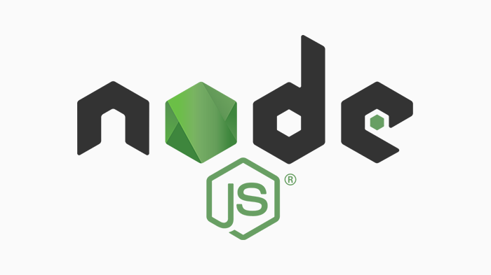
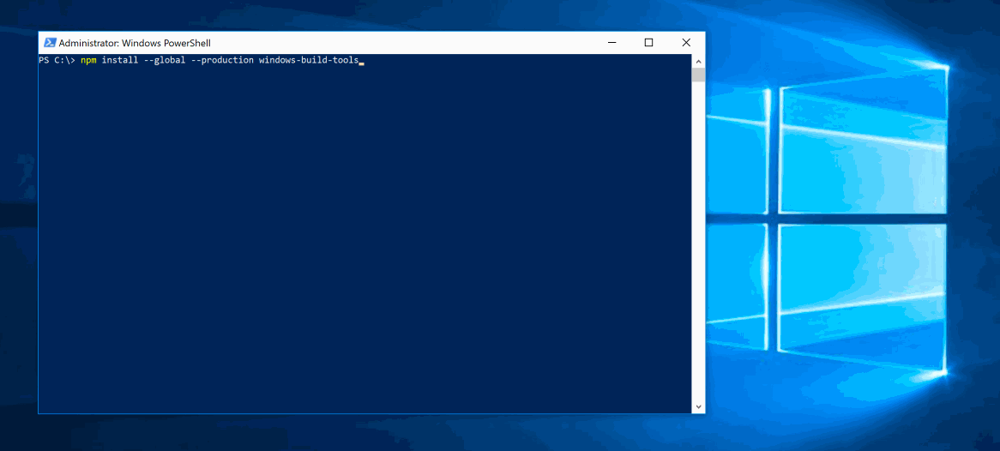
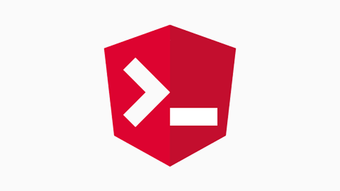
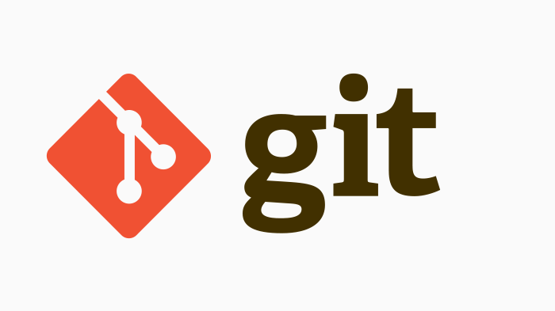
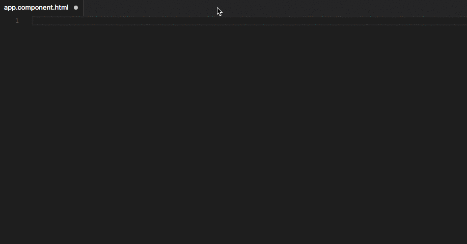
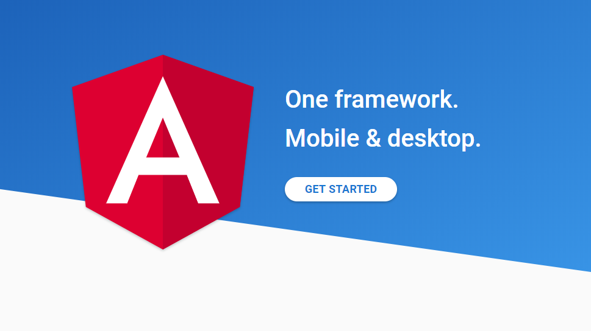

---
{
title: "How to get up and running with Angular on Windows",
published: "2019-11-30T00:25:09Z",
edited: "2020-11-15T21:44:03Z",
tags: ["angular", "beginners", "windows", "tooling"],
description: "Are you struggling with setting up an Angular development environment on Windows? Let us get you up and running in no time!",
originalLink: "https://dev.to/playfulprogramming-angular/how-to-get-up-and-running-with-angular-on-windows-2k32",
coverImg: "cover-image.png",
socialImg: "social-image.png"
}
---

*A well-prepared young man ready to start running. Cover photo by [William Stitt](https://unsplash.com/photos/YadCgbsLHcE) on [Unsplash](https://unsplash.com).*

*Updated for Angular version 11.0.*

Are you struggling with setting up an Angular development environment on Windows? Let us get you up and running in no time!

In November 2018, I attended [ngHeroes](https://ngheroes.org/) as a mentor. It excited me to help students and people from other industries who wanted to learn web development with Angular. A lot of them wanted to start a new career. I was happy to notice more female attendance than I expected based on the gender gap in our industry.

I started my career as a software developer 7 years ago, but I did not forget what it was like to be new to programming. What I *did* forget was how much work we need to do to get up and running with the necessary tools.

The ngHeroes students had macOS, Linux, and Windows computers. We managed to get them up and running but hit some bumps along the way. In this article, I will focus on installing the tools and dependencies you need to develop Angular applications on a Windows machine. They are almost the same for other operating systems. Only the build tools step should differ.

If you run into trouble, comment on this article.

# 1. Node.js


*We use Node.js as a JavaScript runtime for many web development tools.*

The first thing you need to install is Node.js. It is a JavaScript runtime that can run web servers, scripts, and console applications. A lot of web development tools use Node.js.

Go to [the Node.js website](https://nodejs.org/). It offers you 2 installation packages based on your operating system and CPU architecture: *LTS* (Long-Term Support) and *Current*.

This is where it gets tricky. LTS is the right choice, but we might need an older LTS version. We need a version of Node.js LTS that the Angular CLI (Command-Line Interface) supports. Angular CLI is a development tool for Angular projects.

<iframe src="https://gist.github.com/LayZeeDK/c822cc812f75bb07b7c55d07ba2719b3"></iframe>
*Figure 1. Node.js support in Angular CLI. [Open in new tab](https://gist.github.com/LayZeeDK/c822cc812f75bb07b7c55d07ba2719b3).*

For a new application, we can pick the newest version of Angular CLI. On jsDelivr, we can [read the package details for the latest version of Angular CLI](https://cdn.jsdelivr.net/npm/@angular/cli/package.json). At the time of writing, this is Angular CLI version 11.0. In the package details, we can also see the supported version of Node.js.

Towards the end of the JSON file, you will find a JSON object named `"engines"` and inside of that you will find the requirements for `"node"`. For example, it says `"node": ">= 10.13.0"` for Angular CLI version 11.0. This means that we need *at least* version 10.13 of Node.js.

As seen in Figure 1, Angular CLI version 11.0.x has official support for Node.js versions 10 and 12.

We decided to use the newest Angular CLI. Let us go back to the Node.js website, download the installer for the latest LTS version supported by Angular CLI and run it with administrative privileges.

If you are asked whether to include Boxstarter or Chocolatey in the installation, **do** include it. More on that in a minute. Please give it time to finish installing. It might take a while and it could even require a reboot.

To verify that Node.js is installed, open a terminal (command prompt) and run `node --version` which displays the installed version of Node.js.

# 2. Windows Build Tools


*Installing Windows Build Tools with NPM CLI.*

We decided to use the newest version of Angular CLI, but before we can install it, we need to take care of more dependencies.

To be specific, some compilation tools are used by the package `node-gyp` for pre and post install tasks for various packages such as Angular CLI.

For Windows, we need Python 2.7, Visual Studio Build Tools, and C++ Build Tools. Luckily, we can install them all as a single package using the NPM CLI.

---

If you previously installed Node.js with the Boxstarter or Chocolatey option included, you already have these dependencies. Skip to step 3.

---

Run the following command to install all the Windows-specific dependencies for Angular CLI. It uses the NPM (Node Package Manager) CLI to install from the NPM Public Registry. You installed NPM CLI with Node.js.

Make sure to use a terminal with administrator privileges. For example, right-click Command Prompt and choose “Run as administrator”.

NPM is like Composer (PHP), LuaRocks, Maven (Java), NuGet (.NET), pip (Python), and RubyGems, but for JavaScript.

```bash
npm install --global --production windows-build-tools
```

Wait until the installation finishes. It will say “All done!”

---

Installing the build tools *should* be the only step that differs from other operating systems than Windows. For example on Ubuntu and Debian you’ll run the command `sudo apt install gcc g++ make python2`.

---

# 3. Angular CLI


*Angular CLI is a development tool for Angular applications.*

Now we are ready to install Angular CLI. As before, we use NPM CLI to install it.

```bash
npm install --global @angular/cli
```

To verify that Angular CLI is installed, run the command `ng --version` which displays the installed version of Angular CLI and its dependencies.

# 4. Git


*Git is a popular distributed version control system*

We are almost ready to create a new Angular application project. Before we can do that, we need a version control system to be able to back up our source code to a server. It will also enable us to create checkpoints in time that we can return to if we get stuck.

I suggest Git which has excellent support in the code editor we are going to use. Git is also well-integrated with Angular CLI.

Go to [the Git website](https://git-scm.com/downloads). It will offer you an installation package based on your operating system.

# 5. Visual Studio Code


*The Angular Language Service extension for Visual Studio Code adds IntelliSense to Angular templates.*

We need a code editor to develop our Angular application. Visual Studio Code is a free code editor offered by Microsoft. It has excellent Angular and TypeScript support through extensions. Visual Studio Code supports Linux, macOS, and Windows.

Install and run the Stable Build from [the Visual Studio Code website](https://code.visualstudio.com/).

Make sure to [install the Angular Language Service extension](https://marketplace.visualstudio.com/items?itemName=Angular.ng-template) afterwards. It will add IntelliSense to your Angular templates.

# Scaffold an Angular application

With all the tools installed, we can finally scaffold an Angular application. Open a command prompt and navigate to the directory that you want to create the project in.

Use the following Angular CLI command to create the necessary directory and files for a new Angular application. Replace `my-app` with the name of the application which will also be the name of the directory that Angular CLI creates.

By the way, don’t use a directory path that contains a space such as `C:\Program Files (x86)\Angular`. The Angular CLI development server has issues with serving static files that have a path containing spaces. Instead, choose a path such as `C:\Projects`.

```bash
ng new my-app
```

Angular CLI will ask you whether want routing. Most single-page applications (SPAs) will use routing. If this is your first time working with Angular, you can skip it by answering `n` (no).

You will also be prompted to select a stylesheet format. CSS is the native browser format. SCSS is the most popular stylesheet preprocessor. Pick the one you have experience with, or simply CSS if you are new to web development.

The installation will take a few minutes since it installs a lot of tools and library dependencies that are used by Angular and Angular CLI.

# Time to start coding


*Time to start developing an Angular application. Try out [the “Getting started with Angular” tutorial on Angular.io](https://angular.io/start).*

Now you have everything you need to start coding! Open the project directory with Visual Studio Code.

When developing your application, you will want to open a development web server. Angular CLI has prepared one for you which you can run with the following command from inside the root project directory.

```bash
npm start
```

which is an NPM script shortcut for

```bash
ng serve
```

Once the development server has finished compiling your application, you can open it in a browser by navigating to `http://localhost:4200`.

Every time you change a file and save it, your browser will refresh and show you the changes.

To stop a running development server, you have to press `Ctrl+C`, type `y` and hit `Enter`.

Angular CLI defined the `start` script in `package.json`. Try adding the `--open` flag to the script so that it becomes `ng serve --open`, then save `package.json` and run the server again with `npm start`.

Now, all you have to do is develop your application. If you lack ideas or confidence in your development skills, [try the “Getting started with Angular” tutorial on Angular.io](https://angular.io/start).

# Additional learning resources

Read the guide “[Version Control in Visual Studio Code](https://code.visualstudio.com/docs/editor/versioncontrol#_git-support)” to learn about version control with Git in Visual Studio Code.

[Angular.io](https://angular.io/docs) has development guides for most of the Angular framework.

The Angular CLI can help you scaffold components, directives, Angular modules, pipes, and services. Find out more in [the Angular CLI documentation](https://angular.io/cli).

Remember to back up your source code by committing and pushing your Git repository. [GitHub](https://github.com), [GitLab](https://gitlab.com), and [Bitbucket](https://bitbucket.org/) offer free private Git repositories for individuals.
