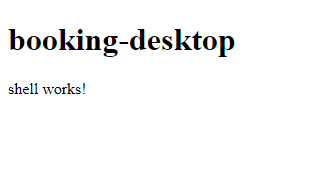

---
{
title: "How to set up an Nx-style monorepo workspace with the Angular CLI: Part 1",
published: "2021-03-31T12:14:53Z",
edited: "2021-09-18T23:08:49Z",
tags: ["angular", "nx", "cli", "monorepo"],
description: "In this step-by-step tutorial, we set up an Nx-style monorepo workspace with the Angular CLI. In this first part, we create an application project, an end-to-end test project, and a feature shell library.",
originalLink: "https://dev.to/this-is-angular/how-to-set-up-an-nx-style-monorepo-workspace-with-the-angular-cli-part-1-16b5",
coverImage: "cover-image.png",
socialImage: "social-image.png",
collection: "How to set up an Nx-style monorepo workspace with the Angular CLI",
order: 1
}
---

*Original cover photo by [Edgar Chaparro](https://unsplash.com/photos/r6mBXuHnxBk) on Unsplash.*

*Original publication date: 2020-05-10.*

The Nx toolchain by Nrwl helps us work in a so-called *workspace* which is a monorepo that can manage multiple applications, workspace libraries, and package libraries.

You might not be able to convince your team or manager to buy in to the Nx toolchain. If that's the case, you're in luck. In this tutorial, we'll walk through how to set up an Nx-style workspace using the Angular CLI rather than the Nx CLI. We'll use a custom Node.js tool to generate application and workspace library projects.

We'll implement enough of the Nrwl Airlines example to demonstrate how to work in an Angular CLI workspace with multiple applications, each with multiple platforms. The application domains have a shared feature. The two different platforms within a domain share the exact same feature set and routing by using a feature shell library for orchestration and to serve as an entry point to the application project.

We'll end up with the project folder structure shown in the following figure. This includes 4 application projects, 4 end-to-end test suites, and 12 workspace libraries.

```bash
nrwl-airlines
├── apps
│   ├── booking
│   │   ├── booking-desktop
│   │   ├── booking-desktop-e2e
│   │   ├── booking-mobile
│   │   └── booking-mobile-e2e
│   └── check-in
│       ├── check-in-desktop
│       ├── check-in-desktop-e2e
│       ├── check-in-mobile
│       └── check-in-mobile-e2e
└── libs
    ├── booking
    │   ├── data-access
    │   ├── feature-flight-search
    │   ├── feature-passenger-info
    │   └── feature-shell
    ├── check-in
    │   ├── data-access
    │   └── feature-shell
    └── shared
        ├── data-access
        ├── environments
        ├── seatmap
        │   ├── data-access
        │   └── feature-seat-listing
        ├── ui-buttons
        └── util-formatting
```

<figcaption>The workspace project folder structure we're going to build in this tutorial.</figcaption>

The Nrwl Airlines example is discussed in the free e-book "[Enterprise Angular Monorepo Patterns](https://go.nrwl.io/angular-enterprise-monorepo-patterns-new-book)" by Nrwl.

First we'll use the Angular schematics and a few command line tools to generate the projects as per our specifications, but later we'll automate those operations using a custom command line tool called `generate-project`.

This tutorial will span over 5 parts. In this first part, we're going to create the Angular CLI monorepo workspace, generate the booking desktop application project, its end-to-end test project and the booking feature shell workspace library.

## Angular workspace

First, we'll generate a new Angular CLI workspace called `nrwl-airlines`. I assume that you have the Angular CLI installed globally. Use the `ng new` command.

```bash
ng new nrwl-airlines --strict --create-application=false
```

<figcaption>Generate the Angular workspace.</figcaption>

The `--strict` flag sets some strict configuration options for the TypeScript compiler.

Clearing the `--create-application` switch prevents an application project from being generated right away. This is important since we want to use an Nx-style file and folder structure for our projects, including separate folders for applications and workspace libraries.

```bash
nrwl-airlines
├── .editorconfig
├── .gitignore
├── README.md
├── angular.json
├── package.json
├── tsconfig.json
├── tslint.json
└── yarn.lock
```

<figcaption>Blank workspace content.</figcaption>

Our blank workspace is generated with this file and folder structure.

```bash
npm install --save-dev json
# or
yarn add --dev json
```

<figcaption>Install command line utility for editing JSON files.</figcaption>

We'll use the `json` package to edit JSON configurations in our workspace. Install it as a development dependency.

Let's try it out by enabling strict template type checking introduced by Ivy. Run these commands.

```bash
npx json -I -f tsconfig.json -e "delete this.angularCompilerOptions.fullTemplateTypeCheck"

npx json -I -f tsconfig.json -e "this.angularCompilerOptions.strictTemplates = true"
```

<figcaption>Enable strict template type checking.</figcaption>

In our TypeScript configuration, we now have these Angular compiler options.

```json
{
  "//": "tsconfig.json",
  "angularCompilerOptions": {
    "strictInjectionParameters": true,
    "strictTemplates": true
  }
}
```

<figcaption>Strict template type checking enabled.</figcaption>

Most of our projects will be workspace libraries. We'll set the default project folder to the `libs` folder which will be created shortly. Do this by running this `ng config` command.

```bash
ng config newProjectRoot libs
```

<figcaption>Set default project directory.</figcaption>

## Booking desktop application

We'll start out by generating the desktop web application for the booking domain.

First, we'll use the built-in Angular application generator schematic with these options.

```bash
ng generate application booking-desktop --prefix=booking --project-root=apps/booking/booking-desktop --style=css --routing=false
```

<figcaption>Generate booking desktop application project.</figcaption>

Next, we'll split the project folder and its configuration in `angular.json` into two projects – one for the application and one for the end-to-end tests. Run the following commands.

```bash
npx copy apps/booking/booking-desktop/e2e/**/* apps/booking/booking-desktop-e2e

npx rimraf apps/booking/booking-desktop/e2e

npx json -I -f apps/booking/booking-desktop-e2e/tsconfig.json -e "this.extends = '../../../tsconfig.json'"

npx json -I -f apps/booking/booking-desktop-e2e/tsconfig.json -e "this.compilerOptions.outDir = '../../../out-tsc/e2e'"

ng config projects["booking-desktop"].architect.e2e.options.protractorConfig apps/booking/booking-desktop-e2e/protractor.conf.js

npx json -I -f angular.json -e "this.projects['booking-desktop-e2e'] = this.projects['booking-desktop']"
```

<figcaption>Extract end-to-end testing project.</figcaption>

Finally, we'll configure the builders and architect targets for our two booking desktop projects as seen here.

```bash
ng config projects["booking-desktop-e2e"].root apps/booking/booking-desktop-e2e

ng config projects["booking-desktop-e2e"].architect.lint.options.tsConfig apps/booking/booking-desktop-e2e/tsconfig.json

npx json -I -f angular.json -e "delete this.projects['booking-desktop'].architect.e2e"

npx json -I -f angular.json -e "this.projects['booking-desktop'].architect.lint.options.tsConfig.pop()"

ng config projects["booking-desktop"].architect.lint.options.exclude[1] !apps/booking/booking-desktop/**

npx json -I -f angular.json -e "delete this.projects['booking-desktop-e2e'].architect.build"

npx json -I -f angular.json -e "delete this.projects['booking-desktop-e2e'].architect['extract-i18n']"

npx json -I -f angular.json -e "delete this.projects['booking-desktop-e2e'].architect.serve"

npx json -I -f angular.json -e "delete this.projects['booking-desktop-e2e'].architect.test"

npx json -I -f angular.json -e "delete this.projects['booking-desktop-e2e'].prefix"

npx json -I -f angular.json -e "delete this.projects['booking-desktop-e2e'].sourceRoot"

npx json -I -f angular.json -e "delete this.projects['booking-desktop-e2e'].schematics"

ng config projects["booking-desktop-e2e"].architect.lint.options.exclude[1] !apps/booking/booking-desktop-e2e/**
```

<figcaption>Configure builders and architect targets.</figcaption>

Some of the commands are just housekeeping after splitting project folder and workspace configuration entry. Some mimic the configuration we get when using the Nx CLI with the Nrwl schematics for Angular.

```bash
apps
└── booking
    ├── booking-desktop
    │   ├── src
    │   │   ├── app
    │   │   │   ├── app.component.css
    │   │   │   ├── app.component.html
    │   │   │   ├── app.component.spec.ts
    │   │   │   ├── app.component.ts
    │   │   │   └── app.module.ts
    │   │   ├── assets
    │   │   │   └── .gitkeep
    │   │   ├── environments
    │   │   │   ├── environment.prod.ts
    │   │   │   └── environment.ts
    │   │   ├── favicon.ico
    │   │   ├── index.html
    │   │   ├── main.ts
    │   │   ├── polyfills.ts
    │   │   ├── styles.css
    │   │   └── test.ts
    │   ├── browserslist
    │   ├── karma.conf.js
    │   ├── tsconfig.app.json
    │   ├── tsconfig.spec.json
    │   └── tslint.json
    └── booking-desktop-e2e
        ├── src
        │   ├── app.e2e-spec.ts
        │   └── app.po.ts
        ├── protractor.conf.js
        └── tsconfig.json
```

<figcaption>Applications folder structure after adding the first application and end-to-end testing projects.</figcaption>

After going through these steps, the file structure of our `apps` directory is as shown in the previous figure.

```json
{
  "//": "angular.json",
  "projects": {
    "booking-desktop": {
      "projectType": "application",
      "schematics": {},
      "root": "apps/booking/booking-desktop",
      "sourceRoot": "apps/booking/booking-desktop/src",
      "prefix": "booking",
      "architect": {
        "build": {
          "//": "(...)"
        },
        "serve": {
          "//": "(...)"
        },
        "extract-i18n": {
          "//": "(...)"
        },
        "test": {
          "//": "(...)"
        },
        "lint": {
          "//": "(...)"
        }
      }
    }
  }
}
```

<figcaption>The project configuration for the desktop booking application.</figcaption>

As seen in the listing above, the `booking-desktop` application configuration in `angular.json` looks like a default configuration except we removed the `e2e` architect target.

```json
{
  "//": "angular.json",
  "projects": {
    "booking-desktop-e2e": {
      "projectType": "application",
      "root": "apps/booking/booking-desktop-e2e",
      "architect": {
        "lint": {
          "builder": "@angular-devkit/build-angular:tslint",
          "options": {
            "tsConfig": "apps/booking/booking-desktop-e2e/tsconfig.json",
            "exclude": ["**/node_modules/**", "!apps/booking/booking-desktop-e2e/**"]
          }
        },
        "e2e": {
          "builder": "@angular-devkit/build-angular:protractor",
          "options": {
            "protractorConfig": "apps/booking/booking-desktop-e2e/protractor.conf.js",
            "devServerTarget": "booking-desktop:serve"
          },
          "configurations": {
            "production": {
              "devServerTarget": "booking-desktop:serve:production"
            }
          }
        }
      }
    }
  }
}
```

<figcaption>End-to-end testing project configuration.</figcaption>

The listing above shows the `booking-desktop-e2e` project configuration which has the `e2e` and `lint` architect targets.

Try them out by running the following commands.

```bash
ng run booking-desktop-e2e:lint

ng run booking-desktop-e2e:e2e
```

<figcaption>Lint and run the end-to-end booking destop test suite.</figcaption>

### Centralise Karma configuration

Since we're splitting our monorepo up into many projects that each have separate test builders, they're going to need separate Karma configurations. Since they will mostly be the same, we'll create a common Karma configuration file in the workspace root folder as seen in this listing.

```js
// karma.conf.js
// Karma configuration file, see link for more information
// https://karma-runner.github.io/1.0/config/configuration-file.html

const { constants } = require('karma');
const path = require('path');

module.exports = () => ({
  basePath: '',
  frameworks: ['jasmine', '@angular-devkit/build-angular'],
  plugins: [require('karma-jasmine'), require('karma-chrome-launcher'), require('karma-jasmine-html-reporter'), require('karma-coverage-istanbul-reporter'), require('@angular-devkit/build-angular/plugins/karma')],
  client: {
    clearContext: false, // leave Jasmine Spec Runner output visible in browser
  },
  coverageIstanbulReporter: {
    dir: path.join(__dirname, 'coverage'),
    reports: ['html', 'lcovonly', 'text-summary'],
    fixWebpackSourcePaths: true,
  },
  reporters: ['progress', 'kjhtml'],
  port: 9876,
  colors: true,
  logLevel: constants.LOG_INFO,
  autoWatch: true,
  browsers: ['Chrome'],
  singleRun: false,
  restartOnFileChange: true,
});
```

<figcaption>Base Karma configuration in workspace root.</figcaption>

We'll replace the desktop application project's Karma configuration with the one shown in the following listing.

```js
// apps/booking/booking-desktop/karma.conf.js
const path = require('path');

const getBaseKarmaConfig = require('../../../karma.conf');

module.exports = (config) => {
  const baseConfig = getBaseKarmaConfig();
  config.set({
    ...baseConfig,
    coverageIstanbulReporter: {
      ...baseConfig.coverageIstanbulReporter,
      dir: path.join(__dirname, '../../../coverage/apps/booking/booking-desktop'),
    },
  });
};
```

<figcaption>Karma configuration for booking desktop application.</figcaption>

Make sure the application's unit tests still work by running the following command.

```bash
ng run booking-desktop:test --watch=false
```

<figcaption>Run the booking desktop application's unit test suite.</figcaption>

## Booking feature shell library

With the first application project set up, we're ready to create the feature shell library for the booking applications.

```bash
npm install --save-dev rimraf
# or
yarn add --dev rimraf
```

<figcaption>Install command line utility for deleting files and folders.</figcaption>

We're going to use the command line utility `rimraf` to remove some of the files that are created when using Angular's library schematic. The reason for this is that the Angular library schematic generates a package library for publishing on a package registry such as NPM.

When using a workspace, we're often creating workspace libraries that might be specific to a single application or might be shared between multiple applications. However, there's often no need to package, version and publish them. This is one of the benefits of using a monorepo.

```bash
ng config newProjectRoot libs/booking
```

<figcaption>Set the parent folder of the library project.</figcaption>

As seen in the previous listing, we start out by setting the parent folder of the library project, we're going to generate.

Now we use the Angular library schematic to generate a library project with this command.

```bash
ng generate library feature-shell --prefix=booking --entry-file=index --skip-install --skip-package-json
```

<figcaption>Generate library project.</figcaption>

With the Angular library generator schematic, we get the following file and folder structure.

```bash
libs/booking/feature-shell
├── src
│   ├── lib
│   │   ├── feature-shell.component.spec.ts
│   │   ├── feature-shell.component.ts
│   │   ├── feature-shell.module.ts
│   │   ├── feature-shell.service.spec.ts
│   │   └── feature-shell.service.ts
│   ├── index.ts
│   └── test.ts
├── README.md
├── karma.conf.js
├── ng-package.json
├── package.json
├── tsconfig.lib.json
├── tsconfig.lib.prod.json
├── tsconfig.spec.json
└── tslint.json
```

<figcaption>Default Angular package library file and folder structure.</figcaption>

We're going to get rid of the files `ng-package.json`, `package.json`, and `tsconfig.lib.prod.json` as we want this to be a workspace library, not a package library.

We're also going to remove the service and its test suite as well as rename the Angular module to follow Nx naming conventions.

```bash
npx json -I -f angular.json -e "this.projects['booking-feature-shell'] = this.projects['feature-shell']"

npx json -I -f angular.json -e "delete this.projects['feature-shell']"
```

<figcaption>Rename workspace library project.</figcaption>

Use the commands above to rename the workspace library project. We passed `feature-shell` as the `name` parameter to the library schematic since that's what we wanted to call the folder since it's already nested in the `libs/booking` folder.

This way, the file paths used in the library project configuration are correct.

```bash
npx json -I -f angular.json -e "delete this.projects['booking-feature-shell'].architect.build"
```

<figcaption>Remove the `build` architect target.</figcaption>

Run the command above to remove the `build` architect target since we're not going to build this library separately – instead, it'll be built as part of the booking applications.

We'll leave the `test` and `lint` architect targets.

```bash
ng config projects["booking-feature-shell"].architect.lint.options.exclude[1] !libs/booking/feature-shell/**

npx json -I -f libs/booking/feature-shell/tslint.json -e "this.linterOptions = { exclude: ['!**/*'] }"
```

<figcaption>Configure library project linter.</figcaption>

We're going to apply linter configurations that are set when using Nrwl's Angular schematics. Run the commands above.

As mentioned earlier, we're going to delete unnecessary files with the following commands.

```bash
npx rimraf libs/booking/feature-shell/*package.json

npx rimraf libs/booking/feature-shell/tsconfig.lib.prod.json

npx rimraf libs/booking/feature-shell/src/lib/*.*
```

<figcaption>Clean up library project.</figcaption>

We generate the feature shell Angular module with a conventional name and export it as shown in the following listing.

```bash
ng generate module booking-feature-shell --project=booking-feature-shell --flat --no-common-module

"export * from './lib/booking-feature-shell.module';" > libs/booking/feature-shell/src/index.ts
```

<figcaption>Generate and export a feature shell Angular module.</figcaption>

Let's also add a test suite for the feature shell Angular module with the content of this listing.

```ts
// booking-feature-shell.module.spec.ts
import { TestBed } from '@angular/core/testing';

import { BookingFeatureShellModule } from './booking-feature-shell.module';

describe('BookingFeatureShellModule', () => {
  beforeEach(async () => {
    TestBed.configureTestingModule({
      imports: [BookingFeatureShellModule],
    });
    await TestBed.compileComponents();
  });

  it('should create', () => {
    expect(BookingFeatureShellModule).toBeDefined();
  });
});
```

<figcaption>Test suite for the feature shell Angular module.</figcaption>

We'll also add a shell component.

```bash
ng generate component shell --project=booking-feature-shell --module=booking-feature-shell.module.ts --display-block

"<router-outlet></router-outlet>" > libs/booking/feature-shell/src/lib/shell/shell.component.html
```

<figcaption>Generate booking shell component.</figcaption>

We add the router module to its component test suite.

```ts
// shell.component.spec.ts
import { ComponentFixture, TestBed } from '@angular/core/testing';
import { RouterModule } from '@angular/router';

import { ShellComponent } from './shell.component';

describe('ShellComponent', () => {
  let component: ShellComponent;
  let fixture: ComponentFixture<ShellComponent>;

  beforeEach(async () => {
    TestBed.configureTestingModule({
      declarations: [ShellComponent],
      imports: [RouterModule.forRoot([])],
    });
    TestBed.compileComponents();
  });

  beforeEach(() => {
    fixture = TestBed.createComponent(ShellComponent);
    component = fixture.componentInstance;
    fixture.detectChanges();
  });

  it('should create', () => {
    expect(component).toBeTruthy();
  });
});
```

<figcaption>Booking shell component test suite with router module.</figcaption>

Now we change the content of the booking feature shell Angular module.

```ts
// booking-feature-shell.module.ts
import { CommonModule } from '@angular/common';
import { NgModule } from '@angular/core';
import { RouterModule, Routes } from '@angular/router';

import { ShellComponent } from './shell/shell.component';

const routes: Routes = [
  {
    path: '',
    component: ShellComponent,
    children: [],
  },
];

@NgModule({
  declarations: [ShellComponent],
  exports: [RouterModule],
  imports: [RouterModule.forRoot(routes), CommonModule],
})
export class BookingFeatureShellModule {}
```

<figcaption>Booking feature shell module with shell component.</figcaption>

The shell component is the entry point component of our layout and features. Every additional route is added to the `children` array of the shell component route.

Additional routes will be rendered by the router outlet in the shell component template.

The Angular library schematic set up the path mapping in the following listing.

```json
{
  "//": "tsconfig.json",
  "compilerOptions": {
    "paths": {
      "feature-shell": ["dist/feature-shell/feature-shell", "dist/feature-shell"]
    }
  }
}
```

<figcaption>Default library path mapping.</figcaption>

That path mapping was meant to use a package library after it had been built and output to the `dist` folder.

We don't have a `build` architect target for the library anymore. Remember that monorepos use workspace libraries straight from their source code and build them as part of an application bundle.

```bash
npx json -I -f tsconfig.json -e "delete this.compilerOptions.paths['feature-shell']"

npx json -I -f tsconfig.json -e "this.compilerOptions.paths['@nrwl-airlines/booking/feature-shell'] = ['libs/booking/feature-shell/src/index.ts']"
```

<figcaption>Generate booking feature shell library and configure path mappings.</figcaption>

The listing above shows how to set up a path mapping aliased with an NPM scope we pick, namely `@nrwl-airlines`. The mapping points to the library's public API barrel file, `index.ts` as seen in the following listing.

```json
{
  "//": "tsconfig.json",
  "compilerOptions": {
    "paths": {
      "@nrwl-airlines/booking/feature-shell": ["libs/booking/feature-shell/src/index.ts"]
    }
  }
}
```

<figcaption>Workspace-scoped library path mapping.</figcaption>

Now applications are able to import the feature shell library by using the `@nrwl-airlines/booking/feature-shell` path.

Remember to replace the library's Karma configuration with the following one.

```js
// libs/booking/feature-shell/karma.conf.js
const path = require('path');

const getBaseKarmaConfig = require('../../../karma.conf');

module.exports = (config) => {
  const baseConfig = getBaseKarmaConfig();
  config.set({
    ...baseConfig,
    coverageIstanbulReporter: {
      ...baseConfig.coverageIstanbulReporter,
      dir: path.join(__dirname, '../../../coverage/libs/booking/feature-shell'),
    },
  });
};
```

<figcaption>Karma configuration for booking feature shell library.</figcaption>

Use the following commands to run the linter and the unit test suite make sure we've set everything up right.

```bash
ng run booking-feature-shell:lint

ng run booking-feature-shell:test --watch=false
```

<figcaption>Lint and test the booking feature shell library.</figcaption>

The following listing shows the generated file and folders structure of the booking feature shell library.

```bash
libs/booking/feature-shell
├── src
│   ├── lib
│   │   ├── booking-feature-shell.module.spec.ts
│   │   └── booking-feature-shell.module.ts
│   ├── index.ts
│   └── test.ts
├── README.md
├── karma.conf.js
├── tsconfig.lib.json
├── tsconfig.spec.json
└── tslint.json
```

<figcaption>Feature workspace library file and folder structure.</figcaption>

The booking feature shell library has the two architect targets `test` and `lint` as shown in the following listing.

```json
{
  "//": "angular.json",
  "projects": {
    "booking-feature-shell": {
      "projectType": "library",
      "root": "libs/booking/feature-shell",
      "sourceRoot": "libs/booking/feature-shell/src",
      "prefix": "booking",
      "architect": {
        "test": {
          "builder": "@angular-devkit/build-angular:karma",
          "options": {
            "main": "libs/booking/feature-shell/src/test.ts",
            "tsConfig": "libs/booking/feature-shell/tsconfig.spec.json",
            "karmaConfig": "libs/booking/feature-shell/karma.conf.js"
          }
        },
        "lint": {
          "builder": "@angular-devkit/build-angular:tslint",
          "options": {
            "tsConfig": ["libs/booking/feature-shell/tsconfig.lib.json", "libs/booking/feature-shell/tsconfig.spec.json"],
            "exclude": ["**/node_modules/**", "!libs/booking/feature-shell/**"]
          }
        }
      }
    }
  }
}
```

<figcaption>Booking feature shell project configuration.</figcaption>

Now that we've generated and configured the feature shell library project, let's import the feature shell module in the booking desktop application.

In the initial booking feature shell, we prepared the root route configuration with the shell component in the top level route. Later, we'll add feature routes, configuration, and initialisation.

```ts
import { NgModule } from '@angular/core';
import { BrowserModule } from '@angular/platform-browser';
import { BookingFeatureShellModule } from '@nrwl-airlines/booking/feature-shell';

import { AppComponent } from './app.component';

@NgModule({
  bootstrap: [AppComponent],
  declarations: [AppComponent],
  imports: [BrowserModule, BookingFeatureShellModule],
})
export class AppModule {}
```

<figcaption>Booking desktop application module.</figcaption>

The previous listing shows how we eagerly load the booking feature shell module which is alright, since it'll in turn lazy load feature routes.

```html
<!-- apps/booking/booking-desktop/src/app/app.component.html -->
<h1>{{title}}</h1>

<router-outlet></router-outlet>
```

<figcaption>The booking desktop application's root component template.</figcaption>

Remember to put a router outlet in the booking desktop application's root component as seen in the listing above.

Make the corresponding changes in the app component test suite.

```ts
// apps/booking/booking-desktop/src/app/app.component.spec.ts
import { async, TestBed } from '@angular/core/testing';
import { RouterModule } from '@angular/router';

import { AppComponent } from './app.component';

describe('AppComponent', () => {
  beforeEach(async(() => {
    TestBed.configureTestingModule({
      declarations: [AppComponent],
      imports: [RouterModule.forRoot([])],
    }).compileComponents();
  }));

  it('should create the app', () => {
    const fixture = TestBed.createComponent(AppComponent);
    const app = fixture.componentInstance;
    expect(app).toBeTruthy();
  });

  it(`should have as title 'booking-desktop'`, () => {
    const fixture = TestBed.createComponent(AppComponent);
    const app = fixture.componentInstance;
    expect(app.title).toEqual('booking-desktop');
  });

  it('should render title', () => {
    const fixture = TestBed.createComponent(AppComponent);
    fixture.detectChanges();
    const compiled = fixture.nativeElement;
    expect(compiled.querySelector('h1').textContent).toContain('booking-desktop');
  });
});
```

<figcaption>Revised app component test suite for the booking desktop application.</figcaption>

Also update the end-to-end tests. We match the title to `'booking-mobile'` and update the selector to `booking-root h1`.

```ts
// apps/booking/booking-desktop-e2e/src/app.e2e-spec.ts
import { browser, logging } from 'protractor';

import { AppPage } from './app.po';

describe('workspace-project App', () => {
  let page: AppPage;

  beforeEach(() => {
    page = new AppPage();
  });

  it('should display welcome message', () => {
    page.navigateTo();
    expect(page.getTitleText()).toEqual('booking-desktop');
  });

  afterEach(async () => {
    // Assert that there are no errors emitted from the browser
    const logs = await browser.manage().logs().get(logging.Type.BROWSER);
    expect(logs).not.toContain(
      jasmine.objectContaining({
        level: logging.Level.SEVERE,
      } as logging.Entry)
    );
  });
});
```

<figcaption>Updated end-to-end test for the booking desktop application.</figcaption>

```ts
// apps/booking/booking-desktop-e2e/src/app.po.ts
import { browser, by, element } from 'protractor';

export class AppPage {
  navigateTo(): Promise<unknown> {
    return browser.get(browser.baseUrl) as Promise<unknown>;
  }

  getTitleText(): Promise<string> {
    return element(by.css('booking-root h1')).getText() as Promise<string>;
  }
}
```

<figcaption>Updated app page object for the booking desktop application.</figcaption>

Lint and test our application and end-to-end projects ot make sure everything works.

```bash
ng run booking-desktop:lint

ng run booking-desktop:test --watch=false

ng run booking-desktop-e2e:lint

ng run booking-desktop-e2e:e2e

ng run booking-feature-shell:lint

ng run booking-feature-shell:test --watch=false
```

<figcaption>Lint and run tests for the booking application project and it's end-to-end test suite as well as the booking feature shell library project.</figcaption>

Now run `ng run booking-desktop:serve` and navigate to `http://localhost:4200` in your browser to see our application. It should look like the following screenshot.



<figcaption>The booking desktop application with the booking shell feature.</figcaption>

## Conclusion

At this point, our project folder structure looks like the following figure.

```bash
nrwl-airlines
├── apps
│   └── booking
│       ├── booking-desktop
│       └── booking-desktop-e2e
└── libs
     └── booking
         └── feature-shell
```

<figcaption>The project folder structure at the end of Part 1.</figcaption>

We started by creating a blank workspace without any application or library projects, using the Angular CLI.

To learn how to use the `json` command line tool to modify JSON-based configuration files, we enabled strict template type-checking.

The first project we created was the booking desktop application. After generating it using the official Angular application project schematic, we extracted the end-to-end test suite and its configuration into a separate project with `lint` and `e2e` architect targets.

We centralised Karma configuration by having a base configuration in the root directory of our workspace. The booking desktop application project extends it by setting a unique path for its test coverage reports.

Next, we created our first workspace library, the booking feature shell library. We used the official Angular library schematic to generate our starting point. However, this schematic is meant to scaffold a package library to be published on a package registry such as NPM.

Workspace libraries are only used internally within a monorepo. They can be shared between multiple projects and they don't require versioning since their source code lives with the rest of the projects in the workspace.

We set up an entry point Angular module with routing for the entry point Angular component, the shell component which itself will have child routes for the rest of the application that are dynamically rendered by its router outlet.

To enable the application to import the booking feature shell library, we set up TypeScript path mappings. Then we added a router outlet to the app component and imported the booking feature shell module to connect these two pieces.

As you know, it's important to maintain our codebase as it evolves. We updated the unit test and end-to-end test suites to keep it in sync with the changes.

Finally, we linted the whole code base and ran the unit test and end-to-end test suites.

That's enough work for one day.

In Part 2, we'll automate a lot of the manual work we did today, using a custom generate project tool. We'll use it to generate the shared and booking data access libraries, then add NgRx Store and Effects root and feature state to them. Finally, we'll add the NgRx Store DevTools and NgRx schematics, register the data access libraries in the feature shell library and extract a shared environments workspace library to be able to configure data access the way we want.

## Resources

For the impatient programmer, [the full solution is in the `LayZeeDK/ngx-nrwl-airlines-workspace` GitHub repository](https://github.com/LayZeeDK/ngx-nrwl-airlines-workspace).
