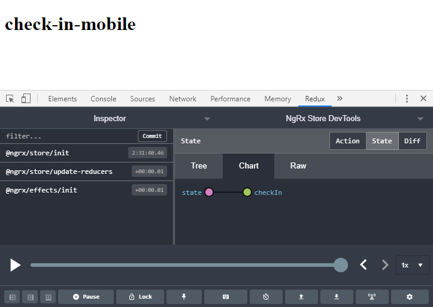

---
{
title: "How to set up an Nx-style monorepo workspace with the Angular CLI: Part 4",
published: "2021-03-31T12:15:22Z",
edited: "2021-09-18T23:09:12Z",
tags: ["angular", "nx", "cli", "monorepo"],
description: "In Part 4 of this tutorial, we create the check-in data access and check-in feature shell libraries. We create the check-in desktop application, review and verify how much our tool automated and finally create the mobile check-in application.",
originalLink: "https://dev.to/playfulprogramming-angular/how-to-set-up-an-nx-style-monorepo-workspace-with-the-angular-cli-part-4-2coa",
coverImg: "cover-image.png",
socialImg: "social-image.png",
collection: "How to set up an Nx-style monorepo workspace with the Angular CLI",
order: 4
}
---

*Original cover photo by [Edgar Chaparro](https://unsplash.com/photos/r6mBXuHnxBk) on Unsplash.*

*Original publication date: 2020-05-19.*

> This tutorial is part of the Angular Architectural Patterns series.

In Part 3 of this tutorial, we created two feature libraries with routed components and hooked them up to the check-in feature shell library. We used the generate project tool to create the mobile check-in application and created a mobile-specific template for the flight search component.

In this part, we're going to create two workspace libraries in the check-in domain, the check-in data access library and the check-in feature shell library. We register data access in the feature shell library, create the check-in desktop application and hook up the feature shell Angular module. After reviewing and verifying how much of this is automated by our generate project tool, we quickly generate the mobile check-in application.

## Check-in data access library

Let's move on to the check-in domain. This time, we'll start with the data access library. I added an extra option called `--with-state` to generate a feature store and effects in the `+state` folder.

```bash
npm run generate-project -- library data-access --scope=check-in --npm-scope=nrwl-airlines --with-state
# or
yarn generate-project library data-access --scope=check-in --npm-scope=nrwl-airlines --with-state
```

<figcaption>Generate check-in data access library with NgRx-based state.</figcaption>

This generates the following file and folder structure.

```bash
libs/check-in/data-access
├── src
│   ├── lib
│   │   ├── +state
│   │   │   ├── check-in.actions.spec.ts
│   │   │   ├── check-in.actions.ts
│   │   │   ├── check-in.effects.spec.ts
│   │   │   ├── check-in.effects.ts
│   │   │   ├── check-in.reducer.spec.ts
│   │   │   ├── check-in.reducer.ts
│   │   │   ├── check-in.selectors.spec.ts
│   │   │   └── check-in.selectors.ts
│   │   ├── check-in-data-access.module.spec.ts
│   │   └── check-in-data-access.module.ts
│   ├── index.ts
│   └── test.ts
├── README.md
├── karma.conf.js
├── tsconfig.lib.json
├── tsconfig.spec.json
└── tslint.json
```

<figcaption>Generated file and folder structure for the check-in data access library.</figcaption>

How sweet is this? One command and we've got a project-specific data access library set up with project configuration, path mappings, feature store, and feature effects.

Lint and test the project. Correct any errors like you did earlier.

```bash
ng run check-in-data-access:lint

ng run check-in-data-access:test --watch=false
```

<figcaption>Lint and test the check-in data acess library.</figcaption>

## Check-in feature shell library

We use the generate project tool to generate the check-in feature shell.

```bash
npm run generate-project -- library feature feature-shell --scope=check-in --npm-scope=nrwl-airlines
# or
yarn generate-project library feature feature-shell --scope=check-in --npm-scope=nrwl-airlines
```

<figcaption>Generate check-in feature shell library.</figcaption>

Everything's now set up for us.

```bash
libs/check-in/feature-shell
├── src
│   ├── lib
│   │   ├── shell
│   │   │   ├── shell.component.css
│   │   │   ├── shell.component.html
│   │   │   ├── shell.component.spec.ts
│   │   │   └── shell.component.ts
│   │   ├── check-in-feature-shell.module.spec.ts
│   │   └── check-in-feature-shell.module.ts
│   ├── index.ts
│   └── test.ts
├── README.md
├── karma.conf.js
├── tsconfig.lib.json
├── tsconfig.spec.json
└── tslint.json
```

<figcaption>Generated file and folder structure for the check-in feature shell library.</figcaption>

Let's take a quick look at the check-in feature shell Angular module.

```ts
// check-in-feature-shell.module.ts
import { NgModule } from '@angular/core';
import { RouterModule, Routes } from '@angular/router';

import { ShellComponent } from './shell/shell.component';

const routes: Routes = [
  {
    path: '',
    component: ShellComponent,
    children: [],
  },
];

@NgModule({
  declarations: [ShellComponent],
  exports: [RouterModule],
  imports: [RouterModule.forRoot(routes)],
})
export class CheckInFeatureShellModule {}
```

<figcaption>Check-in feature shell module.</figcaption>

We need to register the shared data access and check-in data access Angular modules.

```ts
// check-in-feature-shell.module.ts
import { NgModule } from '@angular/core';
import { RouterModule, Routes } from '@angular/router';
import { CheckInDataAccessModule } from '@nrwl-airlines/check-in/data-access';
import { SharedDataAccessModule } from '@nrwl-airlines/shared/data-access';

import { ShellComponent } from './shell/shell.component';

const routes: Routes = [
  {
    path: '',
    component: ShellComponent,
    children: [],
  },
];

@NgModule({
  declarations: [ShellComponent],
  exports: [RouterModule],
  imports: [
    RouterModule.forRoot(routes),
    SharedDataAccessModule, // ?
    CheckInDataAccessModule, // ?
  ],
})
export class CheckInFeatureShellModule {}
```

Great! Since we don't have any features to add to the check-in application yet, we can move on to the next project for now.

## Check-in desktop application

It's time to create the first check-in application, the desktop web app. I've added support for feature shells in the generate project tool. If a feature shell library exists in the same scope, the application will be generated with the same changes as we made earlier in this article. We just need to make sure to use the `--npm-scope` parameter.

```bash
npm run generate-project -- application check-in-desktop --scope=check-in --grouping-folder=check-in --npm-scope=nrwl-airlines
# or
yarn generate-project application check-in-desktop --scope=check-in --grouping-folder=check-in --npm-scope=nrwl-airlines
```

<figcaption>Generate the check-in desktop application using its feature shell library.</figcaption>

Let's make sure it worked. Open up the app module of the new application project.

```ts
// apps/check-in/check-in-desktop/src/app/app.module.ts
import { NgModule } from '@angular/core';
import { BrowserModule } from '@angular/platform-browser';

import { CheckInFeatureShellModule } from '@nrwl-airlines/check-in/feature-shell';

import { AppComponent } from './app.component';

@NgModule({
  bootstrap: [AppComponent],
  declarations: [AppComponent],
  imports: [
    BrowserModule,
    CheckInFeatureShellModule, // ?
  ],
})
export class AppModule {}
```

<figcaption>App module of the check-in desktop application.</figcaption>

The app component is generated with the same template as our other apps.

```html
<!-- apps/check-in/check-in-desktop/src/app/app.component.html -->
<h1>{{title}}</h1>

<router-outlet></router-outlet>
```

<figcaption>Check-in desktop app component template.</figcaption>

As seen in the app module, we eagerly load the check-in feature shell module which routes to its shell component as we saw in the previous section.

The changes to the app component are reflected in its test suite.

```ts
// apps/check-in/check-in-desktop/src/app/app.component.spec.ts
import { TestBed, async } from '@angular/core/testing';
import { RouterModule } from '@angular/router';

import { AppComponent } from './app.component';

describe('AppComponent', () => {
  beforeEach(async(() => {
    TestBed.configureTestingModule({
      declarations: [AppComponent],
      imports: [
        RouterModule.forRoot([]), // ?
      ],
    }).compileComponents();
  }));

  it('should create the app', () => {
    const fixture = TestBed.createComponent(AppComponent);
    const app = fixture.componentInstance;
    expect(app).toBeTruthy();
  });

  it(`should have as title 'check-in-desktop'`, () => {
    const fixture = TestBed.createComponent(AppComponent);
    const app = fixture.componentInstance;
    expect(app.title).toEqual('check-in-desktop');
  });

  it('should render title', () => {
    const fixture = TestBed.createComponent(AppComponent);
    fixture.detectChanges();
    const compiled = fixture.nativeElement;
    expect(compiled.querySelector('h1').textContent) // ?
      .toContain('check-in-desktop'); // ?
  });
});
```

<figcaption>Test suite for the check-in desktop app component.</figcaption>

Our Angular testing module adds the router module to make us able to render the app component's template. The heading selector and content now reflects the simple template.

The final change that we want to check is the usage of the shared environments workspace library in the main file.

```ts
// apps/check-in/check-in-desktop/src/main.ts
import { enableProdMode } from '@angular/core';
import { platformBrowserDynamic } from '@angular/platform-browser-dynamic';

import { AppModule } from './app/app.module';
import { environment } from '@nrwl-airlines/shared/environments'; // ?

if (environment.production) {
  enableProdMode();
}

platformBrowserDynamic()
  .bootstrapModule(AppModule)
  .catch((err) => console.error(err));
```

<figcaption>The check-in desktop application main file.</figcaption>

The generate project tool detects a shared environments library, changes the import statement in the main file and additionally delete the `src/environments` folder and files which are usually generated as part of an application project.

Now, let's make sure that we're using the shared environments library in the `fileReplacements` option of our application project's configuration.

```json
{
  "//": "angular.json",
  "projects": {
    "check-in-desktop": {
      "architect": {
        "build": {
          "configurations": {
            "production": {
              "fileReplacements": [
                {
                  "replace": "libs/shared/environments/src/lib/environment.ts",
                  "with": "libs/shared/environments/src/lib/environment.prod.ts"
                }
              ]
            }
          }
        }
      }
    }
  }
}
```

<figcaption>File replacements configured to use the shared environments library for the check-in desktop application.</figcaption>

We're looking good!

```bash
ng run check-in-desktop:lint

ng run check-in-desktop:test --watch=false
```

<figcaption>Lint and test the check-in desktop application.</figcaption>

Lint checks and the unit test suite run as expected.

Let's verify the changes to the end-to-end test suites.

```ts
// apps/check-in/check-in-desktop-e2e/src/app.po.ts
import { browser, by, element } from 'protractor';

export class AppPage {
  navigateTo(): Promise<unknown> {
    return browser.get(browser.baseUrl) as Promise<unknown>;
  }

  getTitleText(): Promise<string> {
    return element(by.css('check-in-root h1')).getText() as Promise<string>; // ?
  }
}
```

<figcaption>App page object for the booking desktop application.</figcaption>

For some reason, Angular only leaves out the last name of the project-name for the root element. In this case, event though the application project's name is `check-in-desktop`, the root element name is `check-in-root`. The generate project tool respects this.

In the booking apps, the root element name is `booking-root` rather than `booking-desktop-root` and `booking-mobile-root`. This can also be seen in the `index.html` file of an application project generated using the Angular CLI.

```bash
ng run check-in-desktop-e2e:lint

ng run check-in-desktop-e2e:e2e
```

<figcaption>Lint and run the end-to-end test suite of the check-in desktop application.</figcaption>

The end-to-end test suite is linted and tested successfully.

```bash
ng run check-in-desktop:serve
```

<figcaption>Start the development server for the check-in desktop application.</figcaption>

Finally, start the application and verify that it renders the title. As no feature libraries have been added yet, only the title is shown, but no errors are thrown.[](https://bit.ly/39cqbxa)

## Mobile check-in application

The final application project is the mobile check-in web app.

```bash
npm run generate-project -- application check-in-mobile --scope=check-in --grouping-folder=check-in --npm-scope=nrwl-airlines
# or
yarn generate-project application check-in-mobile --scope=check-in --grouping-folder=check-in --npm-scope=nrwl-airlines
```

<figcaption>Generate the check-in desktop application using its feature shell library.</figcaption>

The project is generated exactly as described in the previous section.

Let's review the file and folder structure that is generated for us.

```bash
apps/check-in
├── check-in-mobile
│   ├── src
│   │   ├── app
│   │   │   ├── app.component.css
│   │   │   ├── app.component.html
│   │   │   ├── app.component.spec.ts
│   │   │   ├── app.component.ts
│   │   │   └── app.module.ts
│   │   ├── assets
│   │   │   └── .gitkeep
│   │   ├── favicon.ico
│   │   ├── index.html
│   │   ├── main.ts
│   │   ├── polyfills.ts
│   │   ├── styles.css
│   │   └── test.ts
│   ├── browserslist
│   ├── karma.conf.js
│   ├── tsconfig.app.json
│   ├── tsconfig.spec.json
│   └── tslint.json
└── check-in-mobile-e2e
    ├── src
    │   ├── app.e2e-spec.ts
    │   └── app.po.ts
    ├── protractor.conf.js
    └── tsconfig.json
```

<figcaption>The file and folder structure generated for the mobile check-in application.</figcaption>

With both check-in applications in place, we have the following project folder structure.

```bash
nrwl-airlines
└── apps
     └── check-in
         ├── check-in-desktop
         ├── check-in-desktop-e2e
         ├── check-in-mobile
         └── check-in-mobile-e2e
```

<figcaption>All check-in application and end-to-end testing projects are ready.</figcaption>

## Conclusion

Start the mobile check-in application by running the `ng run check-in-mobile:serve` command.



<figcaption>The mobile check-in application with the NgRx Store Devtools open.</figcaption>

At this point, our workspace folder structure looks like the following figure.

```bash
nrwl-airlines
├── apps
│   ├── booking
│   │   ├── booking-desktop
│   │   ├── booking-desktop-e2e
│   │   ├── booking-mobile
│   │   └── booking-mobile-e2e
│   └── check-in
│       ├── check-in-desktop
│       ├── check-in-desktop-e2e
│       ├── check-in-mobile
│       └── check-in-mobile-e2e
├── libs
│   ├── booking
│   │   ├── data-access
│   │   ├── feature-flight-search
│   │   ├── feature-passenger-info
│   │   └── feature-shell
│   ├── check-in
│   │   ├── data-access
│   │   └── feature-shell
│   └── shared
│       ├── data-access
│       └── environments
└── tools
```

<figcaption>Workspace folder structure after Part 4.</figcaption>

In this part of the tutorial, we used our generate project tool to generate the check-in data access library. This time, we added the `--with-state` parameter to automate the generation of feature state that we generate manually in Part 2.

Next, we generated the check-in feature shell library project and hooked up shared data access as well as check-in data access by importing their Angular modules in the check-in feature shell Angular module.

With data access in place, we generated the check-in desktop application and end-to-end test projects. We went through the steps that the generate project tool does for us. Changes we did manually in Parts 1 and 2.

Finally, we generated the mobile check-in application and end-to-end test projects.

We'll finish the monorepo in Part 5 where we create the seatmap domain and the shared buttons UI library as well as the shared formatting utilities library. We'll wrap up the tutorial series by looking at what other features Nx offers us that Angular CLI doesn't provide out-of-the-box.

## Resources

For the impatient programmer, [the full solution is in the `LayZeeDK/ngx-nrwl-airlines-workspace` GitHub repository](https://github.com/LayZeeDK/ngx-nrwl-airlines-workspace).
