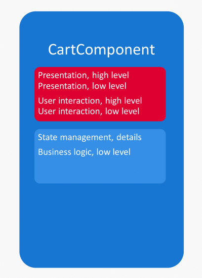
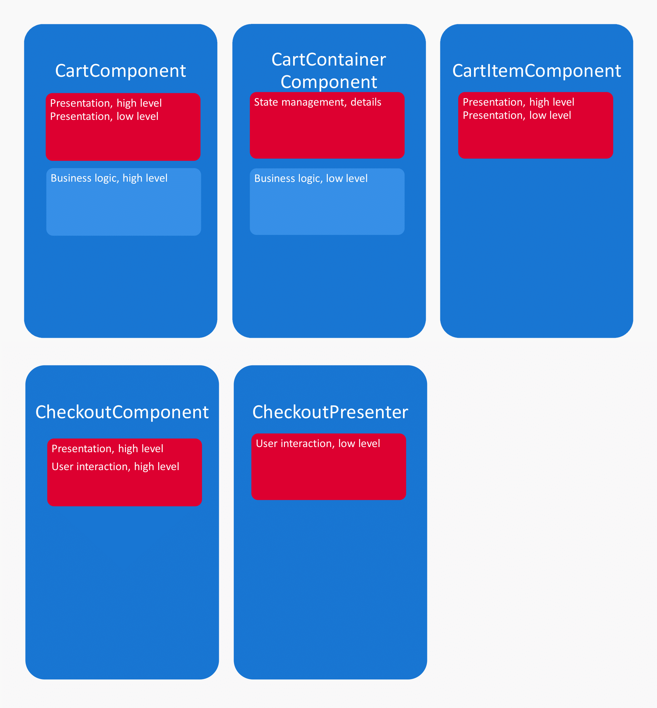

---
{
title: "Lean Angular components",
published: "2021-03-24T12:43:12Z",
edited: "2021-03-24T15:06:36Z",
tags: ["angular", "architecture", "designpatterns", "components"],
description: "Building a robust component architecture.",
originalLink: "https://dev.to/this-is-angular/lean-angular-components-1abl",
coverImg: "cover-image.png",
socialImg: "social-image.png",
collection: "Model-View-Presenter with Angular",
order: 6
}
---

*We want our components to be lean, mean Angular-powered machines. Cover photo by [Alessandro Ranica](https://unsplash.com/photos/3-D6RXgaZnI) on Unsplash.*

*Original publication date: 2019-09-23.*

So you’ve been developing Angular projects for a couple of years and you feel like you’ve got everything under control. You break your applications into components and services. You even follow [the official style guide](https://angular.io/guide/styleguide)—at least you think so. This is all there is to it, right?

Wrong!

> Where did I go so wrong?

I’m glad you asked, grasshopper. Let’s discuss a robust component architecture. Let’s define *lean Angular components*.

## Tutorials teach the basics

You might have learned Angular through [the Tour of Heroes tutorial](https://angular.io/tutorial) or even [the Getting Started guide](https://angular.io/start) which was published with the release of Angular version 8.

While fine for Angular beginners, the tutorials do not teach us how to structure and architect large or complex applications. If you believe they teach you everything there is to know, think again!

This is the issue we’re going to address in this article—too many tutorials and guides teach us only the basics. If basics are all we ever learn, how will we ever advance our skills?

A component-based application architecture has been a major part of all popular frameworks for half a decade, starting with React in 2013. But what are components really? The Angular team tells us that:

> An application is a collection of components.

This barely tells us anything. I would even argue that an application isn't a component collection but rather a component composition. This aligns with the fact that an application at any point in time has a component tree which is made up of all activated components—that is the components that are active on the current page in its current state.

## Components are for presentation

Components are part of the presentational layers of our applications: User interaction and presentation. Components sit on the outermost layer of our overall application architecture. They are the method of presenting information to our users and allow them to interact with the application.

<iframe src="https://gist.github.com/LayZeeDK/e8a312917af9810637dd1330a7ee768c"></iframe>

*Figure 1. Horizontal layers of a web application. [Open in new tab](https://gist.github.com/LayZeeDK/e8a312917af9810637dd1330a7ee768c#file-web-application-horizontal-layers-csv).*

Considering the horizontal layers of a web application in Figure 1, components often end up addressing concerns from multiple layers directly. This is a mistake.

## Model-View-Presenter—a collection of techniques

I’ve previously collected common techniques and described them in the article “[Model-View-Presenter with Angular](https://dev.to/this-is-angular/model-view-presenter-with-angular-533h)” and its related articles. Why? To have a detailed guide on how to separate concerns in Angular applications.

Follow my Model-View-Presenter variation for Angular and you will almost certainly have an application that is maintainable, testable, scalable, and performant.

Not convinced yet? That’s fine. Let’s take a look at an example from the official Getting Started guide.

```ts
// cart.component.ts
import { Component } from '@angular/core';
import { FormBuilder } from '@angular/forms';

import { CartService } from '../cart.service';

@Component({
  selector: 'app-cart',
  templateUrl: './cart.component.html',
  styleUrls: ['./cart.component.css']
})
export class CartComponent {
  items;
  checkoutForm;

  constructor(
    private cartService: CartService,
    private formBuilder: FormBuilder,
  ) {
    this.items = this.cartService.getItems();

    this.checkoutForm = this.formBuilder.group({
      name: '',
      address: ''
    });
  }

  onSubmit(customerData) {
    // Process checkout data here
    console.warn('Your order has been submitted', customerData);

    this.items = this.cartService.clearCart();
    this.checkoutForm.reset();
  }
}
```

<figcaption>Listing 1. Forms: Cart component.</figcaption>

What’s going on in the cart component in Listing 1? In its UI properties, we see a list of items and a checkout form. The items are initialised from the cart service while the checkout form is initialised using the form builder.

When the user submits the form, the checkout form value is logged to the console (since this is a simple example), the item list cleared using the cart service, and the checkout form is reset.

## Addressing too many concerns

What’s wrong with this component? First of all, it addresses concerns that span multiple horizontal layers. Secondly, it contains logic at different levels of abstraction—it contains low level implementation details and high level policies.

The cart component uses two pieces of application state: The checkout form which is local UI state and the items contained in the shopping cart.

## State management is a separate concern

At least two things are wrong about how the application state is managed. The cart item list is initialised from the cart service. At least we’re not performing HTTP requests directly in the component. We’re at a higher level of abstraction by saying we want the cart items, not how to get them.

Then again, we’re pulling the items from the cart service. To separate concerns, we want a presentational cart component which is only concerned about presenting the cart items and allowing the user to submit the checkout form. Nothing more, nothing less.

Why is this important? [The official architecture guide](https://angular.io/guide/architecture-services) reads:

> Angular distinguishes components from services to increase modularity and reusability. By separating a component’s view-related functionality from other kinds of processing, you can make your component classes lean and efficient.

This is exactly what I’m trying to convince you about. We should strive to have components that are only concerned about presentation. The architecture guide mentions **view-related functionality**. We can always argue what is meant by that term. My take is presentation and user interaction.

I would take it one step further and say that not even presentation or user interaction concerns should be part of the component model. Anything more than simple logic should be extracted to services and other dependencies.

## Designing presentational components

[Presentational components](https://dev.to/this-is-angular/presentational-components-with-angular-3961) present application state that is passed to them through input properties. If data transformation or computed properties are necessary, the application state is passed through a [presenter](https://dev.to/this-is-angular/presenters-with-angular-2l7l)—a component level service.

The architecture guide describes this in its very next paragraph:

> Ideally, a component’s job is to enable the user experience and nothing more. A component should present properties and methods for data binding, in order to mediate between the view (rendered by the template) and the application logic (which often includes some notion of a model).

# Managing control flow

Another responsibility of a [presentational component](https://dev.to/this-is-angular/presentational-components-with-angular-3961) is to be a method of passing control flows initiated by user interaction to behaviour-encapsulating services—what I call **[presenters](https://dev.to/this-is-angular/presenters-with-angular-2l7l)**. Side effects of the presenters are mapped to output properties as needed. In simple use cases, a user interaction is mapped directly to an output property.

This is another principle that is mentioned in the architecture guide:

> A component can delegate certain tasks to services, such as fetching data from the server, validating user input, or logging directly to the console.

The three examples mentioned in the guide almost exactly corresponds to the business logic in the cart component. It tells us to delegate to services.

## We need discipline

The final paragraph of the introduction of the guide reads:

> Angular doesn’t enforce these principles. Angular does help you follow these principles by making it easy to factor your application logic into services and make those services available to components through dependency injection.

This hits the nail on its head. The guide encourages us to follow these principles, but it’s up to us to practice them when designing components. We need to be disciplined about our component architecture.

## Container components are not enough

Even with components split into [container components](https://dev.to/this-is-angular/container-components-with-angular-4o05) and [presentational components](https://dev.to/this-is-angular/presentational-components-with-angular-3961), we should still add another layer of abstraction to prevent components from doing too much. Business logic should be extracted into component level services like facades or even component-specific services such as [presenters](https://dev.to/this-is-angular/presenters-with-angular-2l7l).

## For long-lived project and software products

Over-engineering? For a small or simple application, sure. For long-lived projects and software products, we’d better think about our component architecture sooner rather than later.

With concerns separated into very specific software artifacts, each one is easy to reason about and easy to test. Once a new requirement inevitably is needed, we can extend the software artifact that encapsulates the specific concern and addresses it at the correct abstraction level.

## Case study: Lean cart component

So what happened to that cart component from the Getting Started guide?

```html
<!-- cart.component.html -->
<h3>Cart</h3>

<p>
  <a routerLink="/shipping">Shipping Prices</a>
</p>

<div class="cart-item" *ngFor="let item of items">
  <span>{{ item.name }} </span>
  <span>{{ item.price | currency }}</span>
</div>

<form [formGroup]="checkoutForm" (ngSubmit)="onSubmit(checkoutForm.value)">
  <div>
    <label for="name">
      Name
    </label>
    <input id="name" type="text" formControlName="name">
  </div>

  <div>
    <label for="address">
      Address
    </label>
    <input id="address" type="text" formControlName="address">
  </div>

  <button class="button" type="submit">Purchase</button>
</form>
```

<figcaption>Listing 2.1. Cart: Initial mixed component template.</figcaption>

```ts
// cart.component.ts
import { Component } from '@angular/core';
import { FormBuilder } from '@angular/forms';

import { CartService } from '../cart.service';

@Component({
  selector: 'app-cart',
  styleUrls: ['./cart.component.css'],
  templateUrl: './cart.component.html',
})
export class CartComponent {
  items;
  checkoutForm;

  constructor(
    private cartService: CartService,
    private formBuilder: FormBuilder,
  ) {
    this.items = this.cartService.getItems();

    this.checkoutForm = this.formBuilder.group({
      name: '',
      address: '',
    });
  }

  onSubmit(customerData) {
    // Process checkout data here
    console.warn('Your order has been submitted', customerData);

    this.items = this.cartService.clearCart();
    this.checkoutForm.reset();
  }
}
```

<figcaption>Listing 2.2. Cart: Initial mixed component model.</figcaption>

Listings 2.1 and 2.2 are our starting point—a mixed component with concerns spanning many horizontal layers. It also features logic at different abstraction levels.

The mixed cart component has logic for presentation, presentation implementation details, high level presentation logic, low level presentation logic, and low level user interaction logic. These categories of logic might be alright to add to a [presentational component](https://dev.to/this-is-angular/presentational-components-with-angular-3961), but it’s definitely at a point where we should consider refactoring it.

It also contains non-presentational logic in the categories of state management implementation details, and low level business logic. State management is the first concern that we should extract. Local UI state is the exception which is categorised as a user interaction concern—part of UI behaviour.

```html
<!-- cart.container.html -->
<app-cart-ui
  [items]="items"
  [shippingPath]="shippingPath"
  (checkout)="onCheckout($event)"></app-cart-ui>
```

<figcaption>Listing 3.1. Cart: Container component template.</figcaption>

```ts
// cart.container.ts
import { Component } from '@angular/core';

import { Customer } from '../customer';
import { pathPrefix, routes } from '../root-routes';
import { CartService } from './cart.service';

@Component({
  selector: 'app-cart',
  templateUrl: './cart.container.html',
})
export class CartContainerComponent {
  items = this.cartService.getItems();
  shippingPath = pathPrefix + routes.shipping.path;

  constructor(
    private cartService: CartService,
  ) {}

  onCheckout(customerData: Customer) {
    // Process checkout data here
    console.warn('Your order has been submitted', customerData);

    this.items = this.cartService.clearCart();
  }
}
```

<figcaption>Listing 3.2. Cart: Container component model.</figcaption>

In Listings 3.1 and 3.2, we’ve extracted a container component from the mixed cart component. All state management integration logic is now in this component.

```ts
// root-routes.ts
export const pathPrefix = '/';

export const routes = {
  shipping: {
    path: 'shipping',
  },
};
```

<figcaption>Listing 3.3 Root routes after extracting from cart component.</figcaption>

In the initial cart component, the shipping route was hard-coded in the template. Now, we’ve extracted the route path to a separate module as seen in Listing 3.3, making it reusable and easy to change.

---

> Hard-coded route URLs and paths in templates and component models is a poor practice.

We’re better off storing route paths and URLs in a separate module that we can reference from our components, directives, and services.

[Routeshub](https://routeshub.gitbook.io/docs/) by [Max Tarsis](https://twitter.com/maktarsis) is a route management library that integrates easily with the Angular router.

---

The container component creates a full route URL and passes it to the presentational cart component which we’ll examine next.

```html
<!-- cart.component.html -->
<h3>Cart</h3>

<p>
  <a [routerLink]="shippingPath">Shipping Prices</a>
</p>

<app-cart-item *ngFor="let item of items"
  [item]="item"></app-cart-item>

<app-checkout (checkout)="checkout.emit($event)"></app-checkout>
```

<figcaption>Listing 4.1. Cart: Presentational component template.</figcaption>

```ts
// cart.component.ts
import { Component, EventEmitter, Input, Output } from '@angular/core';

import { Customer } from '../customer';
import { Products } from '../product';

@Component({
  selector: 'app-cart-ui',
  styleUrls: ['./cart.component.css'],
  templateUrl: './cart.component.html',
})
export class CartComponent {
  @Input()
  items: Products;
  @Input()
  shippingPath: string;
  @Output()
  checkout = new EventEmitter<Customer>();
}
```

<figcaption>Listing 4.2. Cart: Presentational component model.</figcaption>

In Listings 4.1 and 4.2, we see that there is now minimal logic left in the presentational cart component. The shipping route URL is passed as an input property. This component doesn’t care what the full route URL is or how to access it.

In the same way, this component is happy to iterate over products, passing each one to a separate instance of another [presentational component](https://dev.to/this-is-angular/presentational-components-with-angular-3961) we extracted, the cart item component.

I won’t go through the implementation details of the even more simple cart item component, but the full solution is available in [a StackBlitz workspace](https://stackblitz.com/edit/angular-lean-cart-component).

We’ve extracted yet another [presentational component](https://dev.to/this-is-angular/presentational-components-with-angular-3961), the checkout component.

```html
<!-- checkout.component.html -->
<form [formGroup]="checkoutForm" (ngSubmit)="onSubmit()">
  <div>
    <label for="name">
      Name
    </label>
    <input id="name" type="text" formControlName="name">
  </div>

  <div>
    <label for="address">
      Address
    </label>
    <input id="address" type="text" formControlName="address">
  </div>

  <button class="button" type="submit">Purchase</button>
</form>
```

<figcaption>Listing 5.1. Cart: Checkout component template.</figcaption>

```ts
// checkout.component.ts
import { Component, EventEmitter, Output } from '@angular/core';
import { FormGroup } from '@angular/forms';

import { Customer } from '../customer';
import { CheckoutPresenter } from './checkout.presenter';

@Component({
  selector: 'app-checkout',
  templateUrl: './checkout.component.html',
  viewProviders: [CheckoutPresenter],
})
export class CheckoutComponent {
  @Output()
  checkout = new EventEmitter<Customer>();

  get checkoutForm(): FormGroup {
    return this.presenter.form;
  }

  constructor(
    private presenter: CheckoutPresenter,
  ) {}

  onSubmit() {
    const customerData = this.presenter.checkout();
    this.checkout.emit(customerData);
  }
}
```

<figcaption>Listing 5.2. Cart: Checkout component model.</figcaption>

The checkout component template in Listing 5.1 binds native form controls to reactive Angular form groups and controls.

The component model in Listing 5.2 exposes the form group from the checkout presenter, a component level service that encapsulates user interaction logic.

This presentational component converts a form submission to an output property event emission by delegating logic to the checkout presenter.

```ts
// checkout.presenter.ts
import { Injectable } from '@angular/core';
import { FormBuilder } from '@angular/forms';

import { Customer } from '../../customer';

@Injectable()
export class CheckoutPresenter {
  form = this.formBuilder.group({
    name: '',
    address: '',
  });

  constructor(
    private formBuilder: FormBuilder,
  ) {}

  checkout(): Customer {
    const customerData: Customer = this.form.value;
    this.form.reset();

    return customerData;
  }
}
```

<figcaption>Listing 6. Cart: Checkout presenter.</figcaption>

The low-level logic of building the reactive checkout form group has been encapsulated in the checkout presenter in Listing 6. The form is exposed through a public property

Checkout is a matter of collecting entries from the reactive form controls, resetting the form group and returning the collected form entries from the `checkout` method.

I usually expose observables that emits values when an action such as checkout is performed. In this way, the presentational component can map a button directly to the presenters method and not care about handling a returned valued. Instead, an output property is connected to the presenter’s observable property.

For this case study, I wanted the implementation details to look similar to what we had in the initial solution, so I left some imperative control flow logic in the checkout component’s form submission handler.

### Files and directory structure

After separating concerns and extracting interfaces, we went from the files in Figure 2

```
└── cart
   ├── cart.component.css
   ├── cart.component.html
   ├── cart.component.ts
   └── cart.service.ts
```

*Figure 2. Cart component: Initial file tree.*

to the files and directories in Figure 3.

```
├── cart
│  ├── cart-item
│  │  ├── cart-item.component.html
│  │  └── cart-item.component.ts
│  ├── checkout
│  │  ├── checkout.component.html
│  │  ├── checkout.component.ts
│  │  └── checkout.presenter.ts
│  ├── cart.component.css
│  ├── cart.component.html
│  ├── cart.component.ts
│  ├── cart.container.html
│  ├── cart.container.ts
│  └── cart.service.ts
├── customer.ts
├── product.ts
└── root-routes.ts
```

*Figure 3. Cart: Final file tree.*

The full refactored solution is available as [a StackBlitz workspace](https://stackblitz.com/edit/angular-lean-cart-component).

### Separated concerns



<figcaption>Figure 4. Cart: Initial concerns.</figcaption>

Initially, many different concerns were located in a single mixed component as seen in Figure 4. The concerns in the lower section are definitely not supposed to be in a [presentational component](https://dev.to/this-is-angular/presentational-components-with-angular-3961), that is state management implementation details, high level business logic and low level business logic.



<figcaption>Figure 5. Cart: Refactored concerns.</figcaption>

After refactoring the cart feature into multiple components and a [presenter](https://dev.to/this-is-angular/presenters-with-angular-2l7l), concerns are reasonably separated, as seen in Figure 5.

Every software artifact is concerned with logic from a single horizontal layer or two at the most. They also manage to keep a single abstraction level in most cases.

There is always room for improvements, but this is a pretty solid component design for this application feature.

## Style guidelines worth giving a second read

[The official Angular Style Guide](https://angular.io/guide/styleguide) also recommends this way of designing our components. Let’s give some of the recommended practices another read.

### Extract non-presentational logic to services

[Style 05–15: Delegate complex component logic to services](https://angular.io/guide/styleguide#style-05-15)

This is one of the most important guidelines of the entire style guide, especially in the context of lean Angular components.

First of all, it tells us to extract non-presentational logic to services. Next, it tells us to keep components simple and focused on what they’re supposed to do. In other words, we should minimise logic in templates, delegate logic away from component models, keep component small, so no 1,000 lines of code components.

Even 100 lines of code for a component should have us worried or at the very least thinking of splitting the component into multiple components or delegating to services.

A reason for extracting logic to services is reuse. Data services and other services related to application state management has a big chance of being or potentially becoming reusable to multiple parts of our applications, maybe even multiple projects.

Similarly, when non-presentational logic is extracted from a component, we end up with [presentational components](https://dev.to/this-is-angular/presentational-components-with-angular-3961) that can be reused with state from different part of an application or potentially in multiple projects.

Another upside of extracting logic to a service is that services are easier and faster to test in isolation. Additionally, a simple component with only presentational concerns is easier to test in isolation. This is because we move dependencies and encapsulate implementation details outside of the components.

The final piece of motivation this guideline leaves us with is that extracting logic from components leaves them slim, trim and focused.

> We want our components to be lean, mean Angular-powered machines.

### Don’t put presentation logic in the template

[Style 05–17: Put presentation logic in the component class](https://angular.io/guide/styleguide#style-05-17)

Logic of the same concerns at the same level of abstraction should be located in close proximity. While component models, styles, and templates are closely related, each have their concern to take care of.

Component templates should worry about declarative DOM manipulation and event binding, not about implementation details. The component model should list properties that can be bound to the template. These properties hide implementation details from the template.

The style guide also tells us that placing presentation logic in the component model rather than the template improves reusability, maintainability, and testability—all traits worth maximising.

### Don’t create a component when a directive will do what you need

[Style 06–01: Use directives to enhance an element](https://angular.io/guide/styleguide#style-06-01)

This guiding principle reminds us that we should not always be jumping to using a component straightaway. In fact, if no template is needed or the DOM changes can be reflected in the host element itself, an attribute directive will do good by us.

When we replace a component with an attribute directive, we save a DOM element per directive instance which can be critical to complex applications or if a very specific DOM structure is required.

If we want to present content based only on a certain state or under other conditions, structural directives are our friends.

A downside of using directives rather than components is that they cannot be dynamically applied. Compare that to components which can be dynamically rendered.

On the positive side, the guideline mentions that a template element can have multiple directives applied. In case of components, only a single component can be applied to a template element.

### Do one thing and do it well

[Style 07–02: Single responsibility](https://angular.io/guide/styleguide#style-07-02)

This guideline immediately makes us think about [the Single Responsibility Principle](https://blog.cleancoder.com/uncle-bob/2014/05/08/SingleReponsibilityPrinciple.html). Whether it relates to that depends on how we define **responsibility**. I won’t go into that discussion now, even though it’s very important.

What I take away from this style recommendation is that we should create services that encapsulate logic from a single horizontal layer at a single abstraction level.

Actually, the Angular Style Guide gives this recommendation in its introduction:

> Apply the Single Responsibility Principle to all components, services, and other symbols. This helps make the app cleaner, easier to read and maintain, and more testable.

Unfortunately, it doesn’t teach us how. That’s a topic for a different article.

### Component level services

[Style 07–03: Providing a service](https://angular.io/guide/styleguide#style-07-03)

The style guide recommends to use a root-provided `Injectable` decorator for services to make them singleton services that are able to share business logic and state between multiple parts of our applications.

> This is not ideal when two different components need different instances of a service. In this scenario it would be better to provide the service at the component level that needs the new and separate instance.

More interestingly, the guide tells us to provide a service at the component level when we need separate instances in different components. Whether we have components with different component models or components constructed from the same component model, we do this by using the `providers` or `viewProviders` option for the `Component` decorator factory.

---

Read “[Tree-shakable dependencies in Angular projects](https://dev.to/this-is-angular/tree-shakable-dependencies-in-angular-projects-1ifg)” to learn every detail about Angular providers.

---

### Extract non-presentational concerns to services

[Style 08–01: Talk to the server through a service](https://angular.io/guide/styleguide#style-08-01)

This guideline recommends us to extract data operation and interaction logic to a service. Examples: HTTP communication, web storage reads and writes, and in-memory data storage such as Flux-like stores.

> The component’s responsibility is for the presentation and gathering of information for the view. It should not care how it gets the data, just that it knows who to ask for it. Separating the data services moves the logic on how to get it to the data service, and lets the component be simpler and more focused on the view.

This is very much about separation of concerns. We don’t work at different horizontal layers of the application in the same place. Instead, let’s design components that are only concerned about presentation. I prefer to even extract presentation and user interaction to delegate those concerns to component level services such as [presenters](https://dev.to/this-is-angular/presenters-with-angular-2l7l).

The style guide reminds us that extracting logic from the component into an abstract interface, makes it easier to test the component.

We let the component delegate the task of retrieving or storing data to a service so that it doesn’t have to know or worry about the details. This way we have an easier time changing the details without breaking the component.

## Lean Angular components in a nutshell

For simple applications or projects with a short lifespan, mixed components are acceptable since there’s no big need for maintainability, scalability or even testability of the codebase.

For large, complex applications, we have a higher need for maximising the valuable traits that were just mentioned. To do this, we need [presentational components](https://dev.to/this-is-angular/presentational-components-with-angular-3961) that only contain logic that belongs to the presentational, horizontal application layers. These components should only deal with a concern at a single abstraction level.

Lean [presentational components](https://dev.to/this-is-angular/presentational-components-with-angular-3961) are only concerned about presenting information to our users and allow them to interact with the application. Implementation details are left for other software artifacts that belong in different horizontal application layers. Complex logic for presentation or user interaction is delegated to component level services such as [presenters](https://dev.to/this-is-angular/presenters-with-angular-2l7l).

We can also have lean [container components](https://dev.to/this-is-angular/container-components-with-angular-4o05). They project application state to [presentational components](https://dev.to/this-is-angular/presentational-components-with-angular-3961) and convert application-specific events to commands that affect the application state. Complex logic is delegated to an application level service such as a facade—maybe even a component-specific service at the component level such as a data mapper.

---

An alternative to the container/presentational component pattern is using BLoCs (Business Logic Components) to encapsulate non-presentational logic.

Learn about BLoCs in [Suguru Inatomi](https://dev.to/lacolaco)’s article “[BLoC design pattern with Angular](https://medium.com/lacolaco-blog/bloc-design-pattern-with-angular-1c2f0339f6a3)”.

Make sure to also read my follow up in [this thread](https://medium.com/@LayZeeDK/very-interesting-suguru-thank-you-for-sharing-ec3c2dc7e82e) where I compare this design pattern to [container components](https://dev.to/this-is-angular/container-components-with-angular-4o05), [presentational components](https://dev.to/this-is-angular/presentational-components-with-angular-3961) and [presenters](https://dev.to/this-is-angular/presenters-with-angular-2l7l) while suggesting some improvements to Suguru’s ideas.

---

Even though we end up with more software artifacts in our codebase, each class deals with a very specific part of the entire application control flow. Every component is easy to reason about and every dependency is easy to stub or mock in tests.

We applied these guidelines to the cart component from the "Forms" part of the official Getting Started guide. As a result, we saw a more robust component architecture that follows best practices to increase maintainability, testability, and scalability.

In short, we ended up with lean Angular components with a much more reasonable balance of concerns spread out over many, but simple classes.

Finally, we wrapped up our journey by going through selected style guide recommendations. If you read only one guideline, read [Style 05–15: Delegate complex component logic to services](https://angular.io/guide/styleguide#style-05-15).

We also learned that lean Angular components are encouraged by the architecture guide for Angular services and dependencies.

Don’t take my word on it. [Ward Bell](https://twitter.com/wardbell) was the initial author of the Angular architectural guide. [This tweet thread](https://twitter.com/wardbell/status/1170554435371556864) holds his comments on this topic.

Let’s minimise the logic in our components to a level that they are barely worth testing. Let’s run a lean, mean Angular-powered machine. Let’s design lean and efficient Angular components.

## Related articles

One way to design lean Angular components is to use [container components](https://dev.to/this-is-angular/container-components-with-angular-4o05), [presentational components](https://dev.to/this-is-angular/presentational-components-with-angular-3961) and [presenters](https://dev.to/this-is-angular/presenters-with-angular-2l7l). I explain how in the introductory article “[Model-View-Presenter with Angular](https://dev.to/this-is-angular/model-view-presenter-with-angular-533h)”.

## Acknowledgements

I would like to thank [Ward Bell](https://twitter.com/wardbell) for sharing his wisdom with the community and especially for taking his time to address my questions about his view on this topic.

### Peer reviewers

Thank you to all my fellow Angular experts for helping make this article better:

- [Alex Okrushko](https://dev.to/alexokrushko)
- [Christian Janker](https://twitter.com/y_a_n_x)
- [Nacho Vazquez](https://dev.to/nachovazquez)
- [Oleksandr Poshtaruk](https://dev.to/oleksandr)
- [Tim Deschryver](https://dev.to/timdeschryver)
