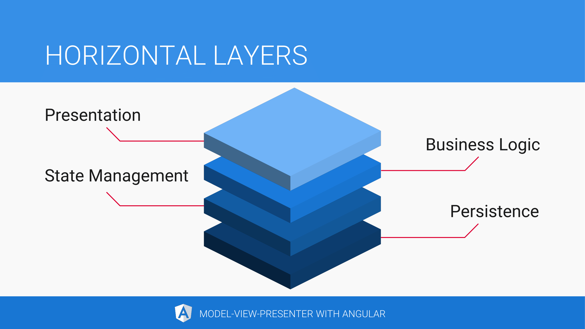
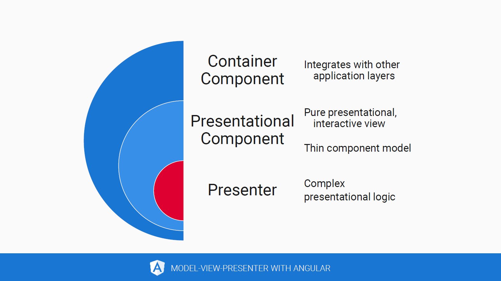
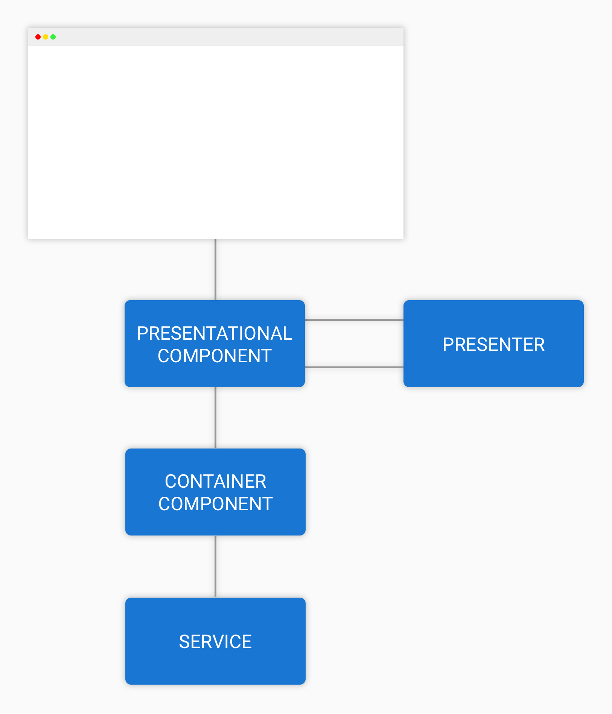
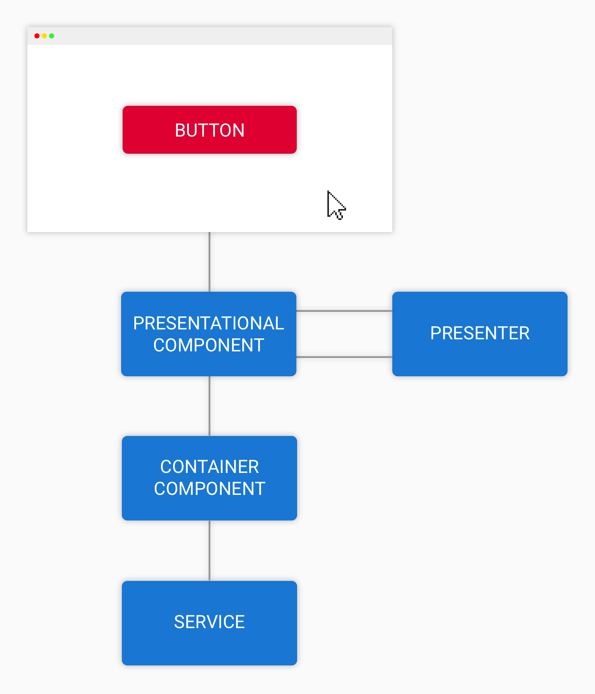
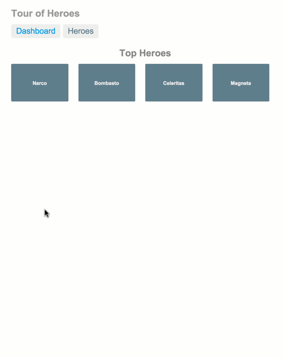

---
{
title: "Model-View-Presenter with Angular",
published: "2020-11-24T20:32:03Z",
edited: "2021-03-22T21:58:02Z",
tags: ["angular", "architecture", "designpatterns", "modelviewpresenter"],
description: "The MVP pattern increases separation of concerns, maintainability, testability and scalability in complex Angular apps by using container components, presentational components and presenters.",
originalLink: "https://dev.to/this-is-angular/model-view-presenter-with-angular-533h",
coverImage: "cover-image.png",
socialImage: "social-image.png",
collection: "Model-View-Presenter with Angular",
order: 1
}
---

*An engineering process. Cover photo by [energepic.com](https://www.pexels.com/photo/architect-composition-data-demonstration-313691/) on Pexels.*

*Original publication date: 2018-10-17.*

[🇪🇸 Spanish version by Estefania Garcia Gallardo](https://medium.com/puntotech/modelo-vista-presentador-con-angular-f30c4b4f99f0)

As an application grows, it becomes harder to maintain. The complexity increases while the value of reusable modules increases. We know that we have got to do something about it before we risk failure.

Design patterns to the rescue!

# Complex applications

A *complex application* is characterised by at least one of these traits:

- Multiple components in the component tree that display the same piece of the application state
- Several sources of updates for the application state such as:
  - Multiple users interacting at the same time
  - Back-end systems that push updated state to the browser in real-time
  - Scheduled background tasks
  - Proximity sensors or other device sensors
- Very frequent updating of the application state
- A large amount of components
- Components built with many lines of code, reminiscent of the [Big Ball of Mud](http://www.laputan.org/mud/) AngularJS controllers of the past
- A high level of cyclomatic complexity in components — a high concentration of logical branches or async control flows

At the same time, we want an application that is maintainable, testable, scalable and performant.

Complex applications rarely have all of the valuable traits. We cannot avoid all of the complex traits and still meet advanced project requirements, but we can design our application to maximise its valuable traits.

# Separation of concerns

We can think of *separation of concerns* (SoC) as compartmentalisation of our application. We group logic by system concern to be able to focus on a single concern at a time. At the topmost level, separation of concerns is an architectural discipline. In day to day development, it is knowing almost by heart exactly what goes where.

<figcaption>Example of horizontal layers in a modern web application.</figcaption>

We can slice our applications vertically, horizontally or both. When slicing vertically, we group software artifacts by *feature*. When slicing horizontally, we group by software *layer*. In our applications, we can categorise the software artifacts into these horizontal layers, or system concerns:



<figcaption>Horizontal layers of a web application.</figcaption>

The same rule can be applied to our Angular components. They should only be concerned with the *presentation* and *user interaction* layers. The result is that we loosen the coupling between the moving parts of our systems.

Sure, this process requires a lot of discipline as we are adding additional layers of abstraction, but the end result’s valuable traits make up for this. Keep in mind that we are only creating abstractions that should have been there in the first place.​

# The Model-View-Presenter pattern

*Model-View-Presenter* (often abbreviated MVP) is an architectural software design pattern for implementing the user interface (UI) of an application. We use it to minimise complex logic in classes, function, and modules (*software artifacts*) that are hard to test. In particular, we avoid complexity in UI-specific software artifacts such as Angular components.

Like Model-View-Controller — the pattern it is derived from — Model-View-Presenter separates presentation from the domain *model*. The presentation layer reacts to changes in the domain by applying the Observer Pattern as described by Erich Gamma, Richard Helm, Ralph Johnson, and John Vlissides (also known as “The Gang of Four”) in their classical book “[Design Patterns: Elements of Reusable Object-Oriented Software](https://www.amazon.com/Design-Patterns-Elements-Reusable-Object-Oriented/dp/0201633612)”.

In *the Observer Pattern*, a *subject* maintains a list of *observers* which it notifies when a state change occurs. Does this sound familiar? You guessed it, RxJS is based on the Observer Pattern.

The *view* does not contain any logic or behaviour except in the form of data bindings and widget composition. It delegates control to a presenter when user interactions occur.

The *presenter* batches state changes so that the user filling a form results in one big state change as opposed to many small changes, e.g. update the application state once per form instead of once per field. This makes it easy to undo or redo state changes. The presenter updates the state by issuing a command to the model. The state change is reflected in the view thanks to [Observer Synchronization](https://www.martinfowler.com/eaaDev/MediatedSynchronization.html).

## The Angular variation

<figcaption>Model-View-Presenter can be combined with Angular.</figcaption>

Inspired by the original Model-View-Presenter patterns and variations, we will create software artifacts that are well-fitted for the Angular platform and its key UI building block, *the component*.

Ideally, an Angular component focuses only on presentation and user interaction. In reality, we have to keep a strict discipline to make sure that our components are only concerned with presenting a piece of the application state to the user and enabling them to affect that state.

The Model-View-Presenter variation introduced in this article is a take on the [Encapsulated Presenter Style](https://lostechies.com/derekgreer/2008/11/23/model-view-presenter-styles/#the-encapsulated-presenter-style). However, our presenters will have no reference to their view. Instead, we will connect the presenter to the model and the view using observables, resulting in presenters that can be tested in isolation from their view.

We tend to use the [Supervising Controller](https://www.martinfowler.com/eaaDev/SupervisingPresenter.html) approach when applying the Model-View-Presenter pattern. Our views (Angular components) simply rely on their presenter for user interactions. Since our presenters are encapsulated by their view, both data and events flow through the component model at some point.

With the help of the component model, our presenter translates the user interaction to a component-specific event. This event is in turn translated into a command which is sent to the model. The final translation is handled by so-called container components which are introduced shortly.

Our presenter will have some of the traits of a [Presentation Model](https://martinfowler.com/eaaDev/PresentationModel.html) in that it will contain presentational logic such as a boolean or observable property to indicate whether a DOM element should be disabled. Another example is a property that indicates which color a DOM element should be renderered.

Our view binds onto the properties of the presenter to simply project the state that it represents without any additional logic. The result is a thin component model with a very simple component template.

# Model-View-Presenter concepts for Angular

To apply the Model-View-Presenter pattern to an Angular application, we will introduce concepts that are heavily inspired by the React community. Our components will—for the purpose of these articles—belong in one of these three categories:

- [Presentational components](https://dev.to/this-is-angular/presentational-components-with-angular-3961)
- [Container components](https://dev.to/this-is-angular/container-components-with-angular-4o05)
- Mixed components

React developers have been extracting presentational components and container components from mixed components for several years. We can use the same concepts in our Angular applications. Additionally, we will introduce the concept of presenters.

## Presentational components

*Presentational components* are purely presentational and interactive views. They present a piece of the application state to the user and enable them to affect its state.

With the exception of presenters, presentational components are not at all aware of any other parts of the application. They have a data binding API which describes the user interactions that they handle and the data that they need.

To remove most of the reasons for unit testing the UI, we keep the complexity of presentational components to an absolute minimum, both with regards to the component model and the component template.

# Container components

*Container components* expose pieces of application state to presentational components. They integrate the presentational layer with the rest of our application by translating component-specific events to commands and queries for non-presentational layers.

Usually, we have a 1-to-1 relationship between a container component and a presentational component. The container component has class properties that match the input properties of its presentational component and methods that respond to the events that are emitted through the presentational component’s output properties.

# Mixed components

If a component is not a container component or a presentational component, it is a *mixed component*. Given an existing application, there is a pretty good chance that it consists of mixed components. We call them mixed components because they have mixed system concerns—they contain logic that belongs in multiple horizontal layers.

Do not be surprised if you stumble upon a component that—in addition to containing an array of domain objects for presentation—directly accesses the device camera, sends HTTP requests and caches application state using WebStorage.

While this logic is expected in an application, grouping it all in a single place makes it hard to test, difficult to reason about, complicated to reuse and tightly coupled.

# Presenters

Behavioural logic and complex presentational logic is extracted into a *[presenter](https://dev.to/this-is-angular/presenters-with-angular-2l7l)* to get a simple presentational component. The presenter has no UI and often no or only a few injected dependencies, making it easy to test and reason about.

The presenter is rarely aware of the rest of the application. Usually, only a single presentational component references a presenter.

# The Model-View-Presenter triad

<figcaption>The Model-View-Presenter triad for an Angular application.</figcaption>

These three software artifacts are combined to what we call a Model-View-Presenter *triad*. The *model*—represented by container components—is the application state that is displayed to the user for them to browse and alter.

The *view*, represented by presentational components, is a thin user interface that presents the application state and translates user interactions to component-specific events, often redirecting the control flow to the presenter.

The *presenter* is usually just an instance of a class that is completely unaware of the rest of the application.

## Data flow

Let us visualise how data and events flow through a Model-View-Presenter triad.

**Data flows down the component tree**

<figcaption>Figure 2. Data flow starting at a service and ending in the DOM.</figcaption>

In Figure 2, an application state change has occured in a service. The container component is notified since it has subscribed to an observable property on the service.

The container component transforms the emitted value into a shape that is most convenient for the presentational component. Angular assigns new values and references to the bound input properties on the presentational component.

The presentational component passes the updated data to the presenter which recomputes additional properties used in the presentational component template.

The data has now finished flowing down the component tree and Angular renders the updated state to the DOM, displaying it to the user in a list.

**Events flow up the component tree**

<figcaption>Figure 3. Event flow starting with a user interaction and ending in a service.</figcaption>

In Figure 3 the user clicks a button. Angular directs control to an event handler in the presentational component model because of an event binding in its template.

The user interaction is intercepted by the presenter which translates it to a data structure and emits it through an observable property. The presentational component model observes the change and emits the value through an output property.

Angular notifies the container component of the value emitted in the component-specific event because of an event binding in its template.

Now that the event has finished flowing up the component tree, the container component translates the data structure into arguments that are passed to a method on the service.

Following a command to change the application state, a service often emits the state change in its observable properties and the data once again flows down the component tree as seen in Figure 2.

# An improved Angular application

Some will consider our new UI architecture an overly complex result of over-engineering, while in reality what we are left with are many simple, modular pieces of software. A modular software architecture is what enables us to be *agile*. Not agile in the sense of agile processes and ceremony but agile in regard to the *cost of change*. Instead of an increasing pile of technical debt, we are proactive as opposed to reactive when handling changes in customer requirements. It is very difficult to achieve this level of agility with a system that is tightly coupled and hardly testable, taking months to refactor.

> A modular software architecture enables us to be agile.

Instead of an increasing pile of technical debt, we are proactive about handling changes in customer requirements. Had the system instead been tightly coupled and hardly testable, taking months to refactor, it would be difficult to achieve this level of agility.

## Maintainable

Even though the resulting system is composed of many moving parts, each part is very simple and only addresses a single system concern. Additionally, we have a clear system in place as to what goes where.

## Testable

We minimise the logic in Angular-specific software artifacts since they are often difficult and slow to test. As each piece of software focuses on exactly one system concern, they are easy to reason about. Assumptions that we can easily verify in automated tests.

UI is particularly difficult and slow to test and Angular is no exception. Using Model-View-Presenter, we minimise the amount of logic in presentational components to the point that they are barely worth testing. Instead, we can choose to skip unit testing them entirely and rely on our development tooling, integration tests, and end-to-end tests to catch simple errors like typos, syntax errors, and properties that are left uninitialised.

## Scalable

Features can be developed in isolation from each other. Even the software artifacts in separate horizontal layers can be developed and tested in isolation. We are aware of exactly where each piece of logic belongs.

Now that we can develop the layers in isolation, we can distinguish between *technical* and *visual* front-end development. While one developer is great at implementing behaviour using RxJS and another ones loves back-end integration, yet another developer enjoys to perfect the design and address accessibility issues with CSS and HTML.

As we can develop features in isolation, tasks can be separated between teams. One team is concerned with the product catalogue, while another team addresses issues and new features for the shopping cart in an e-commerce system.

## Performant

Proper separation of concerns generally gives us high performance, especially in the presentation layer. Performance bottlenecks are easily tracked and isolated.

With the `OnPush` change detection strategy, we minimise the impact that the Angular change detection cycles have on our application’s performance.

# Case study: Tour of Heroes

<figcaption>The “Tour of Heroes” tutorial application.</figcaption>

We begin where the Angular.io [“Tour of Heroes” tutorial](https://angular.io/tutorial) ends. It is used as our starting point because it is a tutorial commonly known by Angular developers.

All of the components in the final Tour of Heroes tutorial code are mixed components. This fact is obvious, considering that none of them have output properties, yet some of them alter the application state.

In the related articles, we will apply the Model-View-Presenter pattern to a selection of these components, step-by-step with lots of hands-on code examples. We also discuss which behaviours to test in a Model-View-Presenter triad.

You will notice that we are not changing any features or behaviour of the application, but simply refactoring its Angular components into more specialised software artifacts.

---

While these articles only discuss some of the Tour of Heroes components, I have applied the Model-View-Presenter pattern to the entire application and added test suites for container components and presenters in [this GitHub repository](https://github.com/LayZeeDK/ngx-tour-of-heroes-mvp).

---

## Prerequisites

Aside from the concepts introduced in this article, I expect you to be familiar with only a few key Angular concepts. The Model-View-Presenter concepts are explained in detail in the related articles.

I expect you to have a good understanding of Angular components, i.e. [data binding syntax](https://angular.io/guide/template-syntax#binding-syntax-an-overview) as well as [input and output properties](https://angular.io/guide/template-syntax#input-and-output-properties). I also assume that you have basic [RxJS](https://rxjs-dev.firebaseapp.com/) knowledge—that you are somewhat familiar with observables, subjects, operators and subscriptions.

We will build isolated unit tests in which we stub service dependencies using Jasmine spies. Stubs and other test doubles are not key to understanding the tests. Keep your focus on the test cases and try to understand *why* we test the behaviour that is exercised by the tests.

# Resources

[Browse the final Tour of Heroes tutorial code on StackBlitz](https://angular.io/generated/live-examples/toh-pt6/stackblitz.html).

[Download the final Tour of Heroes tutorial code](https://angular.io/generated/zips/toh-pt6/toh-pt6.zip) (zip archive, 30 KB)

[Browse the Tour of Heroes—Model-View-Presenter style repository on GitHub](https://github.com/LayZeeDK/ngx-tour-of-heroes-mvp).

[Watch my talk “Model-View-Presenter with Angular” from Angular Online Meetup #8](https://youtu.be/C0yyvnrc0N0):



[View the slides from my talk “Model-View-Presenter with Angular”](https://bit.do/mvp-slides):



# Related articles

Learn about the history of the Model-View-Presenter pattern and how its sibling pattern Model-View-Controller was introduced to client-side UI frameworks for the web. Read “[The history of Model-View-Presenter](https://dev.to/this-is-learning/the-history-of-model-view-presenter-420h)”.

Are you sick of worrying about state management and back-end stuff in your Angular components? Extract all that nasty non-presentational logic into container components. Read how in “[Container components with Angular](https://dev.to/this-is-angular/container-components-with-angular-4o05)”.

Learn how to test container component logic with blazingly fast unit tests in “[Testing Angular container components](https://dev.to/this-is-angular/testing-angular-container-components-33io)”.

"[Presentational components with Angular](https://dev.to/this-is-angular/presentational-components-with-angular-3961)" discusses pure, deterministic and potentially reusable components which only depend on input properties and user interaction-triggered events to determine their internal state.

[Learn how to extract a presenter from a presentational component in "Presenters with Angular"](https://dev.to/this-is-angular/presenters-with-angular-2l7l).

In “[Lean Angular components](https://indepth.dev/lean-angular-components/)”, we discuss the importance of a robust component architecture. Model-View-Presenter encapsulates several of the patterns that help us achieve this.

# Acknowledgements

The animated flow charts are created by my good friend and fellow software developer [Martin Kayser](https://www.linkedin.com/in/mdkayser/).

Achieving a high degree of separation of concerns is an effort inspired by [the works of Robert “Uncle Bob” Martin](https://blog.cleancoder.com/uncle-bob/2012/08/13/the-clean-architecture.html), in particular his book “[Clean Architecture: A Craftsman’s Guide to Software Structure and Design](http://www.informit.com/store/clean-architecture-a-craftsmans-guide-to-software-structure-9780134494166)”.

Applying the Model-View-Presenter pattern to an Angular app was inspired by the article “[Model View Presenter, Angular, and Testing](https://davembush.github.io/model-view-presenter-angular-and-testing/)” by [Dave M. Bush](https://www.linkedin.com/in/davembush/).

In my initial research, I examined the Model-View-Presenter pattern for vanilla JavaScript described in the article “[An MVP guide to JavaScript — Model-View-Presenter](http://www.roypeled.com/an-mvp-guide-to-javascript-model-view-presenter/)” by [Roy Peled](https://www.linkedin.com/in/roypeled/).

## Editor

I want to thank you, [Max Koretskyi](https://indepth.dev/author/maxkoretskyi/), for helping me get this article into the best shape possible. I greatly appreciate the time you take to share your experiences about writing for the software development community.

# Peer reviewers

Thank you, dear reviewers, for helping me realise this article. Your feedback has been invaluable!

- [Alex Rickabaugh](https://twitter.com/synalx)
- [Brian Melgaard Hansen](https://www.linkedin.com/in/brian-melgaard-hansen-8b7176153/)
- [Craig Spence](https://twitter.com/phenomnominal)
- [Denise Mauldin](https://www.linkedin.com/in/denisemauldin/)
- [Kay Khan](https://github.com/KayHS)
- [Mahmoud Abduljawad](https://twitter.com/mahmoud_ajawad)
- [Martin Kayser](https://www.linkedin.com/in/mdkayser/)
- [Sandra Willford](https://www.linkedin.com/in/sandra-willford/)
- [Stephen E. Mouritsen Chiang](https://twitter.com/chiangse)
