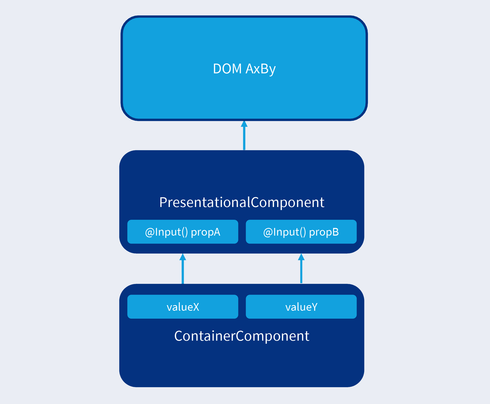
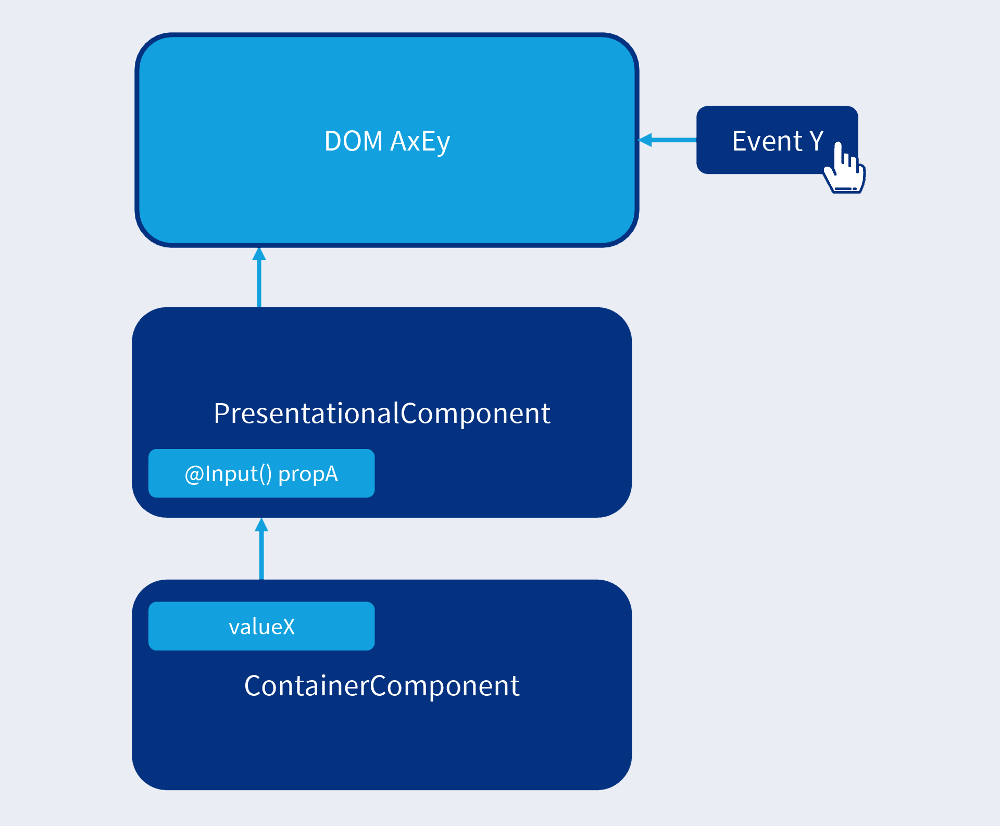
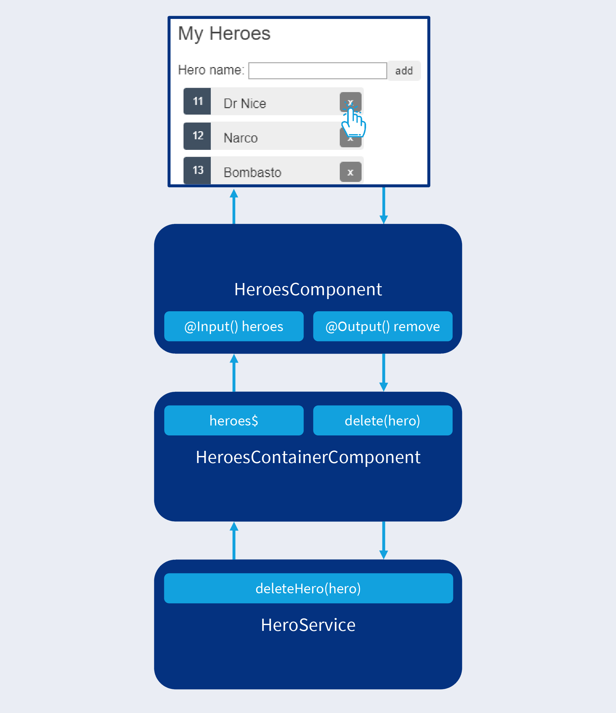
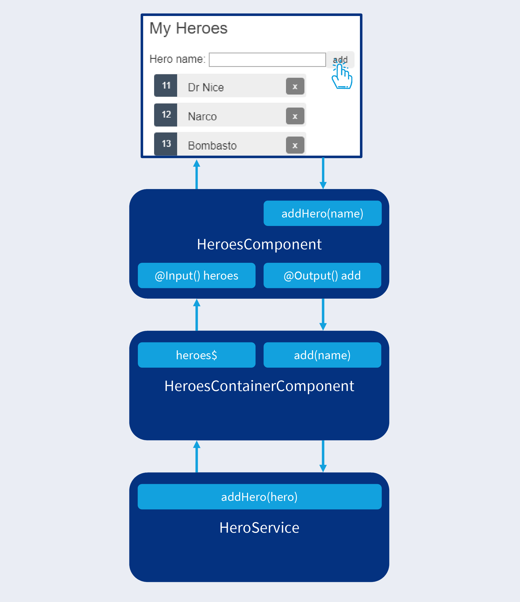

---
{
title: "Presentational components with Angular",
published: "2021-03-22T21:35:55Z",
edited: "2021-03-22T21:50:17Z",
tags: ["angular", "architecture", "designpatterns", "modelviewpresenter"],
description: "Presentational components encapsulate presentation and UI behaviour. They can be stateful or stateless and are connected to the application state through their data binding API.",
originalLink: "https://dev.to/playfulprogramming-angular/presentational-components-with-angular-3961",
coverImg: "cover-image.png",
socialImg: "social-image.png",
collection: "Model-View-Presenter with Angular",
order: 4
}
---

Cover photo by [Jessica Ruscello](https://unsplash.com/photos/-GUyf8ZCTHM) on Unsplash.

*Original publication date: 2020-03-31.*

Presentational components are literally the user interface of our Angular application. They serve two purposes:

- Present application state to the user
- Change application state triggered by user interaction

To communicate with the rest of the application, presentational components have input properties for supplying them with data which will be formatted for display. They use output properties to notify application state changes initiated by user interactions. This is their data binding API.

Presentational components interface with users on one side and application state as well as other non-presentational layers on the other. They use container components as the glue that connect them to non-presentational application layers.

In relation to the rest of the application, data goes in, events emit out. Presentational components don't care about where the data is coming from or where the events are going. When it comes to users, data is presented to them through the component template. Events from users come into the component through event handlers, that is methods that are bound in the component template using event bindings.

Can presentational components use property bindings as well? Sure, they can pass any piece of state down the component tree. Likewise, they might be forwarding events up the component tree from other presentational components similar to how they forward user-initialised events up the component tree.

## Stateless presentational components

Presentational components can be stateless, meaning their appearance and behaviour are always the same. Stateless presentational components are entirely about what is presented to the user.

In Angular, we have another building block for presentation: A directive. A directive should be our go to solution for presentation. It would be a poor choice to create a component to add a specific style like bold font or a background color. We would either use pure CSS for this or encapsulate the presentation in an attribute directive.

A good example of a stateless presentational component would be a toolbar component that simply projected content and wrapped a DOM structure around it for styling and layout purposes.

## Stateful presentational components

Presentational components can have their own isolated state. Think about a checkbox component. It has at least two states: Checked and cleared. The checkbox status is a piece of local UI state.

A checkbox component is stateful. What use is it, if that state is not somehow persisted though? The next time we return to this route, we would often expect the checkbox to be in the same state.

### Notifying the application of state changes

To be useful, this local UI state has to synchronise with the rest of the application state. However, if we added persistence logic to store the checkbox status in WebStorage, we would be dealing with a mixed component, not a presentational component.

To remain purely presentational, the checkbox component communicates its state changes to the rest of the application by emitting status events through an output property.

### Getting notified of state changes

A stateful presentational component can have an initial state, regardless of the rest of the application. But to synchronise with the rest of the application, it needs a way to hydrate its state when the component is activated. The checkbox status will be governed by an input property.

The user might not be the only actor able to change the checkbox state. Maybe a timer sets the state to checked after 10 seconds for whatever reason. The checkbox component will be notified of this state change through its input property.

## Lean presentational components {#lean-presentational-components}

When following the Model-View-Presenter pattern, we keep our presentational components lean. We keep logic out of our component templates, but also our component models (the component class instances).

Component templates should do not much more than set up expression bindings for presentation and event bindings for user interaction.

Behaviour should be delegated to *presenters* which are component level dependencies that are completely isolated from the rest of the application. This ensures that the component model is only coordinating the configuration and binding of input properties, output properties, UI properties, and presenters.

The component model of a Model-View-Presenter-style presentational component contains no business logic except for glue code between the data binding API, UI properties, event handlers, and presenters.

## Presentational components

We call them presentational components because they represent the presentational layers of our application such as *presentation* and *user interaction* as seen in Table 1.

<iframe src="https://gist.github.com/LayZeeDK/e8a312917af9810637dd1330a7ee768c"></iframe>
*Table 1. Horizontal layers of a web application. [Open in new tab](https://gist.github.com/LayZeeDK/e8a312917af9810637dd1330a7ee768c).*

Preferably, we extract user interaction to component level services such as presenters as described in the "[Lean presentational components](#lean-presentational-components)" section.

### Presentational components are usually reusable

Presentational components are usually reusable. Their data binding API or rendering API allow them to be used in many places.

We could easily have one-off presentational components though. For example, we could have a logo component that displayed our logo image. A logo component would often only be used in the main layout. Other layout components like a primary navigation component, a top app bar component or a side drawer component are other examples that are only used in one parent component but definitely have at least a presentational component part. They could also be split into container components and presentational components depending on their complexity.

A good example of a reusable presentational component is a button component. We could implement a design system for our organisation that includes a button. All developers in every team should be able to reuse the button component without worrying about the design system changing in terms of colors, fonts, or spacing. Or maybe we switched from Angular Material to Material UI. When the design system inevitably does change, the implementation details of our button component will make us able to make that change in a single place.

### Presentational components are pure

Presentational components are pure in the sense that they are free from side effects. Integration with state management, persistence, messaging, I/O, and other non-presentational layers belong in container components.

Because they are pure, they are deterministic in the way they render their DOM and emit events through their output properties.



<figcaption>Figure 1. DOM rendered based on 2 input values.</figcaption>

Figure 1 illustrates that when passed the input values `valueX` and `valueY`, this presentational component's DOM will always be rendered in the composition `AxBy`.



<figcaption>Figure 2. DOM rendered based on an input value and a user interaction.</figcaption>

In Figure 2, `valueX` is input followed by a user interaction which is intercepted as `Event Y`. This combination of input value and event series leads to the DOM composition `AxEy`. This will always be the case when `Event Y` happens while `valueX` is input.


<figcaption>Figure 3. DOM rendered based on an input value. Event emitted based on input value and user interaction.</figcaption>

The presentational component in Figure 3 has the DOM composition `Ax` based on `valueX` being passed as an input. The user interaction intercepted as `Event Z` leads to the value `eventZ` being emitted through an output property.

This is always the case when `Event Z` happens while `valueX` is the input value.

We must be able to demonstrate the examples in Figures 1, 2, and 3 in tests. Otherwise our components are impure in that they depend on external state. If that's the case, we need to create another input property and pass in that external state to turn the component into a presentational component with deterministic behaviour and rendering.

Presentational components become *dirty* as in *needs to be dirty checked* for one of two reasons:

- An external event such as a user interaction occurred and was picked up by an event binding in the component template
- New data was passed to one or more input properties

Because of this, we can optimise performance in our change detection cycles by using the `OnPush` change detection strategy.

## Simple example

We continue where we left off in an early section of "[Container components with Angular](https://dev.to/playfulprogramming-angular/container-components-with-angular-4o05)". Let's see where we're at with the mixed dashboard component from the Tour of Heroes tutorial– or what's left of it after we extracted a container component as seen in Listing 1.

```ts
// dashboard.component.ts
import { Component } from '@angular/core';

import { Hero } from '../hero';

@Component({
  selector: 'app-dashboard',
  styleUrls: ['./dashboard.component.css'],
  templateUrl: './dashboard.component.html',
})
export class DashboardComponent {
  heroes: Hero[] = [];
}
```

<figcaption>Listing 1. Dashboard: Mixed component model after extracting a container component.</figcaption>

As a small preparation, we'll change the selector to `'app-dashboard-ui'` as seen in Listing 3 to match the HTML element in our dashboard container component's template (Listing 1). You can use whatever naming, file, folder, and selector convention you think is appropriate for the use case or for your team.

### Declare the component's data binding API

As seen in Listing 2, the dashboard container component expects two input properties on the presentational dashboard component, `heroes` and `title`.

```html
<!-- dashboard.container.html -->
<app-dashboard-ui
  [heroes]="topHeroes$ | async"
  title="Top Heroes"></app-dashboard-ui>
```

<figcaption>Listing 2. Dashboard: Container component template.</figcaption>

Why would we want to extract the heading text from the presentational component? If it's a one-off component in our application, we might leave it in the presentational component. However, by extracing the title we have made it reusable. This dashboard component displays an overview of the top heroes. Maybe we need to add a dashboard for female Marvel heroes or British villains. We're now able to do so by using the presentational component in multiple container components which supply different heroes data sets with relevant titles.

We might also have an application that supports runtime language switching. In this case, we could have a title observable that supplied the title in the active language. Alternatively, we could have a translation pipe that communicates with localisation and internationalisation services. Even in this case, we should extract the title source to the container component to keep our presentational component pure and free from side effects.

```ts
// dashboard.component.ts
import { Component, Input } from '@angular/core';

import { Hero } from '../hero';

@Component({
  selector: 'app-dashboard-ui',
  styleUrls: ['./dashboard.component.css'],
  templateUrl: './dashboard.component.html',
})
export class DashboardComponent {
  @Input()
  heroes: Hero[];
  @Input()
  title: string;
}
```

<figcaption>Listing 3. Dashboard: Presentational component model after declaring its data binding API.</figcaption>

We add an `Input` decorator to the existing `heroes` property. We add the missing input property, `title`.

Now our presentational dashboard component has a data binding API.

### Use minimal presentational logic in the component template

We want our presentational components to be lean. Our templates should have minimal logic. Any complex presentational logic is delegated to the component model or better yet a presenter.

```html
<!-- dashboard.component.html -->
<h3>{{title}}</h3>
<div class="grid grid-pad">
  <a *ngFor="let hero of heroes" class="col-1-4"
      routerLink="/detail/{{hero.id}}">
    <div class="module hero">
      <h4>
        {{hero.name}}
      </h4>
    </div>
  </a>
</div>

<app-hero-search></app-hero-search>
```

<figcaption>Listing 4. Dashboard: Presentational component template with minimal presentational logic.</figcaption>

In Listing 4 we see that we have bound a template expression to the `title` property and that we iterate over the `heroes` property to create a master listing with a link for each hero.

The presentational logic in this template has minimal complexity. It uses template expression bindings to display content. It displays a child component which would be a container component if properly refactored. Finally, it loops through the heroes and adds a link to each one.

This component template is doing quite an amount of work of various categories. We could easily split it into several components. We do have one piece of complex logic left: Determining the route path used for the individual heroes.

Because we're working from an existing tutorial application, we will not split any components into smaller components. We will only split mixed components into container components and presentational components.

[Read "Lean Angular components" to see examples of solving similar component smells](https://indepth.dev/lean-angular-components/).

### Apply the `OnPush` change detection strategy

Now that we have replaced the mixed dashboard component with a pure, presentational component, we can apply the `OnPush` change detection strategy to optimise dirty checking and rendering as seen in Listing 5.

```ts
// dashboard.component.ts
import { ChangeDetectionStrategy, Component, Input } from '@angular/core';

import { Hero } from '../hero';

@Component({
  changeDetection: ChangeDetectionStrategy.OnPush, // 👈
  selector: 'app-dashboard-ui',
  styleUrls: ['./dashboard.component.css'],
  templateUrl: './dashboard.component.html',
})
export class DashboardComponent {
  @Input() heroes: Hero[];
  @Input() title: string;
}
```

<figcaption>Listing 5. Dashboard: Presentational component after the `OnPush` change detection strategy is applied.</figcaption>

When Angular visits this component, it checks whether the values passed to the component's input properties have changed since the last change detection cycle. If the input values haven't changed, dirty checking of the bindings of this component and all its descendant components in the component tree are skipped.

If an event binding in this component's template is triggered or an `AsyncPipe` in a descendant container component receives a new value, this component and all of its ancestors in the component tree is marked as dirty and will be fully dirty checked in the next change detection cycle.

## Advanced example

In "Container components with Angular", we left extracted a lot of logic from the mixed heroes component related to state management and persistence.

Let's review what the mixed heroes component looks like after extracting a container component. Take a look at Listing 6.

```ts
// heroes.component.ts
import { Component } from '@angular/core';

import { Hero } from '../hero';

@Component({
  selector: 'app-heroes',
  styleUrls: ['./heroes.component.css'],
  templateUrl: './heroes.component.html',
})
export class HeroesComponent {
  heroes: Hero[];

  add(name: string): void {
    name = name.trim();

    if (!name) {
      return;
    }
  }

  delete(hero: Hero): void {}
}
```

<figcaption>Listing 6. Heroes: Mixed component model after extracting a container component.</figcaption>

### Declare the component's data binding API

The container component expects the following data binding API from the presentational component we want to refactor this mixed component into:

- Input property: `heroes: Hero[]`
- Input property: `title: string`
- Output property: `add: EventEmitter<string>`
- Output property: `remove: EventEmitter<Hero>`

How do we know? From the hero container component's template which can be seen in Listing 7.

```html
<!-- heroes.container.html -->
<app-heroes-ui
  [heroes]="heroes$ | async"
  title="My Heroes"
  (add)="add($event)"
  (remove)="delete($event)"></app-heroes-ui>
```

<figcaption>Listing 7. Heroes: Container component template.</figcaption>

As a first step in refactoring a mixed component into a presentational component, let's declare its data binding API.

We also change the element selector from `app-heroes` to `app-heroes-ui` as the container component will use `app-heroes`.

```ts
// heroes.component.ts
import { Component, EventEmitter, Input, Output } from '@angular/core';

import { Hero } from '../hero';

@Component({
  selector: 'app-heroes-ui',
  templateUrl: './heroes.component.html',
  styleUrls: ['./heroes.component.css']
})
export class HeroesComponent {
  @Input()
  heroes: Hero[];
  @Input()
  title: string;

  @Output()
  add = new EventEmitter<string>();
  @Output()
  remove = new EventEmitter<Hero>();

  addHero(name: string): void {
    name = name.trim();

    if (!name) {
      return;
    }
  }

  delete(hero: Hero): void {}
}
```

<figcaption>Listing 8. Heroes: Mixed component after declaring its data binding API.</figcaption>

There was a small problem. An output property was called `add`, but so was one of the component's event handlers.

I usually prefix an event handler method's name with `on`, for example `onAdd`. In this case, we stay consistent with the rest of the codebase and instead rename the event handler to `addHero` as seen in Listing 8.

How weird, the `delete` event handler has no method body. There's absolutely no logic left, so what's its purpose? It used to contain important logic for state management and persistence, but that has all been extracted to the heroes container component.

The `delete` event handler is bound to a user interaction by the component template as seen in Listing 9.

```html
<!-- heroes.component.html -->
<h2>
  My Heroes
</h2>

<div>
  <label>Hero name:
    <input #heroName>
  </label>

  <!-- (click) passes input value to add() and then clears the input -->
  <button (click)="add(heroName.value); heroName.value=''">
    add
  </button>
</div>

<ul class="heroes">
  <li *ngFor="let hero of heroes">
    <a routerLink="/detail/{{hero.id}}">
      <span class="badge">{{hero.id}}</span>
      {{hero.name}}
    </a>
    <button class="delete" title="delete hero"
      (click)="delete(hero)">x</button>
  </li>
</ul>
```

<figcaption>Listing 9. Heroes: Initial mixed component template.</figcaption>

### Connect the component template to the data binding API

Let's continue by connecting the component template to the component's data binding API.

```html
<!-- heroes.component.html -->
<h2>
  {{title}}
</h2>

<div>
  <label>Hero name:
    <input #heroName />
  </label>

  <!-- (click) passes input value to addHero() and then clears the input -->
  <button (click)="addHero(heroName.value); heroName.value=''">
    add
  </button>
</div>

<ul class="heroes">
  <li *ngFor="let hero of heroes">
    <a routerLink="/detail/{{hero.id}}">
      <span class="badge">{{hero.id}}</span>
      {{hero.name}}
    </a>
    <button class="delete" title="delete hero"
      (click)="remove.emit(hero)">x</button>
  </li>
</ul>
```

<figcaption>Listing 10. Heroes: Presentational component template after connecting it to the component's data binding API.</figcaption>

First, we replace the hardcoded heading with a template expression bound to the `title` input property. This makes the component more reusable as we discussed previously.

Then we remember to reflect the changed name of the `addHero` event handler. This is shown in Listing 10, as is the title template expression binding.

Finally, we decide to use an inline event handler to emit the current hero through the `remote` output property, when the user clicks the delete button.

We could have done this in the `delete` event handler. A purist might want to do just that, but we'll use this very basic business logic in the template for now. We'll revisit this decision in the following section.

As seen in the template, the name of the hero we want to add is passed to the `addHero` event handler. However, we haven't connected it to the `add` output property, we just created.

```ts
// heroes.component.ts
import { Component, EventEmitter, Input, Output } from '@angular/core';

import { Hero } from '../hero';

@Component({
  selector: 'app-heroes-ui',
  styleUrls: ['./heroes.component.css'],
  templateUrl: './heroes.component.html',
})
export class HeroesComponent {
  @Input()
  heroes: Hero[];
  @Input()
  title: string;

  @Output()
  add = new EventEmitter<string>();
  @Output()
  remove = new EventEmitter<Hero>();

  addHero(name: string): void {
    name = name.trim();

    if (!name) {
      return;
    }

    this.add.emit(name);
  }
}
```

<figcaption>Listing 11. Heroes: Presentational component model after connecting the component template to the data binding API.</figcaption>

We deleted the `delete` event handler after circumventing it with an inline event handler connected to an output property.

Finishing off, we completed connecting the *add hero* control flow by emitting the hero name through the `add` output property after validating it. This can be seen in Listing 11.

### Use minimal presentational logic in the component template

We want to minimise logic in parts of our application that are hard to test. Every Angular-specific software artifact is inherently somewhat complex and complicated to test.

Graphical user interfaces are notoriously hard and slow to test and Angular components are no exception, at least not out-of-the-box.

Extracting logic to parts of our application that are easier and faster to test increases the testability of that logic. At the same time, we separate concerns to increase maintainability, scalability, and stability.

Wow, those 4 *-ilities* are all traits worth maximising!

Let's revisit the heroes component template and see whether there's any non-trivial or complex presentational logic left. Look at Listing 12.

```html
<!-- heroes.component.html -->
<h2>
  {{title}}
</h2>

<div>
  <label>Hero name:
    <input #heroName />
  </label>

  <!-- (click) passes input value to addHero() and then clears the input -->
  <button (click)="addHero(heroName.value); heroName.value=''">
    add
  </button>
</div>

<ul class="heroes">
  <li *ngFor="let hero of heroes">
    <a routerLink="/detail/{{hero.id}}">
      <span class="badge">{{hero.id}}</span>
      {{hero.name}}
    </a>

    <button class="delete" title="delete hero"
      (click)="remove.emit(hero)">x</button>
  </li>
</ul>
```

<figcaption>Listing 12. Heroes: Presentational component template.</figcaption>

First of all, this component still serves many different use cases. It has a creation form, it iterates over heroes,  list their names, links to them and displays their delete buttons.

Normally, we would split it into smaller, more focused presentational components, but in this article series we'll only split components to extract container components.

[Read "Lean Angular components" to see examples of splitting components into smaller components](https://indepth.dev/lean-angular-components/).

We'll leave the hard-coded route segment in the template and not worry about it this time around.

A moment ago, we put the logic to emit a hero through the `remove` output property in the template. The trade-off is that it's not visible in the component model how and when the output value emissions are triggered.

Also, we can't test this in unit tests that are isolated from the DOM as this business logic now lives in the template, outside the component model's surface.

The benefit is that we remove a very basic event handler that would do nothing more than glue a user interaction directly onto an output property.

The `remove.emit(hero)` business logic is so simple that we don't even have to test it in isolation. If we break it, it will show up in integration tests or end-to-end tests.



<figcaption>Figure 4. The remove hero control flow with a presentational component.</figcaption>

Our delete hero control flow now looks like Figure 4.

Going back to the component template, we see that there is a piece of complex presentational logic remaining in the template to control the hero name text field. It even has a comment to explain what it does. What's that you say? A code smell? Indeed it is!

First, the entered hero name is passed to the `addHero` event handler, then the text field is cleared. Remember that the hero name is validated by the event handler? If the validation did more than ensure that a non-empty hero name is submitted, we would be in trouble.

As the text field is cleared after submission and we have no UI property for the hero name, we wouldn't be able to show an error message in the context of the entered name. We also wouldn't be able to keep the invalid entry in the text field to make it easy to correct.

These are tell-tale signs that we're using template-driven Angular forms and that we could benefit from reactive Angular forms to test the UI behaviour and form validation in isolation from the DOM.

It's interesting to note that as soon as we start to add more than basic form validation or UI behaviour, template-driven forms quickly become uninteresting.

**Extract form validation and UI behaviour to component model**

Let's use reactive forms to extract form validation and UI behaviour logic from the presentational heroes component's template to its component model.

```html
<!-- heroes.component.html -->
<h2>
  {{title}}
</h2>

<div>
  <label>Hero name:
    <input [formControl]="nameControl" />
  </label>

  <button (click)="addHero()">
    add
  </button>
</div>

<ul class="heroes">
  <li *ngFor="let hero of heroes">
    <a routerLink="/detail/{{hero.id}}">
      <span class="badge">{{hero.id}}</span>
      {{hero.name}}
    </a>

    <button class="delete" title="delete hero"
      (click)="remove.emit(hero)">x</button>
  </li>
</ul>
```

<figcaption>Listing 13.1. Heroes: Presentational component template after extracting form validation and UI behaviour.</figcaption>

```ts
// heroes.component.ts
import { Component, EventEmitter, Input, Output } from '@angular/core';
import { FormControl } from '@angular/forms';

import { Hero } from '../hero';

@Component({
  selector: 'app-heroes-ui',
  styleUrls: ['./heroes.component.css'],
  templateUrl: './heroes.component.html',
})
export class HeroesComponent {
  @Input()
  heroes: Hero[];
  @Input()
  title: string;

  @Output()
  add = new EventEmitter<string>();
  @Output()
  remove = new EventEmitter<Hero>();

  nameControl = new FormControl('');

  addHero(): void {
    let name = this.nameControl.value;
    this.nameControl.setValue('');
    name = name.trim();

    if (!name) {
      return;
    }

    this.add.emit(name);
  }
}
```

<figcaption>Listing 13.2. Heroes: Presentational component model with form validation and UI behaviour.</figcaption>

As seen in Listing 13.2, we introduce the UI property `nameControl` which is a form control holding a text string value.

In the template shown in Listing 13.1, we bind the `<input>` element's value by using a `FormControlDirective`. To use this directive, we have to remember to import `ReactiveFormsModule` from `@angular/forms` to our component's declaring Angular module.

The logic that was in an inline event handler before has been moved inside of the `addHero` event handler on the component model.

We take a snapshot value from the name form control and then clear the value of the form control. This is reflected in the `<input>` element after the next change detection cycle which is triggered by the update to the form control value.

As before, we trim wrapping whitespace away from the entered hero name which both to sanitize it and to verify that it contains non-whitespace characters. If it does, we emit it through the `add` output property.



<figcaption>Figure 5. The add hero control flow with a presentational component.</figcaption>

The add hero control flow is illustrated in Figure 5.

There we go, we moved complex logic out of the component template. We could easily argue that this logic isn't very complex, but it's actually enough that it'd require an effort to test, especially when we have to test it through a UI.

With the logic extracted to the component model, we have the option to test it without a UI in an isolated unit test that treats the component model as a regular JavaScript class.

### Use minimal presentational logic in the component model

This step is first of all about moving non-presentational logic out of the component model as a presentational component should only be concerned about presentation and user interaction.

In "[Container components with Angular](https://dev.to/playfulprogramming-angular/container-components-with-angular-4o05)", we already extracted persistence and state management concerns into a container component. What we're left with at this point in the component model is form validation, a user interaction concern.

When we're left with only presentation and user interaction concerns as is now the case for the presentational heroes component, we ensure that the logic has minimal complexity. If it gets complicated enough that it needs separate testing, we should extract it to a presenter. A topic that we'll cover in an upcoming article.

For now, we'll leave form validation in the component model.

### Apply the OnPush change detection strategy

Only one thing left to do. Now that we've converted the mixed component to a pure presentational component, we'll apply the `OnPush` change detection strategy to optimize change detection performance.

This minor but important change is made in Listing 14.

```ts
// heroes.component.ts
import {
  ChangeDetectionStrategy,
  Component,
  EventEmitter,
  Input,
  Output,
  } from '@angular/core';
import { FormControl } from '@angular/forms';

import { Hero } from '../hero';

@Component({
  changeDetection: ChangeDetectionStrategy.OnPush, // 👈
  selector: 'app-heroes-ui',
  styleUrls: ['./heroes.component.css'],
  templateUrl: './heroes.component.html',
})
export class HeroesComponent {
  @Input()
  heroes: Hero[];
  @Input()
  title: string;

  @Output()
  add = new EventEmitter<string>();
  @Output()
  remove = new EventEmitter<Hero>();

  nameControl = new FormControl('');

  addHero(): void {
    let name = this.nameControl.value;
    this.nameControl.setValue('');
    name = name.trim();

    if (!name) {
      return;
    }

    this.add.emit(name);
  }
}
```

<figcaption>Listing 14. Heroes: Presentational component model using the `OnPush` change detection strategy.</figcaption>

The template bindings of the presentational heroes component will only need to be dirty checked whenever the value of one of its input properties has changed since the last change detection cycle.

This is one part of what's known as the unidirectional dataflow in Angular projects. Data flows down from the component tree. It starts in a data service, goes through the heroes container component and ends up being passed to one of the input properties of the presentational heroes component.

In the other direction, we have user interactions that are observed through event listeners in the component template which trigger event handlers in the component model. After validation and processing, these user-initiated events are converted to component-specific events that are emitted through the presentational component's output properties.

The component-specific events are observed by a container component which makes further processing or mapping and finally forward them to data services. Events flow up the component tree.

## Dynamic presentational components

In our examples, we have been dealing with use case-specific components. We left out an important category of reusable presentational components.

The data binding API of *dynamic presentational components* don't focus primarily on application state. Rather, their most important traits are content projection or dynamic rendering in the form of component outlets, template outlets or Angular CDK portals.

Consumers pass templates or component types to dynamic presentational components, or maybe we pass content to be projected to the main content outlet. We could also be passing content matching specific selectors. Alternatively, we could use presentational component wrappers or attribute directives.

## Testing presentational components

Presentational components that are closely related to use cases rather than more generic presentation or UI behaviour should be in a state that they're barely worth testing.

Isolated unit tests should be of little value to use case-related presentational components. The complexity of their logic is so minimal that there is very little room for error.

Instead, complex presentational logic and UI behaviour is extracted to presenters that are easy to test in isolation and don't require Angular or even a DOM.

By having a minimal complexity in presentational components, we can rely on static analysis, integration tests, and end-to-end tests to catch simple errors such as typos, type errors, or mapping errors.

Where unit tests make most sense is to document the component API for dynamic presentational components. An alternative is to use something like Storybook to document the component API. We can even choose to run end-to-end tests on Storybook stories.

## Providing fake application state

One benefit of keeping our components pure in the form of presentational components is that they're not tightly coupled to application state. Presentational components don't care where the data comes from. In fact, they're completely detached from application state except for local UI state.

Because of this, we can provide application state from anywhere. We can even fake application state. How can this help us? We can use fake application state if the backend is not ready yet when we're developing.

We can also pass fake data to our presentational components for tests. If we want to make a kitchen sink page for our UI library, for example using Storybook or Angular Playground, we can provide fake data sets to set up the various states that our presentational components support.

## Characteristics of presentational components

Presentational components are potentially reusable. If they present application state, they don't care where that state lives. They can be stateful but only in terms of local UI state such as a Boolean property or a CSS state rule indicating whether a dropdown menu is open or closed.

Presentational components presents the UI to the user visually. When a user interacts with a presentational component either local UI state is changed in the component model or template or a component-specific event is emitted through an output property.

Given a set of values for a presentational component's input properties and local UI state, its corresponding DOM structure is always rendered the same. This trait enables us to use the `OnPush` change detection strategy to optimise change detection performance by minimising dirty checking to when it's needed.

Presentational components can be shared between multiple use cases. They become use case-specific when combined with a container component. Often, we have a 1-to-1 relationship between a presentational components and a container component. Although, we can also have a single container component connect to multiple presentational components of the same or different types.

Some presentational components are made for the purpose of being reusable rather than serve a certain category of application use cases. This type of presentational components represents atoms, molecules, and organisms in the Atomic Design methodology. We can form UI workspace libaries or publishable UI libraries out of a collection of presentational components.

## Converting a mixed component to a presentational component

To convert a mixed component to a presentational component, we follow this recipe:

1. Extract a container component which manages non-presentational concerns.
2. Declare the presentational component's data binding API–its input and output properties.
3. Use minimal presentational logic in the presentational component model and template. Complex user interaction and presentation logic is delegated to one or more presenters–component level services that encapsulate UI behaviour, form validation, or formatting.
4. Apply the `OnPush` change detection strategy to optimise change detection.

When extracting a container component, the template of a mixed component should have little reason to change.

We end up with a presentational component that serves two main purposes:

- Present application state to the user
- Change application state triggered by user interaction

[Continue your journey in "Presenters with Angular"](https://dev.to/playfulprogramming-angular/presenters-with-angular-2l7l).

## Related articles

Read the introductory article “[Model-View-Presenter with Angular](https://dev.to/playfulprogramming-angular/model-view-presenter-with-angular-533h)”. This is also where you'll find links to the companion GitHub repository, related articles, and other useful resources.

[Learn how to extract a container component from a mixed component in "Container components with Angular"](https://dev.to/playfulprogramming-angular/container-components-with-angular-4o05).

[Learn how to extract a presenter from a presentational component in "Presenters with Angular"](https://dev.to/playfulprogramming-angular/presenters-with-angular-2l7l).

## Peer reviewers

- [Nacho Vazquez](https://dev.to/nachovazquez)
- [Tim Deschryver](https://dev.to/timdeschryver)
