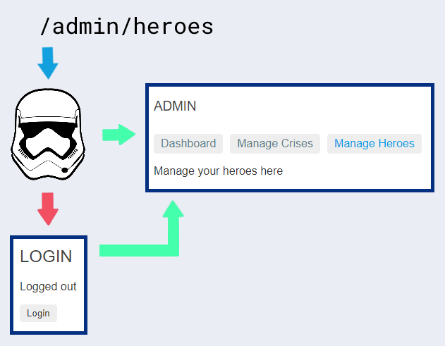

---
{
title: "Testing Angular route guards with the RouterTestingModule",
published: "2020-11-16T21:05:46Z",
edited: "2023-02-08T21:23:17Z",
tags: ["angular", "testing", "router"],
description: "Learn how to test route guards in isolated unit tests. Also learn how to test route guards in practice with RouterTestingModule.",
originalLink: "https://dev.to/this-is-angular/testing-angular-route-guards-with-the-routertestingmodule-45c9",
coverImg: "cover-image.png",
socialImg: "social-image.png",
collection: "Angular router testing",
order: 3
}
---

*Original cover photo by [Liam Tucker](https://unsplash.com/photos/cVMaxt672ss) on Unsplash.*

*Original publication date: 2020-09-19.*

Route guards can prevent activating or deactivating specific routes in our applications. A very common category of route guards is authentication and authorisation guards. The most simple of them verify that the user is authenticated (logged in). If that's not the case, they're redirected to a login form.

In this article, we're going to explore how we can use the `RouterTestingModule` to test router guards. As a case study, we write route guard tests for the `AuthGuard` from the extended Tour of Heroes application from [the official Angular routing guide](https://angular.io/guide/router-tutorial-toh).

 *The control flow of the `AuthGuard` route guard.*

First, we're going to test it using isolated unit tests. Then we're going to create an integrated test suite using Angular's `RouterTestingModule` and finally compare the two approaches.

# Case study: Tour of Heroes

Let's first review the `AuthGuard` route guard.

```ts
import { Injectable } from '@angular/core';
import { ActivatedRouteSnapshot, CanActivate, CanActivateChild, CanLoad, NavigationExtras, Route, Router, RouterStateSnapshot, UrlSegment } from '@angular/router';

import { AuthService } from './auth.service';

@Injectable({
  providedIn: 'root',
})
export class AuthGuard implements CanActivate, CanActivateChild, CanLoad {
  constructor(private authService: AuthService, private router: Router) {}

  canActivate(route: ActivatedRouteSnapshot, state: RouterStateSnapshot): boolean {
    const url = state.url;

    return this.checkLogin(url);
  }

  canActivateChild(route: ActivatedRouteSnapshot, state: RouterStateSnapshot): boolean {
    return this.canActivate(route, state);
  }

  canLoad(route: Route, segments: UrlSegment[]): boolean {
    const url = `/${route.path}`;

    return this.checkLogin(url);
  }

  checkLogin(url: string): boolean {
    if (this.authService.isLoggedIn) {
      return true;
    }

    // Store the attempted URL for redirecting
    this.authService.redirectUrl = url;

    // Create a dummy session id
    const sessionId = 123456789;

    // Set our navigation extras object
    // that contains our global query params and fragment
    const navigationExtras: NavigationExtras = {
      queryParams: { session_id: sessionId },
      fragment: 'anchor',
    };

    // Navigate to the login page with extras
    this.router.navigate(['/login'], navigationExtras);

    return false;
  }
}
```

*Listing 1. Auth route guard.*

The route guard in Listing 1 implements three of the route guard interfaces:

- `CanActivate`: Guards a route.
- `CanActivateChild`: Guards a route's child routes.
- `CanLoad`: Guards lazy/eager loading of routes using the `loadChildren` API.

> There's also a `CanDeactivate` route guard interface which is used to prevent the user from leaving a route, but that's not relevant to an authentication or authorisation guard.

The related methods `canActivate`, `canActivateChild`, and `canLoad` all forward control to the `checkLogin` method. This method returns a Boolean value but also includes some side effects in case the user is not authenticated:

1. It adds a session ID query parameter.
2. It simulates the auth token that is usually passed to external login forms.
3. It navigates to the login route with the aforementioned details added.

For the `CanActivate` and `CanActivateChild` hooks, we've been able to return a promise or an observable resolving a Boolean **or** a `UrlTree` for a long time, but `CanLoad` has been unable to do so until Angular version 10.

`AuthGuard#checkLogin` can now be restructured to return a `UrlTree` instead and let Angular take care of triggering routing. However, we'll leave it as-is for the purpose of this article.

The extended Tour of Heroes application uses the authentication route guard for the routes seen in Listings 2A and 2B.

```ts
const appRoutes: Routes = [
  {
    path: 'admin',
    loadChildren: () => import('./admin/admin.module').then((m) => m.AdminModule),
    canLoad: [AuthGuard],
  },
];
```

*Listing 2A. Excerpt of root level routes.*

```ts
const adminRoutes: Routes = [
  {
    path: '',
    component: AdminComponent,
    canActivate: [AuthGuard],
    children: [
      {
        path: '',
        canActivateChild: [AuthGuard],
        children: [
          { path: 'crises', component: ManageCrisesComponent },
          { path: 'heroes', component: ManageHeroesComponent },
          { path: '', component: AdminDashboardComponent },
        ],
      },
    ],
  },
];
```

*Listing 2B. Admin feature routes.*

The route guard is added to the relevant routing hooks which are matched by their respective interfaces.

We have three different use cases to test based on Listings 2A and 2B, when the user is logged out:

1. When `AuthGuard` guards a `CanLoad` hook, access to route is rejected and its feature Angular module is not loaded.
2. When `AuthGuard` guards a `CanActivate` hook, access to the route is rejected.
3. When `AuthGuard` guards a `CanActivateChild` hook, access to the child routes is rejected.

We also need to verify that when the user is logged in, access is granted in all three use cases.

# Isolated route guard test[](https://indepth.dev/testing-angular-route-guards-with-the-routertestingmodule#isolated-route-guard-test)

First, let's create an isolated unit test suite to make sure that the implementation works as expected.

We will create a stub of the `AuthService` that `AuthGuard` uses to determine whether the user is logged in. Additionally, we will create a spy object representing the `Router` service that the authentication guard uses to redirect to the login page if the user is not logged in.

Other than setting up the relevant service dummies, fakes, spies, stubs and mocks, the difficult part about testing route guards in isolation is that all the route guard interfaces accept these complex data structures which are used internally by the router:

- `ActivatedRouteSnapshot`
- `Route`
- `RouterStateSnapshot`
- `UrlTree`

In this case study, we'll fake as few properties as possible of these objects, but then we're relying on our knowledge about the implementation of the `AuthGuard` and the tests will break if the implementation is changed to use other properties.

It could be helpful if Angular exposed utilities to help create fakes of these complex data structures. Feel free to join [the GitHub discussion from April 2017 on this matter](https://github.com/angular/angular/issues/15779).

## Isolated route guard test utilities[](https://indepth.dev/testing-angular-route-guards-with-the-routertestingmodule#isolated-route-guard-test-utilities)

To test the implementation listed in Listing 1, we will add the test utility as seen in Listing 3A.

```ts
// auth.guard.spec.ts
import { RouterStateSnapshot } from '@angular/router';

function fakeRouterState(url: string): RouterStateSnapshot {
  return {
    url,
  } as RouterStateSnapshot;
}
```

*Listing 3A. Isolated route guard test utility.*

As you can see, we just need a fake object with a `url` property which is accessed by `AuthGuard#canActivate`.

## Isolated route guard test setup[](https://indepth.dev/testing-angular-route-guards-with-the-routertestingmodule#isolated-route-guard-test-setup)

Now, we'll walk through the test setup and shared variables needed for our isolated route guard test suite.

```ts
// auth.guard.spec.ts
import { ActivatedRouteSnapshot, Router } from '@angular/router';

import { AuthGuard } from './auth.guard';
import { AuthService } from './auth.service';

describe('AuthGuard (isolated)', () => {
  beforeEach(() => {
    routerSpy = jasmine.createSpyObj<Router>('Router', ['navigate']); // [1]
    serviceStub = {}; // [2]
    guard = new AuthGuard(serviceStub as AuthService, routerSpy); // [3]
  });

  const dummyRoute = {} as ActivatedRouteSnapshot;
  const fakeUrls = ['/', '/admin', '/crisis-center', '/a/deep/route'];
  let guard: AuthGuard;
  let routerSpy: jasmine.SpyObj<Router>;
  let serviceStub: Partial<AuthService>;

  describe('when the user is logged in', () => {
    beforeEach(() => {
      serviceStub.isLoggedIn = true;
    });
  });

  describe('when the user is logged out', () => {
    beforeEach(() => {
      serviceStub.isLoggedIn = false;
    });
  });
});
```

*Listing 3B. Isolated route guard test setup and shared variables.*

In the test case setup hook (the `beforeEach` callback), we're first creating a spy object that is a partial implementation of the `Router` service which only exposes the `navigate` method (1). The method is replaced with a jasmine spy which will accept any arguments. In our assertions, we will be able to verify the calls made to the spy object's `navigate` method. The spy object is stored in the shared `routerSpy` variable.

We store an empty object in the `serviceStub` variable (2). We're again relying on our implementation knowledge about the authentication guard which tells us that it only accesses the `AuthService#isLoggedIn` property which we configure in each of the nested `describe` scopes. For example, we have a scope for the suite of test cases grouped by the condition that the user is logged in. In its test case setup hook, we're setting the `isLoggedIn` property to true.

In the final step of the outermost test case setup hook, we're creating a new instance of `AuthGuard` by passing `serviceStub` and `routerSpy` to its constructor (3).

Listing 3B has a couple of shared variables that we didn't discuss yet. The first one is `dummyRoute`. This is another example of setting up as little of the complex routing data structures as possible. `CanActivate` and `CanActivateChild` accepts an `ActivatedRouteSnapshot` as their first arguments, but the authentication guard doesn't acces them at all. Because of this, we will just pass this empty object as a dummy argument.

`fakeUrls` holds an array of absolute route URLs that we're going to use to test the route guard's methods with route URLs of various shapes. We'll reuse them in both groups of tests.

## Isolated route guard test cases covering when access is granted[](https://indepth.dev/testing-angular-route-guards-with-the-routertestingmodule#isolated-route-guard-test-cases-covering-when-access-is-granted)

Let's start with the easy part. To grant access when the user is logged in, the route guard methods just need to return `true` for any URL passed to them, whenever `AuthService#isLoggedIn` is also set to `true`.

```ts
// auth.guard.spec.ts
import { Params, Route, UrlSegment } from '@angular/router';

describe('AuthGuard (isolated)', () => {
  describe('when the user is logged in', () => {
    fakeUrls.forEach((fakeUrl) => {
      // [1]
      it('grants access', () => {
        const isAccessGranted = guard.checkLogin(fakeUrl); // [2]

        expect(isAccessGranted).toBeTrue(); // [2]
      });

      describe('and navigates to a guarded route configuration', () => {
        it('grants route access', () => {
          const canActivate = guard.canActivate(dummyRoute, fakeRouterState(fakeUrl)); // [3]

          expect(canActivate).toBeTrue(); // [3]
        });

        it('grants child route access', () => {
          const canActivateChild = guard.canActivateChild(dummyRoute, fakeRouterState(fakeUrl)); // [4]

          expect(canActivateChild).toBeTrue(); // [4]
        });

        const paths = fakeUrl.split('/').filter((path) => path !== ''); // [5]

        paths.forEach((path) => {
          // [6]
          it('grants feature access', () => {
            const fakeRoute: Route = { path }; // [6]
            const fakeUrlSegment = { path } as UrlSegment; // [6]

            const canLoad = guard.canLoad(fakeRoute, [fakeUrlSegment]); // [7]

            expect(canLoad).toBeTrue(); // [7]
          });
        });
      });
    });
  });
});
```

*Listing 3C. Isolated route guard test cases covering when access is granted.*

Notice that we iterate over all the URLs stored in the shared variable `fakeUrls` (1) in Listing 3C. The `fakeUrl` iteration variable represents the URL currently being tested. This means that each test case is run as many times as the number of URLs stored in `fakeUrls`.

In (2), we pass a fake test route to `AuthGuard#checkLogin` and assert that it returned `true`.

The router will grant access to guarded routes if `AuthGuard` returns `true` from its route lifecycle hooks. In (3), we pass the dummy route and a fake router state wrapping the fake route URL as arguments to `AuthGuard#canActivate` and assert that it returns `true`.

`AuthGuard#canActivateChild` accepts the same arguments as seen in (4). Once again, we expect that it returns `true`.

To test `AuthGuard#canLoad`, we have to do something a little different. Since it accepts a `Route` object as its first argument and a route only has a URL segment in its `path` property, we split the fake URL into segments (5) and wrap each part in `Route` and `UrlSegment` data structures (6).

Finally, we pass the fake routing data structures to `AuthGuard#canLoad` and assert that it returns `true` (7).

## Isolated route guard test cases covering when access is rejected[](https://indepth.dev/testing-angular-route-guards-with-the-routertestingmodule#isolated-route-guard-test-cases-covering-when-access-is-rejected)

Now we're going to test the suite of test cases that covers the use cases in which access is rejected by the route guard. As this is more complicated, we're going to split the test cases into two groups for the purpose of this walkthrough.

In Listing 3D, we see the test cases covering the details of how the authentication guard redirects to the login page when the user is logged out.

```ts
// auth.guard.spec.ts
import { Params, Route, UrlSegment } from '@angular/router';

describe('AuthGuard (isolated)', () => {
  describe('when the user is logged out', () => {
    fakeUrls.forEach((fakeUrl) => {
      // [2]
      it('rejects access', () => {
        const isAccessGranted = guard.checkLogin(fakeUrl);

        expect(isAccessGranted).toBeFalse();
      });

      it('stores the redirect URL', () => {
        guard.checkLogin(fakeUrl);

        expect(serviceStub.redirectUrl).toBe(fakeUrl);
      });

      it('navigates to the login page', () => {
        // [1]
        guard.checkLogin(fakeUrl);

        expect(routerSpy.navigate).toHaveBeenCalledWith(['/login'], jasmine.any(Object));
      });

      it('adds a token to the login URL', () => {
        const expectedToken = 'anchor';

        guard.checkLogin(fakeUrl);

        expect(routerSpy.navigate).toHaveBeenCalledWith(
          jasmine.any(Array),
          jasmine.objectContaining({
            fragment: expectedToken,
          })
        );
      });

      it('adds a session ID to the login URL', () => {
        const expectedQueryParams: Params = {
          session_id: jasmine.any(Number),
        };

        guard.checkLogin(fakeUrl);

        expect(routerSpy.navigate).toHaveBeenCalledWith(
          jasmine.any(Array),
          jasmine.objectContaining({
            queryParams: expectedQueryParams,
          })
        );
      });
    });
  });
});
```

*Listing 3D. Isolated route guard test cases covering redirect to the login page when access is rejected*

All side effects caused by the authorisation guard rejecting access are verified one by one in separate test cases. From these tests, we see that some metadata is store in the URL state and the authorisation service. After that, navigation is triggered through the router service.

The test that asserts that navigation to the login page (1) is triggered could have been simplified significantly if we restructured the `AuthGuard`'s methods to return a `UrlTree` as mentioned in the section "Case study: Tour of Heroes".

Note that we run each test case once for every URL in the `fakeUrls` array (2).

Listing 3D covers the method `AuthGuard#checkLogin`. In Listing 3E, the routing hooks are exercised.

```ts
// auth.guard.spec.ts
import { Params, Route, UrlSegment } from '@angular/router';

describe('AuthGuard (isolated)', () => {
  describe('when the user is logged out', () => {
    fakeUrls.forEach((fakeUrl) => {
      // [1]
      describe('and navigates to a guarded route configuration', () => {
        it('rejects route access', () => {
          const canActivate = guard.canActivate(dummyRoute, fakeRouterState(fakeUrl)); // [3]

          expect(canActivate).toBeFalse();
        });

        it('rejects child route access', () => {
          const canActivateChild = guard.canActivateChild(dummyRoute, fakeRouterState(fakeUrl)); // [4]

          expect(canActivateChild).toBeFalse();
        });

        const paths = fakeUrl.split('/').filter((path) => path !== ''); // [2]

        paths.forEach((path) => {
          // [2]
          it('rejects feature access', () => {
            const fakeRoute: Route = { path }; // [5]
            const fakeUrlSegment = { path } as UrlSegment; // [5]

            const canLoad = guard.canLoad(fakeRoute, [fakeUrlSegment]); // [5]

            expect(canLoad).toBeFalse();
          });
        });
      });
    });
  });
});
```

*Listing 3E. Isolated route guard test cases covering redirect to the login page when access is rejected*

We're also running these tests one time per fake URL (1). Additionally, we're running the test that exercises `AuthGuard#canLoad` one time per URL part contained in the `paths` array (2).

The first test case covers usage of the `CanActivate` route guard interface (3). It uses the `dummyRoute` parameter and the `fakeRouterState` factory we created earlier. We assert that it returns `false` when the user is logged out.

In the second test case, we exercise the route guard's implementation of the `CanActivateChild` route guard interface (4). We use the same parameters as in the previous test case and assert that the routing hook returns `false` when the user is logged out.

Finally, we create fake `Route` and `UrlSegment` data structures to pass to `AuthGuard#canLoad` (5) and assert that it also returns `false` when the user is logged out.

## Isolated route guard test suite[](https://indepth.dev/testing-angular-route-guards-with-the-routertestingmodule#isolated-route-guard-test-suite)

The isolated route guard test suite is shown in full length in Listing 4 for reference.

```ts
// auth.guard.spec.ts
import { ActivatedRouteSnapshot, Params, Route, Router, RouterStateSnapshot, UrlSegment } from '@angular/router';

import { AuthGuard } from './auth.guard';
import { AuthService } from './auth.service';

function fakeRouterState(url: string): RouterStateSnapshot {
  return {
    url,
  } as RouterStateSnapshot;
}

describe('AuthGuard (isolated)', () => {
  beforeEach(() => {
    routerSpy = jasmine.createSpyObj<Router>('Router', ['navigate']);
    serviceStub = {};
    guard = new AuthGuard(serviceStub as AuthService, routerSpy);
  });

  const dummyRoute = {} as ActivatedRouteSnapshot;
  const fakeUrls = ['/', '/admin', '/crisis-center', '/a/deep/route'];
  let guard: AuthGuard;
  let routerSpy: jasmine.SpyObj<Router>;
  let serviceStub: Partial<AuthService>;

  describe('when the user is logged in', () => {
    beforeEach(() => {
      serviceStub.isLoggedIn = true;
    });

    fakeUrls.forEach((fakeUrl) => {
      it('grants access', () => {
        const isAccessGranted = guard.checkLogin(fakeUrl);

        expect(isAccessGranted).toBeTrue();
      });

      describe('and navigates to a guarded route configuration', () => {
        it('grants route access', () => {
          const canActivate = guard.canActivate(dummyRoute, fakeRouterState(fakeUrl));

          expect(canActivate).toBeTrue();
        });

        it('grants child route access', () => {
          const canActivateChild = guard.canActivateChild(dummyRoute, fakeRouterState(fakeUrl));

          expect(canActivateChild).toBeTrue();
        });

        const paths = fakeUrl.split('/').filter((path) => path !== '');

        paths.forEach((path) => {
          it('grants feature access', () => {
            const fakeRoute: Route = { path };
            const fakeUrlSegment = { path } as UrlSegment;

            const canLoad = guard.canLoad(fakeRoute, [fakeUrlSegment]);

            expect(canLoad).toBeTrue();
          });
        });
      });
    });
  });

  describe('when the user is logged out', () => {
    beforeEach(() => {
      serviceStub.isLoggedIn = false;
    });

    fakeUrls.forEach((fakeUrl) => {
      it('rejects access', () => {
        const isAccessGranted = guard.checkLogin(fakeUrl);

        expect(isAccessGranted).toBeFalse();
      });

      it('stores the redirect URL', () => {
        guard.checkLogin(fakeUrl);

        expect(serviceStub.redirectUrl).toBe(fakeUrl);
      });

      it('navigates to the login page', () => {
        guard.checkLogin(fakeUrl);

        expect(routerSpy.navigate).toHaveBeenCalledWith(['/login'], jasmine.any(Object));
      });

      it('adds a token to the login URL', () => {
        const expectedToken = 'anchor';

        guard.checkLogin(fakeUrl);

        expect(routerSpy.navigate).toHaveBeenCalledWith(
          jasmine.any(Array),
          jasmine.objectContaining({
            fragment: expectedToken,
          })
        );
      });

      it('adds a session ID to the login URL', () => {
        const expectedQueryParams: Params = {
          session_id: jasmine.any(Number),
        };

        guard.checkLogin(fakeUrl);

        expect(routerSpy.navigate).toHaveBeenCalledWith(
          jasmine.any(Array),
          jasmine.objectContaining({
            queryParams: expectedQueryParams,
          })
        );
      });

      describe('and navigates to a guarded route configuration', () => {
        it('rejects route access', () => {
          const canActivate = guard.canActivate(dummyRoute, fakeRouterState(fakeUrl));

          expect(canActivate).toBeFalse();
        });

        it('rejects child route access', () => {
          const canActivateChild = guard.canActivateChild(dummyRoute, fakeRouterState(fakeUrl));

          expect(canActivateChild).toBeFalse();
        });

        const paths = fakeUrl.split('/').filter((path) => path !== '');

        paths.forEach((path) => {
          it('rejects feature access', () => {
            const fakeRoute: Route = { path };
            const fakeUrlSegment = { path } as UrlSegment;

            const canLoad = guard.canLoad(fakeRoute, [fakeUrlSegment]);

            expect(canLoad).toBeFalse();
          });
        });
      });
    });
  });
});
```

*Listing 4. Isolated route guard test suite.*

The test setup creates a router spy, an authorisation service stub and an instance of the authorisation route guard before each test case.

The test suite is grouped into two sections, one verifying what happens when the user is logged in and one that exercises the `AuthGuard` when the user is logged out. Each section shares a piece of test setup which sets the `AuthService#isLoggedIn` property.

All test cases are run multiple times based on the `fakeUrls` array. The `CanLoad` tests are additionally run not only per URL, but per part of that URL.

[The full test suite is available in this Gist](https://gist.github.com/LayZeeDK/6d34f5843f123a27950f89c86ab84bbb).

# Integrated route guard test with the RouterTestingModule

Looking at the `AuthGuard` in isolation with each of the operations it supports, we now have 100% test coverage. At this point, do you feel confident that the authorisation guard works as part of a route configuration? Maybe if you've worked a lot with route guards before. However, let's create an integrated test suite for the `AuthGuard` in which we exercise it with fake but valid route configurations, both when the user is logged in and logged out.

As we'll see, we won't have to create partial fakes of the complex data structures used by the Angular router. We will only stub the authorisation service and pass valid route configurations.

> If you're looking for an introduction to Angular's `RouterTestingModule`, go read the first section of "[Testing Angular routing components with the RouterTestingModule](https://indepth.dev/testing-angular-routing-components-with-the-routertestingmodule/#angular-s-routertestingmodule)".

## Integrated route guard test utilities

For the integrated test suite, we will start by looking at the test utilities in Listing 5A.

```ts
// auth.guard.integration.spec.ts
import { Component, Injectable, NgModule } from '@angular/core';
import { RouterModule, Routes } from '@angular/router';

import { AuthService } from './auth.service';

function parseUrl(url: string) {
  // [1]
  const urlPattern = /^(?<path>.*?)(\?(?<queryString>.*?))?(#(?<fragment>.*))?$/;
  const {
    groups: { fragment = '', path, queryString = '' },
  } = url.match(urlPattern);
  const query = new URLSearchParams(queryString);

  return {
    fragment,
    path,
    query,
  };
}

function testRouteGuard({
  // [2]
  routes,
  testUrl,
}: {
  routes: Routes;
  testUrl: string;
}) {
  // Implementation discussed later in this article (...)
}

@Component({
  template: '',
})
class TestLazyComponent {} // [3]

@NgModule({
  declarations: [TestLazyComponent],
  imports: [
    RouterModule.forChild([
      {
        path: '', // [5]
        component: TestLazyComponent, // [5]
      },
    ]),
  ],
})
class TestFeatureModule {} // [4]

@Component({
  template: '<router-outlet></router-outlet>',
})
class TestRootComponent {} // [6]

@Component({
  template: '',
})
class TestTargetComponent {} // [7]

@Component({
  template: '',
})
class TestLoginComponent {} // [8]

@Injectable()
class FakeAuthService implements AuthService {
  // [9]
  isLoggedIn = false; // [10]
  redirectUrl: string; // [10]

  login() {
    // [11]
    this.isLoggedIn = true;

    return of(true);
  }

  logout() {
    // [11]
    this.isLoggedIn = false;
  }
}
```

*Listing 5A. Test utilities for the integrated route guard test.*

We will use the `parseUrl` utility (1) to split the URL returned by `Location#path` into three parts:

- Fragment: The fragment is what comes after the hash symbol (`#`). This is returned as a text string.
- Path: The path is the part of the URL that is before any fragment or query parameters. This is returned as a text string.
- Query: The query parameters extracted from the query string after the question mark (`?`). We return them as an instance of the `URLSearchParams` class.

`testRouteGuard` (2) is a test suite factory. We pass it a route configuration and a URL that will be the target of the initial navigation. The test setup and test cases are encapsulated in this function, so we'll cover its implementation in later sections.

The `TestLazyComponent` (3) is the target of a lazy-loaded route. `TestFeatureModule` (4) represents a lazy-loaded feature module and includes a route to `TestLazyComponent` (5).

The `TestRootComponent` (6) is used as the root level component of our test suite. Its template has a router outlet to render our test routes.

`TestTargetComponent` (7) is the target of an eagerly loaded route.

The login page is represented by a route that renders the `TestLoginComponent` (8).

We stub the full public API of the `AuthService` in the `FakeAuthService` class (9). It exposes the `isLoggedIn` and `redirectUrl` properties (10) which our route guard depend on.

We will use the `login` and `logout` methods (11) in the setup of our test suite.

## Integrated route guard test configuration[](https://indepth.dev/testing-angular-route-guards-with-the-routertestingmodule#integrated-route-guard-test-configuration)

Before we move on to the test setup and test cases, let's review the test configurations that we pass to the `testRouteGuard` test suite factory. This is seen in Listing 5B.

```ts
// auth.guard.integration.spec.ts
testRouteGuard({
  routes: [
    {
      path: 'lazy',
      canLoad: [AuthGuard], // [1]
      loadChildren: () => TestFeatureModule, // [2]
    },
  ],
  testUrl: '/lazy', // [3]
});

testRouteGuard({
  routes: [
    {
      path: 'target', // [5]
      canActivate: [AuthGuard], // [4]
      component: TestTargetComponent,
    },
  ],
  testUrl: '/target', // [6]
});

testRouteGuard({
  routes: [
    {
      path: '',
      canActivateChild: [AuthGuard], // [8]
      children: [
        {
          path: 'target', // [7]
          component: TestTargetComponent,
        },
      ],
    },
  ],
  testUrl: '/target', // [7]
});
```

*Listing 5B. Test configurations for the integrated route guard test.*

In the first test configuration, we apply the `AuthGuard` using the `canLoad` route property (1). The `TestFeatureModule` is eagerly loaded, but still uses the `loadChildren` route property (2).

It's not lazy loaded, because I want to contain the test suite and its test utilities within a single file. I did verify that this works in the same way with lazy-loaded Angular modules.

The first test configuration targets the `/lazy` URL (3) which will attempt to access the `LazyComponent` which is routed in the `TestFeatureModule` as we discussed earlier.

The second test configuration lists the authorisation guard in the `canActivate` route property (4). Access will be evaluated when we navigate to the `target` route (5). This is exactly what will happen when we pass `/target` as the test URL (6).

The final test configuration also tests the `/target` URL (7), but this time it's contained in a componentless route which lists the `AuthGuard` in its `canActivateChild` property (8).

This is a sweet and concise testing API. We configure the things that vary between test setup and verification of the three test suites we configure. The test suite factory does all the wiring up and schedules execution of the test cases as we'll see in a minute.

## Integrated route guard test setup[](https://indepth.dev/testing-angular-route-guards-with-the-routertestingmodule#integrated-route-guard-test-setup)

It's time to look into that `testRouteGuard` test suite factory. We start by looking at the test setup encapsulated inside of it. Let's walk through Listing 5C.

```ts
// auth.guard.integration.spec.ts
import { Location } from '@angular/common';
import { NgZone } from '@angular/core';
import { TestBed } from '@angular/core/testing';
import { Router, Routes } from '@angular/router';
import { RouterTestingModule } from '@angular/router/testing';

import { AuthService } from './auth.service';

function testRouteGuard({ routes, testUrl }: { routes: Routes; testUrl: string }) {
  describe('AuthGuard#canActivateChild (integrated)', () => {
    beforeEach(async () => {
      TestBed.configureTestingModule({
        declarations: [
          TestLoginComponent,
          TestRootComponent, // [2]
          TestTargetComponent, // [1]
        ],
        imports: [
          RouterTestingModule.withRoutes([
            {
              path: 'login', // [4]
              component: TestLoginComponent, // [4]
            },
            ...routes, // [5]
          ]),
        ],
        providers: [
          { provide: AuthService, useClass: FakeAuthService }, // [6]
        ],
      });

      await TestBed.compileComponents();

      TestBed.createComponent(TestRootComponent); // [3]

      location = TestBed.inject(Location);
      router = TestBed.inject(Router);
      fakeService = TestBed.inject(AuthService); // [6]
      ngZone = TestBed.inject(NgZone);
    });

    let fakeService: FakeAuthService; // [6]
    let location: Location;
    let ngZone: NgZone;
    let router: Router;

    describe('when the user is logged in', () => {
      // [7]
      beforeEach(async () => {
        // [8]
        await fakeService.login().toPromise(); // [8]
      });

      describe('and navigates to a guarded feature', () => {
        beforeEach(async () => {
          await ngZone.run(
            async () =>
              // [13]
              (canNavigate = await router.navigateByUrl(testUrl))
          ); // [10]
        });

        let canNavigate: boolean; // [9]
      });
    });

    describe('when the user is logged out', () => {
      // [11]
      beforeEach(() => {
        fakeService.logout(); // [12]
      });

      describe('and navigates to a guarded feature', () => {
        beforeEach(async () => {
          await ngZone.run(
            async () =>
              // [13]
              (canNavigate = await router.navigateByUrl(testUrl))
          ); // [10]
        });

        let canNavigate: boolean; // [9]
      });
    });
  });
}
```

*Listing 5C. Test setup for the integrated route guard test.*

What we want to exercise is navigating to a target URL given the specified routes. The consumer of the test suite factory configures the target route which may possibly use the `TestTargetComponent`, so we declare it in our Angular testing module (1).

We discussed the `TestRootComponent` earlier. It is declared in our Angular testing module (2), but we have no need for the root component fixture it's used to create as seen in (3).

The `AuthGuard` is supposed to redirect to the `/login` route, so we configure this route to use the `TestLoginComponent` (4). This test login route is added on top of the routes specified by the consumer (5).

Our `AuthGuard` depends on `AuthService` to figure out whether the user is logged in or not. We replace it with a `FakeAuthService` (6) that we are able to control.

There is a group of test cases for which the user is logged in (7). To set up this precondition, we call the `FakeAuthService#login` method and wait for the returned promise to complete (8).

We set up a common state which tells us whether we are able to navigate to a guarded feature (9). This is done by navigating to the URL specified by the consumer (10). The `Router#navigateByUrl` method resolves a Boolean which lets us know whether navigation was successful.

Note that (10) is also the action of all of our test cases as we'll see in the next section. Navigating to a guarded route is the action which we want to perform.

The other group of test cases is concerned with exercising use cases where the user is logged out (11). To set up this precondition, we call the `FakeAuthService#logout` method (12). The `canNavigate` state is set up in the exact same way as in the other group, so it shares annotations (9) and (10).

Note that we're explicitly navigating inside of the `NgZone` (13) to prevent warnings during test runs. Usually, navigtion is triggered by something that is already inside of the `NgZone` such as an event handler or a timer. Omitting the `NgZone` wrapper doesn't make a difference for the purpose of our tests, but the `NgZone` is unaware that the application is being controlled by a test.

Integrated route guard test cases We have 7 integration test cases exercising the AuthGuard as seen in Listing 5D.

```ts
// auth.guard.integration.spec.ts
import { Routes } from '@angular/router';

function testRouteGuard({ routes, testUrl }: { routes: Routes; testUrl: string }) {
  describe('AuthGuard#canActivateChild (integrated)', () => {
    describe('when the user is logged in', () => {
      describe('and navigates to a guarded feature', () => {
        it('grants access', () => {
          expect(canNavigate).toBeTrue(); // [1]
        });

        it('lazy loads a feature module', () => {
          expect(location.path()).toBe(testUrl); // [2]
        });
      });
    });

    describe('when the user is logged out', () => {
      describe('and navigates to a guarded feature', () => {
        it('rejects access', () => {
          expect(canNavigate).toBeFalse(); // [3]
        });

        it('navigates to the login page', () => {
          const { path } = parseUrl(location.path()); // [4]
          expect(path).toBe('/login'); // [4]
        });

        it('stores the redirect URL', () => {
          expect(fakeService.redirectUrl).toBe(testUrl); // [5]
        });

        it('adds a token to the login URL', () => {
          const expectedToken = 'anchor'; // [6]
          const { fragment } = parseUrl(location.path());
          expect(fragment).toBe(expectedToken); // [6]
        });

        it('adds a session ID to the login URL', () => {
          const { query } = parseUrl(location.path());
          const sessionIdPattern = /^\d+$/;
          expect(query.get('session_id')).toMatch(sessionIdPattern); // [7]
        });
      });
    });
  });
}
```

*Listing 5D. Test cases for the integrated route guard test.*

The first test case asserts that Router#navigateByUrl resolved to true when called with the testUrl while the user is logged in (1).

In the second test case, we assert that the URL we end up on is in fact the expected URL (2) when the user is logged in.

The first test case with the precondition that the user is logged out verifies that the Router#navigateByUrl method resolved to false (3). This would prevent Angular from eagerly or lazily loading the guarded feature Angular module.

In test case (4), we assert that the URL we end up on when the user is logged out is /login. This lets us now that the authentication guard has redirected the user to the login page.

We verify that the FakeAuthService#redirectUrl property is set to the URL specified (5) so that the authorisation service can navigate the user back to the requested route when they have logged in.

From the perspective of the AuthGuard, the FakeAuthService is the real service since the resolved AuthService dependency is injected into its constructor and we have provided the FakeAuthService in our Angular testing module as discussed in the previous section.

There's no meaning in having our FakeAuthService redirect back after the user logs in. If we test the following flow, we would be testing the implementation of the FakeAuthService, not the real authorisation service:

1. The user is logged out.
2. The user navigates to a guarded route.
3. The user is redirected to the login page.
4. The user logs in.
5. The user is redirected back to the guarded route.
6. This is a useless test with a fake authorisation service. To verify this use case, we need an even more integrated feature test. That is a topic for another article.

Our AuthGuard adds an auth token and a session ID to the login URL for reasons discussed in the introduction. This is verified in (6) and (7).

## Integrated route guard test suite

The integrated route guard test suite is shown in full length in Listing 6 for reference.

```ts
import { Location } from '@angular/common';
import { Component, Injectable, NgModule, NgZone } from '@angular/core';
import { TestBed } from '@angular/core/testing';
import { Router, RouterModule, Routes } from '@angular/router';
import { RouterTestingModule } from '@angular/router/testing';
import { of } from 'rxjs';

import { AuthGuard } from './auth.guard';
import { AuthService } from './auth.service';

function parseUrl(url: string) {
  const urlPattern = /^(?<path>.*?)(\?(?<queryString>.*?))?(#(?<fragment>.*))?$/;
  const {
    groups: { fragment = '', path, queryString = '' },
  } = url.match(urlPattern);
  const query = new URLSearchParams(queryString);

  return {
    fragment,
    path,
    query,
  };
}

function testRouteGuard({ routes, testUrl }: { routes: Routes; testUrl: string }) {
  describe('AuthGuard#canActivateChild (integrated)', () => {
    beforeEach(async () => {
      TestBed.configureTestingModule({
        declarations: [TestLoginComponent, TestRootComponent, TestTargetComponent],
        imports: [
          RouterTestingModule.withRoutes([
            {
              path: 'login',
              component: TestLoginComponent,
            },
            ...routes,
          ]),
        ],
        providers: [{ provide: AuthService, useClass: FakeAuthService }],
      });

      await TestBed.compileComponents();

      TestBed.createComponent(TestRootComponent);

      location = TestBed.inject(Location);
      router = TestBed.inject(Router);
      fakeService = TestBed.inject(AuthService);
      ngZone = TestBed.inject(NgZone);
    });

    let fakeService: FakeAuthService;
    let location: Location;
    let ngZone: NgZone;
    let router: Router;

    describe('when the user is logged in', () => {
      beforeEach(async () => {
        await fakeService.login().toPromise();
      });

      describe('and navigates to a guarded feature', () => {
        beforeEach(async () => {
          await ngZone.run(async () => (canNavigate = await router.navigateByUrl(testUrl)));
        });

        let canNavigate: boolean;

        it('grants access', () => {
          expect(canNavigate).toBeTrue();
        });

        it('lazy loads a feature module', () => {
          expect(location.path()).toBe(testUrl);
        });
      });
    });

    describe('when the user is logged out', () => {
      beforeEach(() => {
        fakeService.logout();
      });

      describe('and navigates to a guarded feature', () => {
        beforeEach(async () => {
          await ngZone.run(async () => (canNavigate = await router.navigateByUrl(testUrl)));
        });

        let canNavigate: boolean;

        it('rejects access', () => {
          expect(canNavigate).toBeFalse();
        });

        it('navigates to the login page', () => {
          const { path } = parseUrl(location.path());
          expect(path).toBe('/login');
        });

        it('stores the redirect URL', () => {
          expect(fakeService.redirectUrl).toBe(testUrl);
        });

        it('adds a token to the login URL', () => {
          const expectedToken = 'anchor';
          const { fragment } = parseUrl(location.path());
          expect(fragment).toBe(expectedToken);
        });

        it('adds a session ID to the login URL', () => {
          const { query } = parseUrl(location.path());
          const sessionIdPattern = /^\d+$/;
          expect(query.get('session_id')).toMatch(sessionIdPattern);
        });
      });
    });
  });
}

@Component({
  template: '',
})
class TestLazyComponent {}
@NgModule({
  declarations: [TestLazyComponent],
  imports: [
    RouterModule.forChild([
      {
        path: '',
        component: TestLazyComponent,
      },
    ]),
  ],
})
class TestFeatureModule {}

@Component({
  template: '<router-outlet></router-outlet>',
})
class TestRootComponent {}

@Component({
  template: '',
})
class TestTargetComponent {}

@Component({
  template: '',
})
class TestLoginComponent {}

@Injectable()
class FakeAuthService implements AuthService {
  isLoggedIn = false;
  redirectUrl: string;

  login() {
    this.isLoggedIn = true;

    return of(true);
  }

  logout() {
    this.isLoggedIn = false;
  }
}

testRouteGuard({
  routes: [
    {
      path: 'lazy',
      canLoad: [AuthGuard],
      loadChildren: () => TestFeatureModule,
    },
  ],
  testUrl: '/lazy',
});

testRouteGuard({
  routes: [
    {
      path: 'target',
      canActivate: [AuthGuard],
      component: TestTargetComponent,
    },
  ],
  testUrl: '/target',
});

testRouteGuard({
  routes: [
    {
      path: '',
      canActivateChild: [AuthGuard],
      children: [
        {
          path: 'target',
          component: TestTargetComponent,
        },
      ],
    },
  ],
  testUrl: '/target',
});
```

*Listing 6. Integrated route guard test suite.*

The test setup sets up a test root component and configures the specified routes in addition to a fake login route. The test setup navigates to the specified route URL to be able to verify whether `Router#navigateByUrl` is allowed.

The section of test cases verifies expected behaviour when the user is logged in and out by calling `FakeAuthService#login` and `FakeAuthService#logout`, respectively.

Both the test setup and the test cases are declared and run for each configuration passed to the `testRouteGuard` test suite factory.

The first test configuration exercises what happens when the `AuthGuard` is applied to a feature Angular module. The second test configuration is concerned about what happens when guarding a route directly by applying the `AuthGuard`. The third and final test configuration sets up a guard that covers child routes.

[The full test suite is available in this Gist](https://gist.github.com/LayZeeDK/efcaddfadb4b138bab7b4e2cedb48c2c).

# Conclusion

The `AuthGuard` route guard from the Tour of Heroes tutorial implements three of the route guard interfaces:

- `CanActivate`: Guards a route.
- `CanActivateChild`: Guards a route's child routes.
- `CanLoad`: Guards lazy/eager loading of routes using the `loadChildren` API.

In modern versions of Angular, they all support returning a raw Boolean value or a `UrlTree`. In addition, they support returning a promise or an observable which resolves or emits either a `boolean` or a `UrlTree`.

The `AuthGuard` sticks to returning a Boolean value and triggers navigation itself when the user is unauthorised rather than returning a `UrlTree` which the Angular router could use to redirect to a login page.

The authorisation guard performs several side effects when the user is logged out:

1. It adds a session ID query parameter.
2. It simulates the auth token that is usually passed to external login forms.
3. It navigates to the login route with the aforementioned details added.

 *The control flow of the `AuthGuard` route guard.*

When testing a route guard, we:

1. Set up any precondition that the guard checks for.
2. Trigger navigation.
3. Verify whether navigation is successful.
4. Assert that we end up at the expected URL.
5. Verify any side effects that we expect the route guard to perform.

## Isolated route guard test

In an isolated route guard test suite, we stub all dependencies of the route guard, including the `Router` service, if it's in use.

In our example, we provided a Jasmine spy object with a spy `navigate` method since that was the only part of the `Router`'s API being used. In a modern implementation, the `AuthGuard` would have emitted or resolved a `UrlTree` rather than navigating through the router directly.

We emulate navigation by calling the methods implementing route guard interfaces directly, passing them dummy URLs. In the case of the `AuthGuard`, the route URL doesn't matter for the business logic it encapsulates, but we're passing different fake and real routes anyways to document and verify its behavior across the application.

The route guard hooks return a Boolean value in our case study. Our isolated test suite asserts on the returned result, given a precondition that is either *when the user is logged in* or *when the user is logged out* through stubbed dependencies, in our case a stubbed version of the `AuthService`.

Route guard hooks expect complex objects:

- `ActivatedRouteSnapshot`
- `Route`
- `RouterStateSnapshot`
- `UrlTree`

Creating fake versions of these objects is the most complicated part of setting up isolated route guard test cases.

To verify expected side effects for the `AuthGuard`, we assert the parameters passed to our router spy method and the properties set on the fake authorization service.

## Integrated route guard test

In an integrated route guard test, we pass fake guarded routes to the static `RouterTestingModule.withRoutes` method. This enables us to use the real `Router` service to trigger navigation without changing the URL location of the test browser environment.

We create routed components which we declare in our Angular testing module, for example:

- A test root component
- A test navigation target component
- A test login component

For our integrated route guard test cases, we trigger navigation through `Router#navigate` or `Router#navigateByUrl`. We do so in a callback that we pass to `NgZone#run` to prevent warnings during test runs.

The router navigation methods return a Boolean value indicating whether the navigation was allowed, taking all route guards applied to the fake route into account.

Similar to the isolated route guard tests, we set up our *when the user is logged out/in* preconditions through a stubbed dependency, in our case an instance of the `FakeAuthService`.

We assert that the navigation was either successful or rejected as expected. We use the provided `Location` service to verify the route URL that we end up in after navigation completes.

The benefit of using the `RouterTestingModule` in integrated route guard tests compare to isolated route guard tests are that the `RouterTestingModule` allows us to:

- Configure routes.
- Set up a test application.
- Use the real `Router` service for navigating the configured routes.
- Use a provided `Location` service to check the URL after navigation completes.

> Note that the class-based service provided as `Location` by the `RouterTestingModule` is actually an instance of the `SpyLocation` class. Learn more about this in "[Testing Angular routing components with the RouterTestingModule](https://indepth.dev/testing-angular-routing-components-with-the-routertestingmodule/#what-does-the-routertestingmodule-do)".

## Tests give us confidence in our route guards[](https://indepth.dev/testing-angular-route-guards-with-the-routertestingmodule#tests-give-us-confidence-in-our-route-guards)

With test suites covering our route guards, we can feel confident about adding the route guards to our route configurations. Every side effect is exercised and verified. Support for relevant route hooks is tested in practice using the `RouterTestingModule`.

# Related articles

Learn about the `RouterTestingModule` and how to test routing components in "[Testing Angular routing components with the RouterTestingModule](https://dev.to/this-is-angular/testing-angular-routing-components-with-the-routertestingmodule-4cj0)".

Learn how to test routed components in "[Testing routed Angular components with the RouterTestingModule](https://dev.to/this-is-angular/testing-routed-angular-components-with-the-routertestingmodule-1791)".
