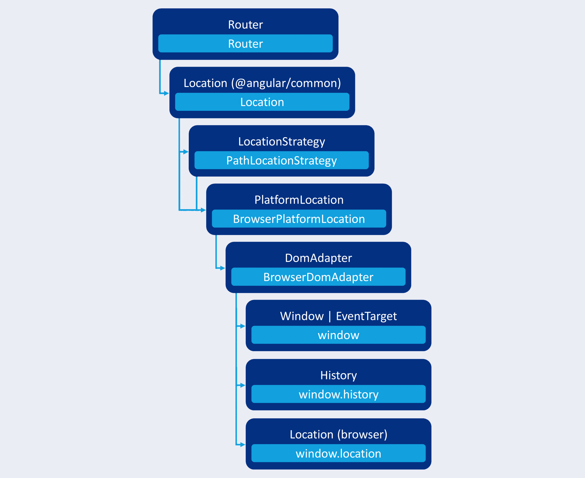
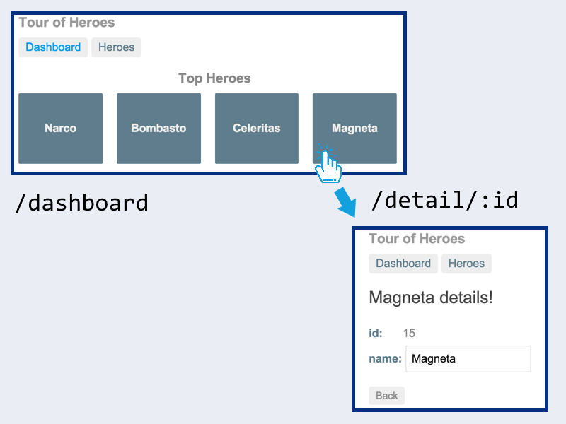
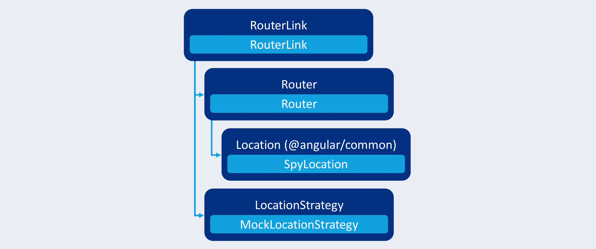

---
{
title: "Testing Angular routing components with the RouterTestingModule",
published: "2020-11-16T20:06:22Z",
edited: "2023-02-08T23:40:30Z",
tags: ["angular", "testing", "router"],
description: "Learn how to implement shallow and integrated routing component tests with the RouterTestingModule. Explore the Location service and its dependencies.",
originalLink: "https://dev.to/this-is-angular/testing-angular-routing-components-with-the-routertestingmodule-4cj0",
coverImage: "cover-image.png",
socialImage: "social-image.png",
collection: "Angular router testing",
order: 1
}
---

*Original cover photo by [Dele Oke](https://unsplash.com/photos/Kg_B2LMPTLs) on Unsplash.*

*Original publication date: 2020-05-25.*

One of the use cases for Angular's `RouterTestingModule` is to test Angular routing components.

An Angular routing component is a component that is used to trigger application navigation. It could be a navigation menu component, a component with one or more `RouterLink` directives, or it could be a component that calls `Router#navigate` or `Router#navigatebyUrl`.

In this article, we're going to explore what the `RouterTestingModule` does and how we can use it to test routing components.


<figcaption>Figure 1. The <em>show hero detail</em> use case.</figcaption>

As a case study, we write routing component tests for the `DashboardComponent` from the Tour of Heroes tutorial on Angular.io. This routing is part of the *show hero detail* use case as shown in Figure 1:

1. The user clicks a top hero in the dashboard.
2. The application navigates to the hero detail.

# Angular's RouterTestingModule

To learn what Angular's `RouterTestingModule` does, we first have to learn about Angular's `Location` service, its dependencies and how it's related to the Angular router.

## What does Angular's Location service do?

Figure 2 illustrates the flow of dependencies from the `Router` service through the `Location` service and all of its dependencies all the way down to the browser APIs.



<figcaption>Figure 2. The dependency hierarchy from the <code>Router</code> service through the <code>Location</code> service and to the browser APIs.</figcaption>

The dark box names the the dependency injection symbol. The inner light box names the dependency that is provided when using the `BrowserModule` and `RouterModule` Angular modules.

The `Router` service subscribes to the `@angular/common` package's `PopStateEvents` which have the interface listed in Listing 1. It uses the `Location` service to be notified of these events.

```ts
interface PopStateEvent {
  pop?: boolean;
  state?: any;
  type?: string;
  url?: string;
}
```

<figcaption>Listing 1. The <code>PopStateEvent</code> interface from <code>@angular/common</code>.</figcaption>

A `PopStateEvent` wraps a native `popstate` or `hashchange` browser event and enriches it with metadata that the Angular router uses to identify which route to activate.

When `Router#navigate` or `Router#navigateByUrl` is called or a `RouterLink` directive is activated, the router figures out which route to activate and uses the `Location` service to replace the browser's history state stack.

From Figure 2 we can tell that the `Location` service itself delegates work to other Angular services. The concrete `LocationStrategy` services are used to decide between path- or hash-based navigation. The concrete `PlatformLocation` interacts with browser APIs to query parts of the URL through the Location API or listen for history stack state changes or hash changes through the History API.

## What does the RouterTestingModule do?

Now that we know the basics of how the `Router` is related to the `Location` service and in turn the browser APIs, we can explore what the `RouterTestingModule` does in terms of dependency injection.


<figcaption>Figure 3. The dependency hierarchy from the <code>Router</code> service to <code>SpyLocation</code> when using the <code>RouterTestingModule</code>.</figcaption>

Believe me, we wouldn't want to create test doubles for all those dependencies in our tests. The router testing Angular module provides a fake location service called `SpyLocation` as illustrated in Figure 3.

Unfortunately, the name is a bit confusing as it doesn't include any test spies. On the other hand it's good that for example no Jasmine spies were used to implement the service as we wouldn't be able to use other testing frameworks than Jasmine if that was the case.

The router testing Angular module also provides a fake version of `LocationStrategy` called `MockLocationStrategy` which we won't discuss further in this article.

You would think that this shouldn't be necessary seeing that `SpyLocation` doesn't depend on a `LocationStrategy` service at all.

However, `RouterLink` depends on `LocationStrategy` as illustrated in Figure 4.


<figcaption>Figure 4. The dependency hierarchy from the <code>RouterLink</code> directive to the <code>SpyLocation</code> and <code>MockLocationStrategy</code> services when using <code>RouterTestingModule</code>.</figcaption>

This dependency probably exists for historical reasons as some of the dependencies listed in Figure 2 were introduced later than the router link directive itself. It should really be depending on the `Location` service rather than the `LocationStrategy` service.

Figure 2 reveals that there's a similar issue with the `Location` service which depends on both the `LocationStrategy` and `PlatformLocation` services.

**Faking the browser APIs**

Why do we need to replace the History API and Location API dependency with a fake? Couldn't we just use the real APIs in our integration tests?

Angular uses Karma out-of-the-box. Karma is a test runner that drives one or more browsers, instruments them and instructs them to load our integration tests.

If we don't use the `RouterTestingModule` for integration tests that involve navigation, the browser would navigate away from the Karma test page. This would fail our entire test suite.

For other test runners and frameworks, the History and Location APIs might not even be available. Because of this, we should prefer the `RouterTestingModule` instead of the `RouterModule` in all of our integration tests.

## What does the SpyLocation service do?

We already learned that `SpyLocation` is a fake implementation of the `Location` service for integration tests that abstracts away certain browser APIs and removes the need for providing fake services to replace `LocationStrategy`, `PlatformLocation`, and `DomAdapter` in tests.

We won't cover the API of the `Location` service itself in this article. As we have learned, it's an abstraction on top of the Location and History browser APIs.

`SpyLocation` has these methods and properties in addition to the public API of `Location`:

- `setBaseHref(url: string): void`
- `setInitialPath(url: string): void`
- `simulateHashChange(pathname: string): void`
- `simulateUrlPop(pathname: string): void`
- `urlChanges: string[]`

I list them here for reference, but we won't discuss them further as they're created specifically for the Angular router's integration tests. In our tests, we should be able to perform the actions we need through the router service, the router link directive and the public API of the `Location` service.

As this is the case, we should have no need to use the `SpyLocation` type in our tests. Instead, we prefer only relying on the interface defined by `Location`'s public API like this:

```ts
import { Location } from '@angular/common';
import { TestBed } from '@angular/core/testing';

describe('MyComponent', () => {
  // (...)

  it('navigates to another route when (...)', () => {
    // The type annotation can be left out as it's inferred
    // from `TestBed.inject`
    const location: Location = TestBed.inject(Location);

    // (...)

    expect(location.path()).toBe('/some/other/route');
  });
});
```

<figcaption>Test case showcasing that we only need to depend on <code>Location</code> , not <code>SpyLocation</code>.</figcaption>

## Providing fake routes

The final piece of the `RouterTestingModule` that we need to learn is that it has a static method for providing routes:

`withRoutes(routes: Routes, config?: ExtraOptions): ModuleWithProviders<RouterTestingModule>`

The static `withRoutes` method has the same signature as `RouterModule.forRoot`. This is not a coincidence. It provides routes and router options for the root level injector.

# Shallow routing component test

The Angular testing guide shows us how to create isolated unit tests around a routing component. The component under test is the `DashboardComponent` from the Tour of Heroes tutorial.

The component model and component template are shown in Listings 2A and 2B.

```html
<!-- dashboard.component.html -->
<h3>Top Heroes</h3>

<div class="grid grid-pad">
  <a
    *ngFor="let hero of heroes"
    class="col-1-4"
    routerLink="/detail/{{hero.id}}"
  >
    <div class="module hero">
      <h4>{{hero.name}}</h4>
    </div>
  </a>
</div>

<app-hero-search></app-hero-search>
```

<figcaption>Listing 2A. The dashboard component template.</figcaption>

```ts
// dashboard.component.ts
import { Component, OnInit } from '@angular/core';

import { Hero } from '../hero';
import { HeroService } from '../hero.service';

@Component({
  selector: 'app-dashboard',
  templateUrl: './dashboard.component.html',
  styleUrls: ['./dashboard.component.css'],
})
export class DashboardComponent implements OnInit {
  heroes: Hero[] = [];

  constructor(private heroService: HeroService) {}

  ngOnInit() {
    this.getHeroes();
  }

  getHeroes(): void {
    this.heroService
      .getHeroes()
      .subscribe(
        heroes => (this.heroes = heroes.slice(1, 5))
      );
  }
}
```

<figcaption>Listing 2B. The dashboard component model.</figcaption>

The dashboard component is a routing component because it uses a router link directive to trigger navigation.

Before we discuss an integration test, let's create a shallow component test that renders the component's view, but not its view children.

## Shallow routing component test utilites

First, we look at the test utilities in Listing 3A.

```ts
// dashboard.component.spec.ts
import {
  Directive,
  HostListener,
  Input,
} from '@angular/core';
import {
  ComponentFixture,
  tick,
} from '@angular/core/testing';
import { By } from '@angular/platform-browser';
import { Router } from '@angular/router';

import { DashboardComponent } from './dashboard.component';

@Directive({
  selector: '[routerLink]',
})
class RouterLinkSpy {
  @Input()
  routerLink = '';

  constructor(private router: Router) {}

  @HostListener('click')
  onClick() {
    this.router.navigateByUrl(this.routerLink);
  }
}

const leftMouseButton = 0;

describe('DashboardComponent (shallow)', () => {
  function advance() {
    tick();
    fixture.detectChanges();
  }

  function clickTopHero() {
    const firstLink = fixture.debugElement.query(By.css('a'));

    firstLink.triggerEventHandler('click', {
      button: leftMouseButton,
    });
  }
});
```

<figcaption>Listing 3A.Test utilities for our shallow routing component tests.</figcaption>

The `advance` function flushes the `NgZone` queues and runs change detection to stabilize the testing environment. As it uses `tick`, it has to be called from within a `fakeAsync`-wrapped function.

The `clickTopHero` function queries for the first link in the component's DOM and then triggers a fake mouse click on it.

The `FakeRouterLink` directive is a router link replacement without other dependencies than `Router#navigateByUrl`. We isolate the component from as many dependencies as possible.

## Shallow routing component test setup

Now let's look at our test setup and variables which are listed in Listing 3B.

```ts
// dashboard.component.spec.ts
import { CUSTOM_ELEMENTS_SCHEMA } from '@angular/core';
import {
  ComponentFixture,
  fakeAsync,
  TestBed,
} from '@angular/core/testing';
import { Router } from '@angular/router';
import { asapScheduler, of } from 'rxjs';
import { observeOn } from 'rxjs/operators';

import { HeroService } from '../hero.service';
import { HEROES } from '../mock-heroes';
import { DashboardComponent } from './dashboard.component';

describe('DashboardComponent (shallow)', () => {
  beforeEach(async () => {
    const fakeService = {
      // [1]
      getHeroes() {
        return of([...HEROES]).pipe(observeOn(asapScheduler));
      },
    } as Partial<HeroService>;
    routerSpy = jasmine.createSpyObj('Router', [
      'navigateByUrl',
    ]); // [2]

    TestBed.configureTestingModule({
      declarations: [
        DashboardComponent, // [3]
        FakeRouterLink, // [3]
      ],
      providers: [
        { provide: HeroService, useValue: fakeService }, // [1]
        { provide: Router, useValue: routerSpy }, // [2]
      ],
      schemas: [CUSTOM_ELEMENTS_SCHEMA], // [4]
    });

    await TestBed.compileComponents();
  });

  beforeEach(fakeAsync(() => {
    fixture = TestBed.createComponent(DashboardComponent);
    component = fixture.componentInstance;
    advance(); // [5]
    advance(); // [6]
  }));

  let component: DashboardComponent;
  let fixture: ComponentFixture<DashboardComponent>;
  let routerSpy: jasmine.SpyObj<Router>;
});
```

<figcaption>Listing 3B.Test setup for our shallow routing component test.</figcaption>

First, we create a fake `HeroService` (1) to supply the dashboard component with fake data. We replace the `Router` service with a simple Jasmine spy object (2).

As this is a shallow component test, we only declare the component itself and the fake router link (3) we discussed a moment ago. We use the `CUSTOM_ELEMENTS_SCHEMA` to enable shallow rendering (4).

The first `advance` call (5) triggers the initial change detection cycle which triggers `OnInit` lifecycle moment. The `ngOnInit` lifecycle hook of the dashboard component reads heroes via the `HeroService`. The second `advance` call (6) waits for the heroes observable to emit a value, then triggers change detection.

Finally, we see the `component` variable for the component instance, the `fixture` variable for the component fixture, and the `routerSpy` variable for a Jasmine spy object that is provided to replace the `Router` service in our test suite.

## Shallow routing component test case

```ts
// dashboard.component.spec.ts
import { fakeAsync } from '@angular/core/testing';

describe('DashboardComponent (shallow)', () => {
  it('navigates to hero detail when a hero link is clicked', fakeAsync(() => {
    const [topHero] = component.heroes;

    clickTopHero(); // [1]
    advance(); // [2]

    const expectedPath = '/detail/' + topHero.id;
    const [actualPath] =
      routerSpy.navigateByUrl.calls.first().args; // [3]
    expect(actualPath).toBe(
      expectedPath,
      'must navigate to the detail view for the top hero'
    );
  }));
});
```

<figcaption>Listing 3C. Test case for our shallow routing component test.</figcaption>

Listing 3C shows the test case that exercises routing for the dashboard component. First, we click the top hero link (1) to trigger navigation, then we wait for the component fixture to stabilize (2).

We query the router spy for the route URL passed to `Router#navigateByUrl` (3). This was done by the `FakeRouterLink` directive. Finally, we assert that the passed route URL matches what we expected.

## Shallow routing component test suite

Listing 4 shows the shallow component routing test suite in its full length for reference.

```ts
// dashboard.component.spec.ts
import {
  CUSTOM_ELEMENTS_SCHEMA,
  Directive,
  HostListener,
  Input,
} from '@angular/core';
import {
  ComponentFixture,
  fakeAsync,
  TestBed,
  tick,
} from '@angular/core/testing';
import { By } from '@angular/platform-browser';
import { Router } from '@angular/router';
import { asapScheduler, of } from 'rxjs';
import { observeOn } from 'rxjs/operators';

import { HeroService } from '../hero.service';
import { HEROES } from '../mock-heroes';
import { DashboardComponent } from './dashboard.component';

@Directive({
  selector: '[routerLink]',
})
class FakeRouterLink {
  @Input()
  routerLink = '';

  constructor(private router: Router) {}

  @HostListener('click')
  onClick() {
    this.router.navigateByUrl(this.routerLink);
  }
}

const leftMouseButton = 0;

describe('DashboardComponent (shallow)', () => {
  function advance() {
    tick();
    fixture.detectChanges();
  }

  function clickTopHero() {
    const firstLink = fixture.debugElement.query(By.css('a'));

    firstLink.triggerEventHandler('click', {
      button: leftMouseButton,
    });
  }

  beforeEach(async () => {
    const fakeService = {
      getHeroes() {
        return of([...HEROES]).pipe(observeOn(asapScheduler));
      },
    } as Partial<HeroService>;
    routerSpy = jasmine.createSpyObj('Router', [
      'navigateByUrl',
    ]);

    TestBed.configureTestingModule({
      declarations: [DashboardComponent, FakeRouterLink],
      providers: [
        { provide: HeroService, useValue: fakeService },
        { provide: Router, useValue: routerSpy },
      ],
      schemas: [CUSTOM_ELEMENTS_SCHEMA],
    });

    await TestBed.compileComponents();
  });

  beforeEach(fakeAsync(() => {
    fixture = TestBed.createComponent(DashboardComponent);
    component = fixture.componentInstance;
    advance();
    advance();
  }));

  let component: DashboardComponent;
  let fixture: ComponentFixture<DashboardComponent>;
  let routerSpy: jasmine.SpyObj<Router>;

  it('navigates to hero detail when a hero link is clicked', fakeAsync(() => {
    const [topHero] = component.heroes;

    clickTopHero();
    advance();

    const expectedPath = '/detail/' + topHero.id;
    const [actualPath] =
      routerSpy.navigateByUrl.calls.first().args;
    expect(actualPath).toBe(
      expectedPath,
      'must navigate to the detail view for the top hero'
    );
  }));
});
```

<figcaption>Listing 4. The shallow routing component test suite for the <code>DashboardComponent</code>.</figcaption>

[The full test suite is available in this Gist](https://gist.github.com/LayZeeDK/e64005b9ce11d864cf084fae5f2b7837#file-dashboard-component-spec-ts).

As a finishing thought on this example, this test case shows us that having route paths hidden inside templates is a code smell. Magic strings in templates force us to have magic strings in tests. This will become even more apparent in the integrated routing component test.

See [Listings 3.1, 3.2, and 3.3 of "Lean Angular components"](https://dev.to/this-is-angular/lean-angular-components-1abl) for a simple example of solving this issue or try out [Routeshub](https://routeshub.gitbook.io/docs/) by [Max Tarsis](https://twitter.com/maktarsis). Routeshub is a route management library that integrates easily with the Angular router.

# Integrated routing component test with the RouterTestingModule

In addition to the shallow routing component test, we want to cover how the dashboard component integrates with its view children and the real `Router` service.

We'll use the `RouterTestingModule` to set up testing routes and replace the `Location` service to abstract away the browser APIs as discussed earlier in this article.

## Integrated routing component test utilities

```ts
// dashboard.component.integration.spec.ts
import { Component, ViewChild } from '@angular/core';
import { tick } from '@angular/core/testing';
import { By } from '@angular/platform-browser';
import { RouterOutlet } from '@angular/router';

@Component({
  template: '<router-outlet></router-outlet>', // [2]
})
class TestRootComponent {
  @ViewChild(RouterOutlet)
  routerOutlet: RouterOutlet; // [3]
}

@Component({
  template: '',
})
class TestHeroDetailComponent {} // [1]

const leftMouseButton = 0;

describe('DashboardComponent (integrated)', () => {
  function advance() {
    tick();
    rootFixture.detectChanges(); // [4]
  }

  function clickTopHero() {
    const firstHeroLink = rootFixture.debugElement.query(
      By.css('a')
    ); // [5]

    rootFixture.ngZone.run(() =>
      // [6]
      firstHeroLink.triggerEventHandler('click', {
        button: leftMouseButton,
      })
    );
  }

  function getActiveComponent<T>(): T {
    return rootComponent.routerOutlet.component as T; // [7]
  }
});
```

<figcaption>Listing 5A. Test utilities for our integrated routing component tests.</figcaption>

Listing 5A shows the test utilities we use for our integrated routing component test of the `DashboardComponent` from the Tour of Heroes tutorial.

As we'll see in a minute, our integrated tests simulates a tiny application in which the only two routed components are our component under test, the dashboard component, and a dummy component (1) which will serve as the target of our routing component.

We'll replace the real `HeroDetailComponent` with `TestHeroDetailComponent` so that we don't have to set up any of its dependencies. What we're exercising here is the routing that is initiated by the user through the dashboard component. Which actual component is targeted by that route URL is not important for the purpose of this test.

If we wanted an integration test that exercised a full use case starting at the dashboard, selecting a top hero and looking up its hero details, we could include the real hero detail component in our test setup. That would actually be a nice behaviour test to include. We could also choose to implement it as and end-to-end test for even more confidence in our application.

To simulate an Angular application, we're going to need a root component. In a real application, this component is conventionally called `AppComponent`. As the test doesn't need it to behave like the actual `AppComponent` of our application, we name it `TestRootComponent` to indicate its purpose – to be the root component of our `ComponentFixture`.

The test root component only has a router outlet in its template (2) which it exposes as a public property (3). We'll discuss why shortly.

The `advance` test utility looks familar, but refers to a variable called `rootFixture` (4) instead of `fixture`. This is because the component fixture in this test suite refers to the test root component, not the component under test.

The `clickTopHero` test utility also looks very similar to the one from our shallow component routing test. However, this version also refers to the `rootFixture` (5).

(6) fixes Angular warnings related to the Angular zone. As [Angular issue #25837](https://github.com/angular/angular/issues/25837) discusses, Angular outputs a warning when we trigger navigation outside of a test case – usually in `beforeEach` hooks.

To address this, we wrap route navigation in a callback (6) which we pass to `NgZone#run` to execute it inside the Angular zone.

The `getActiveComponent` test utility gets the active component through the test root component's router outlet (7).

## Integrated routing component test setup

The test setup in Listing 5B replaces the hero service with the same fake service (1).

```ts
// dashboard.component.integration.spec.ts
import { Location } from '@angular/common';
import {
  ComponentFixture,
  fakeAsync,
  TestBed,
} from '@angular/core/testing';
import { Router } from '@angular/router';
import { RouterTestingModule } from '@angular/router/testing';
import { asapScheduler, of } from 'rxjs';
import { observeOn } from 'rxjs/operators';

import { HeroSearchComponent } from '../hero-search/hero-search.component';
import { HeroService } from '../hero.service';
import { HEROES } from '../mock-heroes';
import { DashboardComponent } from './dashboard.component';

describe('DashboardComponent (integrated)', () => {
  beforeEach(async () => {
    const fakeService = {
      // [1]
      getHeroes() {
        return of([...HEROES]).pipe(observeOn(asapScheduler));
      },
    } as Partial<HeroService>;

    TestBed.configureTestingModule({
      declarations: [
        TestRootComponent, // [2]
        TestHeroDetailComponent, // [2]
        DashboardComponent, // [3]
        HeroSearchComponent, // [3]
      ],
      imports: [
        RouterTestingModule.withRoutes([
          // [5]
          {
            path: '',
            pathMatch: 'full',
            component: DashboardComponent,
          }, // [4]
          {
            path: 'detail/:id',
            component: TestHeroDetailComponent,
          }, // [4]
        ]),
      ],
      providers: [
        { provide: HeroService, useValue: fakeService }, // [1]
      ],
    });

    await TestBed.compileComponents();

    rootFixture = TestBed.createComponent(TestRootComponent); // [6]
    rootComponent = rootFixture.componentInstance; // [6]
    location = TestBed.inject(Location); // [7]
  });

  beforeEach(fakeAsync(() => {
    const router = TestBed.inject(Router);
    rootFixture.ngZone.run(() => router.initialNavigation()); // [8]
    advance(); // [9]
    advance(); // [10]
  }));

  let location: Location;
  let rootComponent: TestRootComponent; // [6]
  let rootFixture: ComponentFixture<TestRootComponent>; // [6]
});
```

<figcaption>Listing 5B.Test setup for our integrated routing component test.</figcaption>

In the Angular testing module, we declare the fake root component and the dummy hero detail component replacement which we discussed before (2). We additionally declare the dashboard component and the `HeroSearchComponent` (3) as it's a view child used in the dashboard component template.

The final part of configuring the Angular testing module is to add fake routes for the dashboard component and the dummy target component (4) by using `RouterTestingModule.withRoutes` (5).

We initialise the `rootFixture` and `rootComponent` variables by calling `TestBed.createComponent(TestRootComponent)` and by getting the `ComponentFixture#componentInstance` property (6).

The `location` variable is initialised by injecting the `Location` service (7) which – as we know – will resolve to the `SpyLocation` service. However, we discussed earlier that we should only depend on the `Location` API in routing component tests.

In the second test case setup hook, we navigate to the default route after initialising the simulated application by calling `Router#initialNavigation` (8). As we learned, we need to wrap this in a callback and pass it to `NgZone#run` to prevent warnings when running this test suite.

As in the shallow component routing test, our first `advance` function call (9) triggers the `OnInit` lifecycle moment and the equivalent lifecycle hook in the dashboard component which resolves data from the hero service.

Our second `advance` function call (10) waits for the heroes observable to emit its first value and then calls changes detection to update the dashboard component's DOM.

## Integrated routing component test case

I know, that was a lot of utilities and setup. Now, let's move on to the test case. Hopefully, our rigorous preparations enable a concise test case.

```ts
// dashboard.component.integration.spec.ts
import { fakeAsync } from '@angular/core/testing';

import { DashboardComponent } from './dashboard.component';

describe('DashboardComponent (integrated)', () => {
  it('navigates to the detail view when a hero link is clicked', fakeAsync(() => {
    const component: DashboardComponent =
      getActiveComponent(); // [1]
    const [topHero] = component.heroes;

    clickTopHero();
    advance();

    const expectedPath = '/detail/' + topHero.id;
    expect(location.path() /* [2] */).toBe(
      expectedPath,
      'must navigate to the detail view for the top hero'
    );
  }));
});
```

<figcaption>Listing 5C. Test case for our integrated routing component test.</figcaption>

The integrated test case in Listing 5C looks surprisingly similar to the shallow test case in Listing 3C with a few exceptions:

1. As the component fixture wraps the `TestRootComponent`, we use the `getActiveComponent` to access the `DashboardComponent`.
2. This time we don't have a `Router` service spy object to ask for arguments to `Router#navigateByUrl`. Instead, we call `Location#path` to see the URL path as it would appear in a browser at runtime.

## Integrated routing component test suite

Listing 6 shows the full test suite for reference.

```ts
// dashboard.component.integration.spec.ts
import { Location } from '@angular/common';
import { Component, ViewChild } from '@angular/core';
import {
  ComponentFixture,
  fakeAsync,
  TestBed,
  tick,
} from '@angular/core/testing';
import { By } from '@angular/platform-browser';
import { Router, RouterOutlet } from '@angular/router';
import { RouterTestingModule } from '@angular/router/testing';
import { asapScheduler, of } from 'rxjs';
import { observeOn } from 'rxjs/operators';

import { HeroSearchComponent } from '../hero-search/hero-search.component';
import { HeroService } from '../hero.service';
import { HEROES } from '../mock-heroes';
import { DashboardComponent } from './dashboard.component';

@Component({
  template: '<router-outlet></router-outlet>',
})
class TestRootComponent {
  @ViewChild(RouterOutlet)
  routerOutlet: RouterOutlet;
}

@Component({
  template: '',
})
class TestHeroDetailComponent {}

const leftMouseButton = 0;

describe('DashboardComponent (integrated)', () => {
  function advance() {
    tick();
    rootFixture.detectChanges();
  }

  function clickTopHero() {
    const firstHeroLink = rootFixture.debugElement.query(
      By.css('a')
    );

    rootFixture.ngZone.run(() =>
      firstHeroLink.triggerEventHandler('click', {
        button: leftMouseButton,
      })
    );
  }

  function getActiveComponent<T>(): T {
    return rootComponent.routerOutlet.component as T;
  }

  beforeEach(async () => {
    const fakeService = {
      getHeroes() {
        return of([...HEROES]).pipe(observeOn(asapScheduler));
      },
    } as Partial<HeroService>;

    TestBed.configureTestingModule({
      declarations: [
        TestRootComponent,
        TestHeroDetailComponent,
        DashboardComponent,
        HeroSearchComponent,
      ],
      imports: [
        RouterTestingModule.withRoutes([
          {
            path: '',
            pathMatch: 'full',
            component: DashboardComponent,
          },
          {
            path: 'detail/:id',
            component: TestHeroDetailComponent,
          }, // [1]
        ]),
      ],
      providers: [
        { provide: HeroService, useValue: fakeService },
      ],
    });

    await TestBed.compileComponents();

    rootFixture = TestBed.createComponent(TestRootComponent);
    rootComponent = rootFixture.componentInstance;
    location = TestBed.inject(Location);
  });

  beforeEach(fakeAsync(() => {
    const router = TestBed.inject(Router);
    rootFixture.ngZone.run(() => router.initialNavigation());
    advance();
    advance();
  }));

  let location: Location;
  let rootComponent: TestRootComponent;
  let rootFixture: ComponentFixture<TestRootComponent>;

  it('navigates to the detail view when a hero link is clicked', fakeAsync(() => {
    const component: DashboardComponent =
      getActiveComponent();
    const [topHero] = component.heroes;

    clickTopHero();
    advance();

    const expectedPath = '/detail/' + topHero.id; // [2]
    expect(location.path()).toBe(
      expectedPath,
      'must navigate to the detail view for the top hero'
    );
  }));
});
```

<figcaption>Integrated routing component test suite.</figcaption>

Like in the shallow routing component test, we see magic strings in use, representing the hero detail route, but this time in two places:

1. Our fake target route has to match the route URL specified in the dashboard component template.
2. As in the shallow routing component test, the expected path in our test case also has to match the one specified in the dashboard component template.

[The full test suite is available in this Gist](https://gist.github.com/LayZeeDK/e64005b9ce11d864cf084fae5f2b7837#file-dashboard-component-integration-spec-ts).

# Conclusion

I hope that you enjoyed learning about how the `Router` interacts with the browser through a series of dependencies, starting with the `Location` service.

We discussed how to test a routing component both by using a shallow component test and an integrated component test approach. Both can be useful, so we don't necessarily have to pick one over the other. If we have to choose, I would prefer an integration routing component test as it covers more ground, gives a higher level of confidence and requires less custom test doubles.

What did we test in our routing component test suite?



<figcaption>Figure 1 (repeated). The <em>show hero detail</em> use case.</figcaption>

We tested the *show hero detail* use case from the dashboard: When the user clicks a top hero in the dashboard, the application navigates to the hero detail.

Let's finish by summing up what we learned about all of these topics.

## Shallow routing component test

When testing an Angular routing component, we can create a shallow component test which doesn't need routing as it renders our component under test as the root component.

For shallow routing component tests, we need to create a spy object representing the `Router` service. We also isolate our component from data services by replacing them with fake services.

In shallow routing component tests, we use the test bed and a component fixture to test as a user by clicking the component DOM which triggers navigation to a different route. To verify this navigation, we ask our router spy for arguments passed to it.

## Integrated routing component test

Instead of – or in addition to – a shallow routing component test, we can create an integrated routing component test.

In an integrated routing component test, we simulate an Angular application by creating a fake root component with a primary router outlet which we can use to access the active component at any given time during our test case.

In addition to the fake root component, we declare the component under test, its view child components and a dummy component to replace our route target.

We use `RouterTestingModule.withRoutes` to add a default route to our component under test and a target route to the dummy component we declared. This target route must match the route passed to a router link directive or `Router#navigateByUrl`.

We use the component fixture's debug element to query for an element and activate it to trigger navigation.

After waiting for navigation to finish, we use `Location#path` to query for the path as it would appear in a browser's URL address bar. Finally, we compare this to the expected target route.

## The RouterTestingModule

We learned how Angular's `Location` service and its dependencies abstract away the Location and History APIs as well as native `popstate` and `hashchange` events.


<figcaption>Figure 3 (repeated). The dependency hierarchy from the <code>Router</code> service to <code>SpyLocation</code> when using the <code>RouterTestingModule</code>.</figcaption>

As seen in Figure 3, the `RouterTestingModule` replaces Angular's `Location` service with the `SpyLocation` service. This prevents tests from trying to navigate which is problematic when using the Karma test runner or a test environment that doesn't have all browser APIs.

For the purpose of routing component tests, we don't need the extra properties and methods introduced by `SpyLocation`. This is proven in that we keep the `Location` type when resolving a `SpyLocation` service instance from the `Location` dependency injection symbol.

The additional `SpyLocation` API should only be required for the `Router`'s own test suite.



<figcaption>Figure 4 (repeated). The dependency hierarchy from the <code>RouterLink</code> directive to the <code>SpyLocation</code> and <code>MockLocationStrategy</code> services when using <code>RouterTestingModule</code>.</figcaption>

Figure 4 illustrates the need for the `RouterTestingModule` to provide `MockLocationStrategy` for the `LocationStrategy` dependency injection symbol. This is the case as the `RouterLink` directive depends on `LocationStrategy#prepareExternalUrl` instead of `Location#prepareExternalUrl` – probably for historical reasons.

# Thank you

Thank you for reading. I appreciate your support! It's been my pleasure to educate you. I learned a lot myself while preparing this article.

# Related articles

Continue learning about the `RouterTestingModule` and how it's used to test routed Angular components in "[Testing routed Angular components with the RouterTestingModule](https://dev.to/this-is-angular/testing-routed-angular-components-with-the-routertestingmodule-1791)".

Learn how to fake routing data and stub services to test Angular route guards in isolation as well as how to verify them in practice using the `RouterTestingModule` in "[Testing Angular route guards with the RouterTestingModule](https://dev.to/this-is-angular/testing-angular-route-guards-with-the-routertestingmodule-45c9)".

# Reviewers

The peer reviewers for this article include:

- [Santosh Yadav](https://dev.to/santoshyadav198613)
- [Tim Deschryver](https://dev.to/timdeschryver)

Thank you, friends!
