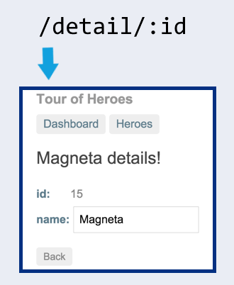

---
{
title: "Testing routed Angular components with the RouterTestingModule",
published: "2020-11-16T21:05:34Z",
edited: "2023-02-08T21:23:18Z",
tags: ["angular", "testing", "router"],
description: "Learn how to stub the ActivatedRoute for shallow routed component tests. Also learn to use the RouterTestingModule for integrated routed component tests.",
originalLink: "https://dev.to/this-is-angular/testing-routed-angular-components-with-the-routertestingmodule-1791",
coverImage: "cover-image.png",
socialImage: "social-image.png",
collection: "21775",
order: 1
}
---

*Original cover photo by [PublicDomainPictures](https://pixabay.com/photos/test-tube-lab-medical-research-214185/) on Pixabay.*

*Original publication date: 2020-06-02.*

Angular's `RouterTestingModule` can be used to test routed Angular components.

A *routed component* is a component which is the target of a navigation in that it's part of a configured route. They could be page components, shell components, layout components, dialogs, or nested components.

Some routed Angular components rely on dynamic route parameters such as our use case today, the hero detail component from the Tour of Heroes tutorial on Angular.io.

Routed components are usually dynamically rendered by a primary router outlet, but others might have routes configured for auxiliary router outlets such as a `popup` or `drawer` named router outlet.

Today, we're first going to walk through well-structured example of a shallow routed component test which is isolated from services and routing.

Then we'll create an integrated routed component test using the router testing Angular module. To understand what the `RouterTestingModule` does, refer to "[Testing Angular routing components with the RouterTestingModule](https://indepth.dev/testing-angular-routing-components-with-the-routertestingmodule/#angular-s-routertestingmodule)".

 *Figure 1. Navigation to the `HeroDetailComponent`.*

Our case study is routed component test suites for the `HeroDetailComponent` from the Tour of Heroes tutorial on Angular.io. Figure 1 illustrated that when navigation to the dynamic `/detail/:id` route is triggered, the hero detail component is rendered with the name of the relevant hero in its title.

What happens is this:

1. Navigation is triggered from some routing component. *Which* routing component is out of scope for this test suite.
2. The hero detail component needs to load the hero data based on the specified `id` route parameter.
3. The hero name is displayed in the hero detail component's title element.

Now, let's get started!

# Shallow routed component test

The Angular testing guide explains how to implement isolated unit tests around a routed component. Our component under test is the `HeroDetailComponent` from the Tour of Heroes tutorial.

You can review the model and template of the component in Listings 1A and 1B.

```html
<!-- hero-detail.component.html -->
<div *ngIf="hero">
  <h2>
    {{hero.name | uppercase}} Details
  </h2>

  <div>
    <span>id:</span>
    {{hero.id}}
  </div>

  <div>
    <label>
      name:
      <input [(ngModel)]="hero.name" placeholder="name" />
    </label>
  </div>

  <button (click)="goBack()">go back</button>

  <button (click)="save()">save</button>
</div>
```

```ts
// hero-detail.component.ts
import { Location } from '@angular/common';
import { Component, Input, OnInit } from '@angular/core';
import { ActivatedRoute } from '@angular/router';

import { Hero } from '../hero';
import { HeroService } from '../hero.service';

@Component({
  selector: 'app-hero-detail',
  styleUrls: ['./hero-detail.component.css'],
  templateUrl: './hero-detail.component.html',
})
export class HeroDetailComponent implements OnInit {
  @Input() hero: Hero;

  constructor(private route: ActivatedRoute, private heroService: HeroService, private location: Location) {}

  ngOnInit(): void {
    this.getHero();
  }

  getHero(): void {
    const id = +this.route.snapshot.paramMap.get('id');

    this.heroService.getHero(id).subscribe((hero) => (this.hero = hero));
  }

  goBack(): void {
    this.location.back();
  }

  save(): void {
    this.heroService.updateHero(this.hero).subscribe(() => this.goBack());
  }
}
```

*Listing 1B. The hero detail component model.*

The hero detail component is a routed component as it has a configured route which can be seen in Listing 2.

```ts
// app-routing.module.ts
const routes: Routes = [
  { path: '', redirectTo: '/dashboard', pathMatch: 'full' },
  { path: 'dashboard', component: DashboardComponent },
  { path: 'detail/:id', component: HeroDetailComponent }, // 👈
  { path: 'heroes', component: HeroesComponent },
];
```

*Listing 2. The routes which are declared in the `AppRoutingModule` of the Tour of Heroes tutorial.*

Let's begin by creating an isolated component test. We'll create a shallow component test for the `HeroDetailComponent`. It's shallow because we intentionally don't render all or any child components.

Our component under test doesn't have any child components at this point, but the strategy and techniques used are the same as if it had child components which means that we can more easily refactor it into multiple components as it grows, without breaking this test case.

## Shallow routed component test utilities[](https://indepth.dev/testing-routed-angular-components-with-the-routertestingmodule#shallow-routed-component-test-utilities)

Starting out, let's walk through the test utilities in Listing 3A.

```ts
// hero-detail.component.spec.ts
import { By } from '@angular/platform-browser';
import { ActivatedRoute, ActivatedRouteSnapshot, convertToParamMap, ParamMap, Params } from '@angular/router';
import { ReplaySubject } from 'rxjs';

class ActivatedRouteStub implements Partial<ActivatedRoute> {
  private _paramMap: ParamMap;
  private subject = new ReplaySubject<ParamMap>();

  paramMap = this.subject.asObservable();
  get snapshot(): ActivatedRouteSnapshot {
    const snapshot: Partial<ActivatedRouteSnapshot> = {
      paramMap: this._paramMap,
    };

    return snapshot as ActivatedRouteSnapshot;
  }

  constructor(initialParams?: Params) {
    this.setParamMap(initialParams);
  }

  setParamMap(params?: Params) {
    const paramMap = convertToParamMap(params);
    this._paramMap = paramMap;
    this.subject.next(paramMap);
  }
}

describe('HeroDetailComponent (shallow)', () => {
  function getTitle() {
    const element = fixture.debugElement.query(By.css('h2')).nativeElement as HTMLElement;

    return element.textContent.trim();
  }

  function navigateByHeroId(id: number) {
    routeStub.setParamMap({ id });
  }
});
```

*Listing 3A. Test utilities for the shallow routed component test.*

The `getTitle` function returns the text content of the heading in the hero detail component by querying its debug element and accessing the native element.

The `navigateByHeroId` function sets the `id` route parameter on the activated route stub to simulate a route change.

I took the `ActivatedRouteStub` from [the official Angular testing guide](https://angular.io/guide/testing#activatedroutestub), but extended it to support route snapshots with the `snapshot` property getter.

These are all the test utilities we need for this test case.

## Shallow routed component test setup

Next up is the test setup and variables for our routed component test. Take a look at Listing 3B.

```ts
// hero-detail.component.spec.ts
import { CUSTOM_ELEMENTS_SCHEMA } from '@angular/core';
import { ComponentFixture, TestBed } from '@angular/core/testing';
import { FormsModule } from '@angular/forms';
import { ActivatedRoute } from '@angular/router';
import { of } from 'rxjs';

import { Hero } from '../hero';
import { HeroService } from '../hero.service';
import { HEROES } from '../mock-heroes';
import { HeroDetailComponent } from './hero-detail.component';

describe('HeroDetailComponent (shallow)', () => {
  beforeEach(async () => {
    const fakeService = {
      // [1]
      getHero(id: number) {
        const hero = [...fakeHeroes].find((h) => h.id === id);

        return of(hero);
      },
    } as Partial<HeroService>;
    routeStub = new ActivatedRouteStub(); // [2]

    TestBed.configureTestingModule({
      declarations: [HeroDetailComponent], // [3]
      imports: [FormsModule], // [4]
      providers: [
        { provide: ActivatedRoute, useValue: routeStub }, // [2]
        { provide: HeroService, useValue: fakeService }, // [1]
      ],
      schemas: [CUSTOM_ELEMENTS_SCHEMA], // [5]
    });

    await TestBed.compileComponents();
  });

  beforeEach(() => {
    fixture = TestBed.createComponent(HeroDetailComponent);
    component = fixture.componentInstance;
  });

  let component: HeroDetailComponent;
  const fakeHeroes: ReadonlyArray<Hero> = [...HEROES];
  let fixture: ComponentFixture<HeroDetailComponent>;
  let routeStub: ActivatedRouteStub;
});
```

*Listing 3B. Test setup for the shallow routed component test.*

First we create a fake `HeroService` (1) to load data for a specific hero based on an ID. We replace the `ActivatedRoute` service with a stub.

We declare the component under test (3) and the `FormsModule` (4) to be able to render its component template. We use the `CUSTOM_ELEMENTS_SCHEMA` (5) to prevent rendering of view child components.

We'll use the `fakeHeroes` variable directly in the test case as it holds the same data as used for the fake hero service. The `fixture` variable is a reference to the component fixture for the hero detail component. Finally, we store a reference to the `routeStub` which we will use to simulate routing parameters.

## Shallow routed component test case

The test case in Listing 3C exercises the behaviour of our component in the happy path scenario, that is a valid hero ID is passed as a route parameter.

```ts
// hero-detail.component.spec.ts
describe('HeroDetailComponent (shallow)', () => {
  it("displays the hero's name in upper-case letters", () => {
    const [expectedHero] = fakeHeroes;

    navigateByHeroId(expectedHero.id); // [1]
    fixture.detectChanges(); // [2]

    expect(getTitle()).toContain(expectedHero.name.toUpperCase()); // [3]
  });
});
```

*Listing 3C. The test case for our shallow routed component test.*

First, we simulate navigation to a route with a valid hero ID (1). Then we trigger change detection (2) to let our component update the DOM. Remember that the `navigateByHeroId` test utility stubs a parameter in the activated route stub.

Finally, we query for the title and expect it to contain the hero name in upper-case letters (3).

## Shallow routed component test suite

The full shallow routed component test suite is shown in full length in Listing 4 for reference.

```ts
// hero-detail.component.spec.ts
import { CUSTOM_ELEMENTS_SCHEMA } from '@angular/core';
import { ComponentFixture, TestBed } from '@angular/core/testing';
import { FormsModule } from '@angular/forms';
import { By } from '@angular/platform-browser';
import { ActivatedRoute, ActivatedRouteSnapshot, convertToParamMap, ParamMap, Params } from '@angular/router';
import { of, ReplaySubject } from 'rxjs';

import { Hero } from '../hero';
import { HeroService } from '../hero.service';
import { HEROES } from '../mock-heroes';
import { HeroDetailComponent } from './hero-detail.component';

class ActivatedRouteStub implements Partial<ActivatedRoute> {
  private _paramMap: ParamMap;
  private subject = new ReplaySubject<ParamMap>();

  paramMap = this.subject.asObservable();
  get snapshot(): ActivatedRouteSnapshot {
    const snapshot: Partial<ActivatedRouteSnapshot> = {
      paramMap: this._paramMap,
    };

    return snapshot as ActivatedRouteSnapshot;
  }

  constructor(initialParams?: Params) {
    this.setParamMap(initialParams);
  }

  setParamMap(params?: Params) {
    const paramMap = convertToParamMap(params);
    this._paramMap = paramMap;
    this.subject.next(paramMap);
  }
}

describe('HeroDetailComponent (shallow)', () => {
  function getTitle() {
    const element = fixture.debugElement.query(By.css('h2')).nativeElement as HTMLElement;

    return element.textContent.trim();
  }

  function navigateByHeroId(id: number) {
    routeStub.setParamMap({ id });
  }

  beforeEach(async () => {
    const fakeService = {
      getHero(id: number) {
        const hero = [...fakeHeroes].find((h) => h.id === id);

        return of(hero);
      },
    } as Partial<HeroService>;
    routeStub = new ActivatedRouteStub();

    TestBed.configureTestingModule({
      declarations: [HeroDetailComponent],
      imports: [FormsModule],
      providers: [
        { provide: ActivatedRoute, useValue: routeStub },
        { provide: HeroService, useValue: fakeService },
      ],
      schemas: [CUSTOM_ELEMENTS_SCHEMA],
    });

    await TestBed.compileComponents();
  });

  beforeEach(() => {
    fixture = TestBed.createComponent(HeroDetailComponent);
    component = fixture.componentInstance;
  });

  let component: HeroDetailComponent;
  const fakeHeroes: ReadonlyArray<Hero> = [...HEROES];
  let fixture: ComponentFixture<HeroDetailComponent>;
  let routeStub: ActivatedRouteStub;

  it("displays the hero's name in upper-case letters", () => {
    const [expectedHero] = fakeHeroes;

    navigateByHeroId(expectedHero.id);
    fixture.detectChanges();

    expect(getTitle()).toContain(expectedHero.name.toUpperCase());
  });
});
```

*Listing 4. The shallow routed component test suite for the `HeroDetailComponent`.*

[The full test suite is available in this Gist](https://gist.github.com/LayZeeDK/222eb704349c80d6d8d7885e934d9159).

This was a simple happy path test case. We could additionally add test cases that demonstrate what happens when the specified hero ID doesn't exist, is empty or otherwise invalid. This is left as an exercise for you.

# Integrated routed component test with the RouterTestingModule

To get a higher level of confidence, we'll exercise how the `HeroDetailComponent` integrates with a real `ActivatedRoute` service and in-memory stubs of services related to routing.

We'll use the `RouterTestingModule` to set up a testing route and replace the `Location` service to abstract away browser APIs as explained in "[Testing Angular routing components with the RouterTestingModule](https://indepth.dev/testing-angular-routing-components-with-the-routertestingmodule/#angular-s-routertestingmodule)".

## Integrated routed component test utilities

In Listing 5A, we see the test utilities required for our routed component test of the `HeroDetailComponent` from the Tour of Heroes tutorial.

```ts
// hero-detail.component.integration.spec.ts
import { Component } from '@angular/core';
import { tick } from '@angular/core/testing';
import { By } from '@angular/platform-browser';

@Component({
  template: '<router-outlet></router-outlet>', // [1]
})
class TestRootComponent {}

describe('HeroDetailComponent (integrated)', () => {
  function advance() {
    tick();
    rootFixture.detectChanges();
  }

  function getTitle() {
    const element = rootFixture.debugElement.query(By.css('h2')).nativeElement as HTMLElement;

    return element.textContent.trim();
  }

  function navigateByHeroId(id: number) {
    rootFixture.ngZone.run(() => router.navigate(['detail', id]));
  }
});
```

*Listing 5A. Test utilities for the integrated routed component test.*

We will soon see that our integrated test is simulating a tiny application with a single route for our component. The test root component has a router outlet (1) which will render our component once it's configured in a test route. The `TestRootComponent` is simulating what's commonly named the `AppComponent`.

What we're exercising here is our application's behaviour when a navigation to the hero detail component happens. In this test case, we're not interested in knowing which routing component triggered the navigation.

If we wanted to implement an integration test that exercise a full use case starting at the `DashboardComponent` and clicking a hero link to navigate to the hero detail, we would add a default route for the dashboard component and click a hero link by first querying for and accessing a debug element through the root component fixture.

This would be an excellent behaviour test to include. Refer to "[Testing Angular routing components with the RouterTestingModule](https://indepth-dev/testing-angular-routing-components-with-the-routertestingmodule/)" for implementation details on how to do most of this. We could even add an end-to-end test for even more confidence in our application at runtime.

The `advance` function flushes the `NgZone` task queues and runs change detection to stabilize the testing environment. As it uses `tick`, it has to be called from within a `fakeAsync`-wrapped function.

The `getTitle` test utility function is exactly the same as in the shallow routed component test, except it refers to a `rootFixture` variable now. The component fixture in this test suite refers to the `TestRootComponent`, not the component under test.

The `navigateByHeroId` function uses the provided `Router` service to navigate to the `detail/:id` route path, replacing the route parameter with the specified ID. The `NgZone#run`-wrapped callback fixes Angular warnings related to the Angular zone.

As [Angular issue #25837](https://github.com/angular/angular/issues/25837) discusses, Angular outputs a warning when we trigger navigation outside of a test case – usually in `beforeEach` hooks. Our callback is executed inside the Angular zone to prevent this warning even though it doesn't matter in tests.

## Integrated routed component test setup

Listing 5B shows how we provide the same fake hero service (1) as in the shallow routed component test.

```ts
// hero-detail.component.integration.spec.ts
import { ComponentFixture, TestBed } from '@angular/core/testing';
import { FormsModule } from '@angular/forms';
import { Router } from '@angular/router';
import { RouterTestingModule } from '@angular/router/testing';
import { of } from 'rxjs';

import { Hero } from '../hero';
import { HeroService } from '../hero.service';
import { HEROES } from '../mock-heroes';
import { HeroDetailComponent } from './hero-detail.component';

describe('HeroDetailComponent (integrated)', () => {
  beforeEach(async () => {
    const fakeService = {
      // [1]
      getHero(id: number) {
        const hero = [...fakeHeroes].find((h) => h.id === id);

        return of(hero);
      },
    } as Partial<HeroService>;

    TestBed.configureTestingModule({
      declarations: [
        TestRootComponent, // [3]
        HeroDetailComponent, // [2]
      ],
      imports: [
        RouterTestingModule.withRoutes([
          // [6]
          { path: 'detail/:id', component: HeroDetailComponent }, // [5]
        ]),
        FormsModule, // [7]
      ],
      providers: [
        { provide: HeroService, useValue: fakeService }, // [1]
      ],
    });

    await TestBed.compileComponents();

    rootFixture = TestBed.createComponent(TestRootComponent); // [4]
    router = TestBed.inject(Router); // [8]
  });

  const fakeHeroes: ReadonlyArray<Hero> = [...HEROES]; // [9]
  let router: Router; // [8]
  let rootFixture: ComponentFixture<TestRootComponent>; // [4]
});
```

*Listing 5B. Test setup for our integrated routed component test.*

We configure the Angular testing module by our component under test (2), the `HeroDetailComponent`.

We also declare the fake root component (3) which is the component that our component fixture will wrap (4). The `TestRootComponent` has a router outlet that will render the component under test as soon as the test route (5) targets it.

We use the `RouterTestingModule#withRoutes` to set up the test route, the `Router` service and a fake `Location` service. (6)

Like in our shallow routed component test, we import the `FormsModule` (7) to render the form directives in our component template. The `CommonModule` is automatically added by the Angular testing module.

After creating the component fixture, we store a reference to the provided `Router` service in the `router` variable (8) which is used by the `navigateByHeroId` test utility function.

Finally, we have the `fakeHeroes` variable (9) similar to the shallow routed component test setup. We will use this variable to get the ID of a hero which the fake hero service can resolve.

Note that we didn't perform any initial navigation as the scope of our test case is limited to what happens when and after navigating to the hero detail. It doesn't include the routing component that triggers the navigation.

As there's no initial navigation, we don't have to call `advance` in our setup to let the component fixture and the following change detection cycle settle.

The test setup is not too bad. We isolate at the data service level by providing a fake `HeroService` and at the browser API level by using the `RouterTestingModule`.

If our component under test had view child components, we might also declare them as part of this test setup to integrate more software artifacts and raise the level of confidence this test gives us.

The final place of isolation is the amount of routes involved in this test suite. As discussed, we only have a test route for the hero detail component, but we could choose to include a routing component as well.

## Integrated routed component test case

After discussing every piece of the test setup, let's move on to the test case. Hopefully, our tenacious test environment allows us to have a very terse test case.

```ts
// hero-detail.component.integration.spec.ts
import { fakeAsync } from '@angular/core/testing';

describe('HeroDetailComponent (integrated)', () =>
    it("displays the hero's name in upper-case letters", fakeAsync(() => {
    const [expectedHero] = fakeHeroes;

    navigateByHeroId(expectedHero.id); // [2]
    advance(); // [1]

    expect(getTitle()).toContain(expectedHero.name.toUpperCase());
    }));
});
```

*Listing 5C. The test case of our integrated routed component test.*

The integrated test case in Listing 5C looks very similar to our shallow routed component test case, except we have to use the `advance` test utility function (1).

This is because our test is integrated with real or fake services used for routing and navigation rather than an activated route stub. We're now exercising how the hero detail component reacts to a the real `ActivatedRoute` service.

In this test suite, we also use the real `Router` service to navigate to a hero detail route, but this is abstracted away in the `navigateByHeroId` test utility (2).

## Integrated routed component test suite

For reference, we the full integrated routed component test suite is shown in Listing 6.

```ts
// hero-detail.component.integration.spec.ts
import { Component } from '@angular/core';
import { ComponentFixture, fakeAsync, TestBed, tick } from '@angular/core/testing';
import { FormsModule } from '@angular/forms';
import { By } from '@angular/platform-browser';
import { Router } from '@angular/router';
import { RouterTestingModule } from '@angular/router/testing';
import { of } from 'rxjs';

import { Hero } from '../hero';
import { HeroService } from '../hero.service';
import { HEROES } from '../mock-heroes';
import { HeroDetailComponent } from './hero-detail.component';

@Component({
  template: '<router-outlet></router-outlet>',
})
class TestRootComponent {}

describe('HeroDetailComponent (integrated)', () => {
  function advance() {
    tick();
    rootFixture.detectChanges();
  }

  function getTitle() {
    const element = rootFixture.debugElement.query(By.css('h2')).nativeElement as HTMLElement;

    return element.textContent.trim();
  }

  function navigateByHeroId(id: number) {
    rootFixture.ngZone.run(() => router.navigate(['detail', id])); // [1] [2]
  }

  beforeEach(async () => {
    const fakeService = {
      getHero(id: number) {
        const hero = [...fakeHeroes].find((h) => h.id === id);

        return of(hero);
      },
    } as Partial<HeroService>;

    TestBed.configureTestingModule({
      declarations: [TestRootComponent, HeroDetailComponent],
      imports: [
        RouterTestingModule.withRoutes([
          { path: 'detail/:id', component: HeroDetailComponent }, // [2]
        ]),
        FormsModule,
      ],
      providers: [{ provide: HeroService, useValue: fakeService }],
    });

    await TestBed.compileComponents();

    rootFixture = TestBed.createComponent(TestRootComponent);
    router = TestBed.inject(Router);
  });

  const fakeHeroes: ReadonlyArray<Hero> = [...HEROES];
  let router: Router;
  let rootFixture: ComponentFixture<TestRootComponent>;

  it("displays the hero's name in upper-case letters", fakeAsync(() => {
    const [expectedHero] = fakeHeroes;

    navigateByHeroId(expectedHero.id);
    advance();

    expect(getTitle()).toContain(expectedHero.name.toUpperCase());
  }));
});
```

*Listing 6. The integrated routed component test suite.*

Notice again that we're using the real `Router` service to navigate to a `/detail/:id` route (1) and that this is done within the Angular zone.

The route paths and URL segments in (2) might seem like magic strings, but in fact we could have used any test route path as long as it had a dynamic `:id` route parameter.

Our test route happened to match the real one used in the Tour of Heroes application, but this is coincidental, not intentional. If we wanted to have an even higher level of integration, we need to store the hero detail route path in a place that we can access both in tests, at compile time and at runtime.

See [Listings 3.1, 3.2, and 3.3 of "Lean Angular components"](https://indepth.dev/lean-angular-components/#case-study-lean-cart-component) for a simple example of solving this issue or try out [Routeshub](https://routeshub.gitbook.io/docs/) by [Max Tarsis](https://twitter.com/maktarsis). Routeshub is a route management library that integrates easily with the Angular router.

[The full test suite is available in this Gist](https://gist.github.com/LayZeeDK/3e80b507b31089da1bc9b5db07c1519f).

# Conclusion

We have test suites exercising what we would think is very simple runtime behaviour. Even though what we're verifying seems simple, a decent amount of test setup and utilities is required to allow concise test cases.

What did we test in our routed component test suite?

 *Figure 1 (repeated). Navigation to the `HeroDetailComponent`.*

We verified that the hero's name is displayed in the component title when we navigate to the hero detail route.

I briefly mentioned that the router testing Angular module abstracts navigation-related browser APIs away through fake services, but that it allows us to use the real `Router` service. However, I didn't mention that the `RouterTestingModule` also prevents Karma from navigating away from the Karma test page and adds support for test runners without browser APIs such as the History and Location APIs.

We can remove the need for navigating through the `Router` service if we scope our integrated routed component test to include the routing component which triggers navigation to our component under test.

With the increased scope, we add the routing component to the default test route and use the `Router#initialNavigation` method to set our starting point.

The `RouterTestingModule` not only allows us to integrated our tests with the real `Router` service. More importantly for the test case used as a case study in this article, it enables our tests to exercise our component interacting with the real `ActivatedRoute` service.

An interesting point about the `HeroDetailComponent` is that it's both a routed component and a routing component. We've seen that it's the target of a dynamic route, but it also uses the `Location` service to navigate back to the `DashboardComponent` in the Tour of Heroes application which makes it a routing component.

If you'd like to test this behaviour as well, follow the techniques demonstrated in "[Testing Angular routing components with the RouterTestingModule](https://dev.to/this-is-angular/testing-angular-routing-components-with-the-routertestingmodule-4cj0)".

# Thank you

Finally, I would like to extend a big thank you to **you**! Your interest in my previous article, "[Testing Angular routing components with the RouterTestingModule](https://dev.to/this-is-angular/testing-angular-routing-components-with-the-routertestingmodule-4cj0)", ignited my interest in exploring the `RouterTestingModule` further.

# Related articles

Learn about the `RouterTestingModule` and how to test routing components in "[Testing Angular routing components with the RouterTestingModule](https://dev.to/this-is-angular/testing-angular-routing-components-with-the-routertestingmodule-4cj0)".

Learn how to fake routing data and stub services to test Angular route guards in isolation as well as how to verify them in practice using the `RouterTestingModule` in "[Testing Angular route guards with the RouterTestingModule](https://dev.to/this-is-angular/testing-angular-route-guards-with-the-routertestingmodule-45c9)".
