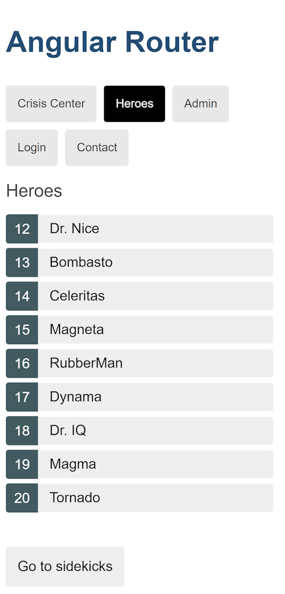
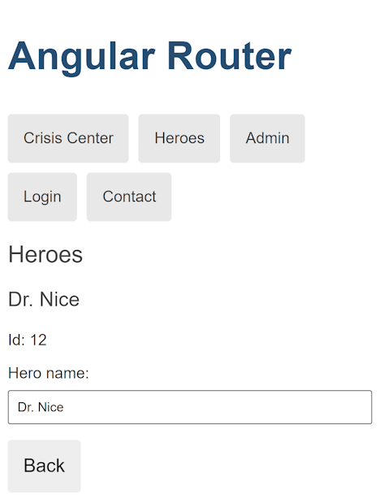

---
{
title: "Testing routed components with RouterTestingHarness",
published: "2023-12-07T00:00:00Z",
edited: "2023-12-12T11:48:42Z",
tags: ["angular", "router", "testing"],
description: "RouterTestingHarness uses the actual Angular Router API in our routed component tests.",
originalLink: "https://dev.to/playfulprogramming-angular/testing-routed-components-with-routertestingharness-22dl",
coverImg: "cover-image.png",
socialImg: "social-image.png",
collection: "Angular router testing",
order: 5
}
---

*Cover art by Microsoft Designer.*

[Since 2017](https://github.com/angular/angular/issues/15779), Angular documentation has offered little advice on testing routing components, routed components, routes, and route guards other than to create partial and brittle [`ActivatedRoute`](https://angular.dev/api/router/ActivatedRoute) and [`Router`](https://angular.dev/api/router/Router) test doubles.

While [`RouterTestingModule`](https://angular.dev/api/router/testing/RouterTestingModule)—recently replacable using the equivalent standalone APIs, [`provideRouter`](https://angular.dev/api/router/provideRouter) and [`provideLocationMocks`](https://angular.dev/api/common/testing/provideLocationMocks)—has been available since Angular version 2, documentation has been lacking at best.

In February 2023, Angular version 15.2 introduced [`RouterTestingHarness`](https://angular.dev/api/router/testing/RouterTestingHarness), the out-of-the-box experience for solving this 6 year old testing pain. The [`RouterTestingHarness`](https://angular.dev/api/router/testing/RouterTestingHarness) sets up a testing root component with a [`RouterOutlet`](https://angular.dev/api/router/RouterOutlet) and uses the actual Angular Router API in our component tests.



In this article, we test and use parts of Angular.io's [Tour of Heroes router tutorial](https://angular.io/guide/router-tutorial-toh).

To use the [`RouterTestingHarness`](https://angular.dev/api/router/testing/RouterTestingHarness), we first set up a test for a routing component or routed component using [`provideRouter`](https://angular.dev/api/router/provideRouter) as we would set up any standalone Angular application or feature.

```typescript
TestBed.configureTestingModule({
  providers: [
    provideRouter([
      {
        path: 'superhero/:id',
        component: HeroDetailComponent,
      },
    ]),
    provideLocationMocks(),
  ],
});
```

We could provide just enough test routes for our component test as seen in the previous code listing or even use—and thereby test—our real feature routes. Exercising the actual routes as part of our component tests is one part of what I call [Angular feature tests](https://ngworker.github.io/ngworker/docs/feature-testing).

> **💡 Tip**
> We use [`provideLocationMocks`](https://angular.dev/api/common/testing/provideLocationMocks) to replace the [`Location`](https://angular.dev/api/common/Location) and [`LocationStrategy`](https://angular.dev/api/common/LocationStrategy) services used internally by the Angular Router with test doubles to isolate the tests from browser History and Location APIs that would trigger navigation in test runners with a real browser environment like Karma, Web Test Runner, or Cypress Component Test Runner and might not be available in test runners without a browser environment like Jest or Mocha.

With dependendencies set up for our test, we call and resolve the static method [`RouterTestingHarness.create`](https://angular.dev/api/router/testing/RouterTestingHarness) to create an instance of a [`RouterTestingHarness`](https://angular.dev/api/router/testing/RouterTestingHarness) as demonstrated in the following code snippet.

```typescript
const harness = await RouterTestingHarness.create();
```

We could have pass an initial URL to the method to activate the component-under-test, `HeroDetailComponent` but we will do that using the [`RouterTestingHarness#navigateByUrl`](https://angular.dev/api/router/testing/RouterTestingHarness) method instead.

> **⚠️ Warning**
> [`RouterTestingHarness.create`](https://angular.dev/api/router/testing/RouterTestingHarness) must only be called once per test case and requires [`ModuleTeardownOptions#destroyAfterEach`](https://angular.dev/api/core/testing/ModuleTeardownOptions) to be set to `true` (the default value).

The [`RouterTestingHarness#navigateByUrl`](https://angular.dev/api/router/testing/RouterTestingHarness) method optionally accepts the component we want to activate and asserts that this is the result of navigating to the specified application URL as seen in the following code snippet.

```typescript
const component = await harness
  .navigateByUrl('superhero/12', HeroDetailComponent);
```

As suggested by the previous code snippet, the activated component instance is resolved by the `Promise` returned by the [`RouterTestingHarness#navigateByUrl`](https://angular.dev/api/router/testing/RouterTestingHarness) method.

I recommend that we make test assertions via the DOM to also exercise the component template. Additionally, this avoid relying on implementation details like whether the loaded hero is represented as a raw data structure, an RxJS [`Observable`](https://rxjs.dev/api/index/class/Observable), or an Angular [`Signal`](https://angular.dev/api/core/Signal). This decreases the brittleness of the test to support refactoring the component and its collaborators without breaking our component test.



To make assertions via the DOM, we use either of the [`RouterTestingHarness#routeDebugElement`](https://angular.dev/api/router/testing/RouterTestingHarness) or the [`RouterTestingHarness#routeNativeElement`](https://angular.dev/api/router/testing/RouterTestingHarness) properties.

```typescript
const heading = harness
  .routeNativeElement
  ?.querySelector('h3')
  ?.textContent
  ?.trim() ?? '';
expect(heading).toBe('Dr. Nice');
```

In the previous code snippet, we use the [`RouterTestingHarness#routeNativeElement`](https://angular.dev/api/router/testing/RouterTestingHarness) property to access the DOM managed by Angular and `HeroDetailComponent`. We query for the hero heading and assert its content to be *Dr. Nice*, the name of the hero who has the ID of `12` as specified in the application URL we navigated to using the [`RouterTestingHarness#navigateByUrl`](https://angular.dev/api/router/testing/RouterTestingHarness) method.

The final test suite looks something like this:

```typescript
import { provideLocationMocks } from '@angular/common/testing';
import { TestBed } from '@angular/core/testing';
import {
  provideRouter,
  withComponentInputBinding,
} from '@angular/router';
import { RouterTestingHarness } from '@angular/router/testing';
import { HeroDetailComponent } from './hero-detail.component';

describe(HeroDetailComponent.name, () => {
  it('displays the name of the hero', async () => {
    TestBed.configureTestingModule({
      providers: [
        provideRouter([
          {
            path: 'superhero/:id',
            component: HeroDetailComponent,
          },
        ]),
        provideLocationMocks(),
      ],
    });

    const harness = await RouterTestingHarness.create();
    const component = await harness.navigateByUrl(
      'superhero/12',
      HeroDetailComponent
    );

    const heading = harness
      .routeNativeElement
      ?.querySelector('h3')
      ?.textContent
      ?.trim() ?? '';
    expect(heading).toBe('Dr. Nice');
  });
});
```

Great, we successfully exercised a routed Angular component in a component test! Better yet, because the test uses `RouterTestingHarness` and makes assertions via the DOM, it is resilient to component and service refactorings.

As an exercise, write a routed component test similar to the one in the previous code listing. Then refactor the component to accept an input property instead of depending on `ActivatedRoute` and provide the [`withComponentInputBinding`](https://angular.dev/api/router/withComponentInputBinding) Angular Router feature. The only thing you should have to change in your test is to provide the same Angular Router feature to the Angular tesitng module.
