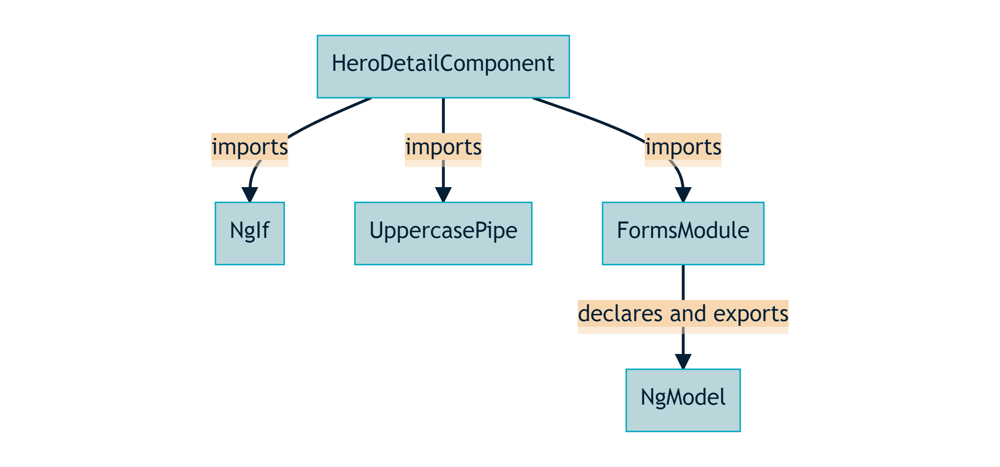
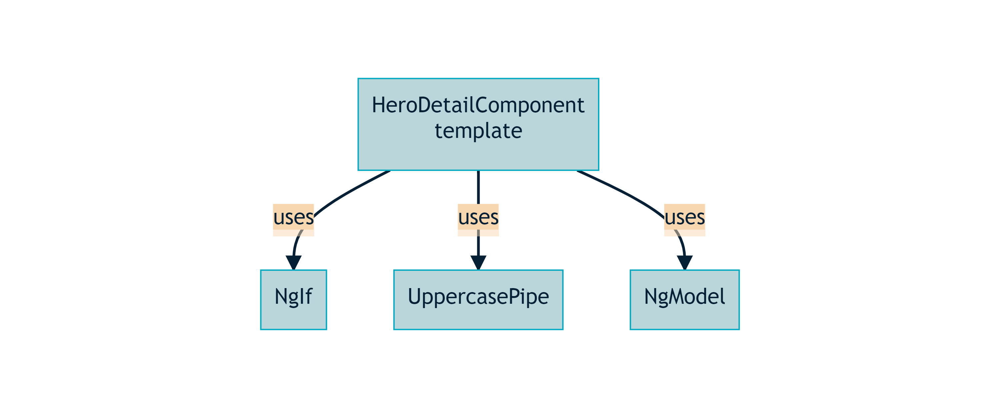
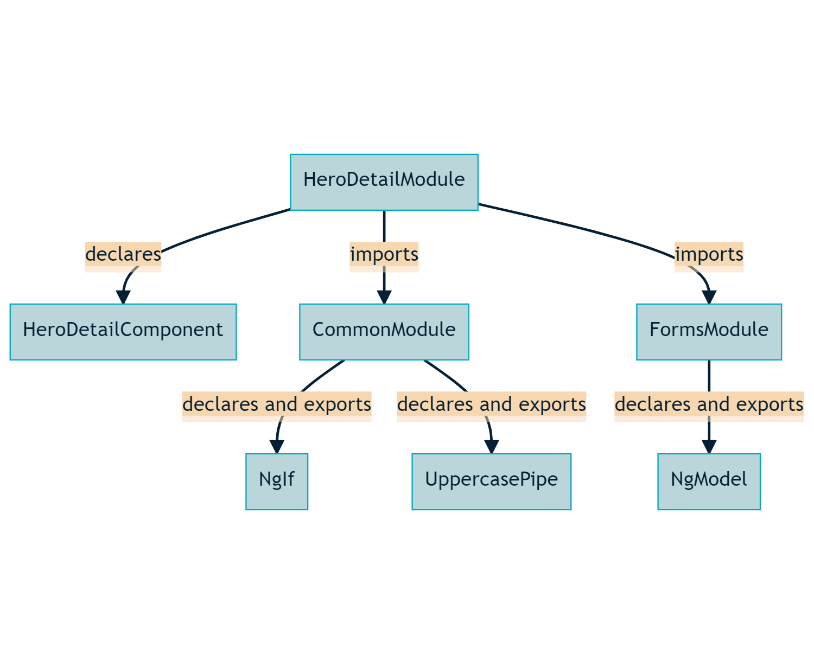
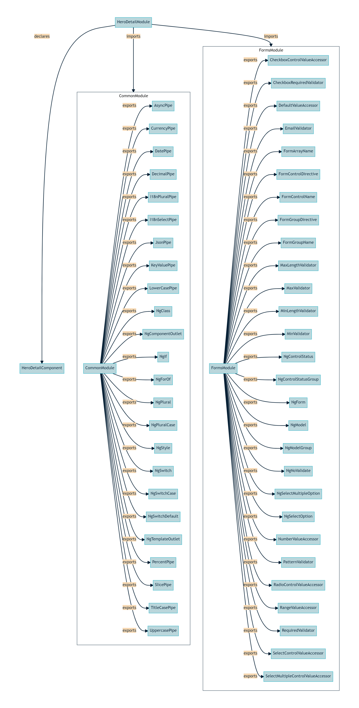

---
{
title: "The local component scope of standalone Angular components",
published: "2022-08-31T07:03:12Z",
edited: "2023-02-01T07:06:39Z",
tags: ["angular"],
description: "The local component scope of a standalone Angular component is managed by listing declarable dependencies in the Component.imports metadata option.",
originalLink: "https://dev.to/this-is-angular/the-local-component-scope-of-standalone-angular-components-3g60",
coverImage: "cover-image.png",
socialImage: "social-image.png",
collection: "Standalone Angular applications",
order: 4
}
---

*Cover photo by [Clay Banks](https://unsplash.com/photos/E4bn9ScilAA) on Unsplash.*

A standalone component is independent from an Angular module. It directly references the declarables (components, directives, and pipes) used in its template.

## Declarable dependencies

A standalone Angular component specifies declarable dependencies in the [`Component.imports`](https://angular.io/api/core/Component#imports) metadata option to manage its [local component scope](https://dev.to/this-is-angular/angular-revisited-tree-shakable-components-and-optional-ngmodules-36d2#local-component-scope).

Let's consider a standalone implementation of the hero detail component from [the Tour of Heroes tutorial](https://angular.io/tutorial):

```typescript
import { NgIf, UpperCasePipe } from '@angular/common';
import { Component } from '@angular/core';
import { FormsModule } from '@angular/forms';

@Component({
  imports: [FormsModule, NgIf, UpperCasePipe],
  selector: 'toh-hero-detail',
  standalone: true,
  styleUrls: ['./hero-detail.component.css'],
  template: `
    <div *ngIf="hero">
      <h2>{{ hero.name | uppercase }} Details</h2>
      <div><span>id: </span>{{ hero.id }}</div>
      <div>
        <label for="hero-name">Hero name: </label>
        <input
          id="hero-name"
          [(ngModel)]="hero.name"
          placeholder="Hero name"
        />
      </div>
      <button type="button" (click)="goBack()">go back</button>
      <button type="button" (click)="save()">save</button>
    </div>
  `,
})
export class HeroDetailComponent {
  // Class body omitted
}
```

Importantly, the [`Component.standalone`](https://angular.io/api/core/Component#standalone) metadata option is set to `true`.

Next, we list declarable dependencies and/or Angular modules exporting declarbales in the [`Component.imports`](https://angular.io/api/core/Component#imports) metadata option. See how the structural directive `NgIf` is listed alongside the Angular pipe `UppercasePipe`, both from the `@angular/common` package. This is possible since they are both standalone declarables in modern versions of Angular.

> ℹ️ **Note**
> It is still possible to import `CommonModule` to introduce all the common Angular declarables to a standalone component's local component scope.

Additionally, the `FormsModule` is added to the [`Component.imports`](https://angular.io/api/core/Component#imports) metadata option, introducing the attribute directive `NgModel` to the hero detail component's local component scope.

> ℹ️ **Note**
> Importantly, components, directives, and pipes listed in [`Component.imports`](https://angular.io/api/core/Component#imports) must be marked with the `standalone: true` metadata option available as [`Component.standalone`](https://angular.io/api/core/Component#standalone), [`Directive.standalone`](https://angular.io/api/core/Directive#standalone), and [`Pipe.standalone`](https://angular.io/api/core/Pipe#standalone).
>
> The default setting for this metadata option is `standalone: false` as of Angular version 15, subject to future change depending on how well standalone declarables are received by the Angular ecosystem and community.

Inspecting the component template, we see the `NgIf` directive in use:

```html
<div *ngIf="hero">
  <!-- Conditional content omitted -->
</div>
```

Next, we see the `UppercasePipe` pipe being used in the template:

```html
<h2>{{ hero.name | uppercase }} Details</h2>
```

Finally, the `Hero#name` property is bound to a form control using two-way data binding with the `NgModel` directive:

```html
<input
  id="hero-name"
  [(ngModel)]="hero.name"
  placeholder="Hero name"
/>
```

## Local component scope

In the dependency graph of the standalone hero detail component's local component scope, we see the relationship between our component and its declarable dependencies:



With the exception of the `FormsModule`, this closely matches the component template's indirect dependencies on declarables it uses:



*Indirect dependencies* meaning that the component template uses the element selectors, attribute selectors, and pipe names specified in the [`Component.selector`](https://angular.io/api/core/Component#inherited-from-directive-decorator), [`Directive.selector`](https://angular.io/api/core/Directive#selector), and [`Pipe.name`](https://angular.io/api/core/Pipe#name) metadata options of the component's declarable dependencies.

## Transitive compilation scope

When we compare this to the [transitive compilation scope](https://dev.to/this-is-angular/angular-revisited-tree-shakable-components-and-optional-ngmodules-36d2#transitive-compilation-scope) of the declaring module of a classic Angular component, we notice an increased mental overhead in the classic Angular component style:



The `HeroDetailModule` and `CommonModule` introduce layers of indirection to the dependency graph. Instead of a direct dependency from the `HeroDetailComponent` to `NgIf` and `UppercasePipe`, there is no direct flow of dependencies between the `HeroDetailComponent` class and any of its declarable dependencies. This is caused by the `HeroDetailModule` referencing the `HeroDetailComponent`, not the other way around. Another indirection is the unnecessary `CommonModule` encapsulating the Angular declarables of which we only use 2 in the component template.

The classic Angular dependency graph does not match the component template's indirect dependencies on declarables it needs.

Imagine the logic needed by the Angular compiler to determine dependencies between classes and the maintenance it requires when significant changes are made to Angular, the TypeScript compiler, and other dependencies.

What's worse, the previous classic dependency graph is simplified. The full transitive compilation scope of the hero detail module is seen in this expanded classic dependency graph:



That's 52 declarables imported to the transitive compilation scope of which the component template uses only 3. Fifty-two.

Luckily for us, the Angular Development Kit's Build Optimizer tree shakes unused declarables from transitive compilation scopes and local component scopes. If that was not the case, our bundle would increase every time we imported an Angular module that exported more declarables than we were using in our component template.

This brings us to the next topic: Maintenance.

## Maintaining declarable dependencies

Take another look at the previous expanded transitive compilation scope. As the codebase evolves, how do we keep the declarable dependencies in sync with the transitive compilation scope? How do we determine when our component template no longer uses any declarable from an Angular module exporting more than a dozen declarables.

This gets harder for every declared component in an Angular module and every non-[SCAM](https://dev.to/this-is-angular/emulating-tree-shakable-components-using-single-component-angular-modules-13do) module imported.

> ℹ️ **Note**
> It's time to convert [SCAMs](https://dev.to/this-is-angular/emulating-tree-shakable-components-using-single-component-angular-modules-13do) to standalone declarables. That was always their purpose, after all.

It's easier to scan a standalone component template and compare it to the imported standalone declarables listed in the [`Component.imports`](https://angular.io/api/core/Component#imports) metadata option.

## Conclusion

A standalone component has a local component scope consisting of its declarables dependencies which are listed in the [`Component.imports`](https://angular.io/api/core/Component#imports) metadata option.

We must maintain the local component scope so that it matches the declarables used in the component template. We do this by comparing the standalone component template to the standalone declarables and Angular modules listed in the [`Component.imports`](https://angular.io/api/core/Component#imports) metadata option, keeping them in sync.

Common declarables such as `NgIf` and `UppercasePipe` that are exported by `CommonModule` are now standalone declarables that can be referenced directly in the [`Component.imports`](https://angular.io/api/core/Component#imports) metadata option.
