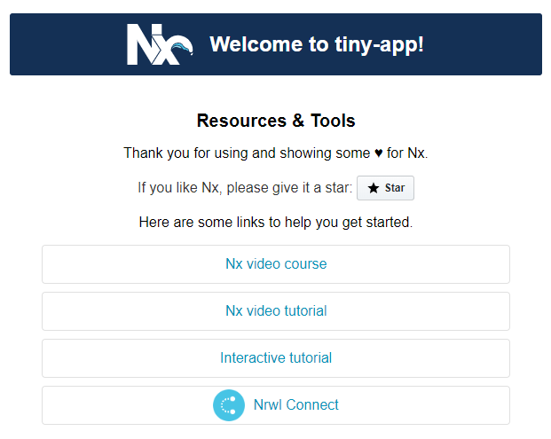
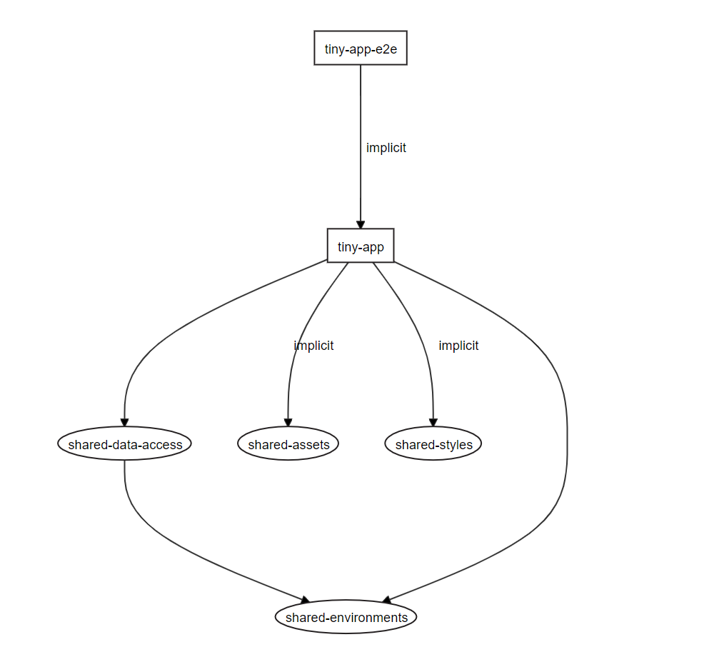
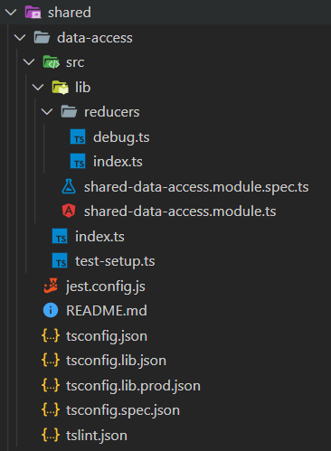
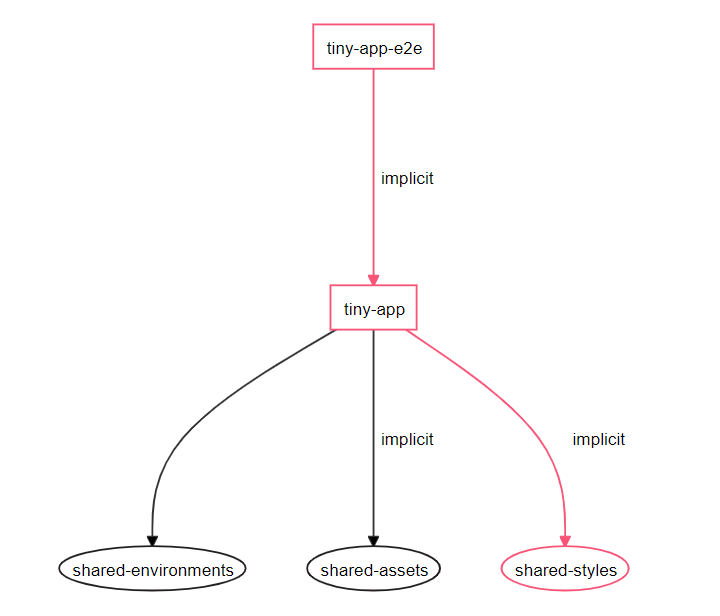
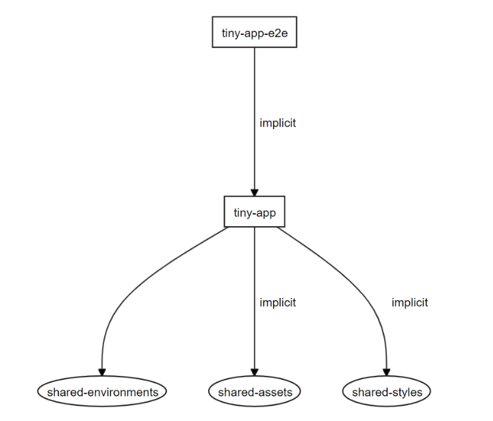
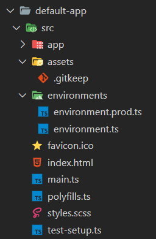
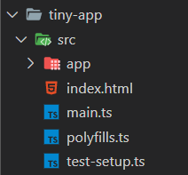
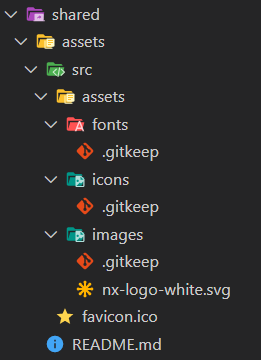
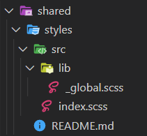
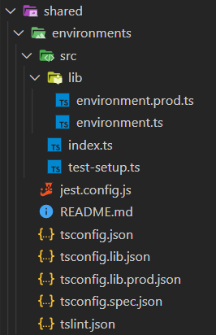

---
{
title: "Tiny Angular application projects in Nx workspaces",
published: "2021-03-24T14:43:24Z",
edited: "2021-03-24T14:45:36Z",
tags: ["angular", "nx", "ngrx", "architecture"],
description: "Extract workspace libraries to get tiny Angular application projects. We'll create assets, styles, and environments libraries for an Nx workspace. Step-by-step commands and instructions.",
originalLink: "https://dev.to/this-is-angular/tiny-angular-application-projects-in-nx-workspaces-229a",
coverImage: "cover-image.png",
socialImage: "social-image.png"
}
---

*Cover photo by [John Moeses Bauan](https://unsplash.com/photos/Oj-G9GYlLr0) on Unsplash.*

*Original publication date: 2020-03-23.*

> This article is part of the Angular Architectural Patterns series.

In Nx workspaces, we can follow a strategy of keeping our Angular application projects as tiny as possible to have less reasons to change the application project and enable reuse of common code. We do this by encapsulating business logic and configuration in workspace libraries.

One tactic of this strategy is to use one of [the shell library patterns](https://indepth.dev/the-shell-library-patterns-with-nx-and-monorepo-architectures/) for orchestration of initialisation, configuration and routing. For workspaces with a single application like this one, a feature shell library is a good choice.

This shell library variant is also the one that keeps the least amount of logic in the application project which is very suitable for our purpose. However, we won't walk through creating this type of library in this article.

Instead, let's kick this up a notch by extracting workspace libraries for static assets, styles, and environments.

We'll walk through the commands and steps to set up a full Nx Angular workspace and apply a tiny application project strategy. Afterwards, we'll discuss the benefits of the different tactics and techniques we use to apply the tiny application project strategy.

## Create an Nx workspace with an Angular application

To demonstrate this, we'll create an Nx workspace with a single Angular application. Execute the commands in Listing 1.

```bash
npx create-nx-workspace workspace --cli=angular --preset=angular --appName=tiny-app --style=scss

nx update @angular/cli @angular/core
```

<figcaption>Listing 1. Create and update an Nx workspace with a single Angular application.</figcaption>

We'll create workspace libraries which the application can import through the `@workspace` scope.

## Extract an assets workspace library

When we generate an Angular application, it comes with an empty `assets` directory for static file assets such as icons, images, and web fonts. We can reference these assets from DOM element attributes and stylesheets by using absolute paths, for example `` and `.twitter { background-image: url('/assets/icons/twitter.png'); }`.

Generated Angular applications also come with the static file `favicon.ico` which is referenced in `index.html`. We'll generate an assets workspace library, extract our static assets to it, configure the workspace and update references to use the assets library.

### Generate a clean workspace library

The first step is to generate a workspace library and clean it up as it won't contain TypeScript files, only static files.

```bash
nx generate library assets --directory=shared --tags="scope:shared,type:assets" --style=scss

npx rimraf ./apps/tiny-app/src/assets ./libs/shared/assets/*.js ./libs/shared/assets/*.json ./libs/shared/assets/src/*.* ./libs/shared/assets/src/lib

"# shared-assets" > ./libs/shared/assets/README.md
```

<figcaption>Listing 2. Generate a shared assets library and clean it from TypeScript files and configurations.</figcaption>

Execute the commands in Listing 2, then edit `angular.json` to remove all architect targets from the `shared-assets` project to match the configuration structure in Listing 3.

```json
{
  "//": "angular.json",
  "projects": {
    "shared-assets": {
      "architect": {}
    }
  }
}
```

<figcaption>Listing 3. Remove architect targets from the assets library.</figcaption>

### Set up common assets folders and move the favicon

Now that we have a clean workspace library folder structure, let's create common assets folders and move the favicon file into our assets library by executing the commands in Listing 4.

```bash
npx mkdirp ./libs/shared/assets/src/assets/fonts ./libs/shared/assets/src/assets/icons ./libs/shared/assets/src/assets/images

"" > ./libs/shared/assets/src/assets/fonts/.gitkeep

"" > ./libs/shared/assets/src/assets/icons/.gitkeep

"" > ./libs/shared/assets/src/assets/images/.gitkeep

mv ./apps/tiny-app/src/favicon.ico ./libs/shared/assets/src
```

<figcaption>Listing 4. Create common assets folders and move the favicon.</figcaption>

To configure the Angular application project to use the assets in the workspace library, we navigate to the `tiny-app:build` architect target in `angular.json` and replace the `assets` options with the entries in Listing 5.

```json
{
  "//": "angular.json",
  "projects": {
    "tiny-app": {
      "architect": {
        "build": {
          "options": {
            "assets": [
              {
                "glob": "favicon.ico",
                "input": "libs/shared/assets/src",
                "output": "./"
              },
              {
                "glob": "**/*",
                "input": "libs/shared/assets/src/assets",
                "output": "assets"
              }
            ]
          }
        }
      }
    }
  }
}
```

<figcaption>Listing 5. Configuring application assets.</figcaption>

We instruct the Angular CLI to copy the favicon file to the `dist/apps/tiny-app` folder when building the application. Additionally, all files and folders in the `libs/shared/assets/src/assets` folder are copied to `dist/apps/tiny-app/assets` by the build process. This will keep our application's assets links working in our non-local environments such as our staging and production web servers.

### Try it out locally

Go ahead, try it out locally with `nx serve --open` on the Webpack development server. Execute the commands in Listing 6 to build a production application bundle and serve it using a local static web server. Make sure the favicon shows up in both places.

```bash
nx build --prod

npx http-server dist/apps/tiny-app -o
```

<figcaption>Listing 6. Build a production bundle and serve it locally using a static web server.</figcaption>

## Bundle an asset

Nx-generated Angular applications show an Nx logo in their app component as seen at the top of Figure 1.



<figcaption>Figure 1. The top of a default home page in an Nx-generated Angular application.</figcaption>

If we open `app.component.html`, we see that the logo is linked from [`https://nx.dev/assets/images/nx-logo-white.svg`](https://nx.dev/assets/images/nx-logo-white.svg).

Let's make the logo part of our application bundle by including it in our assets library and updating the image attribute in the app component's template.

Execute the command in Listing 7 to download the Nx logo and store it in the assets library.

```bash
npx -p wget-improved nwget https://nx.dev/assets/images/nx-logo-white.svg -O ./libs/shared/assets/src/assets/images/nx-logo-white.svg
```

<figcaption>Listing 7. Download the Nx logo and store it in the assets library.</figcaption>

Now let's update the image element to reference the logo from our assets library. Edit `app.component.html` as shown in Listing 8.

```html
<!-- app.component.html -->

```

<figcaption>Listing 8. The image element references the logo from the assets library.</figcaption>

That's it. We extracted an assets workspace library and bundled static files. Try it out one more time to make sure that everything is set up correctly.

## Extract a styles workspace library

Angular applications are generated with a global stylesheet called `styles.css` or in our case `styles.scss` as we're using Sass. The global stylesheet can contain generic styles, element type styles, CSS objects, and utility styles.

A global stylesheet grows larger and more complex as an application evolves. When using Sass, we can split a stylesheet into Sass partials, which are conventionally have names prefixed with an underscore (`_`), for example `_global.scss`.

Sass partials are bundled by using import statements, for example `@import './lib/global';`. Note that Sass uses convention to find the file whether it's name has an underscore prefix or not.

Unlike vanilla CSS, Sass' import statements aren't loaded one at a time, asynchronously. At least not when we reference our application's static assets. Instead, they are bundled into a single stylesheet. This is similar to how we're used to tools like Webpack and Browserify bundling JavaScript and TypeScript files.

We'll make our Angular application project tinier by extracting a styles workspace library, convert `styles.scss` to a Sass partial, bundle it as part of a workspace library stylesheet and configure our application project to link to this stylesheet.

### Generate a clean workspace library

As we did in a previous chapter, we start by generating a workspace library and clean it up as it will only contain stylesheets, not TypeScript files.

```bash
nx generate library styles --directory=shared --tags="scope:shared,type:styles" --style=scss

npx rimraf ./libs/shared/styles/*.js ./libs/shared/styles/*.json ./libs/shared/styles/src/*.* ./libs/shared/styles/src/lib/*.*

"# shared-styles" > ./libs/shared/styles/README.md
```

<figcaption>Listing 9. Generate a shared styles library and clean it from TypeScript files and configurations.</figcaption>

Execute the commands in Listing 9, then edit `angular.json` to remove all architect targets from the `shared-styles` project to match the configuration structure in Listing 10.

```json
{
  "//": "angular.json",
  "projects": {
    "shared-styles": {
      "architect": {}
    }
  }
}
```

<figcaption>Listing 10. Remove architect targets from the styles library.</figcaption>

### Set up an entry point stylesheet

With a clean workspace folder structure, we're ready to create an `index.scss` stylesheet that will serve as the entry point to our styles workspace library.

At the same time, we'll convert the application stylesheet (`styles.scss`) to a Sass partial by renaming it and moving it into the styles library. This is done by executing the commands in Listing 11.

```bash
mv ./apps/tiny-app/src/styles.scss ./libs/shared/styles/src/lib/_global.scss

"@import './lib/global';" > ./libs/shared/styles/src/index.scss
```

<figcaption>Listing 11. Convert the application stylesheet to a Sass partial and create an entry point stylesheet.</figcaption>

Only one thing left to do. Edit `angular.json` to replace the `styles` option of of the `tiny-app:build` architect target with the entry seen in the structure of Listing 12A.

```json
{
  "//": "angular.json",
  "projects": {
    "tiny-app": {
      "architect": {
        "build": {
          "options": {
            "styles": [
              "libs/shared/styles/src/index.scss"
            ]
          }
        }
      }
    }
  }
}
```

<figcaption>Listing 12A. Configure the application to include the styles library's entry point stylesheet.</figcaption>

Note that if we're using Karma and writing component tests that rely on global styles, we'll have to add a similar option to the `test` architect target of our UI workspace libraries as shown in the example in Listing 12B.

```json
{
  "//": "angular.json",
  "projects": {
    "ui-buttons": {
      "architect": {
        "test": {
          "builder": "@angular-devkit/build-angular:karma",
          "options": {
            "styles": [
              "libs/shared/styles/src/index.scss"
            ]
          }
        }
      }
    }
  }
}
```

<figcaption>Listing 12B. Example Karma `test` architect target with global styles.</figcaption>

If a UI library is shared between multiple apps and have tests that rely on their individual global styles, we'd have to create multiple `test` configurations for that project as seen in Listing 12C.

```json
{
  "//": "angular.json",
  "projects": {
    "ui-buttons": {
      "architect": {
        "test": {
          "builder": "@angular-devkit/build-angular:karma",
          "configuration": {
            "booking": {
              "styles": [
                "libs/booking/shared/styles/src/index.scss"
              ]
            },
            "check-in": {
              "styles": [
                "libs/check-in/shared/styles/src/index.scss"
              ]
            }
          }
        }
      }
    }
  }
}
```

<figcaption>Listing 12C. Example Karma `test` architect target with multiple global style configurations.</figcaption>

### Try it out locally

Angular CLI now links `index.scss` in `index.html`, both locally on the development server and in our deployed environments where the stylesheet is part of the application bundle.

Make sure to try it out. Add global styles and verify that they are applied.

```bash
nx build --prod

npx http-server dist/apps/tiny-app -o
```

<figcaption>Listing 6 (repeated). Build a production bundle and serve it locally using a static web server.</figcaption>

Run `nx serve --open` to test global styles locally or run the commands in Listing 6 to serve a production bundle on a local static web server.

## Extract an environments workspace library

Before we bootstrap our Angular application in `main.ts`, we conditionally call `enableProdMode` based on whether the Boolean `production` property of the `environment` object is set or cleared.

Running `enableProdMode` disabled additional runtime change detection cycles in production mode. In development mode, this extra cycle is what triggers [the `ExpressionChangedAfterItHasBeenCheckedError` warning](https://indepth.dev/everything-you-need-to-know-about-the-expressionchangedafterithasbeencheckederror-error/).

Additional runtime assertions are made throughout the core parts of Angular itself in development mode.

### Generate a workspace library

Even though the workspace library we'll extract is going to be tiny and is very specialised, it does contain TypeScript, so `lint` and `test` architect targets are still useful.

```bash
nx generate library environments --directory=shared --tags="scope:shared,type:environments" --style=scss

npx rimraf ./libs/shared/environments/src/lib/*.*
```

<figcaption>Listing 13. Generate a shared environments library and clear it of generated content.</figcaption>

Listing 13 shows that we first generate the environments library. Then we remove the files generated in the `src/lib` subfolder of the library.

### Move the environment files and configure application dependencies

With an empty `lib` folder in our environments library, let's move the environments files from the application project, expose them through the library's entry point and finally delete the `environments` folder of the application project. This is all done by executing the commands in Listing 14.

```bash
mv ./apps/tiny-app/src/environments/*.* ./libs/shared/environments/src/lib

"export * from './lib/environment';" > ./libs/shared/environments/src/index.ts

npx rimraf ./apps/tiny-app/src/environments
```

<figcaption>Listing 14. Move the environment files and set up the library entry point.</figcaption>

To configure the Angular application project to use an environment file in the workspace library based on the build configuration, we navigate to the `tiny-app:build` architect target in `angular.json` and replace the `fileReplacements` option of the `production` configuration with the entry in Listing 15.

```json
{
  "//": "angular.json",
  "projects": {
    "tiny-app": {
      "architect": {
        "build": {
          "configurations": {
            "production": {
              "fileReplacements": [
                {
                  "replace": "libs/shared/environments/src/lib/environment.ts",
                  "with": "libs/shared/environments/src/lib/environment.prod.ts"
                }
              ]
            }
          }
        }
      }
    }
  }
}
```

<figcaption>Listing 15. Configure the application's production build configuration to use the production environment file from the environments library.</figcaption>

Only one thing left to do. We need to update the import statement in `main.ts` to use the environments workspace library as seen in Listing 16.

```ts
// main.ts
import { enableProdMode } from '@angular/core';
import { environment } from '@workspace/shared/environments';

if (environment.production) {
  enableProdMode();
}
```

<figcaption>Listing 16. Importing the `environment` object from the environments workspace library.</figcaption>

### Try it out locally

Angular CLI now replaces `environment.ts` with `environment.prod.ts` in the production bundle, even though our application project only has a transitive dependency on `environment.ts`.

Make sure to try it out. Check your browser console when running `nx serve --open`. The message `Angular is running in the development mode. Call enableProdMode() to enable the production mode.` should be output.

```bash
nx build --prod

npx http-server dist/apps/tiny-app -o
```

<figcaption>Listing 6 (repeated). Build a production bundle and serve it locally using a static web server.</figcaption>

When running a production bundle locally with the commands in Listing 6, no message should be output in your browser's console.

## Add compile time configuration to a library

We can use the environments library to configure our application's dependencies as it allows our environment configuration to be used in compile time configuration methods.

Usually we would add an environment provider that services, declarables, and Angular modules can inject, but that's not possible in methods that return `ModuleWithProviders<T>`, for example static `forRoot` methods on Angular modules.

The same is true for Angular module imports. If we want to load certain Angular modules in development mode, but not in production mode, we could not depend on a provided environment value. We would need static access to a value since it's evaluated at compile time.

It would be a terrible idea to have a workspace library with a dependency on an application project. This would go against the direction of dependencies in a well-structured architecture and could lead to cyclic dependencies.

### Add and configure NgRx Store

As a use case, we'll add NgRx Store and its development tools by using their `ng add` schematics as seen in Listing 17.

```bash
nx add @ngrx/store --minimal false

nx add @ngrx/store-devtools
```

<figcaption>Listing 17. Add NgRx Store and NgRx Store development tools.</figcaption>

We'll move the NgRx Store configurations from `AppModule` to `CoreModule` as this is the preferred way to configure the root injector in traditional Angular application projects. `CoreModule` is imported by `AppModule` and can be seen in Listing 18.

```ts
// core.module.ts
import { NgModule } from '@angular/core';
import { StoreModule } from '@ngrx/store';
import { StoreDevtoolsModule } from '@ngrx/store-devtools';
import { environment } from '@workspace/shared/environments';

import { metaReducers, reducers } from './reducers';

@NgModule({
  imports: [
    StoreModule.forRoot(reducers, {
      metaReducers,
    }),
    StoreDevtoolsModule.instrument({
      logOnly: environment.production,
      maxAge: 25,
    }),
  ],
})
export class CoreModule {}
```

<figcaption>Listing 18. NgRx Store is configured for the the root injector in our core Angular module.</figcaption>

In traditional Angular workspaces, this would be fine, but we want to maintain a tiny application project by minimising the amount of logic it contains.

### Extract a shared data access library

We want to keep NgRx-specific configuration of the root injector in a workspace library. Nx prescribes a data access workspace library type, so let's generate one and extract the configuration logic to it.

```bash
nx generate library data-access --directory=shared --tags="scope:shared,type:data-access" --style=scss

mv ./apps/tiny-app/src/app/reducers ./libs/shared/data-access/src/lib
```

<figcaption>Listing 19. Generate a shared data access library, then move the generated reducer folder and file.</figcaption>

Execute the commands in Listing 19 to generate a shared data access library and move the subfolder  `src/app/reducers` generated when adding NgRx Store.

Navigate to `libs/shared/data-access/src/lib/shared-data-access.module.ts` and edit it to contain the file content in Listing 20.

```ts
// shared-data-access.module.ts
import { ModuleWithProviders, NgModule } from '@angular/core';
import { StoreModule } from '@ngrx/store';
import { StoreDevtoolsModule } from '@ngrx/store-devtools';
import { environment } from '@workspace/shared/environments';

import { metaReducers, reducers } from './reducers';

@NgModule({
  imports: [
    StoreModule.forRoot(reducers, {
      metaReducers,
    }),
    StoreDevtoolsModule.instrument({
      logOnly: environment.production,
      maxAge: 25,
    }),
  ],
})
export class SharedDataAccessRootModule {}

@NgModule({})
export class SharedDataAccessModule {
  static forRoot(): ModuleWithProviders<SharedDataAccessRootModule> {
    return {
      ngModule: SharedDataAccessRootModule,
    };
  }
}
```

<figcaption>Listing 20. Root injector data access configuration module.</figcaption>

We follow the `forRoot` pattern to indicate that the dependencies that are provided when importing this Angular module are for the root injector. This is done by creating a static method that returns a `ModuleWithProviders<T>` object.

The `SharedDataAccessRootModule` that the module with providers object refers to contains the configuration which was in `CoreModule` before we created this library.

Finally, navigate to `apps/tiny-app/src/app/core.module.ts` and edit its file content to that of Listing 21.

```ts
// core.module.ts
import { NgModule } from '@angular/core';
import { SharedDataAccessModule } from '@workspace/shared/data-access';

@NgModule({
  imports: [
    SharedDataAccessModule.forRoot(),
  ],
})
export class CoreModule {}
```

<figcaption>Listing 21. A simple core Angular module that only imports workspace library modules.</figcaption>

After restructuring, we end up with the workspace dependency graph illustrated in Figure 2.



<figcaption>Figure 2. Workspace dependency graph after adding a shared data access library.</figcaption>

Without extracting a shared environments library, we would not have been able to import an environment file in our shared data access library. First of all, the `tiny-app` does not have a scoped path mapping. Secondly, a library project must never depend on an application project.

### Add a development mode only meta reducer

Now we can use the environment object to configure injectors. The generated NgRx Store configuration code does this in another place, namely in the reducers file as shown in Listing 22 where meta reducers are defined.

```ts
// reducers/index.ts
import { ActionReducerMap, MetaReducer } from '@ngrx/store';
import { environment } from '@workspace/shared/environments';

export interface State {}

export const reducers: ActionReducerMap<State> = {};

export const metaReducers: MetaReducer<State>[] =
  !environment.production ? [] : [];
```

<figcaption>Listing 22. Meta reducers are production mode aware by default.</figcaption>

Let's use a recipe from the NgRx documentation to add a development only debug meta reducer.

```ts
// reducers/debug.ts
import { ActionReducer } from '@ngrx/store';

export function debug(reducer: ActionReducer<any>): ActionReducer<any> {
  return (state, action) => {
    console.log('state', state);
    console.log('action', action);

    return reducer(state, action);
  };
}
```

<figcaption>Listing 23. Debug meta reducer.</figcaption>

The debug meta reducer in Listing 23 logs the NgRx Store state and the dispatched action, every time actions are about to be reduced.

```ts
// reducers/index.ts
import { ActionReducerMap, MetaReducer } from '@ngrx/store';
import { environment } from '@workspace/shared/environments';

import { debug } from './debug';

export interface State {}

export const reducers: ActionReducerMap<State> = {};

export const metaReducers: MetaReducer<State>[] =
  !environment.production ? [debug] : [];
```

<figcaption>Listing 24. The debug meta reducer is enabled in development mode, but not in production mode.</figcaption>

Listing 24 shows how to add the debug meta reducer in development mode only. Note that we import the environment object from the environments library.

```ts
// shared-data-access.module.ts
import { NgModule } from '@angular/core';
import { StoreModule } from '@ngrx/store';

import { metaReducers, reducers } from './reducers';

@NgModule({
  imports: [
    StoreModule.forRoot(reducers, {
      metaReducers,
    }),
  ],
})
export class SharedDataAccessRootModule {}
```

<figcaption>Listing 25 (excerpt). Root injector data access configuration module. NOTE: Don't overwrite your file with this partial content.</figcaption>

The exported `metaReducers` array is used to configure the root store as seen in Listing 25.



<figcaption>Figure 3. Shared data access library file and folder structure.</figcaption>

Figure 3 shows the file and folder structure of our shared data access library which contains the root store configuration and meta reducers.

## Configure Nx workspace dependencies

Nx workspaces have a workspace configuration which can be used to set up restrictions on internal dependencies and instruct Nx about dependencies that are not visible in application and library TypeScript files.

```json
{
  "//": "nx.json",
  "projects": {
    "tiny-app": {
      "implicitDependencies": [
        "shared-assets",
        "shared-styles"
      ]
    }
  }
}
```

<figcaption>Listing 25. Configure implicit dependencies for the application project.</figcaption>

Listing 25 shows how we configure our application project to have implicit dependencies on the assets and styles libraries. This is necessary since there are no TypeScript import statements referencing either of these workspace libraries.

The environments library is imported in `main.ts`, so it has an explicit dependency that Nx is able to pick up on its own.

Configuring these dependencies make sure that Nx's `affected:*` commands pick up changes made in the assets and styles libraries.

This will trigger the need to rebuild the application project when running `nx affected:build`. It will also trigger application unit tests and end-to-end tests to run with `nx affected:test` or `nx affected:e2e`. Finally, it will show changed and affected workspace projects when running `nx affected:dep-graph`.



<figcaption>Figure 4. Dependency graph with changed global styles. Shared data acess library left out for brevity.</figcaption>

When we make a change to `_global.scss` and run `nx affected:dep-graph`, we get the dependency graph shown in Figure 4. Highlighted nodes (projects) are affected by the change.

## A tiny Angular application project

After restructuring our application workspace, our dependency graph is a directed acyclic graph (commonly abbreviated as DAG) with dependencies pointing in the right direction as seen in Figure 5.



<figcaption>Figure 5. Workspace dependency graph. Shared data access library left out for brevity.</figcaption>

The end-to-end testing project `tiny-app-e2e` depends on the application project, meaning that it is affected by changes in the application project and thus its tests needs to be rerun.

The application project `tiny-app` depends on and is affected by changes in the shared worskpace libraries `shared-environments`, `shared-assets`, and `shared-styles`. When one of these libraries is changed, the application will have to be rebuild and its test suites rerun. An example of this was illustrated in Figure 2 where `shared-styles` was changed.

No workspace library depends on the application project. This must always be the case or we're doing something wrong.

Our application project has very few reasons to change since it contains minimal logic. There are very few reasons to ever touch the application project again.

In pull requests, it's easy to see what's being changed or extended by looking at the workspace library folder name in which files were changed or by running `nx affected:dep-graph` as we saw in a previous chapter.



<figcaption>Figure 6. Default Nx Angular application project file and folder structure.</figcaption>

Figure 6 shows the default file and folder structure for an Nx generated Angular application. Configuration files like `tsconfig.json` and `tslint.json` are left out of the illustration, as they remain unchanged by the techniques demonstrated in this article.



<figcaption>Figure 7. Tiny application project file and folder structure.</figcaption>

In the tiny app project, files in the `src/app` subfolder are untouched when compared to the default application project, except that we added a `CoreModule` in `core.module.ts` when creating the shared data access library.

As illustrated in Figure 7, all subfolders of `src` have been moved except for `src/app`.

### The shared assets workspace library

The `assets` folder has been moved out of the application project and into the `shared-assets` workspace library as seen in Figure 8.



<figcaption>Figure 8. Shared assets workspace library file and folder structure.</figcaption>

We created the common assets folders `fonts`, `icons`, and `images` and we bundled the Nx logo as seen in the `src/assets/images` subfolder of the assets library.

The `.gitkeep` files are empty placeholder files that are placed to keep the folder structure in the Git repository even without real files within. They can be deleted when files are placed in the folders and put under version control. For example, it would be fine to delete `src/assets/images/.gitkeep`, now that we have added `nx-logo-white.svg` to the same parent folder.

The favicon is in the `src` subfolder of a default application project. We moved that file to the assets library as well, into its `src` subfolder.

Glob patterns in the  `tiny-app:build` architect target of `angular.json` ensures that files in the assets workspace library are bundles during our application's build process.

The library has no TypeScript configuration files as it only contains static files.

### The shared styles workspace library

The global stylesheet `styles.scss` has been moved from the application project's `src` subfolder and into the `shared-styles` workspace library as seen in Figure 9.



<figcaption>Figure 9. Shared styles workspace library file and folder structure.</figcaption>

`styles.scss` was renamed to `_global.scss` to convert it to a Sass partial. The Sass partial is placed in the `src/lib` subfolder of our styles workspace library. It's imported by the entry point stylesheet `index.scss` in the `src` subfolder.

The library contains no TypeScript configuration files because it only contains stylesheets and Sass partials.

### The shared environments workspace library

The environment files have been moved from the application project's `src/environments` subfolder into the `src/lib` subfolder of our environments workspace library as seen in Figure 10.



<figcaption>Figure 10. Shared environments workspace library file and folder structure.</figcaption>

The environment object is re-exported by the environments library's entry point also known as its public API which is defined in `index.ts`.

Configuration files for TypeScript, TSLint, and Jest as well as the architect targets `lint` and `test` are preserved as the workspace library contains TypeScript.

## Conclusion

We have generated an Nx workspace with a single Angular application. Even before adding any features, we can extract workspace libraries to adhere to the Single Responsibility Principle.

### The assets library

The shared assets workspace library contains static files such as web fonts, icons, and images. It also contains the favicon. The web app manifest would also be added here.

We saw an example of adding an image file to this library and referring to it from our application project. Of course, this works from UI workspace libraries and feature libraries as well.

With static files located in a separate workspace library, we lower the risk of breaking the whole application when adding, deleting or modifying static files.

### The styles library

With a workspace library exclusively for global styles, we won't have to feel bad for polluting the application project with dozens of Sass partials or risk breaking the application setup by accident.

The shared styles workspace library could also expose Sass mixins, functions, and partials that are shared between component styles or UI workspace libraries.

### The environments library

Extracting the environment files to a shared workspace library allows us to conditionally configure injectors from workspace libraries such as the shared data access library we created to configure NgRx Store in the root injector.

In a real application, we could add a feature shell library so that it would become the orchestration Angular module imported by `AppModule` or `CoreModule`.

Without a feature shell library, we have to make changes to the application project to add further configure the root injector or add application use cases. This is risky. We're better off leaving the application project untouched under most circumstances to have peace of mind.

### Shared workspace libraries

In the examples demonstrated in this article, we have put the extracted workspaces libraries in the `shared` library grouping folder and added the `scope:shared` tag. For workspaces with only a single application, this might not be necessary.

However, as the application grows, we will be happy that we used grouping folders from the beginning of the project. Application-wide workspace libraries are in the `shared` grouping folder, while we use for example sub-domain grouping folders to group our feature libraries and their related data access, domain, and UI workspace libraries.

Alternatively, we would end up with dozens if not hundreds of library folders within the `libs` folder, each with increasingly long folder names.

If it turned out that we wanted to add additional applications to the workspace, we would keep the workspace libraries that we wanted to share between the applications in the `shared` library grouping folder. The ones that we could or would not want to share between the applications could be placed within a library grouping folder named after the application, for example `libs/tiny-app/shared` for application-wide libraries unique to the `tiny-app` application project.

## Resources

Feel free to [clone `LayZeeDK/nx-tiny-app-project` on GitHub to experiment with the full solution](https://github.com/LayZeeDK/nx-tiny-app-project).

[Watch a video walkthrough of this article by Oscar Lagatta](https://youtu.be/SVdT4_aNpl0).

Learn how to implement a feature shell library in "[Shell Library patterns with Nx and Monorepo Architectures](https://indepth.dev/the-shell-library-patterns-with-nx-and-monorepo-architectures/)" by Nacho Vázquez.

## Peer reviewers

Thank you [Nacho Vazquez](https://dev.to/nachovazquez) for giving me valuable feedback on this article and for our many interesting discussions that lead us to common architectural insights 🙇‍♂️
