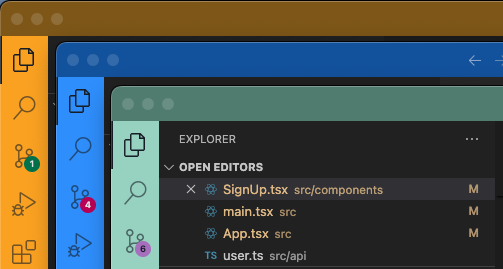
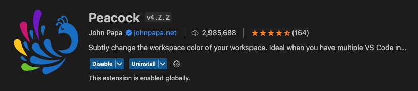
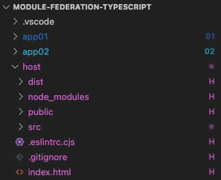
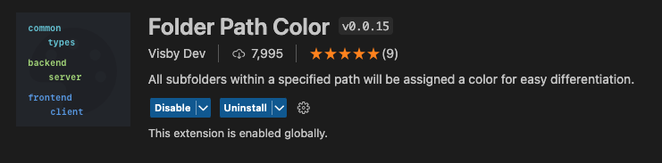

---
{
title: "🌈 2 Colors Extensions to make Visual Studio Code even better!",
published: "2024-05-28T11:09:48Z",
tags: ["vscode", "programming", "productivity"],
description: "Colors 🌈 help us identify things in our surroundings, including Visual Studio Code instances and...",
originalLink: "https://leonardomontini.dev/vscode-folder-path-color-peacock/",
coverImage: "cover-image.png",
socialImage: "social-image.png",
collection: "Visual Studio Code",
order: 6
}
---

Colors 🌈 help us identify things in our surroundings, including Visual Studio Code instances **and** files.

Today I show how I solved two problems I had, thanks to colors and 2 vscode extensions. Here's a video where I showcase them and how you can push the extension even further to get even better customization 👇

<iframe src="https://www.youtube.com/watch?v=bvaSo3tip2g"></iframe>

## 1. Identify different vscode instances



This is quite common, you may have a backend and a frontend repo, or simply you’re working on multiple projects and it happens that you have two or more vscode instances open.

Short answer: Peacock ([get the extension](https://marketplace.visualstudio.com/items?itemName=johnpapa.vscode-peacock))

It's quite a famous and widely used extension, but if you don’t know it yet, it's maybe time to give it a try!

(you can also customize projects from the settings, manually, but this extension makes it so much easier)

### Peacock Features



Some features you may find useful:

With the command `Peacock: Surprise me with a random color`, you can assign a random color to the current project. Try it if you dare!

If you have already a color in mind, you can set it with `Peacock: Enter a color`.

You're also covered if you want some suggestions, with `Peacock: Change to a Favorite Color` you'll get a list of predefined colors (you can also expand this list with your own colors).

## 2. Identify files and folders in the same repo



I was recently playing around with Module Federation, but this applies pretty much in all monorepo scenarios.

I wanted an easy way to know what project a file refers to and with another extension, Folder Path Color ([get the extension](https://marketplace.visualstudio.com/items?itemName=VisbyDev.folder-path-color)), I was able to do that!

It has some limitations since colors on filenames are already used to track git status, so it's up to you if you want to enable it or not.

### Folder Path Color Features



The core feature here is that you can customize the colors for your file based on their path. You can also assign a symbol.

This is the config I use in the video:

```json
{
  "folder-path-color.folders": [
    {
      "path": "host",
      "symbol": "H",
      "tooltip": "Host"
    },
    {
      "path": "app01",
      "symbol": "01",
      "tooltip": "App 01",
      "color": "blue"
    },
    {
      "path": "app02",
      "symbol": "02",
      "tooltip": "App 02",
      "color": "cyan"
    }
  ]
}
```

The symbol (that is a string) is particularly useful to overcome the limitation of the colors on filenames, so that git can color your newly added file in green but you still have the symbol next to the filename to identify the project.

You have some default colors, but you can also expand them with a set of custom colors.

### Conclusion

This was a quick one, but I wanted to mention these two extensions I found to solve a couple of problems I had. Peacock is quite famous, but Folder Path Color is less known and I think it has some usecases.

If you want to see me testing the two extensions and their customization, here's the video: https://www.youtube.com/watch?v=bvaSo3tip2g

---

Thanks for reading this article, I hope you found it interesting!

I recently launched a GitHub Community! We create Open Source projects with the goal of learning Web Development together!

Join us: https://github.com/DevLeonardoCommunity

Do you like my content? You might consider subscribing to my YouTube channel! It means a lot to me ❤️
You can find it here:
[](https://www.youtube.com/c/@DevLeonardo?sub_confirmation=1)

Feel free to follow me to get notified when new articles are out ;)

<!-- ::user id="balastrong" -->
