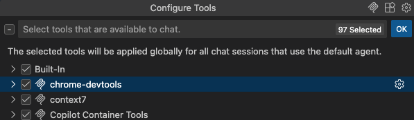
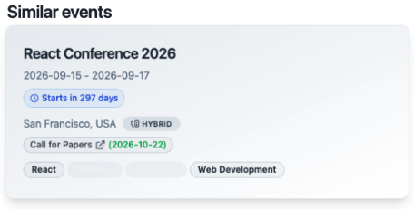
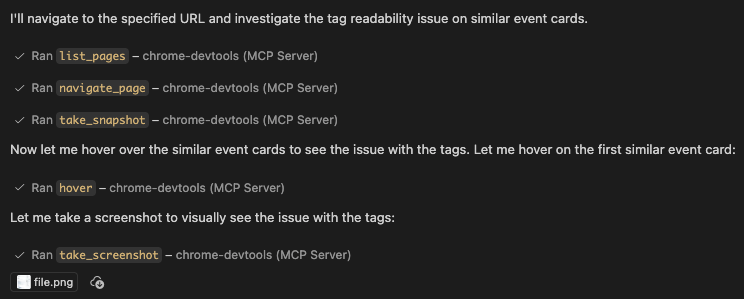
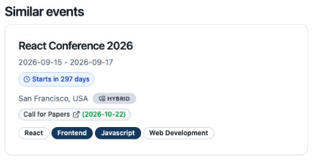

---
{
title: "Automate UI Bug Fixing with Chrome MCP Server and Copilot",
published: "2025-11-24T20:03:04Z",
edited: "2025-11-24T22:27:34Z",
tags: ["mcp", "githubcopilot", "ai", "vscode"],
description: "I recently had a look at the Chrome MCP server and it looks really cool. So, let me show you a quick...",
originalLink: "https://leonardomontini.dev/chrome-mcp-server-guide/",
coverImage: "cover-image.png",
socialImage: "social-image.png"
}
---

I recently had a look at the Chrome MCP server and it looks really cool. So, let me show you a quick example of what it can do.



## Getting Started

First of all, if you don't have it installed yet, there are instructions available. Like every other MCP server, you just need to have somewhere in your client settings the configuration string.

```json
{
  "mcpServers": {
    "chrome-devtools": {
      "command": "npx",
      "args": ["-y", "chrome-devtools-mcp@latest"]
    }
  }
}
```

I'm using VS Code, which has a command in the CLI for this. You can just open a new terminal, paste the command, and that's basically it.

```bash
code --add-mcp '{"name":"chrome-devtools","command":"npx","args":["chrome-devtools-mcp@latest"]}'
```

In any case, full instructions are in the [Chrome MCP server documentation](https://github.com/ChromeDevTools/chrome-devtools-mcp/).

If you want to make sure it is installed, you can open your user configuration (`F1` => `MCP: Open User Configuration`) and find the server there. Also, as soon as you open a new chat, you can click the tools icon and find "Chrome tools" listed.



## Demo Run

I have an application running on localhost, but there's a small UI issue. If you hover over a specific card, the text of some badges becomes unreadable. That's the bug we're going to validate and fix through the Chrome MCP server tools.



*^ this screen has been taken by the MCP server itself!*

Back to our project, I can ask the AI to navigate to the page with the bug and take action. This was my prompt:

> Navigate here with the chrome-devtools mcp: http://localhost:3000/events/js-event-2026
>
> You'll notice that if you hover on the cards on similar events, some tags are hard to read. Verify and fix that

## The Fix in Action

Once the request is made, it starts launching the Chrome MCP server. A Chrome window appears, controlled entirely by the agent.

The first step it takes is to navigate to the page. Then, it takes a snapshot. This isn't just a screenshot, but a deconstructed view of the page where unique IDs are assigned to each text, link, or button. This allows the agent to understand the structure of the page by using way less tokens than a full HTML dump.

Here's an example:

```js
# take_snapshot response
## Page content
uid=1_0 RootWebArea "JS Event - ConfHub" url="http://localhost:3000/events/js-event-2026"
  uid=1_1 banner
    uid=1_2 link "ConfHub" url="http://localhost:3000/"
      uid=1_3 StaticText "ConfHub"
    uid=1_4 navigation "Main"
      uid=1_5 link "Submit Event" url="http://localhost:3000/events/submit"
        uid=1_6 StaticText "Submit Event"
      uid=1_7 link "Communities"
...
```

It then identifies the correct element, in this case, the "React Conference 2026" card (via its `uid=1_31`), and decides to hover over it. I allow the action, and Chrome performs the hover automatically. It then takes a screenshot to visualize the problem within the chat context.

This is what the chat log looks like at this point, after the agent ran the tools provided by the MCP server:



After confirming the issue, the agent searches for the relevant component. it identifies the mistake, (in this case by checking the badge component) and applies a fix.

## Validation

To ensure the fix works, the agent goes back to the page. Since the project has Hot Module Reload the changes should be immediate, but to be safe, it refreshes the page. It then attempts to hover again over the card.



*^ yes, this screen has been taken by the MCP server too, to validate the fix!*

The bug is now be fixed! The text is readable 👀

## Conclusion

In this demo (as you can [see in the video](https://youtu.be/7M7O-tuAkN8)), I was allowing each tool call manually to maintain full control and explain them step by step. However, imagine letting this run on a cloud agent with all tools executable autonomously. It's impressive that an independent agent can navigate, interact, take screenshots, and validate fixes without constant human intervention.

The result will be a pull request containing not just the code changes, but also the validation screenshots, making the review process much easier.

That was just a quick showcase of one feature I recently tested on the Chrome DevTools MCP server. If you're curious about other MCP servers you want me to try, just let me know. Tell me the name of the server and I'm going to give it a try.

Thanks for reading!

---

Thanks for reading this article, I hope you found it interesting!

Let's connect more: https://leonardomontini.dev/newsletter

Do you like my content? You might consider subscribing to my YouTube channel! It means a lot to me ❤️
You can find it here:
[](https://www.youtube.com/c/@DevLeonardo?sub_confirmation=1)

Feel free to follow me to get notified when new articles are out ;)

