---
{
title: "Chrome Debugger is easier to use than you might think",
published: "2023-08-02T07:03:17Z",
edited: "2023-08-03T09:54:19Z",
tags: ["debug", "webdev", "javascript", "tutorial"],
description: "Please, don’t tell me you’re still using console.log to debug your application.  Ok, everyone does...",
originalLink: "https://leonardomontini.dev/chrome-debugger/",
coverImage: "cover-image.png",
socialImage: "social-image.png",
collection: "Web Development",
order: 11
}
---

Please, don’t tell me you’re still using `console.log` to debug your application.

Ok, everyone does that, sometimes I use console logs too… BUT Chrome has a perfectly working debugger and there’s no configuration required, it just… works.

Let me show you:

<iframe src="https://www.youtube.com/watch?v=t1aEXEvYzvM"></iframe>

Or if you prefer reading, here's a summary of what the video is about (but let me recommend you watch the demo in the video).

---

If you never used a debugger, imagine being able to run the code line by line, where you can see all values of your variables at any given time, you can run some extra code to validate your assumptions, you can pause the code only if a condition is met and much more!

Ok cool, but how?

I’m Leonardo and I talk every week about Web Development and Open Source. Today, let’s see together the Chrome Debugger.

## Accessing the debugger

On Chrome, you can press `F12` or right-click on the page and select “Inspect” to open the developer tools.

You already know this, but most often you use the Console or the Network tab, but there’s much more than that.

To access the debugger, you can click on the “Sources” tab and then on the left, you’ll see all the files that compose your application.

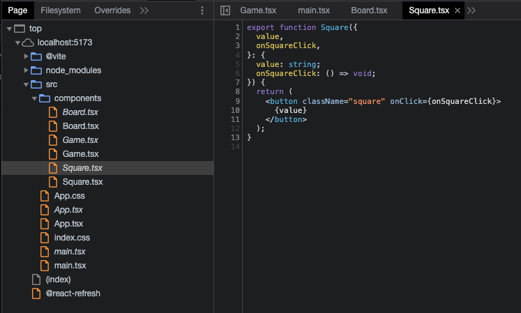

From here you can either navigate to the file you want to debug or you can use the search bar to find it. A smart way is with the command palette (Cmd + P on Mac, which should be Ctrl + P on Windows) and then type the name of the file you want to debug.

From here you can click on the line number to add a breakpoint and the code will pause when it reaches that line.

### Using the debugger; statement

Alternatively, you can add a `debugger;` statement in your code. When you switch to the browser and you use your app, you will see that nothing happens.

However, if you have the developer tools open, you’ll see that the debugger will pause the execution of the code on that line.

This can be useful if you want to debug a specific part of your code and you want a quick shortcut to add a breakpoint from your editor, but please don't forget to remove it before committing and pushing your code.

## Breakpoints

If you're not too familiar with debuggers, I already mentioned breakpoints without explaining what they are... but it's not much more complicated than what I already said.

In short, you tell the debugger that you want your code execution to pause when it reaches a specific line... and that's it!

On Chrome, the browser will pause and from there you'll be able to manually control the execution of the code... and do some more cool stuff I'll explain in a moment.

Last call, you can watch it [on video](https://youtu.be/t1aEXEvYzvM)!

### Conditional breakpoints

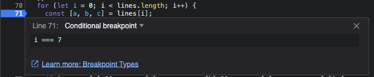

The name is self-explanatory, but I'll explain it with an example.

```js
for (let i = 0; i < 100; i++) {
  const winner = calculateWinner(players[i]);
  winner.doSomething();
}
```

I want to debug the `calculateWinner` function but only for the 87th iteration of the loop. With a regular breakpoint I would have to pause and resume the execution of the code 86 times... not ideal.

Instead, I can add a conditional breakpoint and tell the debugger to pause only if `i === 87`.

You can add a condition to a breakpoint by right-clicking on it and selecting "Conditional Breakpoint".

As simple as that, but reeeally powerful!

### Logpoints

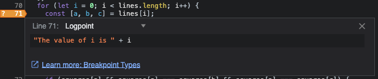

But console logs? I can't live without them!

Ok ok, you can set special breakpoints that are actually logpoints, it's the option right below conditional breakpoints in the menu.

This means that instead of pausing the execution of the code, the debugger will just log a message in the console.

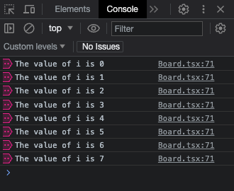

Advantages? You don't need to spread a ton of console.logs in the code that you would need to remove later, to begin with!

Removing a logpoint, as well as other breakpoints, really quick. How? Read the next chapter 👇

### Removing breakpoints

You can remove a breakpoint by clicking on it. If you want to remove all breakpoints, you can click on the "Deactivate breakpoints" button on the top right. This doesn't actually *remove* them, but it deactivates them so you can reactivate everything in a single click.

In any case, from the Breakpoints tab you can enable/disable and even remove breakpoints in a nice overview.

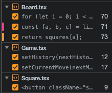

## Event listeners

If breakpoints, conditional breakpoints, logpoints and the `debugger` statement are not enough, I don't know what else you might be looking for.

Oh wait, it's in the title of this chapter: event listeners.

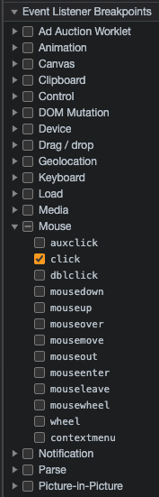

You can add special breakpoints that are triggered only when a specific event is fired.

To name one, you can add a breakpoint that is triggered only when you click on an element, as long as there's an event listener attached to it.

Building a React app? You press a button and the execution will pause on the first line of the function you attached to the `onClick` event.

## Using Chome's debugger

Ok, at this point you can't really say you don't know how to launch the debugger or that it's long or complicated. There are so many different ways of pausing the code exactly at the point you need.

Now, cool, but what can you do once there? Let's see some cool tricks ;)

### Values

The first thing you'll notice is that if you move your mouse over a variable, you'll see its value. This is already a huge improvement over console logs as you can see all of them without having to dig through a wall of text in the logs.

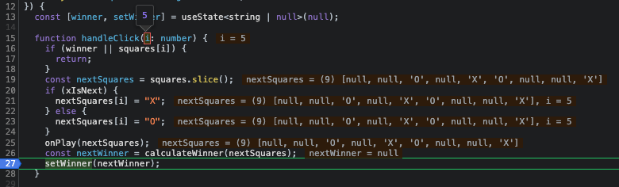

There's also the Scope tab that shows you all the variables in the current scope, grouped in Block, Local, Scope, Module and Global.

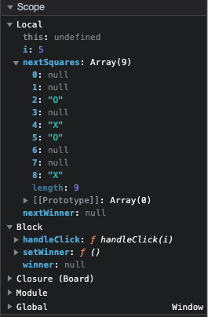

### Watch

If you want to keep an eye on a specific variable, you can add it to the Watch tab and it will be there for you to check at any time.

But this doesn't work only for variables, you can also add expressions. For example, you can add `players[i].name` and it will show you the name of the player at the current iteration of the loop, or if you're manipulating an array you can do `players.map(p => p.name)` and it will show you the names of all the players.

Last example, you can write a boolean expression like `players[i].name === 'Leonardo'` and it will show you if the condition is true or false while you step through the code.

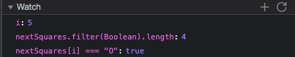

### Call stack

The Call Stack tab shows you the current stack of function calls. This is useful to understand how you got to the current point in the code.

For example, you have a function that is called from many different places and you want to know which one is calling it at the moment.

On the call stack you can exactly see that, all the previous functions that led the execution to the current one.

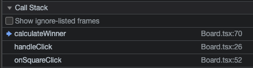

## Moving through time and space

Ok maybe the title is a bit too much, but you can do some cool stuff with the debugger to control the execution of the code.

## Resume

The first one is the Resume button. This will resume the execution of the code until the next breakpoint. If there are no more breakpoints, it will just run until the end.

You will find yourself using it quite often, for example if you have just one breakpoint to peek at the current state, or if the breakpoint was mostly to validate that the code was executed at all.

## Step over

On the second podium for usage you'll probably find the Step over button. This will execute the current line and then pause again on the next one.

If the current line is a function call, it will execute the function and pause on the next line after the function call.

## Step into

The Step into button is similar to the previous one, but instead of executing the current line, it will execute the function call and pause on the first line of the function.

## Step out

The Step out button is the opposite of the previous one. It will execute the current function and pause on the line after the function call.

## Conclusion

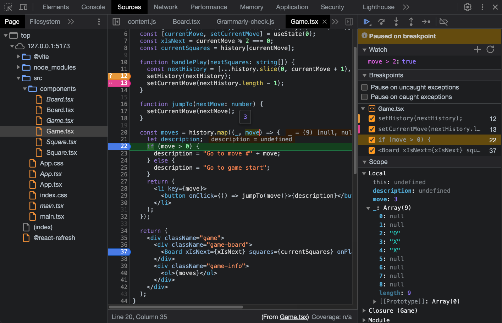

And that's it! This was just the tip of the iceberg, there are many more things you can do with the debugger, but I think this is enough to get you started and to make you curious to learn more.

After all these cool features, are you gonna continue using console log?

Here’s my answer, yes, because I’m lazy.

Or at least, if it’s only ONE console log to print a value once, yeah, why not, but as soon as you find yourself writing TWO console logs, or looking at the same log two or three times… think about the debugger. It will save you quite some time.

I tried to describe this tool and add some screenshots, but this was kind of a dynamic demo. The video already shows some cool tricks, but now it's your turn to try it out and see what you can do with it. Just use it for some days and you'll find yourself using it more and more.

Thanks for reading, and happy debugging! 🎉

---

Thanks for reading this article, I hope you found it interesting!

I recently launched my Discord server to talk about Open Source and Web Development, feel free to join: https://discord.gg/bqwyEa6We6

Do you like my content? You might consider subscribing to my YouTube channel! It means a lot to me ❤️
You can find it here:
[](https://www.youtube.com/channel/UC-KqnO3ez7vF-kyIQ_22rdA?sub_confirmation=1)

Feel free to follow me to get notified when new articles are out ;)

