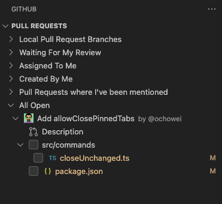
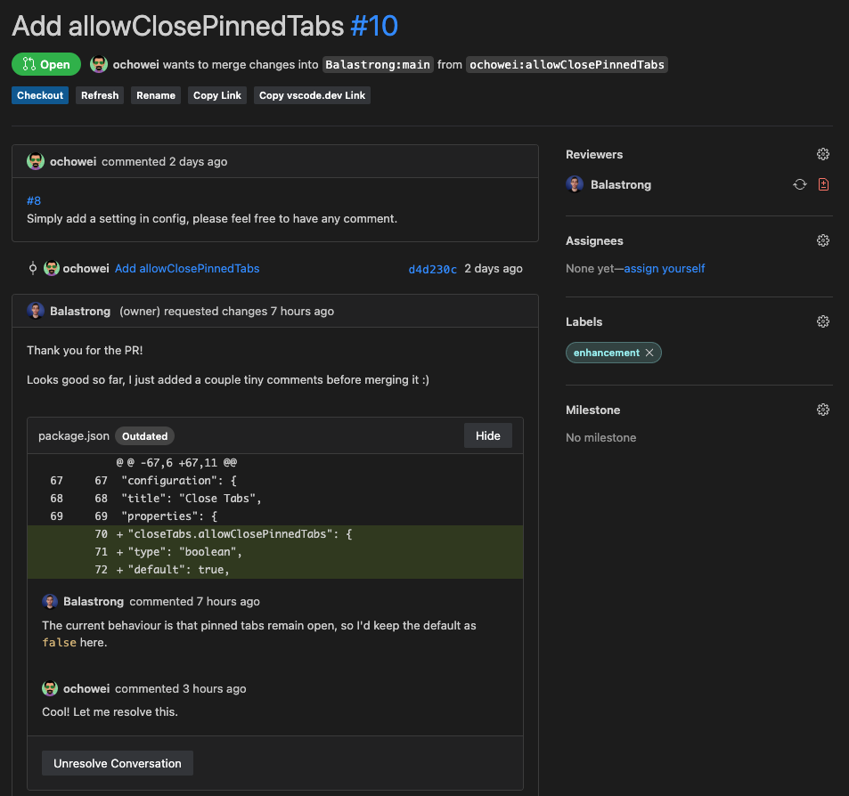
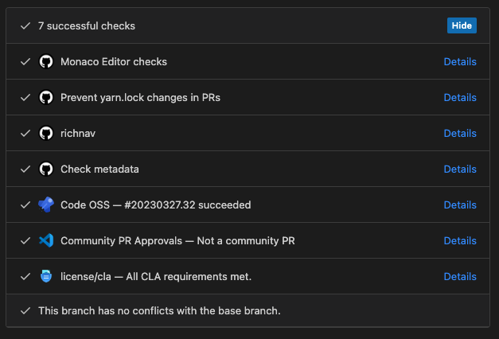

---
{
title: "Code Review on a GitHub Pull Request from Visual Studio Code",
published: "2023-03-28T14:05:31Z",
edited: "2023-04-03T13:36:36Z",
tags: ["vscode", "github", "tutorial", "codenewbie"],
description: "Doing Code Review 📖 on a GitHub Pull Request without leaving Visual Studio Code? Easy! 👇  Last week...",
originalLink: "https://leonardomontini.dev/code-review-vscode-github/",
coverImage: "cover-image.png",
socialImage: "social-image.png",
collection: "GitHub + Visual Studio Code",
order: 2
}
---

Doing Code Review 📖 on a GitHub Pull Request without leaving Visual Studio Code? Easy! 👇

Last week we learned how to create a PR from VSCode, today we'll see how to review it. Spoiler: you can do it from the extension you already installed last week 😉

I will showcase in the video all the advantages of reviewing a Pull Request from the editor, starting by checking out the branch with a single click so that you can compile it locally and test it.

Aaaand there's even more, as anticipated, this is part of a series of three videos so... there's one more coming out in the next few days!



Not a fan of video content? No problem, as usual I write down the concepts explained in the video in written form as well!

(I mean, if you want to watch the video and leave a like, that would be awesome! 😄)

---

## Install the official GitHub Extension

*(If you already installed the extension last week, you can skip this step!)*

The first thing you need to do is to install the official **GitHub Pull Requests and Issues** extension for Visual Studio Code. You can find it in the marketplace by searching for "GitHub" or by clicking [here](https://marketplace.visualstudio.com/items?itemName=GitHub.vscode-pull-request-github).


*Note*: make sure to not get confused, the extension called "GitHub" is an old one and deprecated. The new one is called "GitHub Pull Requests and Issues".

As soon as the extension is installed, you'll see a new icon in the Activity Bar on the left side of Visual Studio Code:


Opening it the first time will ask you to login to GitHub, just click on the button and a browser tab will open where you can login to your GitHub account.

## Changed files

The first thing you notice when selecting a Pull Request from the sidebar is the changed files.



When clicking on one of them a Diff Editor will open so that you can see the changes made to the file by comparing them to the base branch.

## Pull Request Overview

If you click on "Description" from the sidebar, you'll see the Pull Request overview:



From here you can see all the relevant information you can also find on the web UI on GitHub. It's not readonly though, but you can fully interact with it from the editor.

You can for example edit labels, assignees, reviewers, and even add comments.

## Add comments

Speaking of comments, we just saw you can add some to the Pull Request, but you can also add comments to specific lines of code and files!

The UI interaction is the same as on GitHub, you can add a comment by clicking on the line number and then clicking on the "Add comment" button or by dragging the mouse over the lines you want to comment, in case of a multiline comment.

## Checkout the branch

Probably the most interesting feature of the extension is the ability to checkout the branch of the Pull Request directly from the editor. This gives you a lot of advantages, for example you can run and build the code in local so you can test your application.

In case you don't have a CI/CD pipeline in place (you should though, at least CI), you can also run the tests locally to make sure they pass.

## Check GitHub Actions

Speaking of CI/CD, you can also check the status of the GitHub Actions workflow directly from the editor!



## Edit tabs

Before calling it a day, I want to show you another cool feature of the extension: the ability to edit the tabs and organize the filters in the sidebar.

If you hover the mouse on them, you notice a pencil icon. Click on it! It will open your local vscode settings and you can notice this piece of configuration:

```json
githubPullRequests.queries": [
    {
      "label": "Waiting For My Review",
      "query": "is:open review-requested:${user}"
    },
    {
      "label": "Assigned To Me",
      "query": "is:open assignee:${user}"
    },
    {
      "label": "Created By Me",
      "query": "is:open author:${user}"
    },
  ],
```

Do you recognize the labels? Those are the default ones defining your tabs when you install the extension! You can change them to whatever you want, for example I added one for PRs where I've been mentioned, by adding a new element to the array:

```json
{
  "label": "Pull Requests where I've been mentioned",
  "query": "is:open mentions:${user}"
}
```

The syntax is pretty straightforward, on label you put... the label! And on query you can define how PRs will be filtered as you would query them on GitHub.

## Conclusion

That's it for today!

Last week we learned how to create a Pull Request from Visual Studio Code, and today we saw how to give it a review. Who knows what's in part 3! What will we learn next week? Well.. I know but I'm not telling you! 😜

See you next week!

---

## The video series

As mentioned at the beginning of the article, this is the second of a trilogy about the GitHub+VSCode workflow.

Each article will be accompanied by a video on YouTube, you can find them here:

1. [Create a Pull Request from Visual Studio Code](https://youtu.be/Ma67EbIHi64)
2. [Review a Pull Request from Visual Studio Code](https://youtu.be/DSl-L6B_Qb4)
3. [GitHub Issues on Visual Studio Code](https://youtu.be/-nfUgBLBTIo)

---

Thanks for reading this article, I hope you found it interesting!

I recently launched my Discord server to talk about Open Source and Web Development, feel free to join: https://discord.gg/bqwyEa6We6

Do you like my content? You might consider subscribing to my YouTube channel! It means a lot to me ❤️
You can find it here:
[](https://www.youtube.com/channel/UC-KqnO3ez7vF-kyIQ_22rdA?sub_confirmation=1)

Feel free to follow me to get notified when new articles are out ;)

