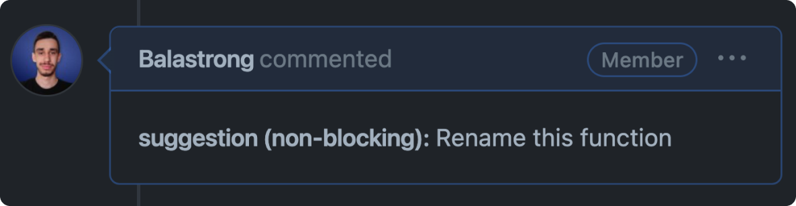

---
{
title: "Conventional Comments: Stop Fighting in Code Reviews",
published: "2024-02-13T14:51:42Z",
edited: "2024-02-14T07:47:27Z",
tags: ["beginners", "codenewbie", "github"],
description: "I’m sure you’ve heard about conventional commits, but what about conventional comments?           The...",
originalLink: "https://leonardomontini.dev/",
coverImage: "cover-image.png",
socialImage: "social-image.png",
collection: "Mastering GitHub",
order: 7
}
---

I’m sure you’ve heard about conventional commits, but what about conventional **comments**?

## The Problem

Code Reviews can go terribly wrong. They're quite a delicate aspect of our daily job and require trained skills and mindset to approach them the right way.

It is so easy to get misunderstood and start pointless discussions, often overlooking critical aspects instead.

I recently discovered a tool, that is in fact a set of rules, to help focus on what really matters and avoid arguments and wasting of time.



## Conventional Comments

The idea is similar to conventional commits, adding labels, decorators and context to your comments.

Something like this:

```
<label> [decorations]: <subject>

[discussion]
```

### Labels

This is relly similar to conventional commits, a label to define the type of the comment. It can be a *suggestion*, a *praise*, a *nitpick* or a proper *issue*.

### Decorations

Here you can make a more defined scope, for example if the comment is an *issue* and it is about the performance, your comment might look like this:

```
issue(performance)
```

### Subject

A short summary of your comment, basically what you would write in the title of an issue.

Following the previous example:

```
issue(performance): This can cause an endless loop of re-renders
```

### Discussion

However, this might still seem sharp or a bit too vague, that's why you might need to add an extra discussion or actionable item to make it more clear and prevent possible follow-up questions.

```
issue(performance): This can cause an endless loop of re-renders

Do we need this in the dependency array? We can achieve the same result by moving it to Line 67.
```

## Conventional Comment specification

This was a brief introduction to the concept, but there is a full specification available at [conventionalcomments.org](https://conventionalcomments.org).

You can find all the details on that page and I also recorded myself while scrolling through it and commenting it live, you can watch it in the video below:



---

Thanks for reading this article, I hope you found it interesting!

I recently launched a GitHub Community! We create Open Source projects with the goal of learning Web Development together!

Join us: https://github.com/DevLeonardoCommunity

Do you like my content? You might consider subscribing to my YouTube channel! It means a lot to me ❤️
You can find it here:
[](https://www.youtube.com/c/@DevLeonardo?sub_confirmation=1)

Feel free to follow me to get notified when new articles are out ;)

