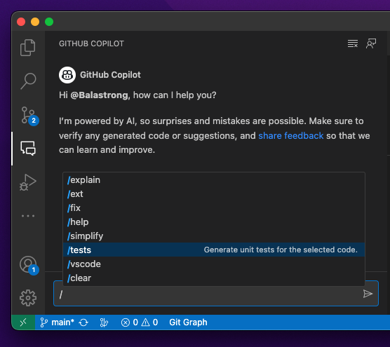

---
{
title: "Copilot Chat writes Unit Tests for you!",
published: "2023-05-18T06:53:23Z",
edited: "2024-04-29T16:39:13Z",
tags: ["github", "testing", "ai", "githubcopilot"],
description: "We don't write tests because we don't have time.   How many times have you heard that? Or maybe you...",
originalLink: "https://leonardomontini.dev/copilot-x-chat-unit-test/",
coverImage: "cover-image.png",
socialImage: "social-image.png",
collection: "GitHub Copilot",
order: 4
}
---

> We don't write tests because we don't have time.

How many times have you heard that? Or maybe you said it yourself? I know you did, we all do at some point.

The thing is, you should probably also know it's not a valid reason. The time you usually spend manually testing your code (for example, by running the app and clicking around), in addition to all the time spent in fixing bugs, is way more than the time you'd spend writing the tests.

Oh, imagine one day you have to edit again that part of the code, you forgot what a specific method does and a tiny change causes a bug that the client will find a week later. Great, you now have an angry client and you're also in a hurry to fix it.

Still not having time to write tests?

## Copilot Chat

One of the coolest features of Copilot Chat, one of the tools in the Copilot X suite, is the ability to generate unit tests for you. You just need to select a block of code and ask Copilot to write the tests for you.

Cool, it will make you and me save so much time!

But... is it reliable? Let's find out.

## Points of attention

Yeah sure, in a single click, you have a bunch of tests written for you. But you should pay attention to some details.

I'll further explore the following topics in the video:

- **Copilot tries to guess the logic of your code** -
  If it's right, it will help you find bugs. Is it wrong? Well, you'll have a bunch of tests that don't make sense.
- **Copilot doesn't know what you're testing** - It will generate tests for the code you selected, but it doesn't know what you're trying to test. In some cases might be more noise than signal.
- **Copilot doesn't know your business logic** - If you wrote code that actually makes sense, Copilot will generate tests that make sense. But what if your business logic is not what the client asked? The generated tests will validate the wrong logic.
- **The scope is limited to the selected code** - If in the method you're trying to test you're calling other methods in other files, Copilot doesn't know what's inside and will try to guess.

## Demo

If you're curious and you want to see it in action, check out the video below:

<iframe src="https://www.youtube.com/watch?v=Psm86eIvmdc"></iframe>

---

I might sound boring at this point, but the closing chapter of all of my Copilot/AI posts is pretty much always the same.

These are incredibly amazing tools, they speed up our work a lot giving us more time to deliver quality products and more value to our clients, BUT, we should always be careful, eyes open, and make sure we understand what we're doing and what the tools are doing for us.

Will I use it to generate tests? Probably yes. Will I use the generated tests as they are? Probably not.

What do you think? Let me know!

---

Thanks for reading this article, I hope you found it interesting!

I recently launched my Discord server to talk about Open Source and Web Development, feel free to join: https://discord.gg/bqwyEa6We6

Do you like my content? You might consider subscribing to my YouTube channel! It means a lot to me ❤️
You can find it here:

Feel free to follow me to get notified when new articles are out ;)

<!-- ::user id="balastrong" -->
