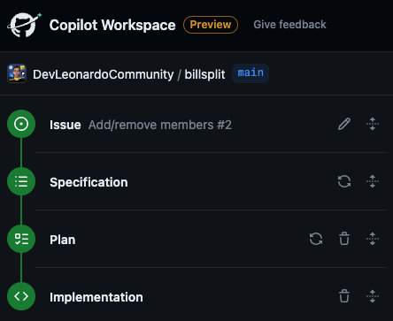
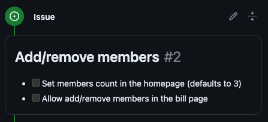
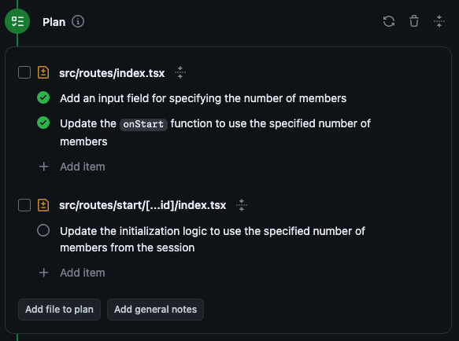
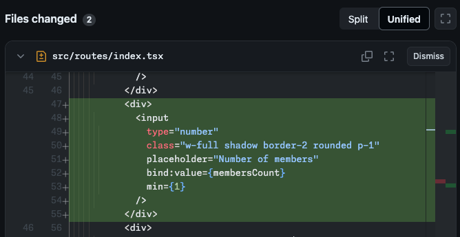
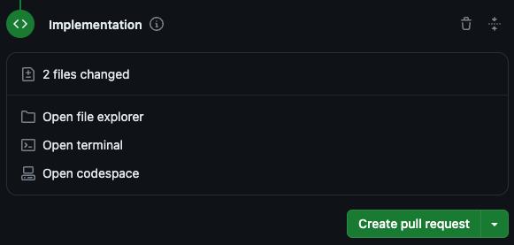

---
{
title: "Copilot Workspace - GitHub's latest innovation",
published: "2024-04-29T16:41:10Z",
tags: ["github", "githubcopilot", "ai", "news"],
description: "GitHub just announced Copilot Workspace a new integrated AI feature with Copilot being your companion...",
originalLink: "https://leonardomontini.dev/copilot-workspace/",
coverImage: "cover-image.png",
socialImage: "social-image.png",
collection: "GitHub Copilot",
order: 6
}
---

GitHub just announced [Copilot Workspace](https://github.blog/2024-04-29-github-copilot-workspace/) a new integrated AI feature with Copilot being your companion through the entire development process, not only with code.

It works in 4 steps:

I recorded a short demo to see it in action, enjoy:



## 1. Issue/Task

*Everything begins with an open issue (or even a simple prompt)*

Copilot can read the selected issue and all the comments, getting knowledge and context of the user's needs.

## 2. Specification

*A summary of the proposed changes, and how they relate to the current behavior*

The AI identifies the exact scope and tries to compare the current state (as is) with the desired outcome (to be).

A list with bullet points is generated to even further define the scope and you, the developer, can edit and improve to fix misunderstandings or cover edge cases.

## 3. Plan

*A summary of the file changes that are needed to complete the current task*

The plan is made of a list of files that can be created, modified, deleted or renamed. For each file Copilot describes the actions it’s going to take.

Once again you can revise and touch up the plan before moving on to the next part, the actual coding.

## 4. Implementation

*A list of files that have changed, and the tools needed to validate them*

For each file listed in the Plan, Copilot writes the proposed changes and shows them in a handy diff editor, which as the name suggests, is editable!

From here you can do the final touches to the code hit the Create pull request button, but more often than not you might want to run the app before creating the PR and Codespaces is the answer!

There’s a button to spin a Codespaces container where you can run your app, validate the changes and eventually create the pull request.

## That's it!

The entire process runs really smoothly with an intuitive UI and what I like the most is that you can always go back and forth between the steps, edit, and improve the generated content.

Coding with an AI assistant is great but I don't think we're yet at the point where we can just sit back and watch the magic happen. It's still like a pair programming session and being able to edit the specification (step 2) and the plan (step 3) even before generating the code makes me feel way more in control, increasing the chances of a successful implementation.

The innovation coming from the [GitHub Next](https://githubnext.com/) team is unbelievable!

---

Do you want to see it in action? You can watch a demo I recorded on YouTube: <https://youtu.be/FARf9emEPjI>

---

Thanks for reading this article, I hope you found it interesting!

I recently launched a GitHub Community! We create Open Source projects with the goal of learning Web Development together!

Join us: https://github.com/DevLeonardoCommunity

Do you like my content? You might consider subscribing to my YouTube channel! It means a lot to me ❤️
You can find it here:

Feel free to follow me to get notified when new articles are out ;)

