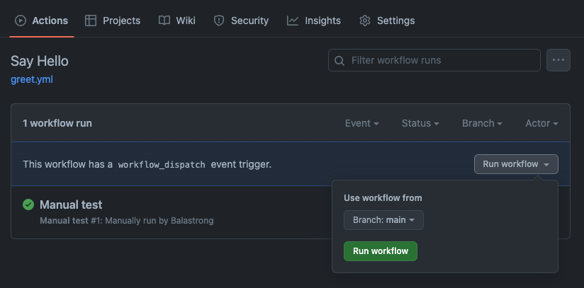
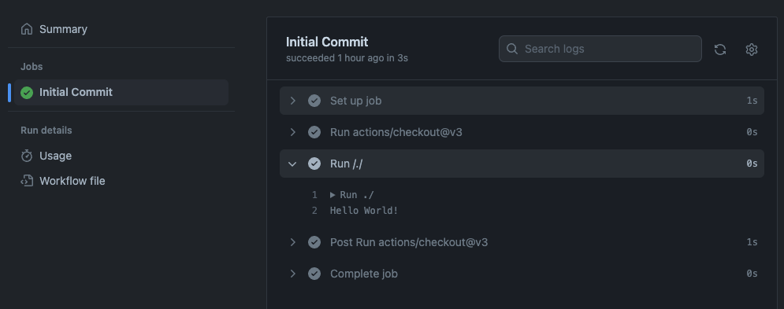
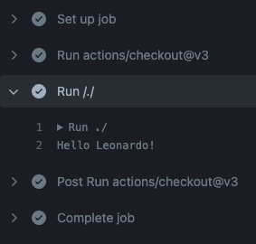
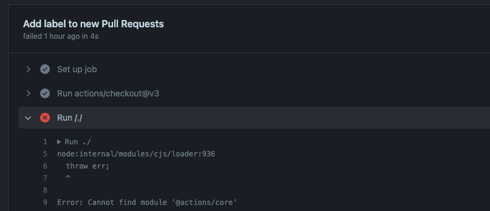
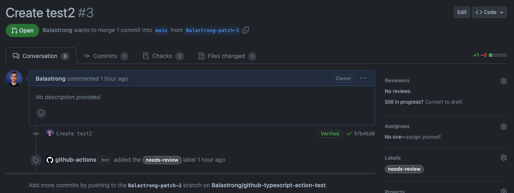
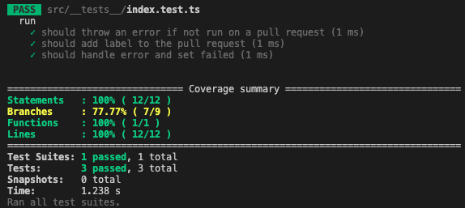
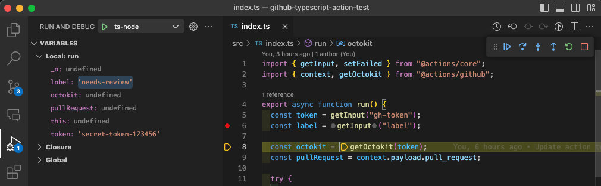
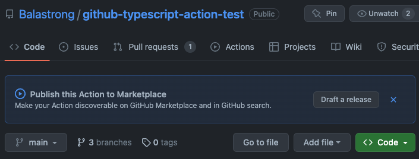
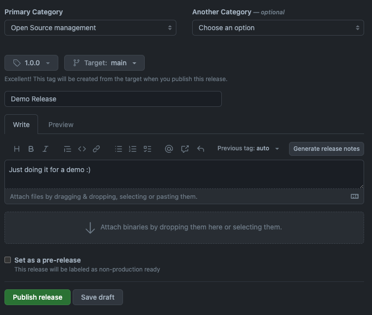

---
{
title: "Create and Publish a GitHub Action in Typescript",
published: "2023-06-12T10:37:13Z",
edited: "2023-08-10T08:43:06Z",
tags: [],
description: "GitHub Actions are a powerful tool to automate your workflow. They can be used to run tests, deploy...",
originalLink: "https://leonardomontini.dev/typescript-github-action",
coverImage: "cover-image.png",
socialImage: "social-image.png",
collection: "GitHub Actions",
order: 4
}
---

GitHub Actions are a powerful tool to automate your workflow. They can be used to run tests, deploy your code, publish a package, and much more.

The cool thing is, there's a GitHub Actions Marketplace where you can find a lot of actions created by... the community. But what if you can't find the action you need? You can create your own and publish it there!

In this tutorial we're going to see in detail how to:

- Create a GitHub Action in Typescript
- Expand our Action to support custom inputs
- Integrate with GitHub's API to add labels to Pull Requests
- Unit testing our action
- Debugging in Visual Studio Code
- Publishing our action to the GitHub Marketplace
- Using our action in another repository
- Some final touches to make our project more robust

## How to use this tutorial {#how-to-use-this-tutorial}

This post will be much longer than usual, you can skip through the chapters from the table of contents below, but I'd recommend you to follow each step and not skip anything.

One more great piece of advice is to create a new repository and follow along with the steps. This way you'll have a working action at the end of the post and you'll be able to play with it and experiment, rather than just reading a long tutorial and forgetting about 90% of it.

The full code of this tutorial is available on GitHub on [this repo](https://github.com/Balastrong/ga-label-issue), so you can always refer to it if you get stuck.

Last, but not least, I also recorded a video version of this tutorial, so if you prefer to watch it instead of reading, you can do so here.

<iframe src="https://www.youtube.com/watch?v=N26xgQ7kLKo"></iframe>

- [How to use this tutorial](#how-to-use-this-tutorial)
- [Building an MVP](#building-an-mvp)
  - [Action Definition](#action-definition)
  - [Project setup](#project-setup)
  - [Project code](#project-code)
  - [Building the action](#building-the-action)
  - [Creating the repository](#creating-the-repository)
- [Running the Action](#running-the-action)
  - [Creating a workflow](#creating-a-workflow)
  - [Running the workflow](#running-the-workflow)
  - [Running the action locally](#running-the-action-locally)
- [Reading inputs](#reading-inputs)
  - [Add inputs to the action definition](#add-inputs-to-the-action-definition)
  - [Read the input in the action code](#read-the-input-in-the-action-code)
  - [Update the workflow](#update-the-workflow)
  - [Run the hello action](#run-the-hello-action)
- [Use case: Adding a label to new Pull Requests](#use-case--adding-a-label-to-new-pull-requests)
  - [Update the action code](#update-the-action-code)
  - [Update the action definition](#update-the-action-definition)
  - [Update the workflow](#update-the-workflow-1)
  - [Run the action](#run-the-action)
  - [Run the action (2.0)](#run-the-action--20-)
- [Testing the action](#testing-the-action)
  - [Setup](#setup)
  - [Additional changes](#additional-changes)
  - [Writing the tests](#writing-the-tests)
  - [Running the tests](#running-the-tests)
- [Debugging the action](#debugging-the-action)
  - [Setup](#setup-1)
  - [Debugging](#debugging)
  - [Inputs](#inputs)
- [Publishing the action](#publishing-the-action)
  - [Branding](#branding)
  - [Publishing](#publishing)
  - [Going live on the GitHub Marketplace](#going-live-on-the-github-marketplace)
  - [Using your action](#using-your-action)
- [Final touches](#final-touches)
  - [Keeping dist up to date](#keeping-dist-up-to-date)
  - [Formatting & Linting](#formatting---linting)
- [Closing](#closing)

## Building an MVP {#building-an-mvp}

Let's begin with an MVP (Minimum Viable Product) of our GitHub Action.

We'll start simple with an action having only the required parts to understand the basics, then we'll add more features to it.

### Action Definition {#action-definition}

The definition is stored in the `action.yml` file, put directly in the root of the repository.

```yaml
name: 'My Custom Action'
description: 'Say Hello'
author: 'Leonardo Montini'

runs:
  using: 'node16'
  main: 'dist/index.js'
```

The most minimal action definition is composed of a name and a `runs` object to define how the action is executed and what file to run. `description` and `author` are optional.

In case your action has some inputs, they will be defined in the `action.yml` file as well, in the `inputs` object.

```yaml
inputs:
  name:
    description: 'The name of the person to greet'
    required: true
    default: 'World'
```

When publishing the action to the store, you might want to customize the appearance of the action in the marketplace. This can be done by adding a `branding` object to the `action.yml` file.

```yaml
branding:
  icon: 'activity'
  color: 'green'
```

Anyway, for this MVP the first snippet will be enough.

### Project setup {#project-setup}

Let's create an empty node project with `npm init -y`.

You can now open `package.json` and add the build script.

```json
{
  "scripts": {
    "build": "tsc"
  }
}
```

Since we want to use Typescript, we'll need to install it as a dev dependency.

```bash
npm install -D typescript
```

Then we'll create a `tsconfig.json` by running `npx tsc --init` and we'll edit it to match our needs.

```json
{
  "compilerOptions": {
    "target": "ES2019",
    "module": "commonjs",
    "outDir": "lib",
    "esModuleInterop": true,
    "forceConsistentCasingInFileNames": true,
    "strict": true,
    "skipLibCheck": true
  }
}
```

### Project code {#project-code}

We can now create the `src/index.ts` file and start writing our action.

```ts
console.log('Hello World!');
```

We're building an MVP, right? So let's keep it simple for now and focus on all the required steps. We'll have time to expand it later.

### Building the action {#building-the-action}

We can now build the action by running `npm run build` which will execute the `tsc` command as we defined in the `package.json` file.

This will create a `dist` folder containing the compiled code.

```bash
dist
└── index.js
```

In case you see `index.js` generated in the root of the project or inside `src/`, you might want to add make sure the `outDir` option to the `tsconfig.json` file is properly set to `dist`.

### Creating the repository {#creating-the-repository}

In case you haven't done it yet, it's time to create a git repository as we'll need to push our code to GitHub soon.

```bash
git init
```

Don't forget to add a `.gitignore` file to the project to avoid committing files that shouldn't be tracked by git, for example, the `node_modules` folder.

A quick way to do it is by running `npx gitignore node` which will create a `.gitignore` file with the most common entries for a node project.

**Note**: in this particular case we want to push the `dist` folder to GitHub, so we'll need to remove the `dist` entry from the `.gitignore` file.

```bash
git add .
git commit -m "Initial commit"
git remote add origin
git push -u origin main
```

## Running the Action {#running-the-action}

We're all set! It's time to run our action.

### Creating a workflow {#creating-a-workflow}

On GitHub, Actions are executed by workflows. A workflow is defined in a `.yml` file stored in the `.github/workflows` folder of the repository so let's create it.

```bash
mkdir -p .github/workflows
touch .github/workflows/greet.yml
```

The name of the file doesn't matter, but it's good practice to give it a meaningful name.

What matters is the content of the file, which defines the workflow. To keep it simple, here are the minimal instructions you need.

```yaml
name: Say Hello

on:
  workflow_dispatch:

jobs:
  run-my-action:
    name: Checks if this action works
    runs-on: ubuntu-latest
    steps:
      - uses: actions/checkout@v3
      - uses: ./
```

In this case, the action will checkout the current repository and then run the action we just created. We put `./` as the action path because we want to run the action from the current repository, but we could also use a different repository.

How does GitHub know what action to run? It's defined in the `action.yml` file we created earlier.

One more line worth mentioning is `on: workflow_dispatch:` which tells GitHub to run the workflow when we manually trigger it from the Actions tab. I recorded a dedicated video about running [GitHub Actions manually](https://youtu.be/KGfncu595pc), if you want to learn more about it.

### Running the workflow {#running-the-workflow}

We can now push our code to GitHub and see the action in action!

```bash
git add .
git commit -m "Add workflow"
git push
```

Once the code is pushed, we can go to the Actions tab and trigger the workflow manually.



The workflow will start running and we'll see the logs of the action in the console.



Congratulations! You just created and ran your first GitHub Action!

### Running the action locally {#running-the-action-locally}

In case you want to run the action locally, without having to commit/push every time, you can use the [act](https://github.com/nektos/act) tool.

```bash
npm install -g act
```

Then you can run the action by executing `act` in the root of the repository.

```bash
act
```

You can find more in my video about [running GitHub Actions locally](https://youtu.be/Ugonll0e2Os).

## Reading inputs {#reading-inputs}

Let's make our action a bit more interesting by reading an input from the workflow.

### Add inputs to the action definition {#add-inputs-to-the-action-definition}

As usual, the first step is to define the input in the `action.yml` file.

```yaml
inputs:
  name:
    description: 'The name of the person to greet'
    required: true
    default: 'World'
```

### Read the input in the action code {#read-the-input-in-the-action-code}

Then we can read the input in the action code.

```ts
const name = getInput('name');

console.log(`Hello ${name}!`);
```

But where does the `getInput` function come from? It's defined in the `@actions/core` package, which we need to install.

```bash
npm install @actions/core
```

And then add the import on top of the `index.ts` file.

```ts
import { getInput } from '@actions/core';
```

### Update the workflow {#update-the-workflow}

Finally, we need to update the workflow to pass the input to the action.

```yaml
- uses: ./
  with:
    name: 'Leonardo'
```

By adding the `with` section, we're passing the `name` input to the action.

### Run the hello action {#run-the-hello-action}

We can now run the action again and see the input being passed to the action.



If it doesn't work (`Error: Cannot find module '@actions/core'`) that's ok, we'll fix it in the next section when we inluce `@vercel/ncc` in the workflow.

## Use case: Adding a label to new Pull Requests {#use-case--adding-a-label-to-new-pull-requests}

We learned the basics, we have our MVP ready to be expanded so let's do it! We'll create a new action that will automatically run every time a new Pull Request is created and it will add a `needs-review` label to it.

### Update the action code {#update-the-action-code}

In order to add a label to a Pull Request, we need to use the [GitHub REST API](https://docs.github.com/en/rest). We can use the Octokit client to make the API calls. Luckily for us there's an official package we can use.

```bash
npm install @actions/github
```

Then we can import the `Octokit` client and use it to add the label to the Pull Request. Here's the full code.

```ts
import { getInput, setFailed } from '@actions/core';
import { context, getOctokit } from '@actions/github';

async function run() {
  const token = getInput('gh-token');
  const label = getInput('label');

  const octokit = getOctokit(token);
  const pullRequest = context.payload.pull_request;

  try {
    if (!pullRequest) {
      throw new Error('This action can only be run on Pull Requests');
    }

    await octokit.rest.issues.addLabels({
      owner: context.repo.owner,
      repo: context.repo.repo,
      issue_number: pullRequest.number,
      labels: [label],
    });
  } catch (error) {
    setFailed((error as Error)?.message ?? 'Unknown error');
  }
}

run();
```

What happened here?

1. We read the `gh-token` and `label` inputs from the workflow. The token is a [personal access token](https://docs.github.com/en/github/authenticating-to-github/creating-a-personal-access-token) that we need to create and pass to the action. More on that later. The label is the name of the label we want to add to the Pull Request.
2. We create an instance of the `Octokit` client using the token.
3. We get the Pull Request number from the `context.payload.pull_request` object. This object is only available when the action is triggered by a Pull Request event.
4. We call the `octokit.rest.issues.addLabels` method to add the label to the Pull Request.

In case something fails, we catch the error and we set the workflow as failed with the `setFailed` function, also coming from the `@actions/core` package.

### Update the action definition {#update-the-action-definition}

We also need to update the action definition to add the new inputs.

```yaml
inputs:
  gh-token:
    description: 'The GitHub token for authentication.'
    required: true
  label:
    description: 'The label to be applied to the pull request.'
    required: true
```

### Update the workflow {#update-the-workflow-1}

Finally, we need to update the workflow to run when PRs are opened or reopened:

```yaml
on:
  pull_request:
    types: [opened, reopened]
```

...and to pass the new inputs to the action.

```yaml
- uses: ./
  with:
    gh-token: ${{ secrets.GITHUB_TOKEN }}
    label: 'needs-review'
```

We're passing the `GITHUB_TOKEN` secret to the action. It usually does not require you any extra action, as GitHub automatically creates it for you.

In case you get an error that says "Resource not accessible by integration", you need to make sure your token on that repository has write access. You can do that by going to the Settings tab > Actions > General and scroll down to the "Workflow permissions" section.

Setting it to "Read and write permissions" will be enough.


### Run the action {#run-the-action}

We can now run the action again and see the label is added to the Pull Request.

However, let's not forget to run `npm run build` first, then we can commit and push the changes. The reason is that we told GitHub that the action is located in the `dist` folder, so we need to make sure that folder is up to date.

```bash
npm run build
git add .
git commit -m "Add label to new Pull Requests"
git push
```

Cool! We can now create a new branch, change a file and open a Pull Request. We'll see the action running and adding the label to the Pull Request, aaaand...



```
Error: Cannot find module '@actions/core'
```

What happened here? If you look at your file in `dist/index.js`, you'll see that the `@actions/core` package is not there. That's because we didn't tell TypeScript to include it in the build.

A good way to include packages and condense everything in one file is with the tool `@vercel/ncc`. Let's install it.

```bash
npm install @vercel/ncc
```

Then we can update our `build` script in `package.json` to use it.

```json
 "build": "tsc && ncc build lib/index.js"
```

We also need to change `outDir` in `tsconfig.json` to `lib`.

```json
"outDir": "lib"
```

You might also want to double-check that `lib` is in your `.gitignore` file but `dist` is not. This is our desired behavior as `lib` will only have our code in javascript, but `dist` will have the whole action.

### Run the action (2.0) {#run-the-action--20-}

We can now run `npm run build` again, then commit and push the changes.

Create a new branch, change a file and open a Pull Request. This time, you'll see the action running and adding the label to the Pull Request.



## Testing the action {#testing-the-action}

You wouldn't push code into production without testing it, right? So let's write some tests for our action.

### Setup {#setup}

We'll use [Jest](https://jestjs.io/) to write our tests. It works out of the box with Javascript but needs a little bit of configuration to work with TypeScript.

```bash
npm install -D jest ts-jest @types/jest
```

We also need to create a new config file for jest, in the root of our project, called `jest.config.json`.

```json
{
  "preset": "ts-jest",
  "testEnvironment": "node",
  "collectCoverage": true,
  "coverageReporters": ["lcov", "text-summary"],
  "collectCoverageFrom": ["src/**/*.ts"],
  "coveragePathIgnorePatterns": ["/node_modules/", "/__tests__/"],
  "testPathIgnorePatterns": ["/node_modules/"]
}
```

We're telling jest to use the `ts-jest` preset, to run the tests in node, to collect coverage and to ignore some files.

### Additional changes {#additional-changes}

Without any extra configuration, the build will also include test files, which we don't want. On tsconfig.json, we can add a new `exclude` property.

```json
"exclude": ["node_modules", "**/*.test.ts"]
```

And also, if we'd run tests now, everything would run twice.

Why?

Because at the end of our `index.ts` file, we're calling the `run` function. This is the entry point of our action, and we want to run it when the action is triggered. However, we don't want it to run by default when we import the file in our tests.

A possible solution is to wrap the call to `run` in an `if` statement that checks if a jest environment variable is set.

```ts
if (!process.env.JEST_WORKER_ID) {
  run();
}
```

### Writing the tests {#writing-the-tests}

We can now create a new file called `index.test.ts` in the `src/__tests__` folder. This is where we'll write our tests.

I have to say I'm a bit lazy so I asked GitHub Copilot to write the tests for me (guess what, I also made a video on this topic). At first, they were not passing, but after a few tweaks, I got them to pass. Here's an extract, but you can find the full file in the repository.

```ts
import { run } from '../index';
import { getInput, setFailed } from '@actions/core';
import { context, getOctokit } from '@actions/github';

// Mock getInput and setFailed functions
jest.mock('@actions/core', () => ({
  getInput: jest.fn(),
  setFailed: jest.fn(),
}));

// Mock context and getOctokit functions
jest.mock('@actions/github', () => ({
  context: {
    payload: {
      pull_request: {
        number: 1,
      },
    },
    repo: {
      owner: 'owner',
      repo: 'repo',
    },
  },
  getOctokit: jest.fn(),
}));

describe('run', () => {
  beforeEach(() => {
    // Clear all mock function calls and reset mock implementation
    jest.clearAllMocks();
  });

  it('should add label to the pull request', async () => {
    // Mock the return values for getInput
    (getInput as jest.Mock).mockReturnValueOnce('gh-token-value');
    (getInput as jest.Mock).mockReturnValueOnce('label-value');
    (context as any).payload.pull_request = {
      number: 1,
    };

    // Mock the Octokit instance and the addLabels method
    const mockAddLabels = jest.fn();
    const mockOctokit = {
      rest: {
        issues: {
          addLabels: mockAddLabels,
        },
      },
    };
    (getOctokit as jest.Mock).mockReturnValueOnce(mockOctokit);

    // Run the function
    await run();

    // Assertions
    expect(getInput).toHaveBeenCalledWith('gh-token');
    expect(getInput).toHaveBeenCalledWith('label');
    expect(getOctokit).toHaveBeenCalledWith('gh-token-value');
    expect(mockAddLabels).toHaveBeenCalledWith({
      owner: 'owner',
      repo: 'repo',
      issue_number: 1,
      labels: ['label-value'],
    });
    expect(setFailed).not.toHaveBeenCalled();
  });
});
```

### Running the tests {#running-the-tests}

Now it's finally time to get rid of that `"test": "echo \"Error: no test specified\" && exit 1"` script in `package.json`. Just replace it with:

```json
"test": "jest"
```

This will run jest with the configuration we just created. If you want to run the tests in watch mode, you can use `jest --watch`.

We can now run `npm test` to run the tests. You should see something like this:



Our action works as intended and we have some tests to prove it!

## Debugging the action {#debugging-the-action}

Our favourite tool is flooding the code with console.log, but we all know there's a better way to debug code. Let's see how we can debug our action with Visual Studio Code.

### Setup {#setup-1}

To get started, we need one more package in our dev dependencies: `ts-node`. This will allow us to run our action directly from the source code, without having to build it first.

```bash
npm install -D ts-node
```

With vscode, the launch configuration is stored in a file called `launch.json`. We can create it by clicking on the debug icon in the sidebar and then on the gear icon, or manually by creating a `.vscode/launch.json` file with this content:

```json
{
  "version": "0.2.0",
  "configurations": [
    {
      "name": "ts-node",
      "type": "node",
      "request": "launch",
      "args": ["./src/index.ts"],
      "runtimeArgs": ["-r", "ts-node/register"],
      "cwd": "${workspaceRoot}",
      "internalConsoleOptions": "openOnSessionStart"
    }
  ]
}
```

### Debugging {#debugging}

You can now put a breakpoint in your code and click on the play button in the debug sidebar. This will start the debugger and run your action. You can also use the `F5` key to start the debugger.

In this specific example, there isn't too much to debug, but if you're working on a more complex action, this can be a lifesaver.

### Inputs {#inputs}

Ah, I almost forgot, what if your action has some inputs? How can you debug it?

You can store them directly in your launch configuration as environment variables with the following rules, the will get picked up by `getInput`:

- prefix the name of the input with `INPUT_`
- name the input in uppercase

In our example it would be something like this:

```json
{
  "version": "0.2.0",
  "configurations": [
    {
      "name": "ts-node",
      "type": "node",
      "request": "launch",
      "args": ["./src/index.ts"],
      "runtimeArgs": ["-r", "ts-node/register"],
      "cwd": "${workspaceRoot}",
      "internalConsoleOptions": "openOnSessionStart",
      "env": {
        "INPUT_GH-TOKEN": "secret-token-123456",
        "INPUT_LABEL": "needs-review"
      }
    }
  ]
}
```

If you now hit `F5` to start the debugger, you'll see that the environment variables are available in your action and are properly read by `getInput`.



## Publishing the action {#publishing-the-action}

The paragraph you've all been waiting for. I'm sure you also skipped the previous one about debugging to jump straight to this one.

### Branding {#branding}

Hold on for a second, if you remember we mentioned the `branding` section in the `action.yml` file. Let's see what it's all about.

```yaml
branding:
  icon: 'activity'
  color: 'green'
```

This will add a nice icon and a color to your action in the GitHub Marketplace. You can find the list of available icons [here](https://docs.github.com/en/actions/creating-actions/metadata-syntax-for-github-actions#branding).

### Publishing {#publishing}

Ok, here we are!

How do we publish our action? Just look at your GitHub repo. If you've properly set up an `action.yml` file, you should see a banner at the top of the page like this one:



### Going live on the GitHub Marketplace {#going-live-on-the-github-marketplace}

Click on `Draft a release` and you will get to a page where you can set up all the required/missing information, for example, a well-written and informative `README.md`file.

You can decide if you only want to make the action available to everyone, or you also want it to be published and discoverable in the GitHub Marketplace. You can also select a primary and a secondary category from the list of available ones.

The next step will be creating a tag and an official release for your action.



Almost there... click the `Publish release` green button and you're done!

Congratulations, you've just published your first GitHub Action!

### Using your action {#using-your-action}

Now that you've published your action, everyone can use it in their workflows!

Just create a new file in your repo, for example `.github/workflows/label.yml` and add the following content:

```yaml
name: Label PR

on:
  pull_request:
    types: [opened, reopened]

jobs:
  label:
    runs-on: ubuntu-latest
    steps:
      - uses: actions/checkout@main
      - uses: Balastrong/gh-aciton-test@latest
        with:
          gh-token: ${{ secrets.GITHUB_TOKEN }}
          label: needs-review
```

To specify the version, you can either use `owner/repo@{version}` (with `{version}` being the tagged version on the repo, like `v1.0.0`) or `owner/repo@branch`.

---

## Final touches {#final-touches}

The action is complete, it's live in the store and it works on all GitHub repositories, but unless it's 100% complete and you won't ever update it again, you still have some room for improvements for a better developer experience (DX is quite trending these days).

### Keeping dist up to date {#keeping-dist-up-to-date}

One thing which will annoy you in this workflow is pushing new code and forgetting to also update the `dist` content.

I mean, all you have to do is just make sure to run `npm run build` before pushing, but if something relies on "just remember to do it"... well... good luck!

A simple way to solve this is to use a git hook. You can use the `pre-commit` hook to run a script at each commit in your repository. This will work for you, but what if you're working with other people? Ah, just kindly tell them to install the hook as well... did I already say good luck?

🐶

A Dog?

Yes, specifically a Husky!

[Husky](https://typicode.github.io/husky/) is a tool which allows you to easily add git hooks to your project. It's very easy to set up and it will make sure that everyone who clones your repo will have the hooks installed as well, as they are part of the project and get installed with the dependencies, right after running `npm install`. No need to rely on people remembering to install them!

Let's follow the [official docs](https://typicode.github.io/husky/getting-started.html) and install it:

```bash
npx husky-init && npm install
```

You will now find a `.husky` folder in your project, with a `pre-commit` file in it. Open it and replace the content with this:

```bash
npm run build
```

Now make sure to run `npm install` once to update the hook. This will make sure that every time you commit, the `dist` folder will be updated.

### Formatting & Linting {#formatting---linting}

Since we already set up our `pre-commit` hook, we can also add some formatting and linting to it.

This will make sure that the code is always properly formatted and that there are no linting errors.

Let's install [Prettier](https://prettier.io/) and [ESLint](https://eslint.org/):

```bash
npm install -D prettier eslint lint-staged
```

We will also need to install some plugins for ESLint:

```bash
npm install -D @typescript-eslint/eslint-plugin@latest eslint-plugin-jest@latest
```

We can now configure eslint and prettier. Create a `.eslintrc` file in the root of your project and add the following content:

```json
{
  "plugins": ["jest", "@typescript-eslint"],
  "parser": "@typescript-eslint/parser",
  "extends": ["eslint:recommended", "plugin:@typescript-eslint/recommended"],
  "env": {
    "node": true,
    "jest/globals": true
  },
  "ignorePatterns": ["*.test.ts"]
}
```

Let's also add a `.prettierrc` file:

```json
{
  "trailingComma": "es5",
  "printWidth": 120,
  "tabWidth": 2
}
```

Last touch, we want to run these two only on the staged files, which means one more config file for lint-staged. Create a `.lintstagedrc` file and add the following content:

```json
{
  "./src/**/*.{js,ts}": ["prettier --write", "eslint --max-warnings 0"]
}
```

Now we can update our `pre-commit` hook to run lint-staged as well:

```bash
npx husky add .husky/pre-commit "npx lint-staged"
```

One more `npm install` and we're done!

## Closing {#closing}

If you followed all steps, you now have a pretty solid GitHub Action, published in the GitHub Marketplace, which is automatically built and linted on each commit. Ready to make a great Open Source project!

If you want to see the final result, you can check out the [GitHub Action I created](https://github.com/Balastrong/ga-label-issue) while writing this article. You can also use it as a reference if you missed some steps.

Want to see me following along the steps in this article? Check out the video here:

<iframe src="https://www.youtube.com/watch?v=N26xgQ7kLKo"></iframe>

What else to say? I hope you enjoyed this article and that you learned something new. If you have any questions, feel free to add a comment below or reach out to me on [Twitter](https://twitter.com/balastrong).

This was much longer than usual, I had a lot of fun writing it and I learned a lot myself in the process. Would you like more long articles like this one? Let me know!

See you next time!

---

Thanks for reading this article, I hope you found it interesting!

I recently launched my Discord server to talk about Open Source and Web Development, feel free to join: https://discord.gg/bqwyEa6We6

Do you like my content? You might consider subscribing to my YouTube channel! It means a lot to me ❤️
You can find it here:
[](https://www.youtube.com/channel/UC-KqnO3ez7vF-kyIQ_22rdA?sub_confirmation=1)

Feel free to follow me to get notified when new articles are out ;)

<!-- ::user id="balastrong" -->
