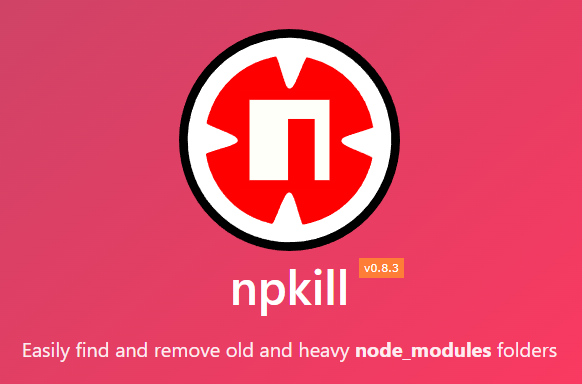
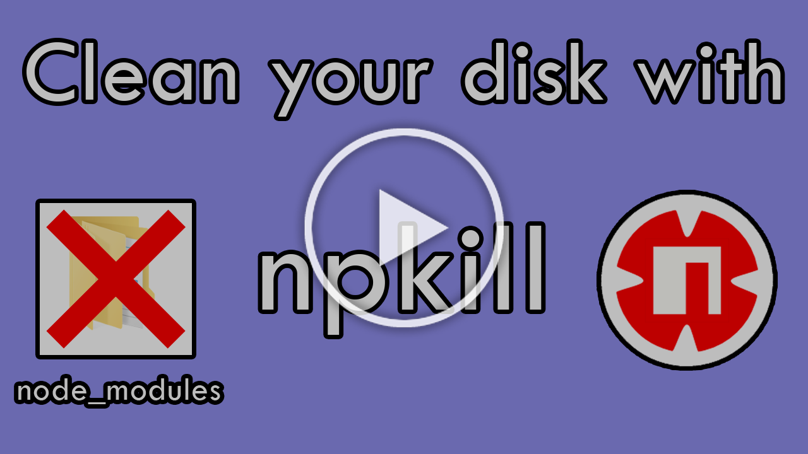

---
{
title: "♻️ Delete unused node_modules in a second and enjoy some free space!",
published: "2022-08-05T07:07:00Z",
edited: "2022-11-22T22:17:17Z",
tags: ["npm", "javascript", "tutorial", "webdev"],
description: "Intro   In this article I'll tell you about a cool tool I just found on npm, called npkill,...",
originalLink: "https://leonardomontini.dev/free-disk-space-npkill/",
coverImage: "cover-image.png",
socialImage: "social-image.png",
collection: "Shorts",
order: 3
}
---

## Intro

In this article I'll tell you about a cool tool I just found on npm, called `npkill`, that helps you cleaning `node_modules` from projects you no longer user but still want to keep.

[](https://youtube.com/shorts/76UXyiPJQwI)

Video link: https://youtube.com/shorts/76UXyiPJQwI

## Table of Contents

- [The problem](#the-problem)
- [The solution](#the-solution)
- [Installation](#installation)
- [Options](#options)
- [Contributing](#contributing)
- [Conclusions](#conclusions)

## The problem

This tool is mostly for active developers who have many projects in their computer, but everyone can get benefit from it.

Everytime you run `npm install` or `yarn` on a new repository, you're basically throwing a lot of files inside the local `node_modules` folder.

As time goes by, you'll end by having a lot of those folders on old and dusty projects sitting there, wasting space in your disk.

For many reasons, you might want to keep those projects and not delete them, for example because of some particular implementations you want to keep as examples or template, and that's totally fine, but you don't need the `node_modules` folder!

## The solution

I found a cool tool that helps exactly for this scenario, it's called [npkill](https://npkill.js.org/) and you can find it on [npm.js](https://www.npmjs.com/package/npkill).



This CLI tool will navigate for your disk looking for `node_modules` folders and will list all of them. After the scan, you will have the power to select them one by one and hit `SPACE` to delete the entire folder.

## Installation

As it's a regular package on npm, it's as easy as

```sh
npm i -g npkill
```

Once you've installed in globally, you can run

```sh
npx npkill
```

and the hunt begins!

## Options

The tool comes with some options you can find in the README on GitHub, but I'd like to put the spotlight in some of them that are quite useful

- `--sort` or `-s` => Allows to sort by `size` or `path`. I think sorting by size is super handy!
- `--target` or `-t` => Allows to set a different target folder than `node_modules`. You can use this option to clean up `dist` or `build` folders for example.
- `--directory` or `-d` => Allows to specify the folder to look at. By default is the current path, but you can run it from everywhere and set a different path without repositioning your terminal.

## Contributing

The repository is public and hosted in GitHub, but does not seem too active.

This doesn't mean the project is dead though, maybe they're still open for external help.

You can find the repo here: https://github.com/voidcosmos/npkill/issues

## Conclusions

And that was it! I found this really handy tool by browsing the internet and cleaned up approximately 8GB on my computer, I was so happy that I wanted to share it with you!

Let me know if you already knew this tool or if you're going to use it... how much space did it save you?

---

Want to see it in action? Check out this YouTube #Shorts video!
[](https://youtube.com/shorts/76UXyiPJQwI)

---

Thanks for reading this post, I hope you find it interesting!
Feel free to follow me to get notified when new articles are out ;)

<!-- ::user id="balastrong" -->
You can also follow me on [Twitter](https://twitter.com/Balastrong) and [YouTube](https://www.youtube.com/channel/UC-KqnO3ez7vF-kyIQ_22rdA)!
[](https://twitter.com/Balastrong) [](https://www.youtube.com/channel/UC-KqnO3ez7vF-kyIQ_22rdA)
