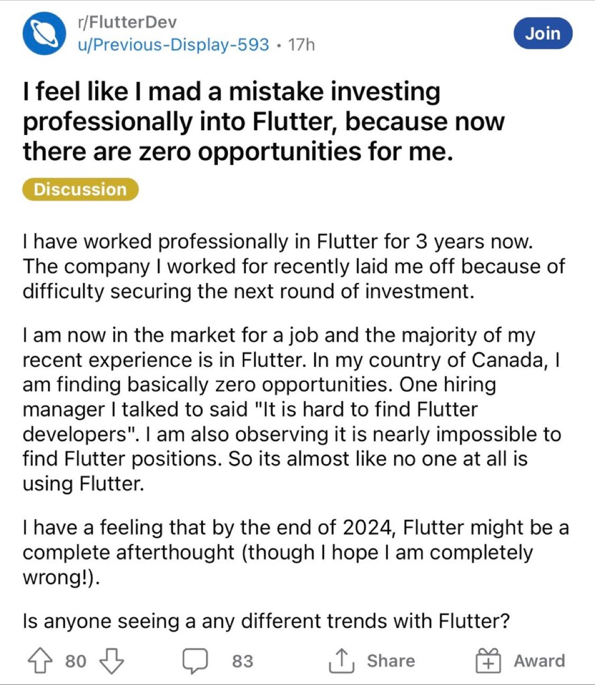

---
{
title: "Developer Shape Makes It All",
published: "2023-08-14T10:39:28Z",
tags: ["webdev", "career", "beginners", "codenewbie"],
description: "Since a couple of days I’m seeing this screenshot everywhere on Twitter and Linkedin, and I’m sorry...",
originalLink: "https://leonardomontini.dev/developer-shape-i-t-pi",
coverImage: "cover-image.png",
socialImage: "social-image.png",
collection: "21771",
order: 1
}
---

Since a couple of days I’m seeing this screenshot everywhere on Twitter and Linkedin, and I’m sorry for you, this is now also here!

But what is it about?

This was posted on Reddit a couple of days ago, it's from someone who worked as a Flutter developer for 3 years who got laid off and he's struggling to find a new job.

I'm not going to talk about Flutter specifically but I'd like to use this as a hook to talk about my personal view about going all-in on a specific technology vs stacking more soft and hard skills, clearly at the cost of being less prepared on that one thing in particular, in this case, Flutter.

You can watch the full content as a video, or keep reading the transcript



## The Shape of a Developer

There’s a common definition about the “shape” of a professional that can either be, I shaped, T shaped or π Shaped, you might already have heard about it.

There are probably a dozen other variations but these are the most common.

So, what does it mean?

Imagine on the X axis you have the number of skills you have, and on the Y axis, you have the depth of each skill.

Look at the letter I, it's one skill but goes really deep into it. You're a dragon on that specific framework or technology and you can do anything with it. But if you get out of your comfort zone, what's gonna happen?

That's why sometimes it's recommended to have a T shape, you still have one skill that you're really good at, maybe slightly less than the I shaped developer, but you also have a couple of other skills that you can use to help you with your main skill.

Those are usually soft-skills such as communication, marketing, or other skills that are not directly related to your main role but can somehow help you. Besides, the horizontal line of the T can also include having some bits of knowledge of other technologies that actually are part of your role.

For example an I-shaped developer might have 10 years of Angular experience, but none in React, while a T-shaped might have 5 years of Angular and 2 years of React.

Who's better?

Well, being really really strong on a specific framework can put yourself in a pretty convenient position, but it can also be a trap.

What happens if that framework is not used anymore in your company? Or if you get laid off and you need to find a new job, that's what happened to our Flutter developer.

If your skill is still relevant, you're probably going to find a new job pretty quickly, but if it's not, you're going to have a hard time, and considering how fast the tech industry is moving, it's not that unlikely.

So what about the π shape?

The thing is, when you're quite strong on a specific skill, being that 5% better might require quite some time and effort, while you could use the same amount of energy to learn a new skill and become 80% good.

That's why the π shape makes a lot of sense for a developer, which is not necessarily having TWO main skills, but having more than one.

You still have your main skill where you're really good at, but you also have one or two other hard skills that you can use in case of need.

Speaking about Frontend, you might be a React developer, with some experience in Angular and a little experience in Qwik or Svelte.

This would make you quite a good pi-shaped developer with a lot of flexibility in case of need.

Clearly, this in addition with some good knowledge of the core javascript aspects and some TypeScript on top, so that you can easily learn any other framework if needed.

## My take on that

Now that we have some kind of definitions, here's how I'm trying to frame myself into that. I already gave you some hints about what I think anyway.

I'm not saying that you shouldn't go deep into a specific technology, I-shaped is not necessarily bad, but you should be aware of the risks that come with it.

First of all, you might lose the focus on the fact that your favourite tool is... a tool, and not the goal itself. Your technology or framework serves the only purpose of solving a problem.

With that in mind, as long as it's the best tool for the job, you're gonna have a great time, but if this is no longer the case, you should make sure to be able to adapt and transposing your knowledge to what is required at that point.

I mean, you can also bet on your hard skill being relevant forever or at least for really long time, that's an option.

But if it's not the case, that's why I really like the π shape and it's exactly what I'm trying to do myself.

Will it be the right choice? Only time will tell but as proper pi-shaped, I'll be prepared to adapt as smoothly as possible by having at least some knowledge here and there.

Do I run into the chance of being mediocre in everything but not really skilled in anything in particular? Not gonna lie, yes, sometimes I have that feeling.

However, I'm still young and my career will be quite long so I think as long as I've got a solid and wide base of knowledge, I should be able to decide at any point to go deep into a specific technology if I want to.

Now that I think about it, I should probably state what my longterm plan is, maybe in a video, and it will be interesting in 5 or 10 years time to look back at what was the plan and what actually happened.

Stay tuned!

---

Thanks for reading this article, I hope you found it interesting!

I recently launched my Discord server to talk about Open Source and Web Development, feel free to join: https://discord.gg/bqwyEa6We6

Do you like my content? You might consider subscribing to my YouTube channel! It means a lot to me ❤️
You can find it here:

Feel free to follow me to get notified when new articles are out ;)

