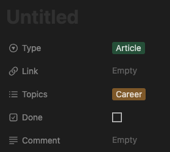

---
{
title: "Feeling overwhelmed by technical articles? Let's find a solution",
published: "2024-04-21T08:47:34Z",
tags: ["productivity", "career", "learning", "codenewbie"],
description: "Sometimes I feel that I'm reading a lot of technical articles and watching videos, but nothing really...",
originalLink: "https://leonardomontini.dev/technical-content-vs-doom-scrolling/",
coverImage: "cover-image.png",
socialImage: "social-image.png",
collection: "My Dev Journey",
order: 8
}
---

Sometimes I feel that I'm reading a lot of technical articles and watching videos, but nothing really sticks to my mind after a few days (or hours!) 😅

**Has it ever happened to you?**

I feel less guilty than watching pointless videos on socials, sure, but if I can't even remember what articles I read yesterday, then what's the point? Is there even a difference?

In the back of my mind, I probably hope that when I get into a situation I already read an article about, that knowledge magically pops out. In that case, it doesn't matter that today I don't remember what I read yesterday, as long as that information is available at the right time I need it.
Does it make any sense? I can say that sometimes it works, but probably most of the time it doesn't.

This morning I woke up with the idea of forcing myself to slow down and add an extra step: take note of each article I read or technical video I watch.

I set up a notion database where I want to write a short summary of each content I consume, along with some tags to categorize it.
The idea here is to force myself to think about what I'm reading and be much more intentional about it.

This means that the amount of content I consume will decrease, with the goal of increasing the quantity (and quality) of information that sticks to my mind on that specific content.

Let's be honest, knowing how lazy I am this will likely last no more than a few days, but let's give it a try!

If you've been in a similar situation, how did you handle it? Did you find any strategy that worked for you or did you just surrender to this kind of doomscrolling in disguise?

---

Thanks for reading this article, I hope you found it interesting!

I recently launched a GitHub Community! We create Open Source projects with the goal of learning Web Development together!

Join us: https://github.com/DevLeonardoCommunity

Do you like my content? You might consider subscribing to my YouTube channel! It means a lot to me ❤️
You can find it here:

Feel free to follow me to get notified when new articles are out ;)

<!-- ::user id="balastrong" -->
