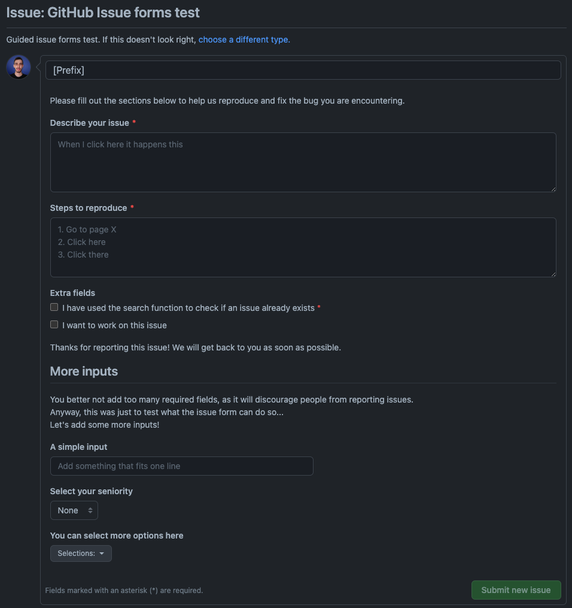
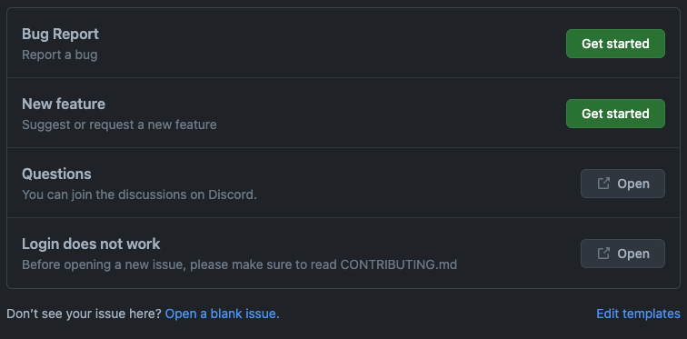

---
{
title: "GitHub Form Templates",
published: "2023-10-17T20:53:04Z",
tags: ["github", "opensource", "codenewbie", "productivity"],
description: "When you, as a contributor, want to create a new issue on GitHub, you're presented with a blank page...",
originalLink: "https://leonardomontini.dev/github-issue-form-template",
coverImage: "cover-image.png",
socialImage: "social-image.png",
collection: "Mastering GitHub",
order: 6
}
---

When you, as a contributor, want to create a new issue on GitHub, you're presented with a blank page and a text area to write your issue description.


If it's a feature request, you'd like to add all the relevant details and reasons why you think it's a good idea, to increase the chances of it being approved.

Speaking of nasty bugs, what you write in the issue body should hopefully be enough to let the maintainers understand what's going on and how to fix it and prevent similar issues in the future.

Everyone has their own way of writing issues and going in depth with details, which is great, but often times it's not the most efficient way.

In this 2 chapters series, we'll see how to use GitHub Issue Templates to help contributors write better issues.

You can find the full content in this video, or you can keep reading for Chapter 2.

<iframe src="https://www.youtube.com/watch?v=hNs5Gg_fEEs"></iframe>

## Form Schema

The direct evolution of the markdown template is indeed the form schema. In short, it's a yaml file that describes the form fields and their properties.

The form what?

Yes, instead of letting the user create an issue on a blank page, or in the best case scenario, on a large text area prefilled with some text and comments, you can create an actual form like this one:



What can we see here? There are many types of fields, like text, dropdowns and checkboxes, and each of them can have a label and description.

Some fields are required while some are optional and there are also some text separators to group fields together.

### How to set up a form

Similarly to the markdown template I've talked about in the [previous article](https://leonardomontini.dev/github-issue-markdown-template), form templates are also stored in the `.github/ISSUE_TEMPLATE` folder of your repository, but instead of creating a markdown file, you need to create a yaml file.

Before defining the form, you can set up some extra fields to define your template, that are, for example:

```yaml
name: Bug Report
description: Report a bug
labels: ['bug']
assignees: ['Balastrong']
title: '[BUG] '
```

This setup lets you define the name and description that will be shown in the template selection page, the labels and assignees that will be automatically added to the issue and the title that will be prefilled in the issue title field, which is usually a prefix like `[BUG]` or `[FEATURE]`.

Right after this block, on the same file, you can start defining the fields of the form inside the `body` key, like this:

```yaml
body:
  - type: markdown
    attributes:
      value: |
        Please fill out the sections below to help everyone identify and fix the bug
  - type: textarea
    id: description
    attributes:
      label: Describe your issue
      placeholder: When I click here this happens
    validations:
      required: true
  - type: checkboxes
    id: checks
    attributes:
      label: Extra fields
      options:
        - label: I have used the search function to check if an issue already exists
          required: true
        - label: I'd like to work on this issue
  - type: markdown
    attributes:
      value: |
        Thanks for reporting this issue! We will get back to you as soon as possible.
```

You can find the full reference in the [official docs](https://docs.github.com/en/communities/using-templates-to-encourage-useful-issues-and-pull-requests/syntax-for-githubs-form-schema#keys).

## External Links

Sometimes when a user is going to create an issue, you actually want them first to read some documentation or directly redirect them to a more appropriate place, for example a discord server or stackoverflow for asking questions.

The external links feature lets you do exactly that, by adding a list of links to the template.



In this case, right below Bug Report and New Feature I linked Discord for generic questions and the CONTRIBUTING.md file on my repository where there's a specific section addressing the most common issue that is setting up the login on local development.

### How to set up external links

Not really a surprise (thanks for the consistency GitHub), external links are also stored in the `.github/ISSUE_TEMPLATE` folder of your repository, this time in a specific file called `config.yml`.

The content to render what you can see in the image above is:

```yaml
blank_issues_enabled: true
contact_links:
  - name: Questions
    url: https://discord.gg/5CceB5Y6Zt
    about: You can join the discussions on Discord.
  - name: Login does not work
    url: https://github.com/Balastrong/github-stats/blob/main/CONTRIBUTING.md
    about: Before opening a new issue, please make sure to read CONTRIBUTING.md
```

As you can see here, all links are an array under the `contact_links` key, and each link has a name, url and about field.

You can also notice that I set `blank_issues_enabled` to true, which means that the user can still create a blank issue, without using any template. This isn't a security block but only enables a text right below the templates block saying *"Don’t see your issue here? Open a blank issue."*

In any case, nothing stops the user from creating a blank issue by manually going on `https://github.com/[Account]/[Repo]/issues/new` even if there are templates.

## Conclusion

In this article we've seen how to use GitHub Issue Form Templates to help contributors write better issues and this closes this short two-chapter series about on GitHub Issues.

Did you know that you can also create issues directly from Visual Studio Code? I talk about that in this article:

<!-- ::start:link-preview -->
[Manage GitHub Issues from Visual Studio Code](https://playfulprogramming.com/posts/manage-github-issues-from-visual-studio-code-3pop)
<!-- ::end:link-preview -->

---

Thanks for reading this article, I hope you found it interesting!

I recently launched my Discord server to talk about Open Source and Web Development, feel free to join: https://discord.gg/bqwyEa6We6

Do you like my content? You might consider subscribing to my YouTube channel! It means a lot to me ❤️
You can find it here:
[](https://www.youtube.com/c/@DevLeonardo?sub_confirmation=1)

Feel free to follow me to get notified when new articles are out ;)

<!-- ::user id="balastrong" -->
