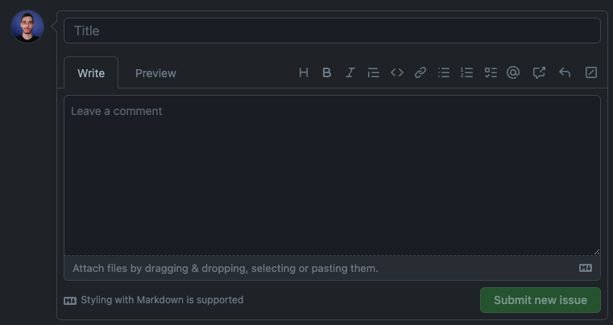
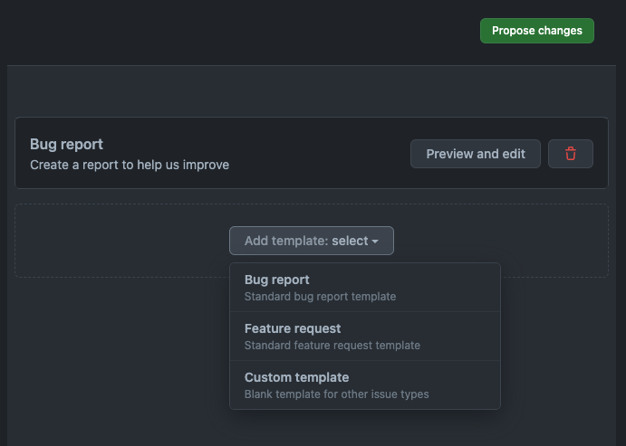
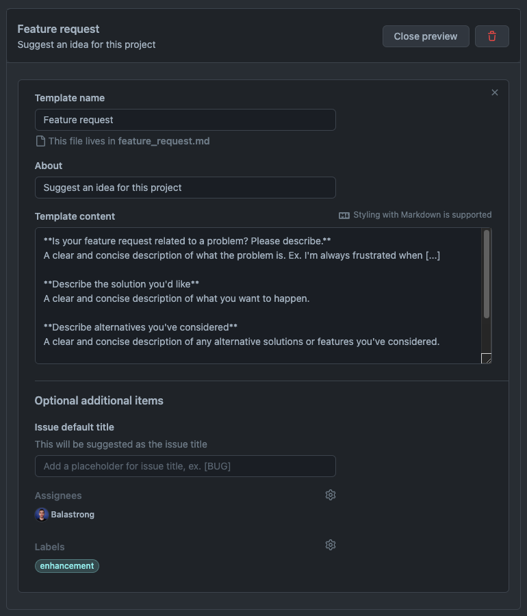
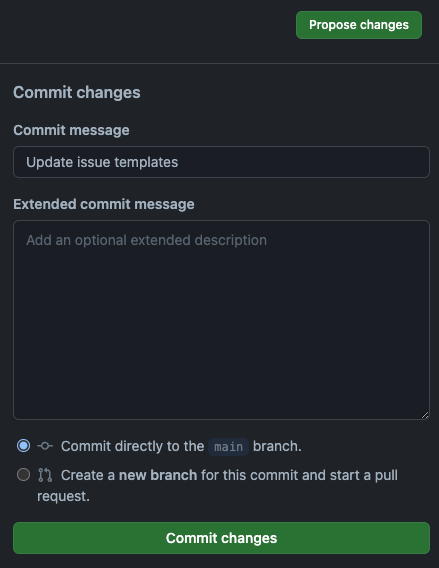

---
{
title: "GitHub Markdown Issue Templates",
published: "2023-09-14T06:27:14Z",
edited: "2023-09-14T06:28:18Z",
tags: ["github", "opensource", "codenewbie", "productivity"],
description: "When you, as a contributor, want to create a new issue on GitHub, you're presented with a blank page...",
originalLink: "https://leonardomontini.dev/github-issue-markdown-template",
coverImage: "cover-image.png",
socialImage: "social-image.png",
collection: "Mastering GitHub",
order: 5
}
---

When you, as a contributor, want to create a new issue on GitHub, you're presented with a blank page and a text area to write your issue description.



If it's a feature request, you'd like to add all the relevant details and reasons why you think it's a good idea, to increase the chances of it being approved.

Speaking of nasty bugs, what you write in the issue body should hopefully be enough to let the maintainers understand what's going on and how to fix it and prevent similar issues in the future.

Everyone has their own way of writing issues and going in depth with details, which is great, but often times it's not the most efficient way.

In this 2 chapters series, we'll see how to use GitHub Issue Templates to help contributors write better issues.

You can find the full content in this video, or you can keep reading for Chapter 1.

<iframe src="https://www.youtube.com/watch?v=hNs5Gg\_fEEs"></iframe>

## Markdown template

Instead of presenting a blank page, as a maintainer you can already fill the textarea with a markdown template. This is mostly used to already create some titles and sections.

As a bonus, you can also add some comments with the syntax `<!-- comment -->` to write some help text that will not be visible in the created issue (still remaining there as comment when editing the text).

This can be an example:

```markdown
## As is

<!-- Please write here a description of the current situation -->

## To be

<!-- Please write here a description of the expected situation -->

## Reproduction steps

<!-- Please write here a list of steps to reproduce the issue -->

1.
2.
3.
```

### How to set up templates

To set up a template, you need to create a new file in the `.github/ISSUE_TEMPLATE` folder of your repository.

The name of the file will be the name of the template, and the content of the file will be the template itself.

For example, if you create a file called `bug_report.md` with the content above, when a contributor creates a new issue, the textarea will already be filled with the template.

The content of the file will be exactly the template that the contributor will see.

### Extra fields

Markdown files can have a header with some metadata.

In this case with issue templates, you can define:

- `name`: the name of the template
- `about`: a short description of the template
- `title`: the title of the issue (the user can still change it)
- `labels`: a list of labels to add to the issue
- `assignees`: a list of users to assign to the issue automatically

For example, from the official docs:

```markdown
---
name: Tracking issue
about: Use this template for tracking new features.
title: '[DATE]: [FEATURE NAME]'
labels: tracking issue, needs triage
assignees: octocat
---
```

## Markdown editor

Up until now we learned how to set up a markdown template for issues, but we did it by writing the markdown code directly in a file, manually.

To make it easier, GitHub has a built-in editor for templates. The output will always be a markdown file, but it's much easier to organize the template and in particular the custom fields.

From the Settings of your repository, scroll down a little bit to the Features block. Here you can see Issues and a big green button "Set up templates".

This will bring you to this page: `https://github.com/Balastrong/[YOUR-REPO-NAME]/issues/templates/edit`.



From there, you can easily handle the existing templates or create a new one. Actually, GitHub already suggests you one for bug reports and one for feature requests.

Select one and you'll see a new row added, with a "Preview and edit" button. Click on it to see the preview and click on the pencil icon to edit the template.



When you're done, since the definition of the template still is a markdown file in your repo, from the "Propose changes" green button on the top right corner you'll be prompted to either commit the changes on the main branch or to create a new branch and open a Pull Request.



And that's it! The output is the same in a markdown file, but you now have a visual editor to help you create and edit the template.

## Can we do better?

Sure! The markdown template is a lightweight solution, easy to set up and use, but often time having a large template in the same textarea can be overwhelming.

In the next chapter we'll see how to use a form schema to create a more structured template. You can see a spoiler in [the video](https://youtu.be/hNs5Gg_fEEs), or wait for the next chapter to be published.

---

Thanks for reading this article, I hope you found it interesting!

I recently launched my Discord server to talk about Open Source and Web Development, feel free to join: https://discord.gg/bqwyEa6We6

Do you like my content? You might consider subscribing to my YouTube channel! It means a lot to me ❤️
You can find it here:
[](https://www.youtube.com/c/@DevLeonardo?sub_confirmation=1)

Feel free to follow me to get notified when new articles are out ;)

<!-- ::user id="balastrong" -->
