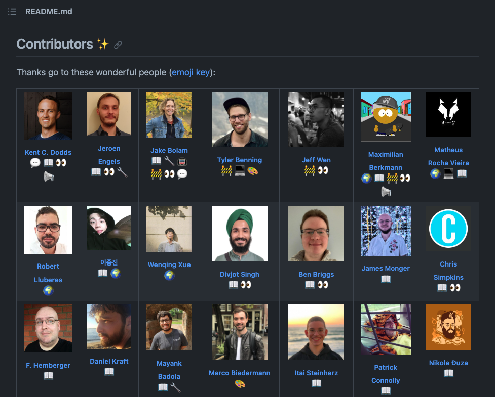

---
{
title: "Give credit to Open Source Contributors",
published: "2023-10-04T14:58:50Z",
tags: ["opensource", "github", "hacktoberfest23"],
description: "Tables like this one are in a lot of repositories, giving well deserved credit to their...",
originalLink: "https://leonardomontini.dev/credit-all-contributors",
coverImage: "cover-image.png",
socialImage: "social-image.png",
collection: "Open Source",
order: 10
}
---

Tables like this one are in a lot of repositories, giving well deserved credit to their contributors.

And you know, developers are lazy so there has to be an automation to manage this.



Today’s topic is the all-contributors tool and I will show you how you can integrate it in your project and why you should!

Contributors merging a PR will get a green square in their profile, but not every contribution is actually submitted through a pull request.

That’s why there’s an emoji key table which includes many other actions giving value to the project, such as writing blog posts, mentoring new contributors or answering questions on discord.

Here's a video where I talk about the two main ways to use this tool which are the Bot and the CLI.



## Bot

The bot is a GitHub App that will automatically create a Pull Request to add a new contributor to the table.

Once installed, you can invoke it with a comment in an issue or pull request, like this:

```markdown
@all-contributors please add @balastrong for code
```

Pros are that it's automatic, you literally just have to write a comment and the bot will do the rest with the PR ready to be merged.
Cons, it spams a little bit of notifications.

## CLI

Similarly to the bot, once installed in your project you can run the CLI to add a new contributor to the table.

```bash
npx all-contributors add balastrong code
```

Pros: you can control when/how you want to add contributors as it just edits the files locally.
Cons: as it's less *automagic*, you will need to manually commit and push the changes.

## Hacktoberfest

A cool contribution during Hacktoberfest could be asking the repository maintainers if they're interested in using the tool.

Setting it up can be a cool PR, after receiving the green light on an issue :)

## Conclusion

Which one is better? I definitely think it depends on how you want to use it, but both ways are super easy to set up and use.

I’m using it on my [github-stats community project](https://github.com/Balastrong/github-stats) and I think it’s a great way to say thank you to everyone involved in the success of an open source project.

Want to learn more? You can watch [my video](https://youtu.be/9okPS0yjsK0) or directly head over the [all-contributors website](https://allcontributors.org/).

---

Thanks for reading this article, I hope you found it interesting!

I recently launched my Discord server to talk about Open Source and Web Development, feel free to join: https://discord.gg/bqwyEa6We6

Do you like my content? You might consider subscribing to my YouTube channel! It means a lot to me ❤️
You can find it here:
[](https://www.youtube.com/c/@DevLeonardo?sub_confirmation=1)

Feel free to follow me to get notified when new articles are out ;)

