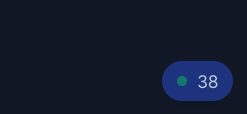

---
{
title: "I vibe coded an online visitors counter for my blog",
published: "2025-07-16T09:56:21Z",
tags: ["webdev", "githubcopilot", "astro", "netlify"],
description: "You know that old-style \"X users online\" counter on a website? I've recently seen it on roe.dev's...",
originalLink: "https://leonardomontini.dev/online-badge/",
coverImage: "cover-image.png",
socialImage: "social-image.png"
}
---

You know that old-style "X users online" counter on a website? I've recently seen it on [roe.dev](https://roe.dev/)'s blog and I though: it shouldn't be too difficult for a naive implementation, let's vibe code it!

The stack: my blog is a static site built with Astro and hosted on Netlify, so I needed a way to track active visitors without a full backend. The goal was to create a simple counter that shows how many people are currently browsing the site, updating in real-time, without any annoying flickering.



## Netlify Server Functions

The main engine for this whole thing is Netlify's server functions. After all, I just needed a simple endpoint to ping when a visitor comes in, which also returns the current count of active users.

I asked Copilot to write the logic in javascript and with a couple of iteration I already had a working demo on my local machine.

Bonus points: since it recognized I was in a Netlify project, it automatically added the function to the right folder and set up the correct export.

## Storage on Redis

Ok this might have been overkill, but I wanted a quick solution to store the data since the netlify function runs in a serverless environment, meaning it doesn't have persistent storage.

I just googled "free redis hosting" and found Upstash, created an account and already had a Redis instance.

Time to write a quick prompt for Copilot to use Redis as storage. Since I mentioned I wanted to track not who's exactly online but how many users visited in the past 30 minutes, it suggested a TTL (time to live) of 30 minutes for each key. Cool, I don't even need to worry about cleaning up old data.

```js
await redis.set(`online:${anonymizedIp}`, '1', { ex: 60 * 30 });
```

As easy as that, there's the `ex` option that sets the expiration time in seconds.

Reading values is also simple, just count the keys with a pattern like `online:*`:

```js
const keys = await redis.keys('online:*');
const count = keys.length;
```

## Avoid flickering

Once the backend was working, the next step was getting that counter to show up nicely on my static site without any annoying flickering.

The problem is that since the page is static, the "dynamic" part (the counter) needs to be fetched after the page loads. If I just rendered the counter with the initial value, it would show zero until the fetch completed, which is not ideal. Oh, and this on each page load or navigation!

So here's the plan, use 1 as default value to immediately show something, then fetch the actual count in the background and update it once we have the real number.

With that alone I had the jump from 1 to the real number at each navigation though, so the first naive solution that came to my mind was to store the value in local storage and read it on each page load. This way, the counter would show the last known value immediately, and then update in the background.

## Local debugging

Just type `netlify dev` and you can run your Netlify functions locally, as easy as that, really!

## So what?

I'm sure there's a million better ways to build this tiny feature, but it's been fun to use AI to quickly build something that kinda works.

Ah by the way, this wasn't a sponsored post (I wish it was!) but I think finding the right tools and services is relevant these days, in particular now that writing code goes much faster with AI.

If you want to see the live result just head over <https://leonardomontini.dev/> or have a look at the video where I walk through the whole process and code:



---

Thanks for reading this article, I hope you found it interesting!

Let's connect more: https://leonardomontini.dev/newsletter

Do you like my content? You might consider subscribing to my YouTube channel! It means a lot to me ❤️
You can find it here:
[](https://www.youtube.com/c/@DevLeonardo?sub_confirmation=1)

Feel free to follow me to get notified when new articles are out ;)

