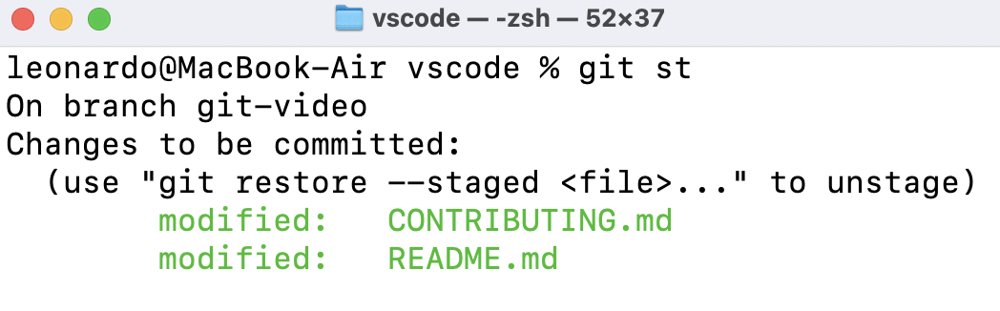
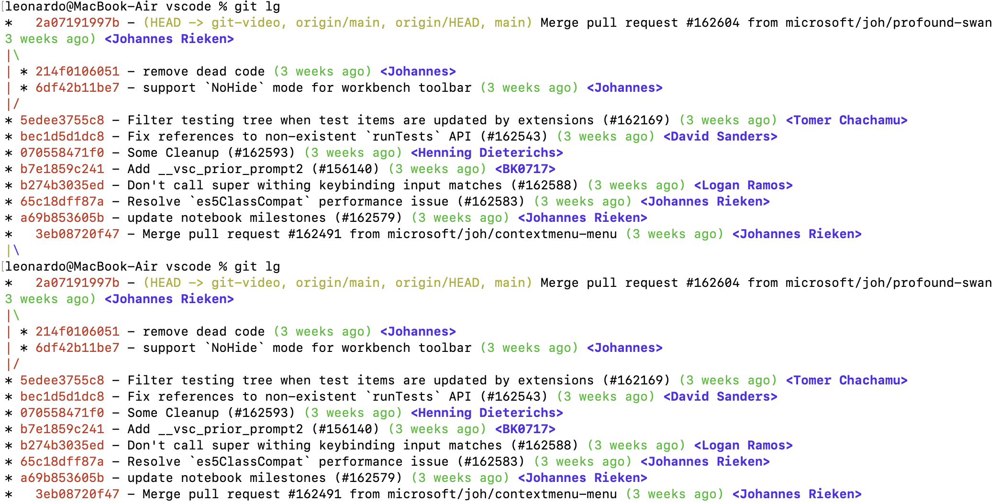

---
{
title: "🕵️‍♂️ Learn git alias and boost your productivity",
published: "2022-10-22T18:32:58Z",
edited: "2023-01-12T13:22:32Z",
tags: ["git", "tutorial", "codenewbie", "productivity"],
description: "Setting up an Alias   Repeating the same git commands over and over again can be such a...",
originalLink: "https://leonardomontini.dev/git-alias-tutorial/",
coverImage: "cover-image.png",
socialImage: "social-image.png",
collection: "git better - Improve your git skills",
order: 1
}
---

### Setting up an Alias

Repeating the same git commands over and over again can be such a waste of time! And some of the most powerful ones are usually quite long and impossible to memorize.

That’s why aliases have been introduced!

Setting up an alias is really simple, just open up a terminal and type

```sh
git config --global alias.[commandName] [long command]
```

For example: `git config --global alias.st 'status'`

In this case, if I call `git st`, it will give me the result of `git status`.



Ok, this was easy, but what about long commands such as this one?

```sh
log --color --graph --pretty=format:'%Cred%h%Creset -%C(yellow)%d%Creset %s %Cgreen(%cr) %C(bold blue)<%an>%Creset' --abbrev-commit

```

You don’t want to write it every single time, right?

Just run this:

```sh
git config —global alias.lg "log --color --graph --pretty=format:'%Cred%h%Creset -%C(yellow)%d%Creset %s %Cgreen(%cr) %C(bold blue)<%an>%Creset' --abbrev-commit"

```

And you never have to remember this long command again!

Look at how cool and colorful this log is, by just using `git lg`:



### Understanding Aliases

If with these two examples you agree with me that aliases are cool, let me give you some more information you should have, in order to use aliases mindfully. Later on, I’ll also share with you a list of other smart aliases you might find useful.

**You can find everything in the video down below, where I also show:**

- How to easily edit aliases without setting them from terminal
- How to use the bang operator `!` (aka exclamation mark)
- How this this weird syntax is useful: `"!f(){ [some commands here] }; f"`
- A list of cool aliases to set up for you

### See aliases in action

You can watch the video on [YouTube](https://youtu.be/Uk4GnYoQx_I), or directly here from the embedded player:



---

**If you have some cool aliases to share, feel free to drop them here in a comment, thank you!**

---

Thanks for reading this post, I hope you found it interesting!

Do you like my content? You might consider subscribing to my YouTube channel!
You can find it here:
[](https://www.youtube.com/channel/UC-KqnO3ez7vF-kyIQ_22rdA?sub_confirmation=1)

Feel free to follow me to get notified when new articles are out ;)

<!-- ::user id="balastrong" -->
