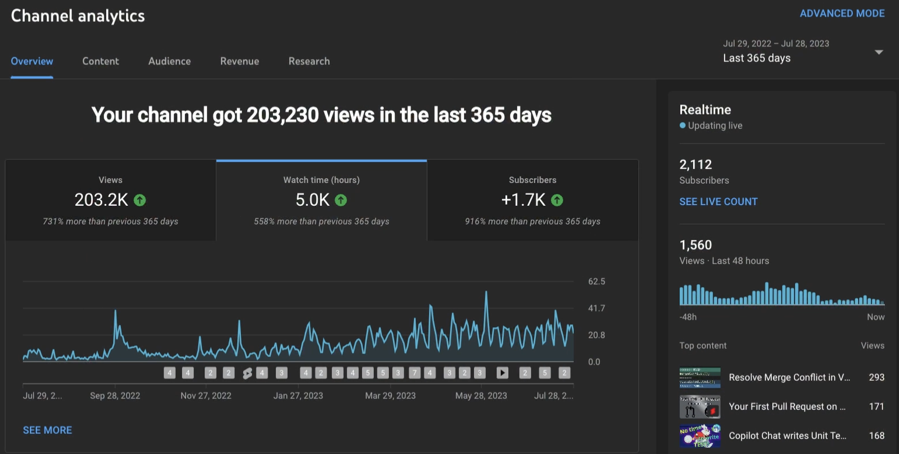
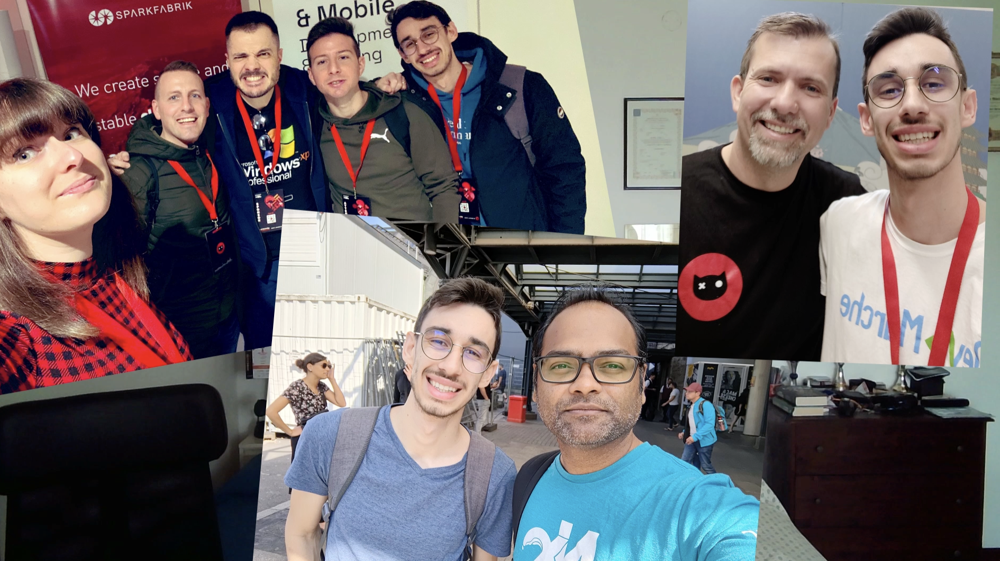

---
{
title: "One Year of Dev YouTube",
published: "2023-07-30T09:25:11Z",
tags: ["webdev", "motivation", "career", "showdev"],
description: "Exactly one year ago I started consistently posting on YouTube, at least a video every single week,...",
originalLink: "https://leonardomontini.dev/dev-youtube-anniversary/",
coverImage: "cover-image.png",
socialImage: "social-image.png",
collection: "My Dev Journey",
order: 4
}
---

Exactly one year ago I started consistently posting on YouTube, at least a video every single week, talking about Web Development and Open Source. Here is my takeaway from this experience.

I recorded a short video, you can watch it here, or keep reading for the transcript below.

<iframe src="https://www.youtube.com/watch?v=sIB31lxkDsI"></iframe>

---

The stats on YouTube are at 5.000 hours of watch time in the last 365 days. I cannot believe people watched me talking for 300.000 minutes, it’s insane!

I really hope this is helping someone learn new skills and getting started with Open Source as that’s my primary goal, but one thing I can tell for sure is… how much I am learning throughout this journey!

Sharing content on YouTube… or actually, researching, studying and testing new concepts in order to create content, is a great way to improve your skills.

I’d definitely recommend you at least write down your findings. It can be a proper blog, on a personal website or on platforms like dev.to, or even public notes of what you’re researching and learning. Trying to explain something to someone else forces you to dig deeper and grasp even more knowledge, and the other person is learning from your added value, isn’t that a win-win?

And it’s not all! Being active online and in communities also got me in touch with other amazing developers, sharing ideas, knowledge and a lot of fun times.

I also met some of them in real life!

Developers are not weird creatures doing their crafts alone, doing stuff together is cool!

To wrap up, one year has passed, and I can assure you, many more will come!

Thank you all for being part of this journey and see you in the next video.

If you're not there yet, join me here: https://www.youtube.com/@DevLeonardo

---

Thanks for reading this article, I hope you found it interesting!

I recently launched my Discord server to talk about Open Source and Web Development, feel free to join: https://discord.gg/bqwyEa6We6

Do you like my content? You might consider subscribing to my YouTube channel! It means a lot to me ❤️
You can find it here:

Feel free to follow me to get notified when new articles are out ;)

<!-- ::user id="balastrong" -->
