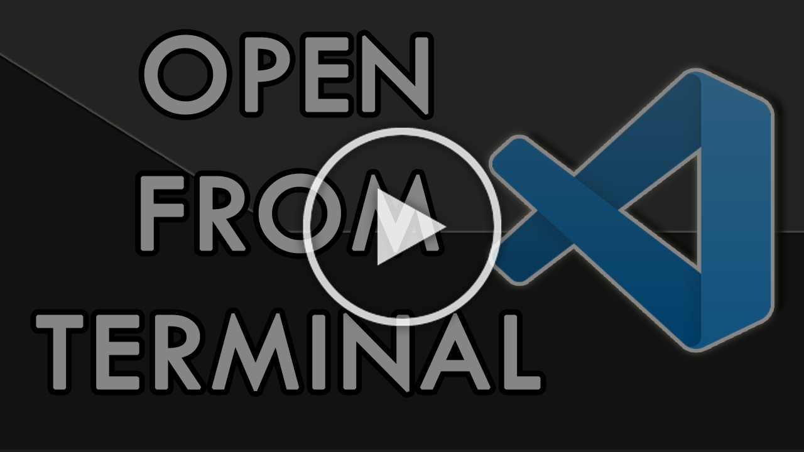

---
{
title: "Open Visual Studio Code from the Terminal",
published: "2022-10-14T17:30:08Z",
edited: "2022-11-23T11:14:39Z",
tags: ["productivity", "programming", "discuss", "tutorial"],
description: "Ok, it's not a super secret feature, but I noticed some of my colleagues and friends do not use it at...",
originalLink: "https://leonardomontini.dev/open-vscode-from-terminal/",
coverImage: "cover-image.png",
socialImage: "social-image.png",
collection: "Visual Studio Code",
order: 2
}
---

Ok, it's not a super secret feature, but I noticed some of my colleagues and friends do not use it at all while I think it's quite handy, so I'm sharing it here.

You might already know, but you can launch vscode from the terminal by just typing `code`

`code .` will Open vscode on the current location, also cool if you're wandering around your filesystem in the terminal for whatever reason.

It can also accept a parameter that is the path, so with `code your/path` it will open a vscode instance already pointing to that file or folder. This is particularly handy right after `git clone` as all you have to do is `code repo-name` and you're ready to write some code.

Last but for sure not least, I made a short video as usual about the topic, you can find it here:

---

**So, a question for you, how often do you open vscode from the terminal?**

---

Thanks for reading this post, I hope you found it interesting!

Do you like my content? You might consider subscribing to my YouTube channel!
You can find it here:

Feel free to follow me to get notified when new articles are out ;)

<!-- ::user id="balastrong" -->
