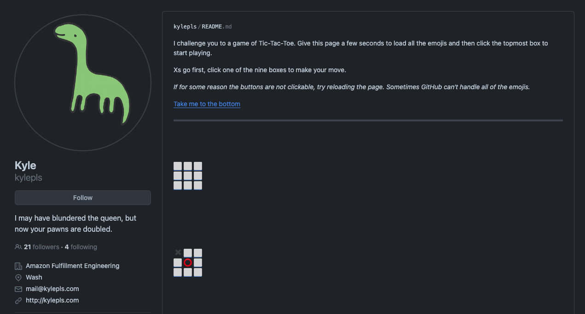
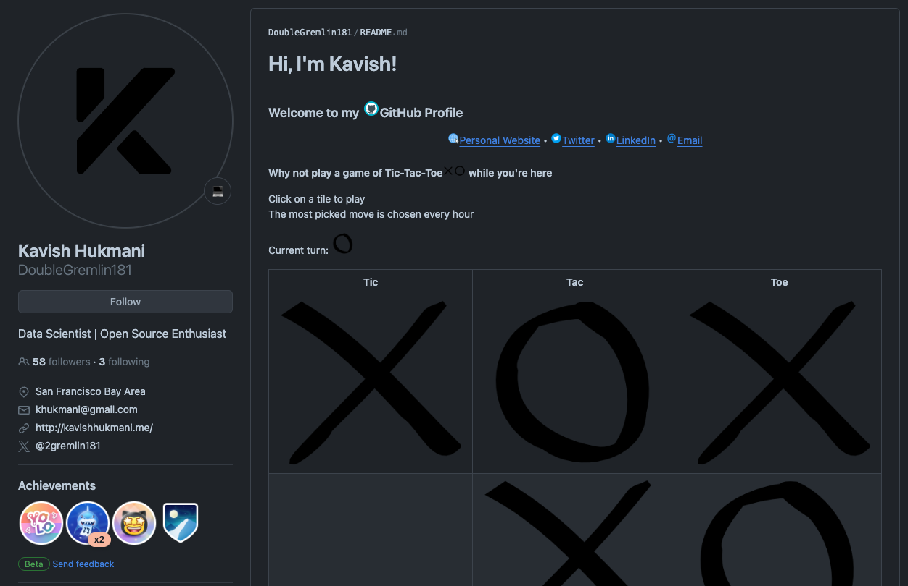
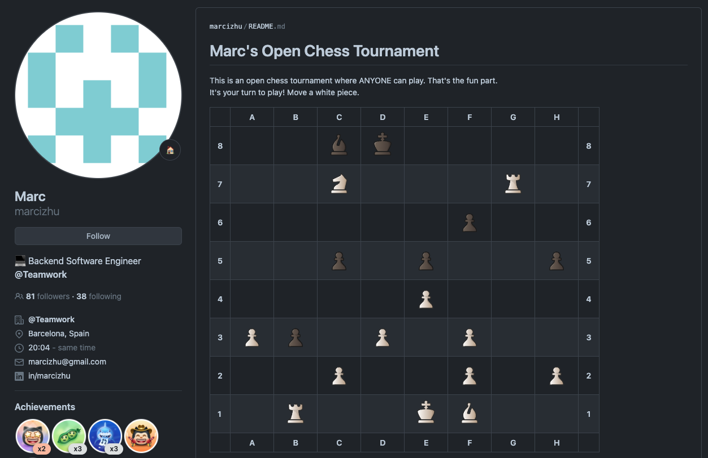
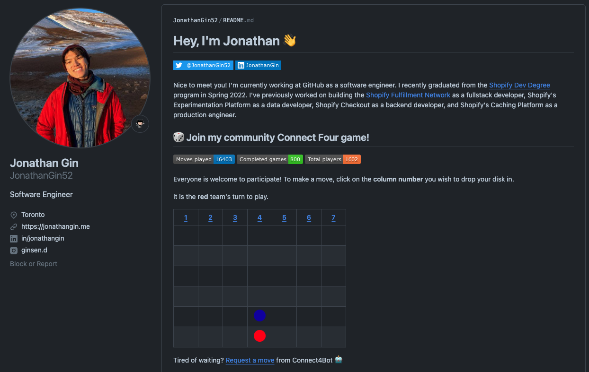

---
{
title: "Play 4 Multiplayer Games 🎮 on Github Profiles (README.md)",
published: "2024-05-14T11:22:28Z",
tags: ["github", "gamedev", "webdev"],
description: "You can play online multiplayer games on Github profiles! 🎮  Setting up a profile on GitHub is easy,...",
originalLink: "https://leonardomontini.dev/4-github-games-readme-profiles/",
coverImage: "cover-image.png",
socialImage: "social-image.png",
collection: "Mastering GitHub",
order: 8
}
---

You can play online multiplayer games on Github profiles! 🎮

Setting up a profile on GitHub is easy, you just need to create a repository with your username and add a README.md file to it. This file will be displayed on your profile page and you can add anything you want to it, including games!

Now you're maybe wondering how to play games on a text file, right? In this article we're gonna see 4 different games and the first one is 100% powered by the markdown file, at the cost of being single-player only.

The other three games, with a little bit of magic, are multiplayer games!

I recorded a video where I play all 4 of them and I try to explain how they work, you can watch it here:

<iframe src="https://www.youtube.com/watch?v=yXO9vhPuV1Y"></iframe>

## Game 1: Single-player Tic-Tac-Toe

Play the game: https://github.com/kylepls

This game is a Tic-Tac-Toe game that you can play by clicking on the cells of the table. Each cell anchor leads to a new table after the computer's move.

Can you win against the computer? Unfortunately in this game with no errors it's always gonna end in a draw so... you either lose or draw 😅

**Language**: Markdown

## Game 2: Multiplayer Tic-Tac-Toe

Play the game: https://github.com/DoubleGremlin181

Here's a version of Tic-Tac-Toe where you can play against someone else. However... there's a catch!

You cannot decide yourself the next move, but you can vote. Each click on a cell increments a counter and after an hour the cell that has the most votes will be the next move.

The profile is updated with a GitHub Action having a cron as a trigger.

**Language**: Python

## Game 3: Multiplayer Chess

Play the game: https://github.com/marcizhu

Now we enter in the realm of the games where you can have direct impact. Right below the board you can see the list of allowed moves and you can select one. Clicking on a link opens a new prefilled issue where you can just hit "create" to submit your move.

Here a GitHub Action with that gets triggered on new issues will read the title and perform the move.

**Language**: Python

Side note, I think the original is on [timburgan](https://github.com/timburgan)'s profile, written in Ruby, but it not working anymore.

## Game 4: Multiplayer Connect4

Play the game: https://github.com/JonathanGin52

This works similar to chess, right below the board you can cast your next move which will be performed by a GitHub Action reading issue titles.

If you don't want to wait for someone else to move, you can also play against the computer by requesting a move to the "Connect4Bot" bot.

**Language**: Ruby

## Game 5 ???

Do you know any other profiles with games on them? Let me know in the comments!

---

Thanks for reading this article, I hope you found it interesting!

I recently launched a GitHub Community! We create Open Source projects with the goal of learning Web Development together!

Join us: https://github.com/DevLeonardoCommunity

Do you like my content? You might consider subscribing to my YouTube channel! It means a lot to me ❤️
You can find it here:

Feel free to follow me to get notified when new articles are out ;)

<!-- ::user id="balastrong" -->
