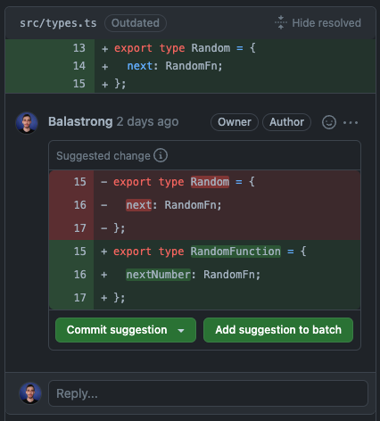
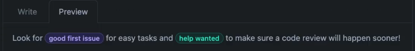
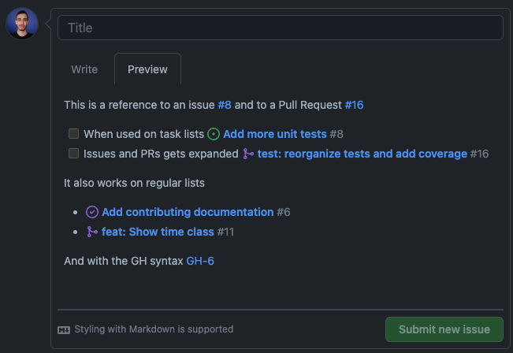
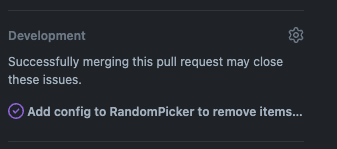
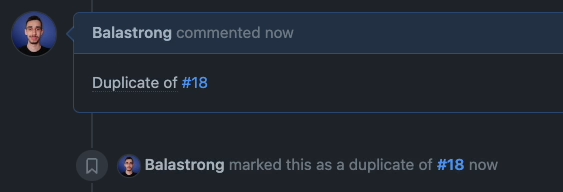

---
{
title: "Some cool GitHub features to enhance your development experience",
published: "2022-11-01T13:21:10Z",
edited: "2023-03-07T11:57:09Z",
tags: ["github", "opensource", "tutorial", "beginners"],
description: "Hello everyone, Leonardo here!  Today we talk about GitHub and some cool features it offers to...",
originalLink: "https://leonardomontini.dev/github-tips-and-tricks/",
coverImage: "cover-image.png",
socialImage: "social-image.png",
collection: "22139",
order: 1
}
---

Hello everyone, [Leonardo](https://twitter.com/Balastrong) here!

Today we talk about GitHub and some cool features it offers to improve the context and the communication between developers, through Issues and Pull Requests.

As usual, before diving into the article, let me share the video version you can find on my [YouTube channel](https://www.youtube.com/c/DevLeonardo):



These are some of the features shown in the video:

### Code suggestions

With a special syntax, you can suggest code changes when commenting a Pull Request.

Everyone with write access to the repo will see a "commit" button to immediately commit the suggested change.

---

### Render labels

Yes, labels can be nicely rendered as well, here's an example:

---

### Show details of linked issues

When you link an issue with `#` followed by the issue number, a link is rendered. However, if you do so in a list, the issue (or PR) is expanded and the name and the status are displayed as well.

By the way, you can mention issues with `GH-[IssueNumber]` as well!

---

### Close issues automatically when PR is merged

Mentioning an issue in a PR, with some special keywords (for example `closes #3` or `fixes #3`), will enable this cool feature. As soon as the PR is merged, the issue will be marked as closed.

If this is activated, you can see it in the bottom right corner of the Pull Request.

---

### Marking an issue as duplicate

If you type `Duplicate of` and mention an issue, that one will be marked as duplicate and it is shown right below your comment.

---

If you want to see all of these in action plus some additional ones, you can watch them in this 3 minutes video!

If you want to support me, go watch it and leave a like ❤️



---

**Do you know of some other cool features? Let me know in the comments!**

---

Thanks for reading this article, I hope you found it interesting!

Do you like my content? You might consider subscribing to my YouTube channel!
You can find it here:

Feel free to follow me to get notified when new articles are out ;)

