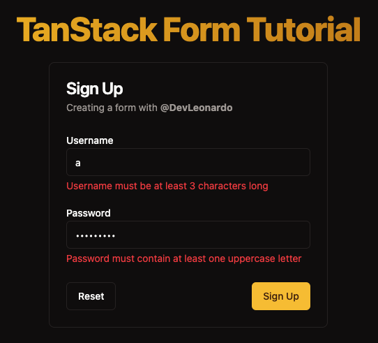

---
{
title: "TanStack Form Tutorial: Setup and simple validation (with shadcn/ui)",
published: "2024-05-07T13:40:41Z",
edited: "2024-05-21T19:22:37Z",
tags: ["react", "typescript", "tutorial", "codenewbie"],
description: "Forms are not an easy business 🤯  Luckily there are many libraries helping out with that and today...",
originalLink: "https://leonardomontini.dev/tanstack-form-setup-validation/",
coverImage: "cover-image.png",
socialImage: "social-image.png",
collection: "27295",
order: 1
}
---

Forms are not an easy business 🤯

Luckily there are many libraries helping out with that and today let's see up close how to setup a form with [TanStack Form](https://tanstack.com/form/latest), the form library in the [TanStack](https://tanstack.com/) ecosystem.

It works on React, but also Angular, Vue, Solid, and Lit.

It’s Headless so you can use it with whatever UI components you have in your project and as with everything in TanStack it’s type-safe! In this example we'll use components from [shadcn/ui](https://ui.shadcn.com/) to build the form but you can really make it work with any UI library.

Worth mentioning it’s probably not production-ready yet, but if you’re curious it definitely deserves a try (maybe on side projects) and feedback can indeed help get to v1, which should happen soon 👀

## About This tutorial



My idea is to cover this library in 3 steps. The first one (this article) is about setting up the library and adding some simple validation rules. The second one will be about more complex validation rules and the third one about handling arrays and dynamic fields.

You can already find the video version for chapter 1 here:



## Setup

As usual, everything begins with an installation:

```bash
npm i @tanstack/react-form
```

Notice here that we are installing `@tanstack/react-form`, if you're using Angular, Vue, Solid, or Lit you should install the respective package.

And... that's it! No particular setup is needed, you can start using it right away.

## Form

Let's imagine we're starting from this uncontrolled form in our component:

```tsx
<form className="flex flex-col gap-4">
  <div>
    <Label htmlFor="username">Username</Label>
    <Input id="username" type="text" />
  </div>
  <div>
    <Label htmlFor="passowrd">Passowrd</Label>
    <Input id="password" type="password" />
  </div>
</form>
```

To add the magic, we can call the `useForm` hook and get our `form` instance.

```tsx
const form = useForm({
  defaultValues: {
    username: '',
    password: '',
  },
  onSubmit: (values) => {
    console.log(values);
  },
});
```

To avoid unexpected side effects, let's prevent the default form submission:

```tsx
<form
  className="flex flex-col gap-4"
  onSubmit={(e) => {
    e.preventDefault();
    e.stopPropagation();
  }}
>
  ...
</form>
```

## Input

It's now time to integrate the inputs with the form, through the `Field` api exposed by TanStack Form.

```tsx
<form.Field
  name="username"
  children={(field) => (
    <>
      <Label htmlFor="username">Username</Label>
      <Input id="username" type="text" value={field.state.value} onChange={(e) => field.handleChange(e.target.value)} />
    </>
  )}
/>
```

Same goes for the password field, we're basically passing our inputs as children of the `Field` component and we're using the `field` object to get the value and the `handleChange` function.

## Submit & Reset

To submit or reset the form, the api exposes `form.handleSubmit` and `form.reset`.

The easiest way to submit a form is to add a button with `type="submit"` and call `form.handleSubmit` on click.

```tsx
<button type="submit" onClick={form.handleSubmit}>
  Submit
</button>
```

As an alternative, you can indeed add `form.handleSubmit` to the `onSubmit` event of the form.

And to reset the form, we can call `form.reset` on click.

```tsx
<button type="reset" onClick={form.reset}>
  Reset
</button>
```

*note*: in the video it's slightly different because the buttons are outside the form in a `CardFooter` component, but the idea remains the same:

```tsx
<CardFooter className="flex justify-between">
  <Button variant="outline" onClick={form.reset}>
    Reset
  </Button>
  <Button onClick={form.handleSubmit}>Sign Up</Button>
</CardFooter>
```

## Validation

The `Field` component also accepts a `validators` object where you can define a function returning the errors, that can be run at the desired event.

Currently supported are: `onBlur`, `onChange`, `onMount` and `onSubmit`.

Our username can be validated as follows:

```tsx
validators={{
    onChange: ({ value }) => value.length < 3
        ? "Username must be at least 3 characters long"
        : undefined,
}}
```

With that, you'll notice that if you try to submit the empty form... nothing happens! That's because we're not showing the errors yet.

In general, errors are inside `field.state.meta.errors`. You can also know where they come from (which event in the validation) but let's keep it simple for now. Let's add this right below the input:

```tsx
{
  field.state.meta.errors && <p className="text-red-500 text-sm mt-1">{field.state.meta.errors}</p>;
}
```

The password validator can be a bit longer, to show better error messages:

```tsx
onChange: ({ value }) => {
    if (value.length < 6) {
        return "Password must be at least 6 characters long";
    }

    if (!/[A-Z]/.test(value)) {
        return "Password must contain at least one uppercase letter";
    }

    if (!/[a-z]/.test(value)) {
        return "Password must contain at least one lowercase letter";
    }

    if (!/[0-9]/.test(value)) {
        return "Password must contain at least one number";
    }
},
```

## Async validation

At this point, each time a value is changed, the validation function is called and the errors are shown. But what if we want to validate the username against an API or if we simply want to avoid running it that often?

As easy as turning `onChange` to `onChangeAsync` and adding an extra property called `onChangeAsyncDebounceMs`.

This already works!

## Validation libraries

TanStack Form also supports integration with popular validation libraries like Zod, Yup and Valibot through adapters. We'll see that on chapter 3 (or you can check the [docs](https://tanstack.com/form/latest/docs/framework/react/guides/validation)).

## Conclusion

This was a quick overview of how to setup a form with TanStack Form and add some simple validation rules. Stay tuned for the next chapters where we'll see more complex validation rules and how to handle arrays and dynamic fields... and even more topics if you like it too!

As mentioned in the intro, the form isn't production-ready yet but being in the TanStack ecosystem is a good sign that something interesting might come out of it.

If you want to support the development of the project you can contribute to the [GitHub Repo](https://github.com/TanStack/form) as I'm doing. You'll also find some previews such as [this PR](https://github.com/TanStack/form/pull/656) which will extend the validation feature.

The source code of the demo created with this article is also available on GitHub ([Balastrong/tanstack-form-demo](https://github.com/Balastrong/tanstack-form-demo)) and will get updated with the next chapters.

Last call, if you want to see it in action, you can watch the video version of this article on my [YouTube channel](https://www.youtube.com/@DevLeonardo): [TanStack Form: Setup and simple validation (with shadcn/ui)](https://www.youtube.com/watch?v=Pf1qn35bgjs).

---

Thanks for reading this article, I hope you found it interesting!

I recently launched a GitHub Community! We create Open Source projects with the goal of learning Web Development together!

Join us: https://github.com/DevLeonardoCommunity

Do you like my content? You might consider subscribing to my YouTube channel! It means a lot to me ❤️
You can find it here:
[](https://www.youtube.com/c/@DevLeonardo?sub_confirmation=1)

Feel free to follow me to get notified when new articles are out ;)

