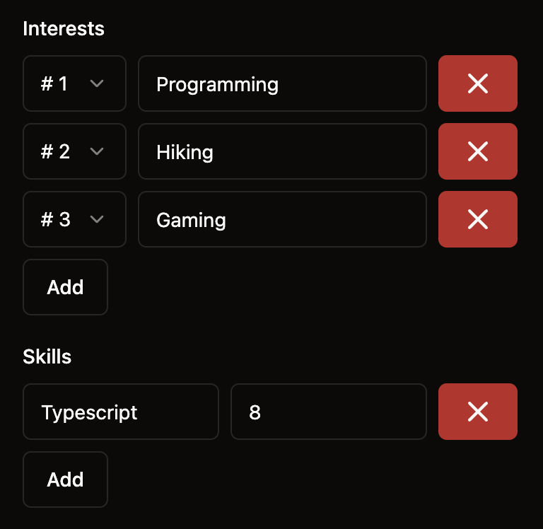

---
{
title: "TanStack Form Tutorial: Arrays & Dynamic Fields",
published: "2024-06-04T14:07:50Z",
tags: ["react", "angular", "tutorial", "codenewbie"],
description: "Your form might not have a fixed number of fields, that's where arrays come in! Let's see today how...",
originalLink: "https://leonardomontini.dev/tanstack-form-arrays-dynamic-fields/",
coverImage: "cover-image.png",
socialImage: "social-image.png",
collection: "TanStack Form",
order: 3
}
---

Your form might not have a fixed number of fields, that's where arrays come in! Let's see today how TanStack Form behaves in this scenario.

This is Chapter 3 of the TanStack Form series, talking about this new Form library which supports React, Angular, Vue, Solid, and Lit.

We'll learn how to setup an array field and how to add, remove, and even move elements around. This works in both flavors with arrays of primitives (strings, numbers, etc) and objects with nested fields.

The video version for this chapter is available here:



Code is as usual on GitHub at the [03-dynamic-arrays](https://github.com/Balastrong/tanstack-form-demo/tree/03-dynamic-arrays) branch (leave a star if you like it! ⭐️).

The final result will look like this:



## Array of strings

Let's start from an array of primates, in our case strings. Here are some snippets of what we need to do:

### 1. Define the form schema

```tsx
const form = useForm({
    defaultValues: {
      ...
      interests: [] as string[],
      ...
    });
```

### 2. Add the field to the form

This takes a few steps, let's see them one by one. First of all, you need to create a `Field` component with `mode="array"` as a container where all elements will have their own components.

```tsx
<form.Field
  name="interests"
  mode="array"
  children={(field) => (
      // your fields go here
  )}
/>
```

From here, `field.state.value` is an array and we can cycle through it with the `map` function to render each element.

```tsx
field.state.value.map((_, index) => (
  <form.Field
    name={`interests[${index}]`}
    children={(subField) => (
      <Input
        type="text"
        value={subField.state.value}
        autoFocus
        onChange={(e) => subField.handleChange(e.target.value)}
      />
    )}
  />
));
```

Notice how the first parameter of the `map` function is not used, we just need the index to create the correct name for the field and we'll use `subField` to control the input.

Side note, the `autoFocus` attribute is used to focus the input as soon as it's added. We'll get there in a moment.

### 3. Add the button to add a new element

You might want to add elements dynamically, for example with a button. The easiest way is to use the `field` object provided in the parent `Field` component and call `field.pushValue('')` from a button.

```tsx
<form.Field
  name="interests"
  mode="array"
  children={(field) => (
    <>
      {field.state.value.map((_, index) =>
        // your components here (the snippet above)
      )}
      <Button type="button" variant={'outline'} onClick={() => field.pushValue('')}>
        Add
      </Button>
    </>
  )}
/>
```

### 4. Add the button to remove an element

Lastly, you might want to remove elements. This time you'll need the index of the element you want to remove, that's why the easiest place to put the button is inside the `map` function using `field.removeValue(index)`.

```tsx
<form.Field
  name="interests"
  mode="array"
  children={(field) =>
    field.state.value.map((_, index) => (
      <div key={index}>
        ...
        <Button variant={'destructive'} onClick={() => field.removeValue(index)}>
          <X />
        </Button>
      </div>
    ))
  }
/>
```

### 5. Full example

Now, by assembling all the pieces of the puzzle, your array field with add/remove and single-element handling will be similar to this:

```tsx
<form.Field
  name="interests"
  mode="array"
  children={(field) => (
    <>
      <Label className="mr-2">Interests</Label>
      {field.state.value.map((_, index) => (
        <div key={index} className="flex gap-2 my-2">
          <form.Field
            name={`interests[${index}]`}
            children={(subField) => (
              <Input
                type="text"
                value={subField.state.value}
                autoFocus
                onChange={(e) => subField.handleChange(e.target.value)}
              />
            )}
          />
          <Button variant={'destructive'} onClick={() => field.removeValue(index)}>
            <X />
          </Button>
        </div>
      ))}
      <Button type="button" variant={'outline'} onClick={() => field.pushValue('')}>
        Add
      </Button>
    </>
  )}
/>
```

## Moving elements

There's still one tiny detail we can implement, what if we want to let the user sort the elements? A cool interaction could be via drag & drop but let's keep it simple for now as we want to explore the API.

We can add a dropdown to move the element at a given index. The component in the example is a `Select` from shadcn but all that really matters here is the `field.moveValue(index, newIndex)` function.

Once again the full example, the only difference is the addition of the `Select` component inside the `map` function to display it on each row.

```tsx
<form.Field
  name="interests"
  mode="array"
  children={(field) => (
    <>
      <Label className="mr-2">Interests</Label>
      {field.state.value.map((_, index) => (
        <div key={index} className="flex gap-2 my-2">
          <Select value={`${index}`} onValueChange={(newIndex) => field.moveValue(index, +newIndex)}>
            <SelectTrigger className="w-28">
              <SelectValue />
            </SelectTrigger>
            <SelectContent>
              {field.state.value.map((_, index) => (
                <SelectItem key={index} value={`${index}`}>
                  # {index + 1}
                </SelectItem>
              ))}
            </SelectContent>
          </Select>
          <form.Field
            name={`interests[${index}]`}
            children={(subField) => (
              <Input
                type="text"
                value={subField.state.value}
                autoFocus
                onChange={(e) => subField.handleChange(e.target.value)}
              />
            )}
          />
          <Button variant={'destructive'} onClick={() => field.removeValue(index)}>
            <X />
          </Button>
        </div>
      ))}
      <Button type="button" variant={'outline'} onClick={() => field.pushValue('')}>
        Add
      </Button>
    </>
  )}
/>
```

## Array of objects

Similarly to the array of strings, you can have an array of objects.

```tsx
const form = useForm({
    defaultValues: {
      ...
      skills: [] as { language: string; rating: number }[],
      ...
    });
```

This time the subfields will no longer be primitives but objects with their own fields. The main difference is that while `interest[0]` is a valid name since it's a primitive, with the object you'll find that `skills[0]` does not work as it's not a value you can access directly.

The values are nested inside the object, so you'll need to use `skills[0].language` and `skills[0].rating` to access them.

In short, your `field.state.value.map` will render **two** `form.Field` components, one for each field of the object.

Here's the full example with also the add/remove buttons:

```tsx
<form.Field
  name="skills"
  mode="array"
  children={(field) => (
    <>
      <Label className="mr-2">Skills</Label>
      {field.state.value.map((_, index) => (
        <div key={index} className="flex gap-2 my-2">
          <form.Field
            name={`skills[${index}].language`}
            children={(subField) => (
              <Input
                type="text"
                value={subField.state.value}
                autoFocus
                onChange={(e) => subField.handleChange(e.target.value)}
              />
            )}
          />
          <form.Field
            name={`skills[${index}].rating`}
            children={(subField) => (
              <Input
                type="number"
                value={subField.state.value}
                onChange={(e) => subField.handleChange(e.target.valueAsNumber)}
              />
            )}
          />
          <Button variant={'destructive'} onClick={() => field.removeValue(index)}>
            <X />
          </Button>
        </div>
      ))}
      <Button type="button" variant={'outline'} onClick={() => field.pushValue({ language: '', rating: 0 })}>
        Add
      </Button>
    </>
  )}
/>
```

## Conclusion

And that's it for Chapter 3! If you want to learn more about arrays in TanStack Form, check out the [official documentation](https://tanstack.com/form/latest/docs/framework/react/guides/arrays).

In case you missed the previous chapters, you can find the YouTube playlist here: [TanStack Form series](https://www.youtube.com/playlist?list=PLOQjd5dsGSxInTKUWTxyqSKwZCjDIUs0Y).

The code is on the [03-dynamic-arrays](https://github.com/Balastrong/tanstack-form-demo/tree/03-dynamic-arrays) branch.

Interested in more content about TanStack Form? Let me know in the comments below if you have any questions or suggestions for the next chapters!

---

Thanks for reading this article, I hope you found it interesting!

I recently launched a GitHub Community! We create Open Source projects with the goal of learning Web Development together!

Join us: https://github.com/DevLeonardoCommunity

Do you like my content? You might consider subscribing to my YouTube channel! It means a lot to me ❤️
You can find it here:
[](https://www.youtube.com/c/@DevLeonardo?sub_confirmation=1)

Feel free to follow me to get notified when new articles are out ;)

