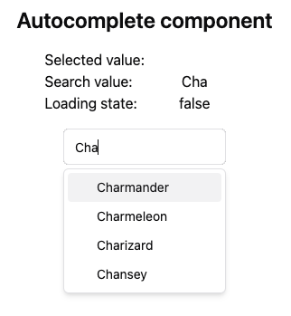
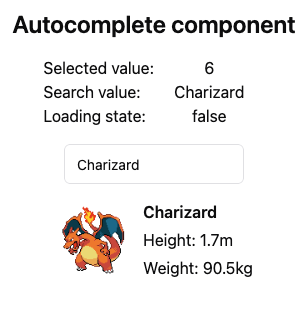

---
{
title: "The Missing Shadcn/ui Component 🪄",
published: "2024-07-10T13:18:47Z",
tags: ["react", "webdev", "javascript"],
description: "The beauty of shadcn/ui is that it's not a component library, but a set of components that you can...",
originalLink: "https://leonardomontini.dev/shadcn-autocomplete/",
coverImage: "cover-image.png",
socialImage: "social-image.png",
collection: "Web Development",
order: 22
}
---

The beauty of shadcn/ui is that it's not a component library, but a set of components that you can use to compose your own library. This is great because you can customize them as you want, but it also means that you have to build and tweak some components yourself... which can be a double-edged sword.

I usually trust library components more than my own, because they are tested by a lot of people and have a lot of edge cases covered. But sometimes you need something that is not there and feel great that it's relatively easy to build it yourself.

In this case I needed an Autocomplete which:

- Can be used with a controlled input
- The input text has to be always visible
- Data comes from an API and is filtered as you type
- You can select an item with the keyboard
- Only suggested items can be selected - no free text
- Handle key and value separately

As usual, I talk about that in a [YouTube video](https://youtu.be/1hfd9CKbv7E) on my channel. Interested in reading the summary? Let's dive in!



## Looking for inspiration

The first step was to check at what was already available.

First I looked at the [Select](https://ui.shadcn.com/docs/components/select) component. It was not enough because I needed the text input to filter the options.

Then I checked the [Combobox](https://ui.shadcn.com/docs/components/combobox): much closer to my needs even if some details were not there, for example the text input is inside the closable panel and data hardcoded & automatically filtered by the Command component. However, it was a good starting point.

### More inspiration

I noticed people have been asking for a full Autocomplete component in [many](https://github.com/shadcn-ui/ui/issues/2577) - [issues](https://github.com/shadcn-ui/ui/issues/173) and someone also created a [fully working demo](https://www.armand-salle.fr/post/autocomplete-select-shadcn-ui/).

## Building the component



With that in mind, I started working on my custom component and this is pretty much how you can use it:

```tsx
function App() {
  const [searchValue, setSearchValue] = useState<string>('');
  const [selectedValue, setSelectedValue] = useState<string>('');

  const { data, isLoading } = useQuery({
    queryKey: ['data', searchValue],
    queryFn: () => getList(searchValue),
  });

  return (
    <AutoComplete
      selectedValue={selectedValue}
      onSelectedValueChange={setSelectedValue}
      searchValue={searchValue}
      onSearchValueChange={setSearchValue}
      items={data ?? []}
      // Optional props
      isLoading={isLoading}
      emptyMessage="No items found."
      placeholder="Search items..."
    />
  );
}
```

The choice on how to handle the logic to ensure fresh data is up to you, but once you begin using [TanStack Query](https://tanstack.com/query/latest) you really stop looking at other options, so that's what I used here.



Look for the [autocomplete.tsx](https://github.com/Balastrong/shadcn-autocomplete-demo/blob/main/src/components/autocomplete.tsx) component.

I also had fun integrating some tests, which you can find in the [autocomplete.test.tsx](https://github.com/Balastrong/shadcn-autocomplete-demo/blob/main/src/test/autocomplete.test.tsx) file.

If you're curious about some choices, I walked through the implementation in a [YouTube video](https://youtu.be/1hfd9CKbv7E) on my channel:

<iframe src="https://www.youtube.com/watch?v=1hfd9CKbv7E"></iframe>

## Always improving

As mentioned in the beginning I'm sure there is room for improvement, actually on another project I also added support to use it uncontrolled with fixed data but I didn't move it here to keep it simple.

Suggestions are always welcome, feel free to open an issue or a PR in the [GitHub repository](https://github.com/Balastrong/shadcn-autocomplete-demo) and if you leave a star ⭐️ you make me happy.

---

Thanks for reading this article, I hope you found it interesting!

I recently launched a GitHub Community! We create Open Source projects with the goal of learning Web Development together!

Join us: https://github.com/DevLeonardoCommunity

Do you like my content? You might consider subscribing to my YouTube channel! It means a lot to me ❤️
You can find it here:
[](https://www.youtube.com/c/@DevLeonardo?sub_confirmation=1)

Feel free to follow me to get notified when new articles are out ;)

<!-- ::user id="balastrong" -->
