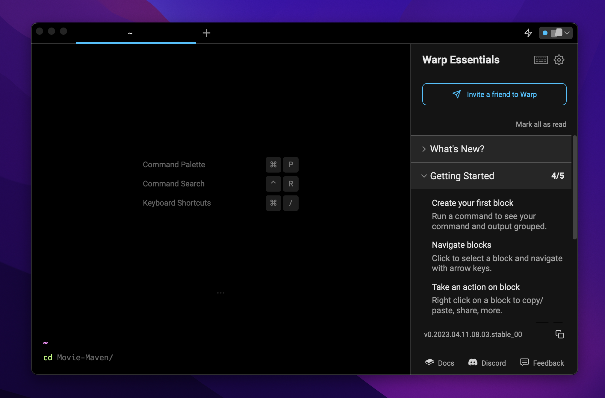
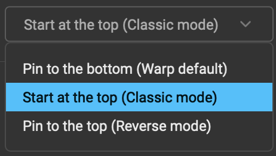
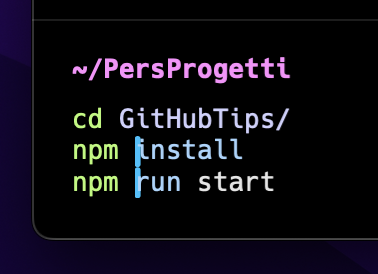
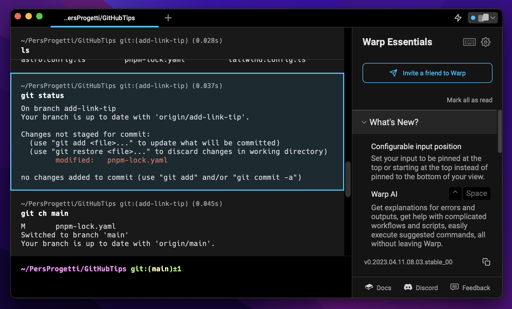
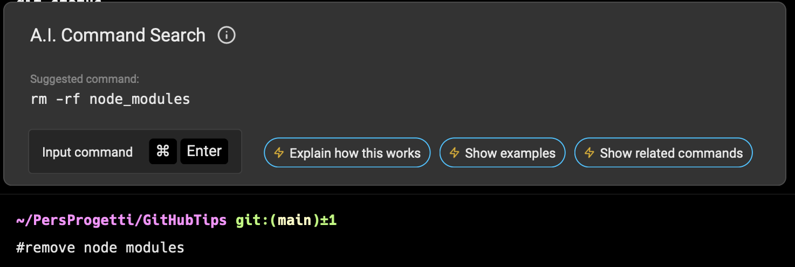
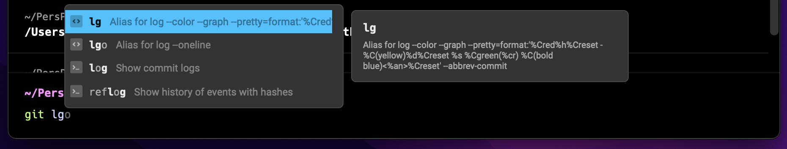

---
{
title: "Trying out a new terminal: Warp",
published: "2023-04-25T17:10:46Z",
edited: "2023-04-28T19:45:12Z",
tags: ["terminal", "rust", "programming", "productivity"],
description: "When I moved from Windows to Mac a year ago I also developed the habit of using the terminal much...",
originalLink: "https://leonardomontini.dev/warp-rust-terminal/",
coverImage: "cover-image.png",
socialImage: "social-image.png"
}
---

When I moved from Windows to Mac a year ago I also developed the habit of using the terminal much more. It might be because at first I was just confused by the slight differences in the UI, but turns out I feel I'm way more productive with the terminal on Mac then I was on Windows.

Navigating through the folders, running commands, using git, etc. It's just faster.

At first, I started with the default terminal to make the transition smoother. After a few months, I started looking for plugins and eventually for other terminals.

Today I'd like to share with you my experience with [Warp](https://warp.dev/).

\## Warp

Warp claims to be "The terminal for the 21st century" and the subtitle on the homepage says:

> Warp is a blazingly fast, Rust-based terminal reimagined from the ground up to work like a modern app.

I'm honestly curious about what Rust can do and also `to work like a modern app` sounds like an interesting claim.

## First impressions

When I ran Warp the first time, after logging in I noticed the menu on the right side. It shows the changelog and a quick tutorial which I really appreciated.

What I would expect from tools like this is to have some cool features that make the terminal better than the default one, but I understand that there can't be buttons everywhere as it's a terminal after all.

I could read the features from the docs (and I'm doing it!) but having some of the coolest ones right there as a tutorial was a nice touch.

This also gives me the hook to introduce you to the next chapter: the features.

\## Features

Like I said in the beginning, a valid reason to make me switch from the default terminal is that the new one must have cool features making my life easier. Here are the ones I'm already using the most.

### Input at bottom

One thing I don't really like about terminals (but I learnt to accept, as they're all like that) is that the input begins at the top of the screen, and then after typing in some commands it goes to the bottom. Just stick it to the bottom from the beginning!

Ok wait, before a holy war begins, they already thought about it and you can actually decide the behaviour from the settings, between:

- Pin to the bottom (Warp default)
- Start at the top (Classic mode)
- Pin to the top (Reverse mode)

Basically, the Classic mode is the behaviour all terminals have, but you can also decide if you want to pin the input at the bottom (default for Warp) or at the top.

To be fair, I also see why having it pinned on top makes sense, as it's probably better for your back. This makes you keep looking at your eye level, instead of looking down all the time.

Ok, I might already have changed my mind while writing this article, I'll probably pin it to the top. Still better than the default terminal behaviour.

### Text editor

Now that we've decided where to place the input, let's give it a closer look as it's not the simple terminal input you're used to.

First of all, you can click on it. And this already makes a huge difference.

Not impressed yet? You can go multiline! As a regular text editor, with Shift+Enter you can go on a new line and write a more complex script where each line will be executed one after the other.

Now that you're writing this multiline script, you can copy-paste some parts and since we're talking about a modern app... you can have multiple cursors!

\### Tabs

Not a lot to say about that, lot of terminals have tabs, but I just wanted to mention that Warp has them too.

### Blocks

One thing that bothers me A LOT in terminals is when you run a command with a long input and you can't see the output because it's too long.

An example could be the simple `npm install` but also some custom commands to run your app. If you want to go back to the previous command you have to scroll up and hope to find it rather quick in the wall of text you're just facing.

With blocks, this is waaaaay easier!

Outputs are contained in blocks, you can scroll to read the output but you have the prompt and the input at the top of the block. Besides, if you click on it, the border will become visible so it's clear to see where a command ends and another one begins.

But blocks are not just a visual thing, you can also interact with them! You can do so many things I could probably write an entire article about it. And I think I will :D

For today let me just tell you that you can SHARE a code block with someone by creating a permalink to it.

https://app.warp.dev/block/uUbOWsWgfxJKQBuQcOMoeI

This is a pretty basic example, I just run `ls` on a project and you can see here the content, but imagine having a really weird error in a long log and you're trying to get help. You're two clicks away from sharing the entire block with someone else who can help you!

I'll tell you more about blocks in a future article, or you can find yourself on [Warp](https://warp.dev/) and try it out! ;)

### AI

We're in 2023, basically every single app has some sort of AI, so why not a terminal?

In Warp you can summon the AI by typing `#` in the input area, followed by your command written in natural language. In this example I just asked how I can remove `node_modules` from my project.

In a moment I got the suggested command and with Cmd+Enter I can run it.

You can also ask the AI what the suggested command does and this is the explanation I received, which I think is a good one:

> The command `rm` stands for "remove" and is used to delete files and directories. The `-rf` options are used to force the removal of files and directories without prompting for confirmation and to remove directories and their contents recursively.

> So, the command `rm -rf node_modules` will remove the `node_modules` directory and all its contents from the current working directory. The `-rf` option ensures that the removal is done without prompting for confirmation, and the `node_modules` argument specifies the directory to be removed.

> It's important to note that this command can be dangerous if used improperly, as it can delete important files and directories without warning. It should only be used when you are sure that you want to delete the specified directory and all its contents.

### Commands Lookup

This is the last feature I'm going to cover today but is really a must-have for me.

When you're typing a command, just press Tab and a lookup will appear suggesting to you how to complete it, or what you might want to add next.

Simple scenario: you type `cd` and then press Tab. You'd expect the list of folders you can navigate to and that's what you get. You can pick one with the up/down arrow keys and press Enter to go there.

Cool scenario: you type `git` and then press Tab. You won't only get the known git commands, but also your custom aliases! I use them A LOT and having them listed in the lookup is so useful.

It's worth mentioning that it also shows what your custom alias stands for!

You can see in the screenshot it picked up `lg` and `lgo` which are aliases I use every time I want to have a quick glimpse at the commit history, but what about `log` and `reflog`? I mean, they don't start with `lg` which was my initial prompt.

A fuzzy search is performed here so that you don't exactly need to type the first few chars but you can also type something in the middle or have a typo in there, the lookup will still find what you're looking for!

## To wrap up

I started using [Warp](https://warp.dev/) only a few days ago so let's see how it will perform in the long run, but it's doing great so far!

As mentioned in the beginning I also had a read of [the docs](https://docs.warp.dev/getting-started/readme) and there's much more I'd like to try out, for example, the autocomplete suggestions and get even more out of the AI features.

Oh, and custom themes!!

---

Thanks for reading this article, I hope you found it interesting!

I recently launched my Discord server to talk about Open Source and Web Development, feel free to join: https://discord.gg/bqwyEa6We6

Do you like my content? You might consider subscribing to my YouTube channel! It means a lot to me ❤️
You can find it here:

Feel free to follow me to get notified when new articles are out ;)

