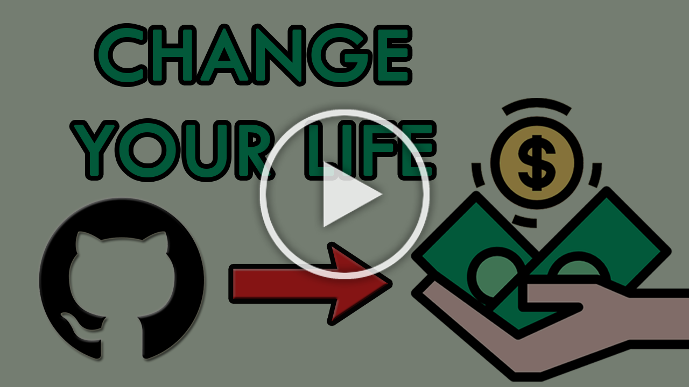

---
{
title: "[Video] How Open Source can change your life",
published: "2022-07-30T09:57:00Z",
edited: "2022-09-11T12:09:25Z",
tags: ["opensource", "github", "discuss", "career"],
description: "Hello everyone!  I recently posted an Article about benefits and advantages from contributing in Open...",
originalLink: "https://dev.to/this-is-learning/video-how-open-source-can-change-your-life-4kg7",
coverImage: "cover-image.png",
socialImage: "social-image.png"
}
---

Hello everyone!

I recently posted an Article about benefits and advantages from contributing in Open Source.

I released the video version on YouTube, go check it out!

Here's the link: https://youtu.be/uquIcISFtwg

---

Thanks for reading my post, I hope you find it interesting!
Feel free to follow me to get notified when new articles are out ;)

<!-- ::user id="balastrong" -->
You can also follow me on GitHub or Twitter, you can find the links here directly on my GitHub profile!

