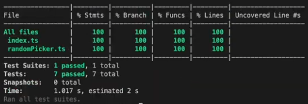

---
{
title: "Weighted 🏋️ Random generator in Typescript (with Test Driven Development 🧪)",
published: "2022-08-18T10:55:13Z",
edited: "2023-04-11T10:05:11Z",
tags: ["javascript", "typescript", "tutorial", "beginners"],
description: "You can find a video version of this article on my YouTube Channel.           Intro   Today we're...",
originalLink: "https://leonardomontini.dev/typescript-test-driven-development/",
coverImage: "cover-image.png",
socialImage: "social-image.png"
}
---

*You can find a [video version](https://youtu.be/jNBw9_qNgmo) of this article on my [YouTube Channel](https://www.youtube.com/channel/UC-KqnO3ez7vF-kyIQ_22rdA).*

## Intro {#intro}

Today we're building together a weighted random generator. You may also know it as a random loot table generator, or gacha system.

In short, what it does is extract a random object considering its weight. An object with a higher weight is more likely to be picked up than an item with a smaller weight (or call it chance).

As a side quest, we're going to keep code coverage at 100% ✅

- [Intro](#intro)
  - [Output](#output)
- [Development](#development)
  - [Typing](#typing)
  - [Core class](#core-class)
  - [Validation](#validation)
  - [Standalone](#standalone)
  - [Going further](#going-further)

<iframe src="https://www.youtube.com/watch?v=jNBw9_qNgmo"></iframe>

### Output {#output}

The final result is already available on [GitHub](https://github.com/Balastrong/wrand) (there are [open issues](https://github.com/Balastrong/wrand/issues) to pick up!).

You can also install it from [npm](https://www.npmjs.com/package/wrand) and [deno](https://deno.land/x/wrand).

If you're on node, you can install it with `npm i wrand` and you can use it like so:

```typescript
const picker = new RandomPicker(items);

const result = picker.pick();
const results = picker.pickMany(3);
```

## Development {#development}

As seen in the preview, we're going to build a generator (with a class) that takes an array of objects in the constructor and will spit out randomly picked items with two methods: `pick` and `pickMany`.

### Typing {#typing}

As we're in Typescript, let's start by giving a type definition to our input.

<iframe src="https://gist.github.com/Balastrong/6784d2d12cf887c026a03bbaeec9011b"></iframe>

Our type will have two fields, one to keep the original items we passed in, and the other to store its weight (or chance, probability).
A heavier weight means more likely to be picked up.

### Core class {#core-class}

To add some more informative content, we'll build this up with a little bit of Test Driven Development (TDD).

We can create a new file, randomGenerator.ts with the skeleton of the final product.

<iframe src="https://gist.github.com/Balastrong/4eeb096cd9726efe81c38c0895494d40"></iframe>

Before writing the implementation, we have to write the tests! This approach helps write code that is more reliable and with fewer bugs as you focus on the business logic first, and only after that on the implementation.

In this case, I'm using Jest, so `npm i jest` to have it running.

In my tests, I want to make sure that:

1. The class is instantiated properly.
2. A random item is picked and comes from my list.
3. N random items are picked, exactly the amount I requested and all of them are in the list.
4. Works not only with strings but also with objects.

<iframe src="https://gist.github.com/Balastrong/f8cf757a5b8e39d9cca16a6cdc75a695"></iframe>

*Note: To improve the tests even more, there's an [open issue](https://github.com/Balastrong/wrand/issues/5) about passing a custom random generator. This could allow to set a generator with a specific seed (Math.random can't do that) and make the tests predictable, rather than entirely random.*

Now that the tests are written, we can proceed with the implementation.

<iframe src="https://gist.github.com/Balastrong/95998c34d114aee61ca597af98a24398"></iframe>

If we run the test now, they're all green and 100% code coverage ✅

### Validation {#validation}

Let's add some validation to our input. As usual, tests first!

This time we want to check that:

1. The list is not empty
2. There are no duplicates
3. There are no negative weights

<iframe src="https://gist.github.com/Balastrong/336a7aed5a951c30ad8832b001215769 "></iframe>

Tests are looking good, we can implement the validation method.

<iframe src="https://gist.github.com/Balastrong/e0aef8b0889616c6bdcc3fe749e219ce"></iframe>

`npm run test` and it's all green and 100% again! ✅



### Standalone {#standalone}

With the current implementation, to pick one item only you need to explicitly create the `RandomGenerator` instance and call `pick` on it.

As we're building a library, it might be useful to also provide some standalone methods that do everything under the hood so that one can directly call `pick` or `pickMany` without seeing the logic behind it.

<iframe src="https://gist.github.com/Balastrong/14d684e75a560200cc5922ce66e82bcf"></iframe>

### Going further {#going-further}

The core implementation is done and the requested functionalities described at the beginning are already working.

As I mentioned, the library is Open Source and the code is available on [GitHub](https://github.com/Balastrong/wrand). I'm repeating it because this means it's open to contributions and for example, you're free to pick up some of the [open issues](https://github.com/Balastrong/wrand/issues).

In the meantime, the library has been extended with more utility methods (`getItems`, `getWeights`, `getTotalWeight`, `getCount`) and also an extra standalone method to `flatten` the items in case you have duplicates and you want to aggregate their weights.

Feel free to jump on GitHub and extend it, even more, I'm waiting for your Pull Requests! :)

<iframe src="https://youtu.be/jNBw9_qNgmo"></iframe>

---

Thanks for reading this post, I hope you find it interesting!
Feel free to follow me to get notified when new articles are out ;)

<!-- ::user id="balastrong" -->

You can also follow me on your favourite platform!

[](https://twitter.com/Balastrong) [](https://www.youtube.com/channel/UC-KqnO3ez7vF-kyIQ_22rdA) [](https://www.tiktok.com/@balastrong) [](https://www.instagram.com/devbalastrong/)
