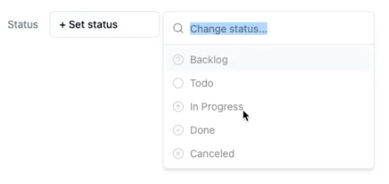
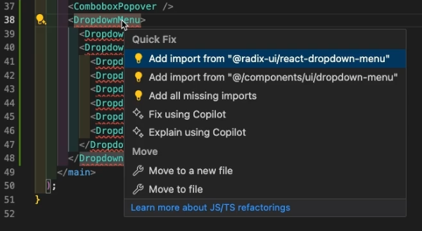
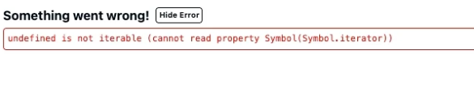

---
{
title: "What I DON'T like about shadcn/ui",
published: "2024-04-23T11:05:29Z",
tags: ["webdev", "react", "css", "javascript"],
description: "Shadcn/ui is great, components are good-looking, easy to setup and customize, and everyone likes it…...",
originalLink: "https://leonardomontini.dev/shadcn-ui-use-with-caution/",
coverImage: "cover-image.png",
socialImage: "social-image.png",
collection: "Web Development",
order: 21
}
---

Shadcn/ui is great, components are good-looking, easy to setup and customize, and everyone likes it… BUT, as everything, it has some downsides.

Most of the reviews are 100% positive, but I think it’s also worth mentioning what are the tradeoffs in order to make an informed decision, before adopting a tool.

So, after using it for a few months, I recorded a video sharing my thoughts.

**What you're reading here is the script of the video, however some examples are better shown in the video than explained. I'll try to add some screenshots!**

<iframe src="https://www.youtube.com/watch?v=RPQBTG8-qB8"></iframe>

First of all, this is NOT a component library, it’s clearly written in the homepage but I’m afraid not everyone is going to read it.

What does that mean? When you take a component from shadcn/ui, from that moment it becomes YOUR component. If there’s a problem, well, it’s YOUR problem.

Unlike the other UI libraries we’re used to deal with where bugs are fixed with npm update, this is not exactly the case with shadcn.

[(See at 01:08)](https://youtu.be/RPQBTG8-qB8?t=68)

Look ad this dropdown, I copy paste from the docs and it doesn’t work, and you know what, I have to fix it manually on my project. We’ll get on that later.

---

In general the components are… basic. Wich makes sense, it’s not a huge library like MUI or Prime with advanced components, it’s not an UI library at all, but when deciding if you want to use shad, you must be aware of that. Lot of people claiming it’s the best ui library so far, often forget to mention this.

Most of the components are simply customizations of headless components coming from another great library that is Radix-ui. Let’s talk about that.

The first issue i’ve got with radix is… not a big one, but I want to mention it. When importing components, it always comes as first suggestion but if you import if from there and you look at your application, it obviously doesn’t work.

[(See at 02:48)](https://youtu.be/RPQBTG8-qB8?t=168)

But maybe this can be easily solved with some settings on vscode. Let me know!

---

Since a lot of components are built on top of radix, what happens if radix has a bug? The easy answer is that you can simply update it and the bug is gone, but then what if something else breaks on shad because of the radix update?

Maybe it’s not gonna happen that often, but as mentioned, if there’s a bug, it’s your problem.

Speaking of bugs, let’s get back at the broken combobox, I cannot click on the options and this is the component copy pasted from the docs, how is that possible?

By looking at this [open GitHub issue](https://github.com/shadcn-ui/ui/issues/2944), a breaking change on cmdk, another library shad relies on, also broke the shadcn Combobox component.

Besides, some components are seen as disabled some other are directly throwing an error and are unusable.

[(See at 04:10)](https://youtu.be/RPQBTG8-qB8?t=250)

In this case it seems that the fix fix is to:

1. Wrap all `<CommandItem>` inside `<CommandList>`
2. Change a couple tailwind classes from `[data-disabled]` to `[data-disabled='true']`

With that, everything is back to work, but we don’t have any guarantee that bugs in the future will always be that easy to fix.

---

Maybe I’m wrong, but I have the feeling that on the long run this dependency situation might backfire, basically forcing shadcn users to fix the bugs themselves each time they occur, like this one.

Or maybe since the community is big, it will be as easy as searching through the open issues. Or even better, like breaking changes in other libraries there will be a list somewhere with all the known bugs and solutions.

I don’t know, let’s see how it will evolve.

In general, I’m quite happy with shadcn/ui so far, but I also think the downsides have to be clear.

Instead of chasing the hype, you should try to make an informed decision before adopting a new shiny tool. But how is your experience with shadcn going? Let me know in the comments and speaking of hype, let me recommend you this video.

Thanks for watching, bye!

<iframe src="https://www.youtube.com/watch?v=KwlJnW9Femo"></iframe>

---

Thanks for reading this article, I hope you found it interesting!

I recently launched a GitHub Community! We create Open Source projects with the goal of learning Web Development together!

Join us: https://github.com/DevLeonardoCommunity

Do you like my content? You might consider subscribing to my YouTube channel! It means a lot to me ❤️
You can find it here:

Feel free to follow me to get notified when new articles are out ;)

