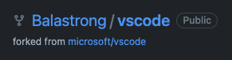

---
{
title: "What the FORK are you doing?!",
published: "2023-03-20T11:34:37Z",
tags: ["github", "opensource", "tutorial", "codenewbie"],
description: "How to Fork a repository on GitHub is as easy as pressing a button, we take this for granted, but why...",
originalLink: "https://leonardomontini.dev/github-fork/",
coverImage: "cover-image.png",
socialImage: "social-image.png",
collection: "Mastering GitHub",
order: 3
}
---

How to Fork a repository on GitHub is as easy as pressing a button, we take this for granted, but why is it required? Wouldn’t just cloning the repository be enough?

Here’s a brief video about the most essential GitHub feature to enable collaboration between developers in the open-source world.

<iframe src="https://www.youtube.com/watch?v=VbfvQzCoiQc"></iframe>

---

**Not a fan of videos?** You might want to reconsider, it's just a few minutes and *there are a couple fun gags*... anyway, if you insist, here's the written version I drafted right before recording. The content should be pretty much the same :)

---

## Fork a repository

Today, we're going to talk about one of the most important features of GitHub, and that's forking.

First of all, what does it mean? It is essentially making a copy of a repository from someone else's account to your account. It’s not like... stealing the repo: you will end up with a copy linked to the original one as you can also see right below the repository name on GitHub.

So, why do we fork? Well, forking is really important because it allows collaboration. Suppose you find someone else's code that you want to contribute to or add some features to it. You cannot just push your changes in the original repo because you probably don’t have write access. In that case, you can fork the repository, make the changes in your own copy, and then create a pull request to ask if your changes can be merged back into the original repository.

## Why not just clone?

But hold on, what's the difference between forking and cloning? Isn’t git clone faster? Well, cloning is to copy a remote repository in your machine. However, if you clone someone else’s repository, if you don’t have write access you still cannot push any changes. Forking, on the other hand, allows you to make changes to the code without affecting the original repo.

To fork a repository, navigate to it on GitHub and click the "fork" button on the top right corner. Once you've forked the repository, you'll have your own copy of the code and you can run git clone on this one. If you don’t remember if you already forked a repo, clicking on the arrow button here will let you know the answer.

## Maintaining a fork

One thing to keep in mind when forking is that your copy will not automatically sync with the original repository. If the original one gets any changes, you will have to pull those changes into your fork manually. Don’t worry though, all you have to do is from your repo just click the sync button and then in your local version, make sure to git pull.

Quick tip: when you push changes on a forked repository, don’t forget to always do that in a separate branch, try to avoid pushing commits on main.

It’s not mandatory, but it will help you preventing some annoying situations with merge conflicts or unwanted code showing up in your pull requests to the original repo.

Just create a branch every time and you’ll be fine.

## Why is it called fork?

Also, are you curios why is it called fork? It comes from a command with the same name in Unix.

The Unix command "fork" was named after the idea of a fork in the road, as it creates a new process that splits off from the original process. This term has since been adopted in the software industry, including GitHub, where it refers to creating a duplicate copy of a repository.

---

Thanks for reading this article, I hope you found it interesting!

I recently launched my Discord server to talk about Open Source and Web Development, feel free to join: https://discord.gg/bqwyEa6We6

Do you like my content? You might consider subscribing to my YouTube channel! It means a lot to me ❤️
You can find it here:

Feel free to follow me to get notified when new articles are out ;)

<!-- ::user id="balastrong" -->
