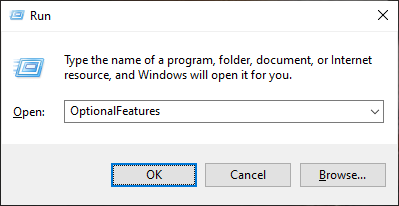
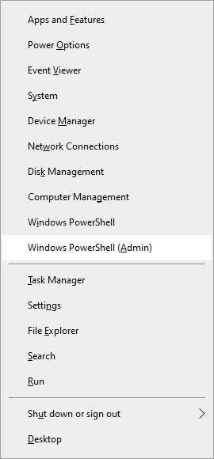

---
{
	title: "Setup Android Studio Emulator for AMD Ryzen CPUs",
	description: "While the Android Emulator isn't confined to Intel CPUs anymore, it can be tricky to setup for AMD Ryzen CPUs. Let's explain how to do so.",
	published: '2020-05-05T13:45:00.284Z',
	authors: ['crutchcorn'],
	tags: ['tools', 'windows'],
	attached: [],
	license: 'cc-by-nc-sa-4'
}
---

In the past, Android Studio did not support AMD's CPUs for hardware emulation of an Android device. [That all changed in 2018 when Google added Hyper-V support to the Android Emulator](https://android-developers.googleblog.com/2018/07/android-emulator-amd-processor-hyper-v.html).

However, while working on my Ryzen CPU powered desktop, I had difficulties getting the program working on my machine.

# BIOS Setup {#bios}

To use Hyper-V, we have to have various settings configured on our motherboards.

Two of the settings we need to enable are:

- `IOMMU` - Provides resources to be passed directly to virtual machines
- `SVM Mode` - "Secure Virtual Machine" features, enabling applications to use features for VMs

I personally have a Gigabyte motherboard (the Gigabyte GA-AB350M-Gaming 3), so I'll showcase the places I had to find the options for these motherboard settings.

## SVM Mode {#gigabyte-svm}

To enable SVM mode, first start at the first screen to the left, labeled **"M.I.T"**.


Then, select **"Advanced Frequency Settings"**.


Finally, open the **"Advanced CPU Core Settings"**.


Once on this page, you should see **"SVM Mode"** as the fourth option from the bottom. _Toggle that to **"Enabled"**_, then move onto enabling IOMMU

## IOMMU {#gigabyte-iommu}

Enabling IOMMU on a Gigabyte AMD motherboard is much easier than enabling SVM mode. Simply _go to the **"Chipset"** root tab, and it should be the first option at the top_. Even if it's set to "Auto", go ahead and _update that to be **"Enabled"**_.


Once changed, tab over to "Save & Exit" and select "Exit and save changes".

# Windows Features Setup {#windows-features}

Now that we have our BIOS (UEFI, really) configured correctly, we can enable the Windows features we need for the Android Emulator.

To start, press <kbd>Win</kbd> + <kbd>R</kbd>, which should bring up the **"Run"** dialog. Once open, _type `OptionalFeatures` and press **"OK"**_.



Once that's run, you'll see a **"Turn Windows features on or off"** window.


You'll want to turn on the following options:

- Hyper-V
- Windows Hypervisor Platform
- Windows Sandbox

After these three settings are selected, press **"OK"** and allow the features to install. After your features are installed, your machine will need a reboot. Go ahead and restart your computer before proceeding to install Android Studio.

# Setup Android Studio {#android-studio}

You have a few different methods for installing Android Studio. You can choose to use [Google's installer directly](https://developer.android.com/studio/install), you can [utilize the Chocolatey CLI installer](https://chocolatey.org/packages/AndroidStudio), or even use [JetBrain's Toolbox utility to install and manage an instance of Android Studio](https://www.jetbrains.com/toolbox-app/). _Any of these methods work perfectly well_, it's down to preference, really.

Once you get Android Studio installed, go ahead and _open the SDK Manager settings screen_ from the **"Configure"** dropdown.


Once you see the popup dialog, you'll want to _select the "SDK Tools" tab_. There should be a selection of tools that you can install or update. One of those selections (in about the middle of the list) should be called _"Android Emulator Hypervisor Driver for AMD Processors (installer)"_


Once you've selected it, press **"Apply"** to download the installer. _Because the "Apply" button only downloads the installer, we'll need to run it manually._

## Run the Installer {#amd-hypervisor-installer}

To find the location of the installer, you'll want to go to the install location for your Android SDK. For me (who used the Jetbrains Toolbox to install Android Studio), that path was: `%AppData%/../Local/Android/Sdk`.

The hypervisor installer is located under the following subpath of that path:

```
SDK_INSTALL_LOCATION\extras\google\Android_Emulator_Hypervisor_Driver
```


> If you like having this macOS-like preview pane of files, you can find it in the OneCommander application. We covered this app in [our "Ultimate Windows Development Environment Guide" article](posts/ultimate-windows-development-environment-guide/#Paid)

Once you have the path located, you'll want to run the `silent_installer.bat` inside of an elevated shell. I did this by pressing <kbd>Win</kbd> + <kbd>X</kbd> and pressing **"Windows PowerShell (Admin)"**. Once that was opened, I copied the path to the PowerShell window via `cd` and ran the installer.




You should see the message _"DeleteService SUCCESS"_ if everything ran as expected.

> If you get an error `[SC] StartService FAILED with error 4294967201.`, make sure you've followed the steps to [enable BOTH settings in your BIOS](#bios) as well as ALL of the [features mentioned in Windows](#windows-features)

## AVD Setup {#avd}

To run the emulator, you need to set up a device itself. You do this through the **"AVD Manager"** in the "configure" menu.


You'll then see a list of the devices that you currently have setup. I, for example, have three different devices already setup as you can see here:


You can create a new one by _pressing **"Create Virtual Device"**_.

Upon the dialog creation, you'll see a list of devices that you can use as a baseline for your emulator. This sets the hardware information (screen size and such). Even if you pick a device, it does not restrict the versions of Android you can use with it. I picked Pixel 2 and KitKat for my KK testing device, despite the Pixel 2 being released well after that OS release.


Once you've selected a device, you can pick the version of Android to run. You'll want to select an `x86` or `x86_64` build of Android you're looking for. I've noticed better performance from `x86_64` emulators myself, so I went with an `x86_64` build of Android Pie.


Afterward, you'll want to name your emulator. I try to keep them without strings and not too long, so if I need to run the emulator manually in the CLI, I can do so with the name of the emulator easily.


Finally, once you've selected **"Finish"**, it should save the emulator's settings and start the emulator itself.

> You may get an error such as `HAXM is not installed` when trying to set up an emulator. If you get this error, it's most likely that you have not [enabled the settings in BIOS](#bios). I know in my case, I had recently performed a BIOS upgrade, and it had reset my BIOS settings, making me go back and re-enable them.


# Conclusion

I've had incredible success with my Ryzen powered desktop during my Android development. Not only is it cost-efficient for my usage compared to the Intel option, but it's able to run the emulator quickly. Hopefully, this article has been able to help you set up your machine as well.

Let us know what your thoughts on this article were! We not only have our comments down below, but we have [a Discord community](https://discord.gg/FMcvc6T) as well that we invite you to join! We chat about all kinds of programming and CS related topics there!
