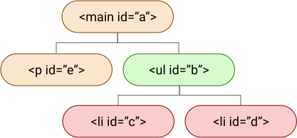
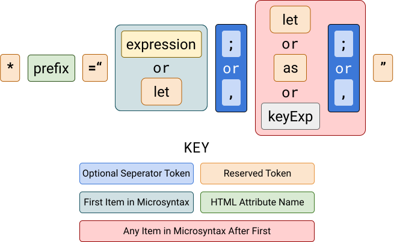

---
{
	title: 'Angular Templates — From Start to Source',
	description: 'Learn how templates work in Angular. From the basics to being able to read Angular source code and write your own structural directives',
	published: '2019-07-11T22:12:03.284Z',
	authors: ['crutchcorn'],
	tags: ['angular', 'templates'],
	attached: [],
	license: 'cc-by-nc-sa-4'
}
---

# Article Overview {#overview}

> This article was written with the idea that the reader is at least somewhat familiar with the introductory concepts of Angular. As a result, if you haven't done so already, it is highly suggested that you make your way through the fantastic [Angular getting started guide](https://angular.io/start).

One of the core concepts to the Angular framework is the idea of templates. Templates allow developers to create embedded views of UI from other locations.

These templates not only power many of Angular's baseline features, but are extremely versatile in their capabilities and serve as powerful tools to leverage:

- Templates can be passed and called manually in a similar way to functions.
- You can leverage a set of APIs built into these templates to pass and manipulate data from one template to another during the render process

While this article is far from a comprehensive list of all template related APIs, I want to walk through as much as I can to help you understand how templates work in Angular, what you're able to do with them, and loosely how they're used within Angular itself. Some of the APIs we'll be going through include:

- `ng-template`
- `TemplateRef`
- `EmbeddedViewRef`
- `ViewContent`/`ViewChildren`
- `ViewContainerRef`
- `createEmbeddedView`
- [Structural Directives](https://angular.io/guide/structural-directives#asterisk) (such as `*ngIf`)

By the end of this article, you'll not only have read some of Angular's source code ([as of 8.0.1](https://github.com/angular/angular/commit/e1f6d1538784eb87f7497bef27e3c313184c2d30)), but you should have a better understanding of how to implement many of these tools and how some of the APIs you use daily work under-the-hood.

It's going to be a long article, so please feel free to take breaks, grab a drink to enjoy while reading, pause to tinker with code, or anything in-between. Feedback is always welcomed and appreciated.

Sound like a fun time? Let's goooo! 🏃🌈

> The contents of this post was also presented in a talk under the same name. You can [find the slides here](./slides.pptx).

# Introduction To Templates {#intro}

## `ng-template` {#ng-template}

Before we dive into the meat of this article, let's do a quick recap of what templates are and what they look like.

While Angular templates come in many shapes and sizes, a simple but common use for them might look something like this:

```html
<ng-template #falseTemp>
	<p>False</p>
</ng-template>
<p *ngIf="bool; else falseTemp">True</p>
```

<iframe src="https://stackblitz.com/edit/start-to-source-1-ng-template?ctl=1&embed=1&file=src/app/app.component.ts" style="width:100%; height:500px; border:0; border-radius: 4px; overflow:hidden;" sandbox="allow-modals allow-forms allow-popups allow-scripts allow-same-origin"></iframe>

In this example, we are creating a template and assigning it to a [template reference variable](https://blog.angulartraining.com/tutorial-the-magic-of-template-reference-variables-3183f0a0d9d1). _This template reference variable makes `falseTemp` a valid variable to use as a value for other inputs in the same template._ It then handles that variable similarly to how a variable from the component logic is handled when referenced from the template.

We are then adding the [`ngIf`](https://angular.io/api/common/NgIf) structural directive to the paragraph tag to render content to the screen conditionally.

- If `bool` is true, it renders `<p>True</p>`, and the template containing `<p>False</p>` does not
- If `bool` is false, it then checks if the [`else` condition built into `ngIf`](https://angular.io/api/common/NgIf#showing-an-alternative-template-using-else) has a value assigned to it. If there is a value assigned to the `else` condition, it renders that template.
	- In this example, it does; the template we've assigned to `templHere`. Because of this, `<p>False</p>` is rendered

If you had forgotten to include the `ngIf`, it would never render the `False` element because **a template is not rendered to the view unless explicitly told to — this includes templates created with `ng-template`**

## Rendering Manually with `ngTemplateOutlet` {#ng-template-outlet}

But there's a ~~simpler~~ ~~much more complex~~ another way show the same template code above!

```html
<ng-template #falseTemp>
	<p>False</p>
</ng-template>
<ng-template #ifTrueCondTempl>
	<p>True</p>
</ng-template>
<ng-template [ngTemplateOutlet]="bool ? ifTrueCondTempl : falseTemp"></ng-template>
```

<iframe src="https://stackblitz.com/edit/start-to-source-2-conditional-render?ctl=1&embed=1&file=src/app/app.component.ts" style="width:100%; height:500px; border:0; border-radius: 4px; overflow:hidden;" sandbox="allow-modals allow-forms allow-popups allow-scripts allow-same-origin"></iframe>

> While this is not how the `ngIf` structural template works internally, this is a good introduction to the `ngTemplateOutlet` directive, which adds functionality to the `ng-template` tag.
>
> If you're curious to how Angular's `ngIf` works, read on dear reader.

While I'd mentioned previously that `ng-template` does not render to the DOM, because we're using `ngTemplateOutlet`, it renders the template defined in the passed `ng-template`.

This template that's defined by `ng-template` is called a "view", and when it is rendered to the screen, it is called an "embedded view".

This embedded view is located in the DOM, where the `ng-template` that used the `ngTemplateOutlet` resides. That is to say, if you look at the element inspector, the element is placed where you'd expect the `ng-template` to be located based on the structure of your code.

Knowing that, you can see that the following example would show the user three of the most mythical beasts imaginable:

```html
<ng-template #unicorns><button>🦄🦄🦄</button></ng-template>
<ng-template [ngTemplateOutlet]="unicorns"></ng-template>
```

With this, combined with template reference variables, you may find it easier to use a ternary operator to pass the correct template based on the value of `bool` to create an embedded view of that template.

## Pass Data To Templates — The Template Context {#template-context}

Do you know how I mentioned that you can pass data between templates (at the start of the article)? This can be accomplished by defining the _context_ of the template. This context is defined by a JavaScript object you pass to the template with your desired key/value pairs (just like any other object). When looking at an example below, **think of it in terms of passing data from a parent component to a child component through property binding**. When you define the context of a template, you're simply giving it the data it needs to fulfill its purpose in much the same way.

So, now that we know what they are in broad terms, what do they look like?

While we used the `ngTemplateOutlet` directive before to render a template, we can also pass an input to the directive `ngTemplateOutletContext` to pass a context. A context is just an object with a standard key/value pairing.

```html
<ng-template
	[ngTemplateOutlet]="showMsgToPerson"
	[ngTemplateOutletContext]="{$implicit: 'Hello World', personName: 'Corbin'}"
>
</ng-template>
```

From there, you can use `let` declarations to create template variables in that template based on the values passed by the context like so:

```html
<ng-template #showMsgToPerson let-message let-thisPersonsName="personName">
	<p>{{message}} {{thisPersonsName}}</p>
</ng-template>
```

Here, you can see that `let-templateVariableName="contextKeyName"` is the syntax to bind any named context key's value to the template input variable with the name you provided after `let`. There is an edge-case you've probably noticed though, the `$implicit` key of the context is treated as a default of sorts, allowing a user to simply leave `let-templateVariableName` to be the value of the `$implicit` key of the context value.

Now let's see it in action!

<iframe src="https://stackblitz.com/edit/start-to-source-3-context?ctl=1&embed=1&file=src/app/app.component.ts" style="width:100%; height:500px; border:0; border-radius: 4px; overflow:hidden;" sandbox="allow-modals allow-forms allow-popups allow-scripts allow-same-origin"></iframe>

As a quick note, _I only named these template input variables differently from the context value key to make it clear that you may do so_. `let-personName="personName"` is not only valid, but it also can make the code's intentions clearer to other developers.

# View References — `ViewChild`/`ContentChild` {#view-references}

## Keeping Logic In Your Controller using `ViewChild` {#viewchild}

While template reference variables are very useful for referencing values within the template itself, there may be times when you'll want to access a reference to an item in the template from the component logic. Luckily, there's a way to get a reference to any component, directive, or view within a component template.

Using [`ViewChild`](https://angular.io/api/core/ViewChild), you're able to grab a reference to the `ng-template` from the component logic rather than the template code:

```typescript
@Component({
	selector: 'my-app',
	template: `
		<div>
			<ng-template #helloMsg>Hello</ng-template>
		</div>
		<ng-template [ngTemplateOutlet]="helloMessageTemplate"></ng-template>
	`
})
export class AppComponent {
	// Ignore the `static` prop for now, we'll cover that in just a bit
	@ViewChild('helloMsg', {static: false}) helloMessageTemplate: TemplateRef<any>;
}
```

<iframe src="https://stackblitz.com/edit/start-to-source-4-viewchild?ctl=1&embed=1&file=src/app/app.component.ts" style="width:100%; height:500px; border:0; border-radius: 4px; overflow:hidden;" sandbox="allow-modals allow-forms allow-popups allow-scripts allow-same-origin"></iframe>

> While this example is effectively not-much-more than an alternative API to `ngTemplateOutlet`, it serves as a basis for introducing into further concepts.

_`ViewChild` is a "property decorator" utility for Angular that searches the component tree to find what you pass it as a query._ In the example above, when we pass the string `'templName'`, we are looking for something in the tree that is marked with the template variable `helloMsg`. In this case, it's an `ng-template`, which is then stored to the `helloMessageTemplate` property when this is found. Because it is a reference to a template, we are typing it as `TemplateRef<any>` to have TypeScript understand the typings whenever it sees this variable.

### Not Just for Templates! {#viewchild-not-just-templates}

`ViewChild` isn't just for templates, either. You can get references to anything in the view tree:

```typescript
@Component({
	selector: 'my-app',
	template: `
		<my-custom-component #myComponent [inputHere]="50" data-unrelatedAttr="Hi there!"></my-custom-component>
	`
})
export class AppComponent {
	@ViewChild('myComponent', {static: false}) myComponent: MyComponentComponent;
}
```

For example, would give you a reference to the `MyComponentComponent` instance of the template. If you ran:

```typescript
/* This would be added to the `AfterViewInit` lifecycle method */
console.log(this.myComponent.inputHere); // This will print `50`
```

It would give you the property value on the instance of that component. Angular by default does a pretty good job at figuring out what it is that you wanted to get a reference of and returning the "correct" object for that thing.

<iframe src="https://stackblitz.com/edit/start-to-source-5-view-not-template?ctl=1&embed=1&file=src/app/app.component.ts" style="width:100%; height:500px; border:0; border-radius: 4px; overflow:hidden;" sandbox="allow-modals allow-forms allow-popups allow-scripts allow-same-origin"></iframe>

Despite the examples thus far having only used a string as the query for `ViewChild`, you're also able to use the ComponentClass to query for a component with that component type.

```typescript
/* This would replace the previous @ViewChild */
@ViewChild(MyComponentComponent) myComponent: MyComponentComponent;
```

For the particular example listed above, this code change would still yield the same results. _When using `ViewChild`, it might be dangerous to do this if you have many components with that class._ This is because when using `ViewChild`, _it only returns the first result that Angular can find_ — this could return results that are unexpected if you're not aware of that.

### My Name is ~~Inigo Montoya~~ the `read` Prop {#viewchild-read-prop}

Awesome! But I wanted to get the value of the `data-unrelatedAttr` attribute dataset, and my component definition doesn't have an input for that. How do I get the dataset value?

Ahh, so you've seen the problem with Angular's guessing of what datatype you're looking for. There are times where we, the developers, know better of what we're looking for than the framework services.

Fancy that.

When we want to overwrite the type of data we expect `ViewChild` to return, we can use a second property passed to the `ViewChild` decorator with the type we want to be returned. With the use-case mentioned above, we can tell Angular that we want a reference to the element of the component itself by using the `ElementRef`.


```typescript
/* This would replace the previous @ViewChild */
@ViewChild('myComponent', {read: ElementRef, static: false}) myComponent: ElementRef;
```

Now that we've configured the `ViewChild` to read this as an `ElementRef` (a class provided from `@angular/core` which helps us get the right value back from the query) rather than a component reference, we're able to use the `nativeElement` property of that class to get the HTMLElement object for that component instance.

```typescript
/* This would be added to the `AfterViewInit` lifecycle method */
console.log(myComponent.nativeElement.dataset.getAttribute('data-unrelatedAttr')); // This output `"Hi there!"`
```

<iframe src="https://stackblitz.com/edit/start-to-source-6-read-prop?ctl=1&embed=1&file=src/app/app.component.ts" style="width:100%; height:500px; border:0; border-radius: 4px; overflow:hidden;" sandbox="allow-modals allow-forms allow-popups allow-scripts allow-same-origin"></iframe>

`ViewChild` isn't an only child, though (get it?). There are other APIs similar to it that allow you to get references to other items in your templates from your component logic.

## `ViewChildren`: More references then your nerdy pop culture friend {#viewchildren}

`ViewChildren` allows you to get a reference to any items in the view that match your `ViewChildren` query as an array of each item that matches:

```typescript
@Component({
	selector: 'my-app',
	template: `
		<div>
			<my-custom-component [inputHere]="50"></my-custom-component>
			<my-custom-component [inputHere]="80"></my-custom-component>
		</div>
	`
})
export class AppComponent {
	@ViewChildren(MyComponentComponent) myComponents: QueryList<MyComponentComponent>;
}
```

<iframe src="https://stackblitz.com/edit/start-to-source-7-viewchildren?ctl=1&embed=1&file=src/app/app.component.ts" style="width:100%; height:500px; border:0; border-radius: 4px; overflow:hidden;" sandbox="allow-modals allow-forms allow-popups allow-scripts allow-same-origin"></iframe>

Would give you a list of all components with that base class. You're also able to use the `{read: ElementRef}` property from the `ViewChild` property decorator to get a `QueryList<ElementRef>` (to be able to get a reference to the DOM [Elements](https://developer.mozilla.org/en-US/docs/Web/API/Element) themselves) instead of a query list of `MyComponentComponent` types.

### What is `QueryList` {#viewchildren-querylist}

While `QueryList` (from `@angular/core`) returns an array-like, and the core team has done an outstanding job at adding in all the usual methods (`reduce`, `map`, etc.) and it _extends an iterator interface_ (so it works with `*ngFor` in Angular templates and `for (let i of _)` in TypeScript/JavaScript logic), _it is not an array_. [A similar situation occurs when using `document.querySelectorAll` in plain JavaScript](https://developer.mozilla.org/en-US/docs/Web/API/NodeList). _If you're expecting an array from an API that returns `QueryList`, it might be best to use `Array.from`_ on the value (in this case the `myComponents` component prop) when you access it in logic later.

A `QueryList` also allows for some nice additions like the `changes` observable property that allows you to listen for changes to this query. For example, if you had some components that were hidden behind a toggle:

```html
<!-- This would make up the template of a new component -->
<input type="checkbox" [(ngModel)]="bool"/>
<div *ngIf="bool">
	<my-custom-component></my-custom-component>
</div>
<my-custom-component></my-custom-component>
```

And wanted to get the value of all component's `numberProp` values reduced into one, you could do so using the `changes` observable:

```typescript
/* This would be added to the `AfterViewInit` lifecycle method */
this.myComponents.changes.subscribe(compsQueryList => {
	const componentsNum = compsQueryList.reduce((prev, comp) => {
		return prev + comp.numberProp;
	}, 0);
	console.log(componentsNum); // This would output the combined number from all of the components' `numberProp` fields. This would run any time Angular saw a difference in the values
});
```

<iframe src="https://stackblitz.com/edit/start-to-source-8-querylist?ctl=1&embed=1&file=src/app/app.component.ts" style="width:100%; height:500px; border:0; border-radius: 4px; overflow:hidden;" sandbox="allow-modals allow-forms allow-popups allow-scripts allow-same-origin"></iframe>

It might be a good idea to gain familiarity of doing this as the Angular docs give the following warning in the [`QueryList` docs](https://angular.io/api/core/QueryList#changes):

> NOTE: In the future this class will implement an Observable interface.

## `ContentChildren`: If this article had kids {#contentchildren}

Author's note:

> This section of the article assumes that you know what the `ng-content` tag is. While I could do an in-depth dive on what `ng-content` and content projection is, it's somewhat outside of the scope of this current article. Let me know if this is something that interests you; I might do another deep, deep dive into how Angular parses tags like `ng-content` and how it's handled by Angular's AST and template parsing/etc.
>
> If you're less familiar with `ng-content`, you can probably get by with just knowing how parent/child relationships elements work and just reading through carefully. Never be afraid to ask questions!
>
> There's also the `:host` selector used in these demos. Think of each component creating their own wrapper `div` — the `:host` selector applies styling to the component wrapper element itself.

I always love nesting some of my code into `ng-content`s. I don't know what's so appealing about having my code look like it's straight out of HTML spec, but just being able to pass component instances and elements as children to one of my components and then tinkering with them is so satisfying.

One thing I always run into though is that I always end up wanting to style the components that are passed in. Take the following example:

```html
<cards-list> <!-- Cards list has default styling with grey background -->
	<action-card></action-card> <!-- Action card has default styling with grey background -->
	<action-card></action-card> <!-- It's also widely used across the app, so that can't change -->
</cards-list>
```

Anyone with a sense of design might be cringing about now. Grey on grey? On cards? Yuck! Let's make those cards have some white backgrounds.

This might seem like a trivial task to anyone assuming that these components are built-in HTML elements as of course a CSS stylesheet like so would apply:

```css
// cards-list.component.css
action-card {
	background: white;
}
```

But this is often not the case. _[Angular's `ViewEncapsulation`](https://angular.io/api/core/ViewEncapsulation) prevents styles from one component from affecting the styling of another_. This is especially true if you're using a configuration that allows the native browser to handle the components under the browser's shadow DOM APIs, which restricts stylesheet sharing on a browser-level. This is why the [Angular-specific CSS selector `::ng-deep`](https://angular.io/guide/component-styles#deprecated-deep--and-ng-deep) has been marked for depreciation (sorry old-school Angular developers [including myself, so much to migrate 😭]).

It's no matter, though. We have the power of `ViewChildren` on our side! Corbin already showed us how to get a reference to an element of a rendered component! Let's spin up an example:

```typescript
@Component({
	selector: 'action-card',
	template: `<div></div>`,
	styles: [`
		:host {
			border: 1px solid black;
			display: inline-block;
			height: 300px;
			width: 100px;
			background: grey;
			margin: 10px;
		}
	`]
})
export class ActionCard {}

@Component({
	selector: 'cards-list',
	template: `<div><ng-content></ng-content></div>`,
	styles: [`:host {background: grey; display: block;}`
})
export class CardsList implements AfterViewInit {
	@ViewChildren(ActionCard, {read: ElementRef}) actionCards;

	ngAfterViewInit() {
		// Any production code should absolutely be cleaning this up properly,
		// this is just for demonstration purposes
		this.actionCards.forEach(elRef => {
			console.log("Changing background of a card");
			this.renderer.setStyle(elRef.nativeElement, "background", "white");
		});
	}
}
```

Awesome, let's spin that up and… Oh.

<iframe src="https://stackblitz.com/edit/start-to-source-9-cardlist-broke?ctl=1&embed=1&file=src/app/app.component.ts" style="width:100%; height:500px; border:0; border-radius: 4px; overflow:hidden;" sandbox="allow-modals allow-forms allow-popups allow-scripts allow-same-origin"></iframe>

The cards are still grey. Let's open up our terminal and see if the `console.log`s ran.

They didn't.

Alright, I could keep going, but I know you've all read the section title (👀 at the skim-readers).

`ViewChildren` is a fantastic tool but only works for the items defined in the template of the component itself. Any children that are passed to the component are not handled the same way and require `ContentChildren` instead. The same applies to `ViewChild` (which has the adjacent API of `ContentChild`). The `ContentChild/ren` should share the same API with their `ViewChild/ren` counterparts.

If we change the `ViewChildren` line to read:

```typescript
@ContentChildren(ActionCard, {read: ElementRef}) actionCards;
```

<iframe src="https://stackblitz.com/edit/start-to-source-10-cardlist-fixed?ctl=1&embed=1&file=src/app/app.component.ts" style="width:100%; height:500px; border:0; border-radius: 4px; overflow:hidden;" sandbox="allow-modals allow-forms allow-popups allow-scripts allow-same-origin"></iframe>

We'll see that the code now runs as expected. The cards are recolored, the `consoles.log`s ran, and the developers are happy.

### The Content Without the `ng` {#viewchildren-without-ng-content}

`ContentChild` even works when you're not using `ng-content` but still passing components and elements as children to the component. So, for example, if you wanted to pass a template as a child but wanted to render it in a very specific way, you could do so:

```html
<!-- root-template.component.html -->
<render-template-with-name>
	<ng-template let-userName>
		<p>Hello there, {{userName}}</p>
	</ng-template>
</render-template-with-name>
```

```typescript
// render-template-with-name.component.ts
@Component({
	selector: 'render-template-with-name',
	template: `
	<ng-template
		[ngTemplateOutlet]="contentChildTemplate"
		[ngTemplateOutletContext]="{$implicit: 'Name here'}">
	</ng-template>
`
})
export class AppComponent {
	@ContentChild(TemplateRef, {static: false}) contentChildTemplate;
}
```

This is a perfect example of where you might want `@ContentChild` — not only are you unable to use `ng-content` to render this template without a template reference being passed to an outlet, but you're able to create a context that can pass information to the template being passed as a child.


# How Does Angular Track the UI {#understand-the-tree}

Awesome! We've been blowing through some of the real-world uses of templates like a bullet-train through a tunnel. 🚆 But I have something to admit: I feel like I've been doing a pretty bad job at explaining the "nitty-gritty" of how this stuff works. While that can often be a bit more dry of a read, I think it's very important to be able to use these APIs to their fullest. As such, let's take a step back and read through some of the more abstract concepts behind them.

One of these abstract concepts comes from how Angular tracks what’s on-screen; just like the browser has the _Document Object Model_ tree (often called the DOM), Angular has the _View Hierarchy Tree_.

## The DOM Tree {#the-dom}

Okay, I realize I just dropped some vocab on you without explaining first. Let's change that.

So, when you build out an HTML file, you're defining the shape the document object model (DOM) takes. When you load a file similar to this:

```html
<!-- index.html -->
<!-- ids are only added for descriptive purposes -->
<main id="a">
	<ul id="b">
		<li id="c">Item 1</li>
		<li id="d">Item 2</li>
	</ul>
	<p id="e">Text here</p>
</main>
```

_The browser takes the items that've been defined in HTML and turns them into a tree that the browser can understand how to layout and draw on the screen_. That tree, internally, might look something like this:


This tree tells the browser where to place items and includes some logic when combined with CSS, even. For example, when the following CSS is applied to the `index.html` file:

```css
#b li {
	background: red;
}
```

It finds the element with the ID of `b`, then the children of that tag are colored red. They're "children" because the DOM tree keeps that relationship info that's defined by the HTML.



> The `ul` element is marked as green just to showcase that it is the element being marked by the first part of the selector


## View Hierarchy Tree

In the same way, the browser keeps track of what's rendered into the dom using the DOM tree, Angular has its own tree to keep track what's rendered on-screen.

The reason Angular has its own tree is due to the dynamic nature of Angular. In order to understand how to hide content on the fly, change out the content on-screen, and know how to keep consistent expected interactions between all of this, Angular needs to have a tree to keep track of its state.

_While Angular renders to the DOM in the end_ (just as vanilla HTML would), _Angular has the original information that described how to render things onto screen. When Angular detects changes to this tree, it will then update the DOM with the changes that Angular has tracked_.

> I will make a note that, while Angular's _View Hierarchy Tree_ is used by Angular to keep track of component/template composition (and some might argue that this is a "virtual DOM" of sorts as it updates the DOM based off of it's own tree), Angular makes no claims that this is a virtual DOM (AFAIK).
>
> Virtual DOMs have highly contested conversation surrounding them and have no standard definition as-to what one is or is not. I only used the DOM to present a foundational understanding of hierarchy trees in general.

Because this tree is used to update the DOM rather than being part of the DOM itself, _the tree Angular uses to track its state is called the "view hierarchy tree"_. This tree is composed of various "views". _A view is a grouping of elements and is the smallest grouping of elements that can be created or destroyed together_. **A view is defined by a template.** _This template on its own is not a view, but does define a view_

Because of this, despite there being many templates — this code sample does not have any views in it, because they are not being created from any of the templates:

```html
<ng-template>I am a view that's defined by a template</ng-template>
<ng-template>
	<p>So am I! Just a different one. Everything in THIS template is in the same view</p>
	<div>Even with me in here? <span>Yup!</span></div>
</ng-template>
```

However, when you create a view from a template, you're able to display them on-screen. When a view is displayed on-screen, they're then called an _embedded view_. So, when we render a template using `ngTemplateOutlet`, we are creating a view from a template, then embedding the view in the view that you called the `ngTemplateOutlet` in.

As such, the following code example would create the view hierarchy in the chart below the code sample:

```html
<ng-template>
	<p>I am in a view right now</p>
	<ng-template #rememberMsg>
		But as you might recall, this is also a view
	</ng-template>
	<ng-template
		[ngTemplateOutlet]="rememberMsg"
		[ngTemplateOutletContext]="{$implicit: 'So when we render it, it\'s a view within a view'}"
	></ng-template>
</ng-template>
```


> The arrow in this chart simply shows that the view is being defined by the template itself

It's this composition of views that make up the "view hierarchy".

## View Containers

Admittedly, that chart above isn't QUITE right. A more accurate version of the chart might look something like this:


Little has changed, yet there's something new! A _view container_ is just what it sounds like: It's a container for views. That is to say, whenever you see a view embedded, you can be sure it's a child of a view container. While our code might not make it apparent, when we're using `ngTemplateOutlet`, Angular creates a view container for us to place the view into. It will create the view container from a template, view, or even from an element.

```html
<p>
	<ng-template #letsRender>
		Let's render this thing!
	</ng-template>
	<ng-template [ngTemplateOutlet]="letsRender"></ng-template>
</p>
```


_It is because Angular's view containers being able to be attached to views, templates, and elements that enable the dependency injection system to get a `ViewContainerRef` regardless of what you're requested the `ViewContainerRef` on_.

## Host Views {#components-are-directives}

If you're looking for them, you might notice a few similarities between a component declaration's `template` and `ng-template`s:

- Both of them allow for values to be passed into them (`@Input` props for components, context for templates)
- Both of them contain the same support for tags and template creation (using `ng-template`).

Well, there's a good reason for that: _A component is actually just a directive with a special view — a "host view" (defined by the `template` or `templateUrl` field in the decorator) associated with it_.

[To quote the Angular documentation](https://angular.io/guide/architecture-components#directives):

> A component is technically a directive. However, components are so distinctive and central to Angular applications that Angular defines the `@Component()` decorator, which extends the `@Directive()`decorator with template-oriented features.

This host view can also be attached to another view by using the `selector` value of that component's.

```typescript
@Component({
	selector: "child-component",
	template: `
		<p>I am in the host view, which acts as a view container for other views to attach to</p>
		<div><p>I am still in the child-component's host view</p></div>
		<ng-template #firstChildCompTempl>
			<p>I am in a view outside of the child-component's host view</p>
		</ng-template>
		<ng-template
			[ngTemplateOutlet]="firstChildCompTempl"
			[ngTemplateOutletContext]="{$implicit: 'And now I'm attaching that template to the host view by embedding the view'}"
		></ng-template>
	`
})
export class ChildComponent {}


@Component({
	selector: 'my-app',
	template: `
		<p>I am in app's host view, and can act as a view container for even other host views by using the component's selector</p>
		<child-component></child-component>
	`
})
export class AppComponent {}
```


## Template Input Variable Scope

Template input variables are the variables you bind to a template when using context. `<ng-template let-varName>`. _These variables are defined from the context that is applied to the template_. As a result **these templates are able to be accessed by the children views of the templates, but not from a higher level** — as the context is not defined above the template:

```html
<!-- ✅ This is perfectly fine -->
<ng-template let-varName><p>{{varName}}</p></ng-template>

<!-- ❌ This will throw errors, as the template context is not available from anywhere that isn't a child of the template -->
<ng-template let-thisVar></ng-template>
<p>{{thisVar}}</p>
```

## Template Reference Variable Scope

Template reference variables, however, have a much more complex answer in regards to how they're able to be accessed.

As a small review of what they are:
_A template reference variable is a variable assigned to a tag so that other items in the same template are able to reference that tag._

```html
<div>
	Hello There!
	<ng-template #testingMessage><p>Testing 123</p></ng-template>
</div>
<ng-template [ngTemplateOutlet]="testingMessage"></ng-template>

<!-- Will now show the following in the DOM: -->
<!--        <div>Hello There!</div>          -->
<!--           <p>Hi There</p>               -->
```

In this example, we're getting a reference to `testingMessage` template to be able to provide as an input. We're then passing that value to another `ng-template`'s `ngTemplateOutlet` directive to get it rendering on-screen.

Straightforward enough example, let’s see a more difficult example:

```html
<ng-template #helloThereMsg>
	<p>Hello There!</p>
	<ng-template #testingMessage>
		<p>Testing 123</p>
	</ng-template>
</ng-template>
<div>
	<ng-template [ngTemplateOutlet]="helloThereMsg"></ng-template>
</div>
<ng-template [ngTemplateOutlet]="testingMessage"></ng-template>
```

<iframe src="https://stackblitz.com/edit/start-to-source-11-broke-template-var?ctl=1&embed=1&file=src/app/app.component.ts" style="width:100%; height:500px; border:0; border-radius: 4px; overflow:hidden;" sandbox="allow-modals allow-forms allow-popups allow-scripts allow-same-origin"></iframe>

If you look at the output of this example, you'll notice that `testingMessage` isn't rendering. This is because template reference variables bind to the view that they're present in; and as a result are unable to be accessed from parent views.

[Like how CSS is applied to a dom when bound to a selector](#the-dom), template reference variables can be accessed within the view itself and child views, but not the parent views.


When the view that is trying to render `testMessage` looks for that template reference variable, it is unable to, as it is bound to the `helloThereMsg` template view. Because it cannot find a template reference variable with the id `testMessage`, it treats it like any other unfound variable: an `undefined` value. The default behavior of `undefined` being passed to `ngTemplateOutlet` is to not render anything.

In order to fix this behavior, we'd need to move the second `ng-template` into the `helloThereMsg` template view so that the `ngTemplateOutlet` is able to find the matching template reference variable within its view scope.

```html
<ng-template #helloThereMsg>
	Hello There!
	<ng-template #testingMessage><p>Testing 123</p></ng-template>
	<ng-template [ngTemplateOutlet]="testingMessage"></ng-template>
</ng-template>
<div>
	<ng-template [ngTemplateOutlet]="helloThereMsg"></ng-template>
</div>
```

<iframe src="https://stackblitz.com/edit/start-to-source-12-fixed-template-var?embed=1&file=src/app/app.component.ts" style="width:100%; height:500px; border:0; border-radius: 4px; overflow:hidden;" sandbox="allow-modals allow-forms allow-popups allow-scripts allow-same-origin"></iframe>

# The Bane of All JavaScipt Developer: Timings {#timings}

## Understanding timings with `ViewChildren` {#viewchildren-timings}

But the example immediately above doesn't have the same behavior as the one we likely intended. We wanted to get:

```html
<div>Hello there!</div>
<p>Testing 123</p>
```

And instead got:

```html
<div>Hello there! <p>Testing 123</p></div>
```

This is because, when we moved the template into the correct view scope, we moved it in the element tree as well.

Luckily, we've already covered `@ViewChild`, which is able to get references all the way down the view hierarchy tree and provide the value to the component logic. Because the **component logic variables are accessible from any child view of the component host view**, you can pass the `testingMessage` template reference variable to the top level.

```typescript
@Component({
	selector: "my-app",
	template: `
		<ng-template #helloThereMsg>
			Hello There!
			<ng-template #testingMessage>Testing 123</ng-template>
		</ng-template>
		<ng-template [ngTemplateOutlet]="helloThereMsg"></ng-template>
		<ng-template [ngTemplateOutlet]="testingMessageCompVar"></ng-template>
	`
})
export class AppComponent {
	@ViewChild("testingMessage", { static: false }) testingMessageCompVar;
}
```

Something you'll see if you open the console in that example is an error you may already be familiar with if you’ve used Angular extensively in the past (I know I sure saw it more then a few times!):

```
Error: ExpressionChangedAfterItHasBeenCheckedError: Expression has changed after it was checked. Previous value: 'ngTemplateOutlet: undefined'. Current value: 'ngTemplateOutlet: [object Object]'.
```

> This error is being thrown by Angular's developer mode, so if you're running a production build, this error will not show.

Why is this error happening? What can we do to fix it?

This, my friends, is where the conversation regarding change detection, lifecycle methods, and the `static` prop come into play.

## Change Detection, How Does It Work {#change-detection}

> Change detection in Angular is deserving of its own massive article: This is not that article. That said, understanding how change detection and how it affects the availability of templates is imperative to understanding some of the more ambiguous aspects of Angular template’s behaviors.
>
> More information can be found on lifecycle methods and change detection on [the official docs page for them](https://angular.io/guide/lifecycle-hooks).

_Angular has specific hooks of times when to update the UI_. Without these hooks, Angular has no way of knowing when data that's shown on-screen is updated. These hooks essentially simply check when data has changed. While these checks are imperfect, they have default behavior that will handle most cases and and the ability to overwrite it and even manually trigger a check.

One of the default checks that is ran when Angular is starting the initial render of a component. During this time, it will do a check of all of the values stored within the component's state. Afterwards, it will run checks whenever any data has changed whether or not to update the UI.

These checks trigger the lifecycle method `DoCheck`, which you can manually handle. The `DoCheck` lifecycle method will trigger every time Angular detects data changes, regardless of if the check of that data does not decide to update the item on-screen or not.


So let's look at the example we had previously, but let's add some lifecycle methods to evaluate when `ViewChild` is able to give us our value.

```typescript
export class AppComponent implements DoCheck, OnChanges, AfterViewInit {
	realMsgVar: TemplateRef<any>;
	@ViewChild("testingMessage", { static: false }) testingMessageCompVar;

	ngOnInit() {
		console.log("ngOnInit | The template is present?", !!this.testingMessageCompVar)
	}

	ngDoCheck() {
		console.log("ngDoCheck | The template is present?", !!this.testingMessageCompVar);
		this.realMsgVar = this.testingMessageCompVar;
	}

	ngAfterViewInit() {
		console.log('ngAfterViewInit | The template is present?', !!this.testingMessageCompVar);
	}
}
```

<iframe src="https://stackblitz.com/edit/start-to-source-13-lifecycle-explain?ctl=1&embed=1&file=src/app/app.component.ts" style="width:100%; height:500px; border:0; border-radius: 4px; overflow:hidden;" sandbox="allow-modals allow-forms allow-popups allow-scripts allow-same-origin"></iframe>

Looking at the console logs, you'll be left with the following messages in your console:

```diff
ngOnInit        | The template is present? false
ngDoCheck       | The template is present? false
ngAfterViewInit | The template is present? true
ngDoCheck       | The template is present? true
```

You can see that the `testingMessageCompVar` property is not defined until the `ngAfterViewInit`. _The reason we're hitting the error is that the template is not defined in the component logic until `ngAfterViewInit`._ It is not defined until them due to timing issues:* **the template is being declared in an embedded view, which takes a portion of time to render to screen**. As a result, the `helloThereMsg` template must render first, then the `ViewChild` can get a reference to the child after the initial update.

When using `ViewChild` by itself, it updates the value of the `testingMessageCompVar` at the same time that the `AfterViewInit` lifecycle method is ran. This value update is then in turn reflected in the template itself.

Angular, however, does not like values being updated directly within the `AfterViewInit`. Angular runs change detection often after an `ngDoCheck` and, after that method, does not like to re-check if there are things to update on-screen (as there can be timing conflicts under-the-hood that require a lot of foundation regarding how the change detection process works to explain properly — well outside the scope of this post).

Because of this — when using the `ngDoCheck` — you're manually running the variable update, which in turn informs Angular’s change detection process to include this in it’s list of screen updates.

> I realize there’s a lot going on in this example and that can be very confusing, even for me writing it! If you’re wanting to learn more but feeling discouraged after reading through this section a time or two, give [this resource](https://blog.angular-university.io/angular-debugging/) (from "Angular University", a great un-official Angular resource hub) a shot. It’s what I used to re-learn the elements at play with this error.

> If there’s more interest in an article from me about Angular change detection, reach out — I'd love to gauge interest!

### Great Scott — You Control The Timing! The `static` Prop {#static-prop}

That said, there might be times where having the value right off the bat from the `ngOnInit` might be useful. After all, if you're not embedding a view into a view, it would be extremely useful to be able to get the reference before the `ngAfterViewInit` and be able to avoid the fix mentioned above.

> Before I go much further, I will remind readers that [the `static` prop was introduced in Angular 8](https://github.com/angular/angular/pull/28810); this section does not apply to `ViewChild`/`ContentChild` prior to that version

Well, that can be controlled via the `static` prop! Before this example, I was defaulting to use `static: false` to avoid running into [the issue we covered in the last section](#change-detection), but you’re able to set this flag to `true` to get access to the template reference from within the `ngOnInit` lifecycle method:

```typescript
@Component({
	selector: "my-app",
	template: `
		<div>
			<p>Hello?</p>
			<ng-template #helloThereMsg>
				Hello There!
			</ng-template>
		</div>
		<ng-template [ngTemplateOutlet]="realMsgVar"></ng-template>
	`
})
export class AppComponent {
	@ViewChild("helloThereMsg", { static: true }) realMsgVar;
}
```

<iframe src="https://stackblitz.com/edit/start-to-source-14-static?ctl=1&embed=1&file=src/app/app.component.ts" style="width:100%; height:500px; border:0; border-radius: 4px; overflow:hidden;" sandbox="allow-modals allow-forms allow-popups allow-scripts allow-same-origin"></iframe>

Because this example does not have the `helloThereMsg` template within another view (outside of the host view), it is able to render without the errors we found when using `static: true`). Likewise, if you were to add an `OnInit` lifecycle method, you'd be able to get a reference to that template.

```typescript
ngOnInit() {
	console.log(!!this.realMsgVar); // This would output true
}
```

While you might wonder "Why would you use `static: false` if you can get the access within the `ngOnInit`", the answer is fairly similarly: _when using `static: true`, the `ViewChild` prop never updates after the initial `DoCheck` lifecycle check_. This means that your value will never update from `undefined` when trying to get a reference to a template from within a child view.

When taking the example with the `testingMessageCompVar` prop and changing the value to `true`, it will never render the other component since it will always stay `undefined`.

<iframe src="https://stackblitz.com/edit/start-to-source-15-static-first-check?ctl=1&embed=1&file=src/app/app.component.ts" style="width:100%; height:500px; border:0; border-radius: 4px; overflow:hidden;" sandbox="allow-modals allow-forms allow-popups allow-scripts allow-same-origin"></iframe>

# View Manipulation {#view-manipulation}

## View Limitations {#view-limitations}

Having covered views in the last section, it's important to mention an important limitation regarding them:

>Properties of elements in a view can change dynamically, in response to user actions; the structure (number and order) of elements in a view can't. You can change the structure of elements by inserting, moving, or removing nested views within their view containers.
>
>\- Angular Docs

## Embed Views {#embed-views}

While we've covered how to insert a component using `ngTemplate`, Angular also allows you to find, reference, modify, and create them yourself in your component/directive logic! 🤯

Let's show an example of how we can render an `ng-template` using TypeScipt component logic:

```typescript
@Component({
	selector: 'my-app',
	template: `
		<ng-template #templ>
			<ul>
				<li>List Item 1</li>
				<li>List Item 2</li>
			</ul>
		</ng-template>
		<div #viewContainerRef class="testing">
		</div>
	`
})
export class AppComponent implements OnInit {
	@ViewChild('viewContainerRef', {read: ViewContainerRef, static: true}) viewContainerRef;
	@ViewChild('templ', {read: TemplateRef, static: true}) templ;

	ngOnInit() {
		this.viewContainerRef.createEmbeddedView(this.templ);
	}
}
```

<iframe src="https://stackblitz.com/edit/start-to-source-16-createembeddedview?ctl=1&embed=1&file=src/app/app.component.ts" style="width:100%; height:500px; border:0; border-radius: 4px; overflow:hidden;" sandbox="allow-modals allow-forms allow-popups allow-scripts allow-same-origin"></iframe>

This example has a lot going on, so let's dissect it bit-by-bit.

Starting with some small recap:

- We're creating a template with the `ng-template` tag and assigning it to a template reference variable `templ`
- We're also creating a `div` tag, assigning it to the template reference variable `viewContainerRef`
- Lastly, `ViewChild` is giving us a reference to the template on the `templ` component class property.
	- We're able to mark both of these as `static: true` as neither of them are obfuscated by non-host-view views as parents

Now the new stuff:

- We're also using `ViewChild` to assign the template reference variable `viewContainerRef` to a component class property.
	- We're using the `read` prop to give it the [`ViewContainerRef`](https://angular.io/api/core/ViewContainerRef) class, which includes some methods to help us create an embedded view.
- Then, in the `ngOnInit` lifecycle, we're running the `createEmbeddedView` method present on the `ViewContainerRef` property to create an embedded view based on the template.

If you take a look at your element debugger, you'll notice that the template is injected as a sibling to the `.testing` div:

```html
<!---->
<div class="testing"></div>
<ul>
	<li>List Item 1</li>
	<li>List Item 2</li>
</ul>
```

> The empty comment `<!---->` will show up in your element tab of your browser and was therefore left in. The empty comment block is used by Angular to showcase where a template is

[While this has confused many developers, who have expected the embedded view to be children of the `ViewContainer` reference element](https://github.com/angular/angular/issues/9035), this is intentional behavior, and is consistent with other APIs similar to it.

The reason for this is that _Angular is creating a `ViewContainer` as the parent of the element when the user queries for one_. From there, Angular is "appending" the new view into the view container (as a view container is a view itself, and a view cannot have the number of elements in it modified without inserting a new view).

Why would it make one as a parent rather than the element itself?

Not all elements accept children inputs, IE: `</br>`. As a result, the Angular team thought it be best to make the parent the view container when a user queries for one (or uses the dependency injection to get a reference to one, as we are in this example).

### See How The View Is Tracked

Because all views are unable to mutate the number of items without explicitly moving, creating, or destroying themselves, the view container is able to track all of the views via index.

For example, if you wanted to see the index, we could use an API on the view container to get the index of the embedded view. To do this, we'd first need a reference of the embedded view in our template logic.

Just like how we have `ViewContainerRef`, there's also [`EmbeddedViewRef`](https://angular.io/api/core/EmbeddedViewRef#embeddedviewref). Luckily, with our previous example, getting that ref is trivial, as it's returned by the `createEmbeddedView` method:

```typescript
const embeddRef: EmbeddedViewRef<any> = this.viewContainerRef.createEmbeddedView(this.templ);
```

From there, we can use the `indexOf` method on the parent `ViewContainerRef`:

```typescript
const embeddIndex = this.viewContainerRef.indexOf(embeddRef);
console.log(embeddIndex); // This would print `0`.
// Remember that this is a new view container made when we queried for one with DI, which is why this is the only view in it currently
```

The view container keeps track of all of the embedded views in its control, and when you `createEmbeddedView`, it searches for the index to insert the view into.


You're also able to lookup an embedded view based on the index you're looking for using `get`. So, if you wanted to get all of the indexes being tracked by `viewContainerRef`, you'd do:

```typescript
ngOnInit() {
	for (let i = 0; i < this.viewContainerRef.length; i++) {
		console.log(this.viewContainerRef.get(i));
	}
}
```

<iframe src="https://stackblitz.com/edit/start-to-source-17-see-viewcontainer-indexes?ctl=1&embed=1&file=src/app/app.component.ts" style="width:100%; height:500px; border:0; border-radius: 4px; overflow:hidden;" sandbox="allow-modals allow-forms allow-popups allow-scripts allow-same-origin"></iframe>

#### Context

Just as we can use `contextRouterOutlet`, you're able to pass context to a template when rendering it using `createEmbeddedView`. So, let's say that you wanted to have a counting component and want to pass a specific index to start counting from, you could pass a context, [with the same object structure we did before](#template-context), have:

```typescript
import { Component, ViewContainerRef, OnInit, AfterViewInit, ContentChild, ViewChild, TemplateRef , EmbeddedViewRef} from '@angular/core';

@Component({
	selector: 'my-app',
	template: `
	<ng-template #templ let-i>
				<li>List Item {{i}}</li>
				<li>List Item {{i + 1}}</li>
		</ng-template>
		<ul>
			<div #viewContainerRef></div>
		</ul>
	`
})
export class AppComponent implements OnInit {
	@ViewChild('viewContainerRef', {read: ViewContainerRef, static: true}) viewContainerRef;
	@ViewChild('templ', {read: TemplateRef, static: true}) templ;

	ngOnInit() {
		const embeddRef3: EmbeddedViewRef<any> = this.viewContainerRef.createEmbeddedView(this.templ, {$implicit: 3});
		const embeddRef1: EmbeddedViewRef<any> = this.viewContainerRef.createEmbeddedView(this.templ, {$implicit: 1});
	}
}
```

In this example, because we want to have an unordered list with list elements being created using embedded views, we're getting a `ViewContainerRef` directly from inside the unordered list.
But you'll notice a problem with doing this if you open up your inspector (or even just by reading the code):
There's now a `div` at the start of your list.

To get around this, we can use the `ng-container` tag, which allows us to get a view reference without injecting a DOM element into the fray. _`ng-container` can also be used to group elements without using a DOM element_, similar to how [React Fragments](https://reactjs.org/docs/fragments.html) work in that ecosystem.

```html
<ng-container #viewContainerRef></ng-container>
```


<iframe src="https://stackblitz.com/edit/start-to-source-18-create-embedd-context?ctl=1&embed=1&file=src/app/app.component.ts" style="width:100%; height:500px; border:0; border-radius: 4px; overflow:hidden;" sandbox="allow-modals allow-forms allow-popups allow-scripts allow-same-origin"></iframe>

#### Move/Insert Template

But oh no! You'll see that the ordering is off. The simplest (and probably most obvious) solution would be to flip the order of the calls. After all, if they're based on index — moving the two calls to be in the opposite order would just fix the problem.

But this is a blog post, and I needed a contrived example to showcase how we can move views programmatically:


```typescript
const newViewIndex = 0;
this.viewContainerRef.move(embeddRef1, newViewIndex); // This will move this view to index 1, and shift every index greater than or equal to 0 up by 1
```

<iframe src="https://stackblitz.com/edit/start-to-source-19-move-template?ctl=1&embed=1&file=src/app/app.component.ts" style="width:100%; height:500px; border:0; border-radius: 4px; overflow:hidden;" sandbox="allow-modals allow-forms allow-popups allow-scripts allow-same-origin"></iframe>

Angular provides many APIs to take an existing view and move it and modify it without having to create a new one and run change detection/etc again.

If you're wanting to try out a different API and feel that `createEmbeddedView` is a little too high-level for you (we need to go deeper), you can create a view from a template and then embed it yourself manually.

```typescript
ngOnInit() {
	const viewRef1 = this.templ.createEmbeddedView({ $implicit: 1 });
	this.viewContainerRef.insert(viewRef1);
	const viewRef3 = this.templ.createEmbeddedView({ $implicit: 3 });
	this.viewContainerRef.insert(viewRef3);
}
```

<iframe src="https://stackblitz.com/edit/start-to-source-20-insert-template?ctl=1&embed=1&file=src/app/app.component.ts" style="width:100%; height:500px; border:0; border-radius: 4px; overflow:hidden;" sandbox="allow-modals allow-forms allow-popups allow-scripts allow-same-origin"></iframe>

[And in fact, this is how the `createEmbeddedView` works internally](https://github.com/angular/angular/blob/e1f6d1538784eb87f7497bef27e3c313184c2d30/packages/core/src/view/refs.ts#L174):

```typescript
// Source code directly from Angular as of 8.0.1
createEmbeddedView<C>(templateRef: TemplateRef<C>, context?: C, index?: number):
EmbeddedViewRef<C> {
	const viewRef = templateRef.createEmbeddedView(context || <any>{});
	this.insert(viewRef, index);
	return viewRef;
}
```

# Accessing Templates from a Directive {#directives}

Thus far, we've only used components to change and manipulate templates. However, [as we've covered before, directives and components are the same under-the-hood](#components-are-directives). As a result, _we have the ability to manipulate templates in the same way using directives rather than components_. Let's see what that might look like:

```typescript
@Directive({
	selector: '[renderTheTemplate]'
})
export class RenderTheTemplateDirective implements OnInit {
	constructor (private parentViewRef: ViewContainerRef) {
	}

	@ContentChild(TemplateRef, {static: true}) templ;

	ngOnInit(): void {
		this.parentViewRef.createEmbeddedView(this.templ);
	}
}

@Component({
	selector: 'my-app',
	template: `
		<div renderTheTemplate>
			<ng-template>
					<p>Hello</p>
			</ng-template>
		</div>
	`
})
export class AppComponent {}
```

<iframe src="https://stackblitz.com/edit/start-to-source-21-directive-template?ctl=1&embed=1&file=src/app/app.component.ts" style="width:100%; height:500px; border:0; border-radius: 4px; overflow:hidden;" sandbox="allow-modals allow-forms allow-popups allow-scripts allow-same-origin"></iframe>

You'll notice this code is almost exactly the same from some of our previous component code.

## Reference More Than View Containers {#directive-template-ref}

However, the lack of a template associated with the directive enables some fun stuff, for example, _we can use the same dependency injection trick we've been using to get the view container reference_ to get a reference to the template element that the directive is attached to and render it in the `ngOnInit` method like so:


```typescript
@Directive({
	selector: '[renderTheTemplate]'
})
export class RenderTheTemplateDirective implements OnInit {
	constructor (private parentViewRef: ViewContainerRef, private templToRender: TemplateRef<any>) {}

	ngOnInit(): void {
		this.parentViewRef.createEmbeddedView(this.templToRender);
	}
}

@Component({
	selector: 'my-app',
	template: `
		<ng-template renderTheTemplate>
				<p>Hello</p>
		</ng-template>
	`
})
export class AppComponent {}
```

<iframe src="https://stackblitz.com/edit/start-to-source-22-directive-template-reference?ctl=1&embed=1&file=src/app/app.component.ts" style="width:100%; height:500px; border:0; border-radius: 4px; overflow:hidden;" sandbox="allow-modals allow-forms allow-popups allow-scripts allow-same-origin"></iframe>

## Input Shorthand {#directive-same-name-input}

With directives, we can even create an input with the same name, and just pass that input value directly to the template using a context:

```typescript
@Directive({
	selector: '[renderTheTemplate]'
})
export class RenderTheTemplateDirective implements OnInit {
	constructor (private parentViewRef: ViewContainerRef, private templToRender: TemplateRef<any>) {}

	@Input() renderTheTemplate: string;

	ngOnInit(): void {
		this.parentViewRef.createEmbeddedView(this.templToRender, {$implicit: this.renderTheTemplate});
	}
}

@Component({
	selector: 'my-app',
	template: `
		<ng-template [renderTheTemplate]="'Hi there!'" let-message>
				<p>{{message}}</p>
		</ng-template>
	`
})
export class AppComponent {}
```

> I want to make clear that this trick is present in all directives. If you name the input the same as the directive name, it will bind the value you're passing in to that directive name while also associating the directive with the component. No need for a separate input and directive name!

<iframe src="https://stackblitz.com/edit/start-to-source-23-directive-input-name?ctl=1&embed=1&file=src/app/app.component.ts" style="width:100%; height:500px; border:0; border-radius: 4px; overflow:hidden;" sandbox="allow-modals allow-forms allow-popups allow-scripts allow-same-origin"></iframe>

Starting to look a bit more like the `ngTemplateOutlet`, no? Well, why not go even further! Let's lean into that!
With this syntax, we can add a second input, pass an object as the context to the template we want to render, and then a template reference variable, and be able to recreate Angular's `ngTemplateOutlet`'s API almost to-a-T:

```typescript
@Directive({
	selector: '[renderTheTemplate]'
})
export class RenderTheTemplateDirective implements OnInit {
	constructor (private parentViewRef: ViewContainerRef) {
	}

	@Input() renderTheTemplate: TemplateRef<any>;
	@Input() renderTheTemplateContext: Object;

	ngOnInit(): void {
		this.parentViewRef.createEmbeddedView(this.renderTheTemplate, this.renderTheTemplateContext);
	}
}

@Component({
	selector: 'my-app',
	template: `
		<ng-template [renderTheTemplate]="template1"
								[renderTheTemplateContext]="{$implicit: 'Whoa 🤯'}"></ng-template>
		<ng-template #template1 let-message>
				<p>Testing from <code>template1</code>: <b>{{message}}</b></p>
		</ng-template>
	`
})
export class AppComponent {}
```

<iframe src="https://stackblitz.com/edit/start-to-source-24-directive-outlet-alternative?ctl=1&embed=1&file=src/app/app.component.ts" style="width:100%; height:500px; border:0; border-radius: 4px; overflow:hidden;" sandbox="allow-modals allow-forms allow-popups allow-scripts allow-same-origin"></iframe>

The nice part is that not only does it look like the directive from its usage, [but it's also not entirely dissimilar to how Angular writes the component internally](https://github.com/angular/angular/blob/e1f6d1538784eb87f7497bef27e3c313184c2d30/packages/common/src/directives/ng_template_outlet.ts#L35):

```typescript
// This is Angular source code as of 8.0.1 with some lines removed (but none modified otherwise).
// The lines removed were some performance optimizations by comparing the previous view to the new one
@Directive({selector: '[ngTemplateOutlet]'})
export class NgTemplateOutlet implements OnChanges {
	private _viewRef: EmbeddedViewRef<any>|null = null;

	@Input() public ngTemplateOutletContext: Object|null = null;
	@Input() public ngTemplateOutlet: TemplateRef<any>|null = null;

	constructor(private _viewContainerRef: ViewContainerRef) {}

	ngOnChanges(changes: SimpleChanges) {
			if (this._viewRef) {
				this._viewContainerRef.remove(this._viewContainerRef.indexOf(this._viewRef));
			}

			if (this.ngTemplateOutlet) {
				this._viewRef = this._viewContainerRef.createEmbeddedView(
					this.ngTemplateOutlet, this.ngTemplateOutletContext);
			}
	}
}
```

# Structural Directives — What Sorcery is this? {#structural-directives}

If you've used Angular in any scale of application, you've ran into Angular helpers that look a lot like directives and start with a `*` such as `*ngIf` and `*ngFor`. These helpers are known as **structural directives** and are built upon all of the things we've learned to this point.

The main idea behind structural directives is that **they're directives that will wrap the tag that you've applied it to inside of a template without the need for an `ng-template` tag**.

Let's look at a basic sample to start:


```typescript
@Directive({
	selector: '[renderThis]'
})
export class RenderThisDirective implements OnInit {
	constructor (private templ: TemplateRef<any>,
							private parentViewRef: ViewContainerRef) {
	}

	ngOnInit(): void {
		this.parentViewRef.createEmbeddedView(this.templ);
	}
}

@Component({
	selector: 'my-app',
	template: `
			<p *renderThis>
					Rendering from <code>structural directive</code>
			</p>
	`
})
export class AppComponent {}
```

<iframe src="https://stackblitz.com/edit/start-to-source-25-structural-directive-intro?ctl=1&embed=1&file=src/app/app.component.ts" style="width:100%; height:500px; border:0; border-radius: 4px; overflow:hidden;" sandbox="allow-modals allow-forms allow-popups allow-scripts allow-same-origin"></iframe>

[Just as we previously used Angular's dependency injection (DI) system to get a reference to the `ViewContainerRef`](#embed-views), we're using DI to get a reference to the `TemplateRef` created by the `*` in the invocation of this directive and embedding a view.

Too much CS (computer science) speak? Me too, let's rephrase that. When you add the `*` to the start of the directive that's being attached to the element, you're essentially telling Angular to wrap that element in an `ng-template` and pass the directive to the newly created template.

From there, the directive can get a reference to that template from the constructor (as Angular is nice enough to pass the template to our directive when we ask for it [this is what the DI system does]).

The cool part about structural directives, though? Because they're simply directives, **you can remove the `*` and use it with an `ng-template` directly**. Want to use the `renderThis` without a structural directive? No problem! Replace the template with the following code block and you've got yourself a rendered template:

```html
<ng-template renderThis>
	<p>
		Rendering from <code>ng-template</code>
	</p>
</ng-template>
```

<iframe src="https://stackblitz.com/edit/start-to-source-26-structural-directive-manually-apply?ctl=1&embed=1&file=src/app/app.component.ts" style="width:100%; height:500px; border:0; border-radius: 4px; overflow:hidden;" sandbox="allow-modals allow-forms allow-popups allow-scripts allow-same-origin"></iframe>

It is for this reason that **only one structural directive can be applied to one element**. Otherwise, how would it know what order to wrap those directives in? What template should get what reference to what template?

### Building A Basic `*ngIf`

But rendering a template without changing it in any way isn't a very useful structural directive. Remove that structural directive and your code has exactly the same behavior. However, Angular provides something not-altogether-different from what we started on as a useful utility to hide/show a view based on a boolean's truthiness: `ngIf`.

So if we added an input with the same name as the directive ([as we did previously](#directive-same-name-input)) to accept a value to check the truthiness of, added an `if` statement to render only if the value is true, we have ourselves the start of an `ngIf` replacement that we've built ourselves!


```typescript
@Directive({
	selector: '[renderThisIf]'
})
export class RenderThisIfDirective implements OnInit {
	constructor (private templ: TemplateRef<any>,
							private parentViewRef: ViewContainerRef) {
	}

	@Input() renderThisIf: any; // `any` since we want to check truthiness, not just boolean `true` or `false`

	ngOnInit(): void {
		if (this.renderThisIf) {
			this.parentViewRef.createEmbeddedView(this.templ);
		}
	}
}

@Component({
	selector: 'my-app',
	template: `
		<label for="boolToggle">Toggle me!</label>
		<input id="boolToggle" type="checkbox" [(ngModel)]="bool"/>
		<div *renderThisIf="bool">
			<p>Test</p>
		</div>
	`
})
export class AppComponent {
	bool = false;
}
```

<iframe src="https://stackblitz.com/edit/start-to-source-27-render-if-intro?ctl=1&embed=1&file=src/app/app.component.ts" style="width:100%; height:500px; border:0; border-radius: 4px; overflow:hidden;" sandbox="allow-modals allow-forms allow-popups allow-scripts allow-same-origin"></iframe>

Super cool! Image we kept developing this structural directive out, but you noticed while running your test (which you should totally have 👀) that toggling the checkbox doesn't actually show anything! This is because it's running the check once on `ngOnInit` and not again when the input changes. So let's change that:

```typescript
@Directive({
	selector: '[renderThisIf]'
})
export class RenderThisIfDirective {
	constructor (private templ: TemplateRef<any>,
							private parentViewRef: ViewContainerRef) {
	}

	private _val: TemplateRef<any>;

	@Input() set renderThisIf(val: TemplateRef<any>) {
		this._val = val;
		this.update();
	}

	update(): void {
		if (this._val) {
			this.parentViewRef.createEmbeddedView(this.templ);
		}
	}
}
```

<iframe src="https://stackblitz.com/edit/start-to-source-28-render-if-work-toggle-true?ctl=1&embed=1&file=src/app/app.component.ts" style="width:100%; height:500px; border:0; border-radius: 4px; overflow:hidden;" sandbox="allow-modals allow-forms allow-popups allow-scripts allow-same-origin"></iframe>

You'll notice that I removed the `OnInit` lifecycle and replaced it with an input `set`ter. We could have changed the lifecycle method to use `ngOnChanges` to listen for input changes, given that we only have one input, but as your directive adds more inputs and you want to maintain the local state, that logic can get more complex.

Running our tests again, we see that toggling it once now shows the embedded view, but toggling it again after that does not hide it again. With a simple update to the `update` method, we can fix that:

```typescript
update(): void {
	if (this._val) {
		this.parentViewRef.createEmbeddedView(this.templ);
	} else {
		this.parentViewRef.clear();
	}
}
```

<iframe src="https://stackblitz.com/edit/start-to-source-29-render-if-fully-working?ctl=1&embed=1&file=src/app/app.component.ts" style="width:100%; height:500px; border:0; border-radius: 4px; overflow:hidden;" sandbox="allow-modals allow-forms allow-popups allow-scripts allow-same-origin"></iframe>

Here, we're using the `clear` method on the parent view ref to remove the previous view when the value is false. Because our structural directive will contain a template only used for this directive, we can safely assume that `clear` will only remove templates created within this directive and not from an external source.

#### How Angular Built It {#angular-ngif-source}

While Angular goes for a more verbose pattern due to additional features available in their structural directive, the implementation is not too different from our own.

[The following is the Angular source code for that directive](https://github.com/angular/angular/blob/e1f6d1538784eb87f7497bef27e3c313184c2d30/packages/common/src/directives/ng_if.ts#L151). To make it easier to explain with our current set of knowledge, there have been lines of code removed and a single conditional modified in a very minor way. Outside of these changes, this is largely unchanged.

```typescript
@Directive({selector: '[ngIf]'})
export class NgIf {
	private _context: NgIfContext = new NgIfContext();
	private _thenTemplateRef: TemplateRef<NgIfContext>|null = null;
	private _thenViewRef: EmbeddedViewRef<NgIfContext>|null = null;

	constructor(private _viewContainer: ViewContainerRef, templateRef: TemplateRef<NgIfContext>) {
		this._thenTemplateRef = templateRef;
	}

	@Input()
	set ngIf(condition: any) {
		this._context.$implicit = this._context.ngIf = condition;
		this._updateView();
	}

	private _updateView() {
		if (this._context.$implicit) {
			if (!this._thenViewRef) {
				this._viewContainer.clear();
				if (this._thenTemplateRef) {
					this._thenViewRef =
						this._viewContainer.createEmbeddedView(this._thenTemplateRef, this._context);
				}
			} else {
				this._viewContainer.clear();
			}
		}
	}
}
export class NgIfContext {
	public $implicit: any = null;
	public ngIf: any = null;
}
```

Just to recap, let's run through this line-by-line:

1. `_context` is creating a default of `{$implicit: null, ngIf: null}`
	- The object shape is defined by the `NgIfContext` class below
	- This is to be able to pass as a context to the template. While this is not required to understand how Angular implemented this directive in basic terms, it was left in to avoid editing code elsewhere
2. We're then defining a variable to keep track of the template reference and the view reference ([what `createEmbeddedView` returns](https://angular.io/api/core/EmbeddedViewRef)) for usage later
3. The constructor is then assigning the template reference to the variable, and getting a reference to the view container
4. We're then defining an input with the same name as a setter, as we did with our implementation
	- This setter is also calling an update function, just as were with our implementation
5. The update view is then seeing if the `$implicit` value in the context is truthy (as we're assigning the value of the `ngIf` input to the `$implicit` key on the context)
6. Further checks are made to see if there is a view reference already.
	- If there is not, it will proceed to make one (checking first that there is a template to create off of)
	- If there is, it will not recreate a view, in order to avoid performance issues by recreating views over-and-over again

## Microsyntax

Alright, we've made it thus far! The following section is going to be kinda a doozy so if you're feeling tired, a nap is certainly in order. 😴 🛌 Otherwise, let's get up — do a little shoulder shimmy to get ourselves moving for a bit 🏋 (I'm totally not just writing this for my future self who's gonna be editing this, noooope 😬), and dive in.

### Bind Context

Just as Angular parses the rest of the template you pass in to be able to convert your custom Angular components into template tags, **Angular also provides a small language-like syntax into its own query system**. This syntax is referred to as a "microsyntax" by the Angular devs. _This syntax is able to let the user create specific APIs that tie into this syntax and call/leverage specific parts of their code_. Sound vague? I think so too, let's look at a fairly minimal example:

```typescript
function translatePigLatin(strr) {
	// See the code here: https://www.freecodecamp.org/forum/t/freecodecamp-algorithm-challenge-guide-pig-latin/16039/7
}

@Directive({
	selector: '[makePiglatin]'
})
export class MakePigLatinDirective {
	constructor(private templ: TemplateRef<any>,
		private parentViewRef: ViewContainerRef) {}

	@Input() set makePiglatin(val: string) {
		this.parentViewRef.createEmbeddedView(this.templ, {
			$implicit: translatePigLatin(val)
		});
	}
}

@Component({
	selector: 'my-app',
	template: `
		<p *makePiglatin="'This is a string'; let msg">
			{{msg}}
		</p>
	`
})
export class AppComponent {}
```

<iframe src="https://stackblitz.com/edit/start-to-source-30-microsyntax?ctl=1&embed=1&file=src/app/app.component.ts" style="width:100%; height:500px; border:0; border-radius: 4px; overflow:hidden;" sandbox="allow-modals allow-forms allow-popups allow-scripts allow-same-origin"></iframe>

This might look familiar. We're using the `$implicit` value from the context within our structural directive! However, [if you review the section we introduced that concept in](#template-context), you'll notice that the syntax here is different but similar from a template variable that would be used to bind the context from an `ng-template` tag.

The semicolon is the primary differentiator between the two syntaxes in this particular example. The semicolon marks the end to the previous statement and the start of a new one (the first statement being a binding of the `makePiglatin` property in the directive, the second being a binding of the `$implicit` context value to the local template variable `msg`). This small demo already showcases part of why the microsyntax is so nice — it allows you to have a micro-language to define your APIs.

Let's continue exploring how leveraging this tool can be advantageous. What if we wanted to export more than a single value in the context? How would we bind those named values?

```typescript
@Directive({
	selector: '[makePiglatin]'
})
export class MakePigLatinDirective {
	constructor(private templ: TemplateRef<any>,
		private parentViewRef: ViewContainerRef) {}

	@Input() set makePiglatin(val: string) {
		this.parentViewRef.createEmbeddedView(this.templ, {
			$implicit: translatePigLatin(val),
			original: val
		});
	}
}

@Component({
	selector: 'my-app',
	template: `
		<p *makePiglatin="'This is a string'; let msg; let ogMsg = original">
			The message "{{msg}}" is "{{ogMsg}}" in 🐷 Latin
		</p>
	`
})
export class AppComponent {}
```


<iframe src="https://stackblitz.com/edit/start-to-source-31-structural-named-context?ctl=1&embed=1&file=src/app/app.component.ts" style="width:100%; height:500px; border:0; border-radius: 4px; overflow:hidden;" sandbox="allow-modals allow-forms allow-popups allow-scripts allow-same-origin"></iframe>

Just as before, we would use semicolons to split the definitions, then bind the external (as in: from the directive) context value of `original` to the local (this template) variable of `ogMsg`.


### Additional Attribute Inputs

With a typical — non-structural — directive, you'd have inputs that you could add to your directive. For example, you could have a directive with the following inputs:

```typescript
@Directive({
	selector: '[consoleThing]'
})
export class ConsoleThingDirective {
	@Input() set consoleThing(val: string) {
		if (this.warn) {
			console.warn(val)
			return
		}
		console.log(val)
	}

	@Input() warn: boolean = false;
}
```

And then call them with the following template:

```html
<ng-template [consoleThing]="'This is a warning from the 👻 of code future, refactor this please'" [warn]="true"></ng-template>
```

<iframe src="https://stackblitz.com/edit/start-to-source-32-console-non-structural-directive?ctl=1&embed=1&file=src/app/app.component.ts" style="width:100%; height:500px; border:0; border-radius: 4px; overflow:hidden;" sandbox="allow-modals allow-forms allow-popups allow-scripts allow-same-origin"></iframe>

This can be super useful for both providing concise APIs as well as provide further functionalities to said directive simply. Structural directives offer similar, although it comes with its own syntax and limitations due to the microsyntax API.

```typescript
@Directive({
	selector: '[makePiglatin]'
})
export class MakePigLatinDirective implements OnInit {
	constructor(private templ: TemplateRef<any>,
		private parentViewRef: ViewContainerRef) { }

	@Input() makePiglatin: string;
	@Input() makePiglatinCasing: 'UPPER' | 'lower';

	ngOnInit() {
		let pigLatinVal = translatePigLatin(this.makePiglatin)
		if (this.makePiglatinCasing === 'UPPER') {
			pigLatinVal = pigLatinVal.toUpperCase();
		} else if (this.makePiglatinCasing === 'lower') {
			pigLatinVal = pigLatinVal.toLowerCase();
		}
		this.parentViewRef.createEmbeddedView(this.templ, {
			$implicit: pigLatinVal,
			original: this.makePiglatin
		});
	}
}

@Component({
	selector: 'my-app',
	template: `
		<p *makePiglatin="'This is a string'; casing: 'UPPER'; let msg; let ogMsg = original">
			The message "{{msg}}" is "{{ogMsg}}" in 🐷 Latin
		</p>
	`
})
export class AppComponent { }
```

<iframe src="https://stackblitz.com/edit/start-to-source-33-pig-latin-microsyntax?ctl=1&embed=1&file=src/app/app.component.ts" style="width:100%; height:500px; border:0; border-radius: 4px; overflow:hidden;" sandbox="allow-modals allow-forms allow-popups allow-scripts allow-same-origin"></iframe>

You can see that I've had to tweak our previous pig latin directive example a bit.

For starters, I moved away from a `set`ter for the input value and towards `ngOnInit`, just to ensure that everything was defined in the right timing.

I'm also binding the value "upper" to `makePiglatinCasing` by adding `casing: 'UPPER'` to the input to the structural directive and then separating it by `;`.

The magic in the syntax comes from that input name. I know in previous examples I've mentioned when things were similarly named only for readability purposes and not because the syntax demands such — this is not one of those times. **The microsyntax is taking the `casing` binding from the input, making the first letter uppercase, then prepending it to the template selector to get the name of the `@Input` directive property to pass that value to.**

**This is why we usually call the directive selector the structural directive prefix — it should prefix the names of any of your microsyntax inputs**. Outside of the prefix rule, there's little else that you'll need to keep in mind with these input names. Want to make it `makePiglatinCasingThingHere`? No problem, just change that part of the input syntax to read `casingThingHere: 'upper'`


#### Why not bind like a typical input?

Now, I remember when I was learning a lot of the structural directive stuff, I thought "well this syntax is cool, but it might be a bit ambiguous". I decided I was going to change that a bit:

```html
<p *makePiglatin="'This is a string'; let msg; let ogMsg = original" [makePiglatinCasing]="'UPPER'">
	The message "{{msg}}" is "{{ogMsg}}" in 🐷 Latin
</p>
```

<iframe src="https://stackblitz.com/edit/start-to-source-34-pig-latin-non-binding?ctl=1&embed=1&file=src/app/app.component.ts" style="width:100%; height:500px; border:0; border-radius: 4px; overflow:hidden;" sandbox="allow-modals allow-forms allow-popups allow-scripts allow-same-origin"></iframe>

I was not, however, greeted by praises on my PR making this change, but rather by an error in my console:

> Can't bind to `makePiglatinCasing` since it isn't a known property of `p`

This may seem strange upon first glance, but remember: **the structural directive wraps the tag it is on the inside of a template**. Because of this, _the `makePiglatinCasing` input is not set to the directive anymore, but rather on the `p` element inside the template created by the structural directive_.

This becomes more apparent when you expand the syntax to look something like this:

```html
<ng-template makePiglatin="'This is a string'; let msg; let ogMsg = original">
	<p [makePiglatinCasing]="'UPPER'">
		The message "{{msg}}" is "{{ogMsg}}" in 🐷 Latin
	</p>
</ng-template>
```

### Bind as you would — They're JUST directives!

But, of course, because structural directives are just normal directives under-the-hood, you can use the same directive code you'd expect to, even with some of the binding syntaxes.

So if we did want to take the non-functional example above and fix it to not use structural directives, we could do so:

```html
<ng-template [makePiglatin]="'This is a string'" [makePiglatinCasing]="'UPPER'" let-msg let-ogMsg="original">
	<p>The message "{{msg}}" is "{{ogMsg}}" in 🐷 Latin</p>
</ng-template>
```

<iframe src="https://stackblitz.com/edit/start-to-source-35-pig-latin-normal-directive?ctl=1&embed=1&file=src/app/app.component.ts" style="width:100%; height:500px; border:0; border-radius: 4px; overflow:hidden;" sandbox="allow-modals allow-forms allow-popups allow-scripts allow-same-origin"></iframe>

### `as` to preserve values in template variable

One of my favorite tools at the microsyntax's disposal is the `as` keyword. On paper, it sounds extremely straightforward and duplicative of the `let` keyword:
It saves the context output of a specific value as a template variable.

If it sounds duplicative with that description, that's because it can absolutely be used in the same ways:

```html
<!-- These do exactly the same things -->
<p *makePiglatin="let msg casing 'UPPER'; original as ogMsg"></p>
<p *makePiglatin="let msg casing 'UPPER'; let ogMsg = original"></p>
```

Because `original` is being exported by the `makePiglatin` context, you can save the value to a template variable `ogMsg`.

But this example doesn't showcase very much of what makes the `as` keyword as powerful as it is: _You can preserve the initial value passed to an input_. This can be used to significant effect when passing in complex expressions, such as piped values (in this example, the [uppercase pipe](https://angular.io/api/common/UpperCasePipe)):

```typescript
@Component({
	selector: 'my-app',
	template: `
		<p *ngIf="message | uppercase as uppermessage">{{uppermessage}}</p>
		<!-- Will output "HELLO THERE, WORLD" -->
	`
})
export class AppComponent {
	message = "Hello there, world"
}
```

<iframe src="https://stackblitz.com/edit/start-to-source-36-as-keyword?ctl=1&embed=1&file=src/app/app.component.ts" style="width:100%; height:500px; border:0; border-radius: 4px; overflow:hidden;" sandbox="allow-modals allow-forms allow-popups allow-scripts allow-same-origin"></iframe>

While this example can be seen clearly with this usage of `ngIf` , let's try to add it into our `pigLatin` example:

```html
<p *makePiglatin="'test'; let msg; casing 'upper' | uppercase as upperInUpper">{{upperInUpper}}: {{msg}}</p>
```

<iframe src="https://stackblitz.com/edit/start-to-source-37-pig-latin-as-keyword-broken?ctl=1&embed=1&file=src/app/app.component.ts" style="width:100%; height:500px; border:0; border-radius: 4px; overflow:hidden;" sandbox="allow-modals allow-forms allow-popups allow-scripts allow-same-origin"></iframe>

In this example, we're expecting `'upper'` to be turned into `'UPPER'` by the `uppercase` pipe, then to be passed as the input to `makePiglatinCasing` and for the `$implicit` value of that context to be assigned to a local variable `msg`. If you load this, you'll noticed that the uppercased pig lattin displays as expected but the `upperInUpper` variable (which we expected to be `'UPPER'`) is undefined.

The reason is because we're not exporting a key of `makePiglatinCasing` in our context to supply this value.

```typescript
this.parentViewRef.createEmbeddedView(this.templ, {
	$implicit: pigLatinVal,
	original: this.makePiglatin,
	makePiglatinCasing: this.makePiglatinCasing
});
```

<iframe src="https://stackblitz.com/edit/start-to-source-38-pig-latin-as-keyword?ctl=1&embed=1&file=src/app/app.component.ts" style="width:100%; height:500px; border:0; border-radius: 4px; overflow:hidden;" sandbox="allow-modals allow-forms allow-popups allow-scripts allow-same-origin"></iframe>

Now that we're exporting the output with the `as`, it should show on-screen as expected. So why is this? **Well, `as` exports the outputted value that it's bound to.** In this case, we're binding the value to `casing` (because that's what `'upper'` is being passed as an input to).

Of course, this means that you can send any value as the context. Change the code to read:

```typescript
{
			$implicit: pigLatinVal,
original: this.makePiglatin,
makePiglatinCasing: 'See? Any value'
}
```

And the DOM would now show:

> See? Any value: ISTHAY ISWAY AWAY ESTTAY

#### But it worked in `ngIf`

And this is true, but only because the Angular devs were kind enough to make this syntax approachable without having to understand the inner-workings of it before using it.

If we [go back to the original section where we showed `ngIf` code from the Angular syntax](#angular-ngif-source), you can see they're using the same trick to provide the `as` value for a call to `ngIf`:

```typescript
this._context.$implicit = this._context.ngIf = condition;
```

## Syntax Rules {#microsyntax-rules}

Thus far, I've been doing my best to keep the examples using a fairly consistent microsyntax. Because of this, you might think that you must use `;` to separate the calls, you need to have things in a certain order, or that there might be more rules you don't yet understand about how to use the syntax. This is not the case — the syntax is fairly loose, actually, although it can be hard to understand.

### Parts Make Up The Whole {#microsyntax-parts}

The rules behind microsyntax can seem overwhelming, so let's take a look at each part on their own before coming them together.

Angular's microsyntax has 4 building blocks, that when combined in a particular way, make up the entire microsyntax API. These building blocks are:

- Expressions
- The `as` keyword
- Keyed expressions
- `let` bindings


#### Expressions {#microsyntax-explain-expressions}

The way I describe expressions in simple terms is "anything that, when referenced, returns a value". Like the example above, it could mean using an operator (`5 + 3`), calling a function (`Math.random()`), a variable (assuming `const numberHere = 12`, `numberHere`) or just a value itself (`'a string here'`).

While "what is and isn’t an expression in JavaScript" could be its own post, suffice it to say that if you’re able to pass a piece of code to a function as an argument — it’s an expression.

```html
<!-- This code is not super useful in the real-world, -->
<!-- but is used To demonstrate the correct syntaxes -->
<p *makePigLatin="'This is an expression'"></p>
<p *makePigLatin="'So is this' | uppercase"></p>
<p *makePigLatin="'So is ' + ' this'"></p>
<p *makePigLatin="varsToo"></p>
<p *makePigLatin="functionsAsWell()"></p>
```

#### The `as` keyword {#microsyntax-explain-as}

The rules behind the `as` keyword as an alternative to `let` are fairly straightforward:

- You **start with the name of the exported key** from the context
- Then, you **use the name you want to save the value to** (as a template input variable)

So, if you had the context as `{personName: 'Corbin', personInterests: ['programming']}`, and wanted to save the value from `personInterests` to a template input variable `interestList`, you could use: `personInterests as interestList`.

#### `keyExp` — Key Expressions {#microsyntax-explain-keyexp}

A key expression is simply an expression that you’re able to bind to an input on a structural directive.

- You **start with the `key` you’d like to bind to** the input that is prefixed with the directive selector (so `[ngIf]`’s `then` key would map to the `ngIfThen` input)
- Then, you **optionally can place a colon** (having it or not does not affect the behavior in any way)
- You’ll then want to **place an expression that will be passed as the input value** for the `key` you started the key expression with
- Finally, _if you’d like to save the input value_, you’re able to **use the `as` keyword**, followed by the name you’d like to save the input value to (as a template input variable)


```html
<p *makePigLatin="inputKey: 'This is an expression' as localVar"></p>
<p *makePigLatin="inputKey: 'This is an expression'"></p>
<p *makePigLatin="inputKey 'This is an expression' as localVar"></p>
<p *makePigLatin="inputKey 'This is an expression'"></p>
```

#### `let` bindings {#microsyntax-explain-let}

The `let` binding:

- Starts with a `let` preserved keyword
- Then lists the template input variable to save the value to
- You’ll then want to put the key of the context you want to save a value of after a `=` operator
	- It’s worth mentioning that this is optional. This is because of the `$implicit` key in context.
		EG: a context of `{$implicit: 1, namedKey: 900}` and `let smallNum; let largerNum = namedKey` would assign `1` to `smallNum` and `900` to `largerNum`

### Combining Them Together

Now that we understand all of the parts by themselves, let’s combine them together to get a macro view at the microsyntax.



- The start to any structural directive call is **the `*` reserved token** (a token, in this case, is just a symbol marked to do something). This just marks the directive call to be handled as a structural directive.

- Then, you have **the `selector` value** of the directive itself (which acts as a prefix to the inputs)

- You bind to the selector as you would any other input using **`="`** tokens

The contents of the input itself is where the microsyntax goes.

#### First Item

The first item that’s allowed in the microsyntax is either an expression or a `let` binding.

If an expressing `*prefix="5 + 3"` is passed, this value will be passed to the same input name as the selector itself: EG the `ngIf` input on the directive with the `[ngIf]` selector value.

If a `let` binding is the first item, it will work exactly as it’s explained in [the previous section](#microsyntax-explain-let)

```html
<!-- ✅ These ARE valid for the first item -->
<p *makePigLatin="'Expression'"></p>
<p *makePigLatin="let localVar = exportKey"></p>

<!-- 🛑 But these are NOT valid for the first item -->
<p *makePigLatin="inputKey: 'Input value expression'"></p>
<p *makePigLatin="exportKey as localVar"></p>
```

#### Second Item and Beyond

After the first item, _you’re able to pass in a `let` binding, an `as` binding, or a key expression_. **There can be as many of these items in a microsyntax as you’d like, so long as they’re one of those 3**. These will act the way you expect them to as before. You’re not, however, able to pass an expression to act as the default input value — that’s preserved only for the first item.

```html
<p *makePigLatin="'First'; let localVar = exportKey"></p>
<p *makePigLatin="'First'; exportKey as localVar"></p>
<p *makePigLatin="'First'; inputKey: 'Input value expression'"></p>
<!-- And you can do more than one! -->
<p *makePigLatin="'First'; let localVar = exportKey; exportKey as localVar; inputKey: 'Input value expression'"></p>
```

## Optional Separators

Just as the `:` is optional in a [key expression](#microsyntax-explain-keyexp), **all separators in the microsyntax are optional**.

These are all valid:

```html
<!-- You can mix and match which tokens you leave or don't -->
<p *makePigLatin="'First'; let localVar = exportKey; exportKey as localVar; inputKey: 'Input value expression'"></p>

<!-- Remember that the key expression's `:` token is optional -->
<p *makePigLatin="'First'; let localVar = exportKey exportKey as localVar; inputKey 'Input value expression'"></p>

<!-- All separator tokens are optional -->
<p *makePigLatin="'First' let localVar = exportKey exportKey as localVar inputKey 'Input value expression'"></p>

<!-- You can shorten the `as` binding, as it's also part of the `let` binding -->
<!-- as an optional second part -->
<p *makePigLatin="'First' let localVar = exportKey as localVar; inputKey 'Input value expression'"></p>
```

## Let's remake `ngFor`

[The Angular section on structural directives say that you should probably study the `ngFor` code to understand them better](https://angular.io/guide/structural-directives#microsyntax). Let's do them one better — let's make our own.

Well, admittedly, the code for `ngFor` is a bit complex and handles a lot more than I think would be covered by the scope of this post; Let's at least make a version of it that supports a limited part of its API (just for conciseness).

So, what is the API we want to support?

`*uniFor="let item of items; let firstItem = isFirst"`

Sounds reasonable enough. Just to make things even easier on us, let's not worry about re-rendering the list if it updates or properly cleaning up if this directive view unrenders. These requirement changes make our code much more simple for demonstration purposes, but inherently makes the resulting code unfit for production.

```typescript
@Directive({ selector: '[uniFor]' })
export class UniForOf<T> implements AfterViewInit {
	@Input() uniForOf: Array<T>;

	constructor(
		private viewContainer: ViewContainerRef,
		private template: TemplateRef<any>
	) {}

	ngAfterViewInit() {
		this.uniForOf.forEach((ofItem, i) => {
			this.viewContainer.createEmbeddedView(this.template, {
				isFirst: i === 0,
				$implicit: ofItem,
				uniForOf: this.uniForOf
			})
		})
	}
}

@Component({
	selector: 'my-app',
	template: `
	<p *uniFor="let num of numbers | async as allNumbers; let firstItem = isFirst">
		Number in a list of {{allNumbers.length}} numbers: {{num}}
		<ng-container *ngIf="firstItem"> it's the first number!</ng-container>
	</p>
	`
})
export class AppComponent {
	// `import {of} from 'rxjs';`
	numbers = of([1,2,3,4,5])
}
```

<iframe src="https://stackblitz.com/edit/start-to-source-39-uni-for?ctl=1&embed=1&file=src/app/app.component.ts" style="width:100%; height:500px; border:0; border-radius: 4px; overflow:hidden;" sandbox="allow-modals allow-forms allow-popups allow-scripts allow-same-origin"></iframe>

- We're starting with enabling `uniFor` as the structural directive name
- Then we're defining an input to accept `of` as a key in the syntax (to match the `ngFor` structural directive syntax).

- We can then reference this value later with `this.uniForOf` just as we are in the `ngAfterViewInit`.

- In that lifecycle method, we're then creating an embedded view for each item in the array
	- This view is passed a context with an implicit value (so that `_var` in`let _var of list` will have the value of this item)
	- We also pass the index to the context to give a boolean if an item is the first in a list
	- Then we pass a `uniForOf` so that we can use `as` to capture the value passed to the `of` portion of the syntax
- Finally, we use the [async pipe](https://angular.io/api/common/AsyncPipe) to get the value of the array that's inside of an observable

# Conclusion

All in all, Angular has extremely powerful tools that it provides to you out-of-the-box for managing templates across your application. While a lot of these examples have been small, silly, and contrived, they've loosely come from patterns I've seen in very large Angular libraries. As a result, utilizing them can solve many problems and serve as a starting point for highly extensible code.

Other than that, that's it! You reached the end! You did it! 🎊

Thank you so much for taking the time to read through, always feel free to reach out on Twitter or comment in the comment section below to ask further questions or add to the conversation/teach me something, always happy to help and always loving to learn!
