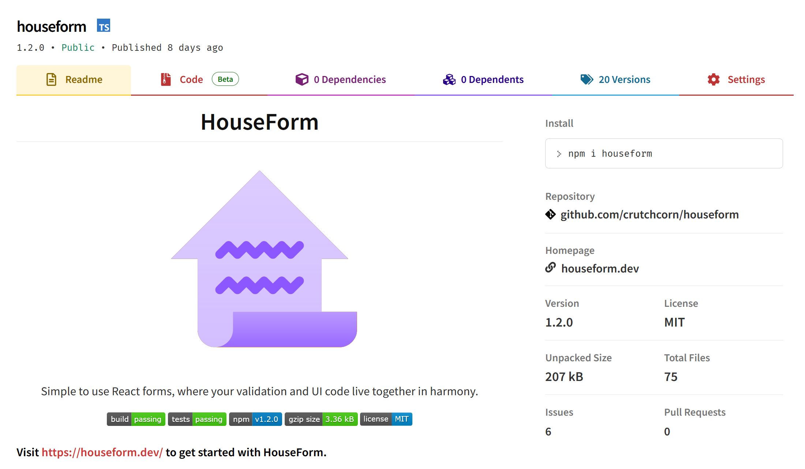

---
{
	title: "How to Build a React Library with Vite",
	description: "",
	published: "2023-02-25T04:45:30.247Z",
	authors: ["crutchcorn"],
	tags: ["react"],
	attached: [],
	license: "cc-by-nc-sa-4"
}
---


# How did we write HouseForm?

I started work on HouseForm with an API in mind:

```jsx
// This was an early API design for HouseForm, it differs slightly from the final product
<Form onSubmit={values => alert(values)}>
	{({submit}) => (
		<Field validate={z.string().min(1, "Must be a length of 1")}>
			{({value, setValue}) => (
				<input type="text" value={value} onChange={e => setValue(e.target.value)} />
			)}
		</Field>
	)}
</Form>
```

You'll notice that this API looks pretty similar to the final result of HouseForm.

To start working on the library, we built out a [Vite](https://vitejs.dev/) repository using Vite's CLI command:

 ```shell
npm create vite@latest my-vue-app --template react-ts
 ```

I then placed the `Form` pseudocode in the `App.tsx` file, and mocked out the `Form` and `Field` inputs:

```jsx
export const Form = (props: any) => null as any;

export const Field = (props: any) => null as any;
```

From here, I build a small proof-of-concept inside of the `src` folder to implement how `Form` and `Field` should interact with another. 

> Coincidentally, the proof-of-concept's foundations - such as [using `Form` to provide a context](https://github.com/crutchcorn/houseform/blob/497580ab351724e091508954501d04ea2c506d52/lib/form/form.tsx#L112) and [registering `Field`s into this context](https://github.com/crutchcorn/houseform/blob/497580ab351724e091508954501d04ea2c506d52/lib/field/use-field-like-sync.ts#L39-L50) using [a `useRef` in the `Form`](https://github.com/crutchcorn/houseform/blob/497580ab351724e091508954501d04ea2c506d52/lib/form/use-formlike.ts#L18) - are still used in the code today.

# Publishing HouseForm on NPM

When this initial proof-of-concept was finished, I wanted a quick way for my engineers to play with it.

The quickest way to do so? [Publish it on NPM](https://npmjs.com/package/houseform).

[](https://npmjs.com/package/houseform)

How to do that? [Vite library mode](https://vitejs.dev/guide/build.html#library-mode).

It was simple enough to configure this in our `vite.config.ts` file:

```typescript
import { defineConfig } from "vite";
import react from "@vitejs/plugin-react";
import dts from "vite-plugin-dts";
import { resolve } from "path";
import { dirname } from "path";
import { fileURLToPath } from "url";

const __dirname = dirname(fileURLToPath(import.meta.url));

export default defineConfig({
  plugins: [
    react(),
    dts({
      entryRoot: resolve(__dirname, "./lib"),
    }),
  ],
  resolve: {
    alias: {
      houseform: resolve(__dirname, "./lib")
    },
  },
  build: {
    lib: {
      entry: resolve(__dirname, "lib/index.ts"),
      name: "HouseForm",
      fileName: "houseform",
    },
    rollupOptions: {
      external: ["react", "react/jsx-runtime", "zod"],
      output: {
        globals: {
          react: "React",
          "react/jsx-runtime": "jsxRuntime",
          zod: "zod",
        },
      },
    },
  },
});
```

This allows us to use Zod and React as a peer dependency and output a CJS and ESM version of library. Once this `vite.config.ts` file was setup, we just needed to modify our `package.json`:

```json
{
  "name": "houseform",
  "description": "Simple to use React forms, where your validation and UI code live together in harmony.",
  "version": "0.0.1-alpha.0",
  "type": "module",
  "license": "MIT",
  "repository": {
    "type": "git",
    "url": "https://github.com/crutchcorn/houseform"
  },
  "homepage": "https://houseform.dev",
  "bugs": "https://github.com/crutchcorn/houseform/issues",
  "scripts": {
    "dev": "vite",
    "build": "tsc && vite build",
    "prepublishOnly": "npm run build"
  },
  "peerDependencies": {
    "react": ">=16.8.0",
    "zod": ">=3.9.0"
  },
  "devDependencies": {
    "//": "..."
  },
  "files": [
    "dist",
    "lib",
    "package.json",
    "README.md",
    "LICENSE"
  ],
  "main": "./dist/houseform.umd.cjs",
  "module": "./dist/houseform.js",
  "types": "./dist/index.d.ts",
  "exports": {
    ".": {
      "import": "./dist/houseform.js",
      "require": "./dist/houseform.umd.cjs",
      "types": "./dist/index.d.ts"
    }
  }
}
```

Then, to publish the package on NPM's repository, I just needed to run `npm publish`. This command runs my `prepublishOnly` script and, on success, will publish to the NPM repository.

# Running a Dev Build of HouseForm Locally

Because we're using Vite's library mode, a question that I asked myself was "how do I set up an example application to test my changes to HouseForm locally before publishing them?"

Luckily, Vite handles this with `vite dev` right out of the box.

By using the `vite.config.ts` file we showed before, we were able to have [an `index.html` file](https://github.com/crutchcorn/houseform/blob/497580ab351724e091508954501d04ea2c506d52/index.html) that pointed to [a React app living in the `example` folder](https://github.com/crutchcorn/houseform/tree/497580ab351724e091508954501d04ea2c506d52/example), which then [uses `import {Field} from 'houseform'` syntax](https://github.com/crutchcorn/houseform/blob/497580ab351724e091508954501d04ea2c506d52/example/App.tsx#L1) to look at [the `lib` folder](https://github.com/crutchcorn/houseform/tree/497580ab351724e091508954501d04ea2c506d52/lib), which contains the library source code itself.

# Adding Tests to HouseForm

With any project of scale, you want to make sure that your project is working the way you say it is. The solution to this difficult problem? Automated tests.

Luckily, Vite has an answer for this as well in the form of [Vitest](https://vitest.dev/). Simply install the package:

```shell
npm install -D vitest
```

And provide a setup file in `vitest.config.ts`:

```typescript
import { defineConfig } from "vitest/config";
import { resolve } from "path";
import { dirname } from "path";
import { fileURLToPath } from "url";

const __dirname = dirname(fileURLToPath(import.meta.url));

export default defineConfig({
  test: {
    setupFiles: ["./config/setup-tests.ts"],
    environment: "jsdom",
  },
  resolve: {
    alias: {
      houseform: resolve(__dirname, "./lib"),
    },
  },
});
```

Because [I like to have my tests representative of user interactions](https://kentcdodds.com/blog/write-tests), I wanted to use [React Testing Library](https://testing-library.com/docs/react-testing-library/intro/) for this project.

To do this, I simply needed to install the relevant packages and write a `setup-tests.ts` file:

```typescript
import { expect, afterEach } from 'vitest';
import matchers, {
    TestingLibraryMatchers,
} from '@testing-library/jest-dom/matchers';

import { cleanup } from '@testing-library/react';

expect.extend(matchers);

afterEach(() => {
    cleanup();
});

// This fixes TypeScript issues with Testing Library expecting Jest usage
declare global {
    namespace Vi {
        interface JestAssertion<T = any>
            extends jest.Matchers<void, T>,
                TestingLibraryMatchers<T, void> {}
    }
}
```


